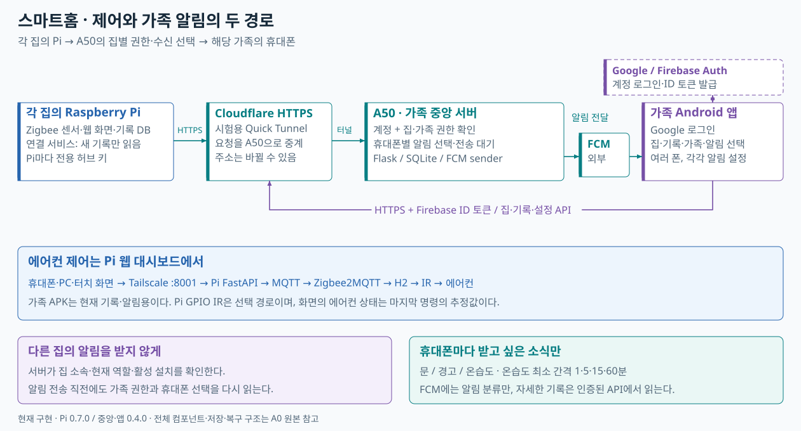
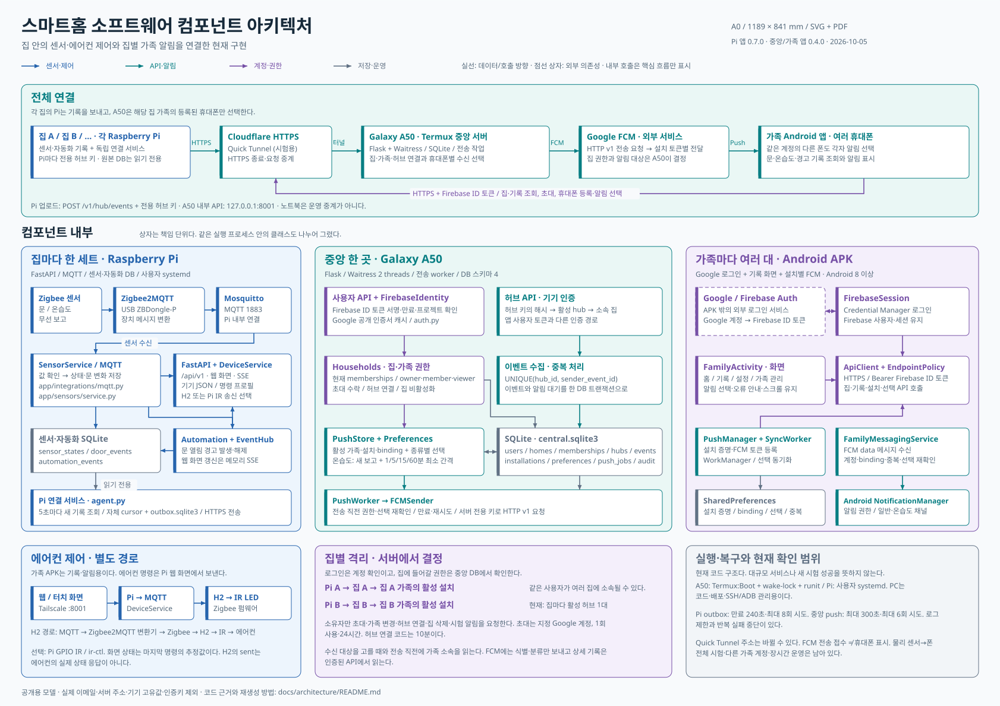

# 라즈베리파이 + Zigbee로 에어컨 제어하기

리모컨으로만 조작하던 에어컨을 휴대폰, PC, 집 안의 터치 화면에서 제어하는 프로젝트다. 라즈베리파이는 웹 화면과 Zigbee 게이트웨이를 맡고, ESP32-H2 SuperMini 시제품은 에어컨 앞에서 적외선(IR)을 보낸다. 온습도계와 문 열림 센서도 같은 화면에서 볼 수 있다.

이 README는 **처음부터 한 번 만들어 보는 순서**로 썼다. 아래 링크는 모두 이 저장소 안의 실제 파일을 가리킨다. 코드와 스크립트를 따로 요청할 필요 없이 GitHub에서 이 저장소를 내려받으면 된다.

공개 저장소에는 실제 SSH 키, MQTT 비밀번호, Firebase 서버 키와 집의 접속 주소를 넣지 않았다. 설치할 때 필요한 비공개 설정은 각자 자신의 장비에서 준비한다.

**루트는 Raspberry Pi 에어컨 제어 프로젝트이고, A50 가족 알림의 코드·앱·설치 도구·테스트는 [`server/`](server/) 아래에만 둔다.** A50 작업은 `server` 폴더에서 시작하며, 루트에는 같은 실행 코드를 복사해 두지 않는다. 전체 구조도와 소개는 이 README에 함께 남겼다.

## 소프트웨어 구조

집마다 Raspberry Pi가 센서와 에어컨 제어를 맡는다. 선택 확장인 A50 중앙 서버는 각 Pi의 새 기록을 받고, **그 집에 등록된 가족의 휴대폰에만** 선택한 알림을 보낸다. 같은 계정으로 여러 휴대폰을 쓰더라도 알림 종류는 휴대폰마다 정한다. Google 로그인은 계정 확인을 맡고, 집에 들어갈 권한과 알림 대상은 중앙 서버가 결정한다.

[](docs/architecture/smart-home-overview.svg)

**현재 가족 APK는 기록·알림용이다.** 에어컨 조작은 Tailscale로 접속하는 Pi 웹 대시보드에서 한다. 가족 앱의 HTTPS 통로와 Pi 제어 경로는 별개다. FCM 전송 접수도 휴대폰에 알림이 표시됐다는 뜻은 아니다.

[A0 벡터 SVG 원본](docs/architecture/smart-home-components-a0.svg) · [A0 인쇄용 PDF](docs/architecture/smart-home-components-a0.pdf) · [컴포넌트 역할·코드 위치·데이터 흐름](docs/architecture/README.md)

<details>
<summary>A0 컴포넌트 아키텍처 펼쳐 보기</summary>

본문 글자 약 12px, A0 가로형(1189 × 841mm)으로 만들었다. SVG 좌표의 12px는 화면에서 확대·축소할 때 함께 변한다. 전체를 축소하면 세부 글자가 작아지므로 그림을 클릭하거나 PDF를 확대해서 읽는다. SVG의 글자·상자·화살표는 벡터이며, PDF에는 한글 글꼴을 포함했다.

[](docs/architecture/smart-home-components-a0.svg)

</details>

Zigbee2MQTT는 인터넷 회원가입 서비스가 아니다. Pi에 설치해 Zigbee 장치의 메시지를 웹앱이 읽을 수 있는 MQTT 메시지로 이어주는 프로그램이다. ESP32-H2도 Wi-Fi나 MQTT에 직접 연결하지 않는다.

## 시작 전에 알아둘 범위

- 이 글의 **실물 에어컨 신호는 Carrier CS-A061GS**에서 기록했다. 다른 모델에는 그대로 보내지 말고 해당 리모컨 신호부터 새로 확보해야 한다. 신호 자료는 [`device_profiles/air_conditioner/Carrier/CS-A061GS/`](device_profiles/air_conditioner/Carrier/CS-A061GS/)에 있다.
- **이번 시제품 경로는 USB 전원 ESP32-H2 + 만능기판**이다. 배터리 제품이나 양산 PCB를 완성한 상태가 아니다. Pi의 GPIO18에 IR 송신기를 직접 다는 첫 번째 방식은 별도 [하드웨어 기록](docs/hardware/)에 있다. 두 방식을 동시에 만들 필요는 없다.
- H2로 에어컨 끄기, 대시보드 냉방 명령에 대한 실물 반응을 봤다. 하지만 냉방 21–30°C 신호는 규칙으로 계산한 값이고, 다른 모드·부가 기능·무선 장시간 안정성은 더 시험해야 한다. 화면의 에어컨 상태는 **마지막으로 보낸 명령에 따른 추정값**이지 에어컨이 보내 준 측정값이 아니다.
- 외부 접속은 Tailscale을 사용한다. `8001`, MQTT `1883`, Zigbee2MQTT 관리 화면 `8080`을 공유기 포트포워딩으로 인터넷에 열지 않는다.

## 1. 준비물과 파일 지도

| 필요한 것 | 이 프로젝트에서 쓴 구성 | 관련 파일 |
| --- | --- | --- |
| 게이트웨이 | Raspberry Pi 4B, 안정적인 전원, microSD, Raspberry Pi OS Lite 64-bit | [`deploy/zigbee/`](deploy/zigbee/) |
| Zigbee 동글 | SONOFF ZBDongle-P (CP2102N, `zstack`), 가능하면 USB 연장선 | [`scripts/setup_zigbee_stack.sh`](scripts/setup_zigbee_stack.sh) |
| 선택 센서 | Zigbee 온습도계, 자석식 문 센서와 각 배터리 | [상용 센서 연결 글](docs/blog/zigbee-mqtt/02-commercial-zigbee-sensors.md) |
| 에어컨 앞 송신기 | 18핀 ESP32-H2 SuperMini, USB-C 전원, 만능기판, IR LED 1개, N채널 로직 MOSFET, 저항 | [H2 배선 설명](docs/hardware/esp32-h2-usb-ir-prototype.md) |
| 개발 PC | Git, Python 3.11 이상, PowerShell; H2에 펌웨어를 올릴 때 ESP-IDF 5.5.4 | [`scripts/esp32_h2_firmware.ps1`](scripts/esp32_h2_firmware.ps1) |
| 선택 화면 | HDMI/USB 터치형 디스플레이 | [키오스크 설치 설명](docs/operations/kiosk-display.md) |

IR LED는 940 nm 제품(시제품의 기준은 TSAL6200), MOSFET은 AO3400A 계열의 **3.3 V 게이트로 켤 수 있는** 제품을 기준으로 했다. 저항은 LED 직렬 47 Ω, 게이트 직렬 100 Ω, 게이트 풀다운 100 kΩ이 각각 1개 필요하다. 5 V와 GND 사이에 100 nF 세라믹을 IR 분기 가까이 둔다. 시제품에는 100 µF 전해 커패시터도 병렬로 달았다. 이 부품은 극성이 있으므로 `+`는 5 V, `−`는 GND다. 구매한 MOSFET의 **실제 Gate/Drain/Source 핀 순서는 데이터시트로 확인**해야 한다. 겉모양만 보고 꽂지 않는다.

주요 파일은 아래 순서로 사용한다.

| 단계 | 파일 |
| --- | --- |
| PC에서 웹앱 실행 | [`pyproject.toml`](pyproject.toml), [`scripts/run_local.ps1`](scripts/run_local.ps1) |
| Pi에 Zigbee 게이트웨이 설치 | [`scripts/install_zigbee_host.sh`](scripts/install_zigbee_host.sh), [`scripts/setup_zigbee_stack.sh`](scripts/setup_zigbee_stack.sh), [`scripts/check_zigbee_stack.sh`](scripts/check_zigbee_stack.sh) |
| Pi 웹앱과 MQTT 연결 | [`scripts/setup_app_mqtt.sh`](scripts/setup_app_mqtt.sh), [`deploy/systemd/aircon-controller.service`](deploy/systemd/aircon-controller.service) |
| H2 펌웨어 소스와 PC 빌드 도구 | [`firmware/esp32-h2-zigbee-ir-node/`](firmware/esp32-h2-zigbee-ir-node/), [`scripts/esp32_h2_firmware.ps1`](scripts/esp32_h2_firmware.ps1) |
| H2를 Zigbee2MQTT에서 인식 | [`aircon-h2-ir.mjs`](deploy/zigbee/zigbee2mqtt/external_converters/aircon-h2-ir.mjs), [`scripts/install_h2_zigbee_converter.py`](scripts/install_h2_zigbee_converter.py) |
| 기록과 화면 자료 | [Zigbee/MQTT 4편](docs/blog/zigbee-mqtt/README.md), [문제 해결](docs/troubleshooting.md) |

## 2. 개발 PC에 코드 내려받기

Windows PowerShell 예시다. GitHub의 기본 브랜치를 내려받고 저장소 폴더에서 명령을 실행한다.

```powershell
git clone https://github.com/PCY00/aircon-remote-control.git
cd aircon-remote-control
python -m venv .venv
.\.venv\Scripts\python.exe -m pip install -e ".[dev]"
.\.venv\Scripts\python.exe -m pytest -q --ignore=tests/test_h2_ir_firmware.py
.\scripts\run_local.ps1
```

브라우저에서 `http://127.0.0.1:8001/`을 연다. `http://127.0.0.1:8001/health`가 응답하면 웹앱이 켜진 것이다. **PC의 기본 IR 송신은 모의 동작**이다. 화면이 열렸다고 에어컨이 움직이는 단계는 아니다. Python 패키지 설치는 PC에 직접 뿌리지 않고 이 저장소의 `.venv` 안에만 한다. 위 테스트 명령은 한글 경로의 Windows C 컴파일러에서 실패하는 H2 호스트 테스트 한 파일을 제외한다. 나머지 테스트는 이 PC에서 210개 통과, 2개 건너뜀으로 끝났다.

PowerShell이 `.ps1` 실행을 막는 PC라면 현재 창에서만 `Set-ExecutionPolicy -Scope Process Bypass`를 먼저 실행한다. PC 전체 정책을 영구히 바꿀 필요는 없다.

## 3. Raspberry Pi와 Tailscale 준비

1. [Raspberry Pi Imager](https://www.raspberrypi.com/software/)로 Raspberry Pi OS Lite 64-bit를 microSD에 기록한다. 이번 설치 기록의 기준은 Debian 13 Trixie arm64다. Imager의 사전 설정에서 네트워크, 시간대, 사용자 계정과 SSH 공개키 로그인을 설정한다. 아래 Pi 명령은 사용자 이름을 `air`, 프로젝트 경로를 `/home/air/aircon-controller`로 둔 **저장소 스크립트 기본값**에 맞췄다. 다른 이름을 쓰려면 서비스 파일과 배포 경로도 함께 바꿔야 한다.
2. PC에서 SSH로 Pi에 접속한다. Pi가 처음 켜지지 않거나 SSH가 안 된다면 [Raspberry Pi의 초기 설정 안내](https://www.raspberrypi.com/documentation/computers/getting-started.html)를 먼저 따른다.
3. Pi와 원격 접속할 휴대폰·PC에 Tailscale을 설치하고 **본인 계정의 같은 사설망(tailnet)**에 넣는다. 설치·로그인 명령은 [Tailscale의 현재 Linux 안내](https://tailscale.com/kb/1031/install-linux)를 따른다. Pi에서 `tailscale ip -4`로 주소가 나오는지 살핀다. 주소 자체는 블로그, 이슈, 화면 캡처에 공개하지 않는다.
4. Pi에서도 이 저장소를 내려받고 Python 환경을 만든다. 이것은 **첫 설치**다. 이후 코드 수정은 PC를 기준으로 하고, Pi 파일을 직접 고쳐 서로 다른 버전을 만들지 않는다.

```bash
sudo apt update
sudo apt install -y git python3-venv python3-pip
cd /home/air
git clone https://github.com/PCY00/aircon-remote-control.git aircon-controller
cd aircon-controller
python3 -m venv .venv
.venv/bin/python -m pip install -e .
tailscale ip -4
```

Pi의 13인치 화면은 선택 사항이다. Raspberry Pi OS Lite에 화면만 연결하면 웹이 아닌 터미널이 나오는 것이 정상이며, 7단계에서 키오스크를 설치해야 웹 화면이 뜬다.

## 4. Zigbee 게이트웨이 만들기

Pi 전원을 끈 상태에서 ZBDongle-P를 USB에 연결한다. 재부팅 후 아래 명령에서 `/dev/serial/by-id/`의 CP2102N 장치가 보여야 한다. USB를 다시 꽂으면 달라질 수 있는 `/dev/ttyUSB0` 번호를 호스트 설정에 고정하지 않는다.

```bash
ls -l /dev/serial/by-id/
cd /home/air/aircon-controller
sudo bash scripts/install_zigbee_host.sh
```

설치 스크립트는 Docker와 Compose를 설치하고 현재 사용자를 `docker` 그룹에 넣는다. Zigbee 동글을 열 수 있도록 사용자에게 `dialout` 그룹도 필요하다. 아래 명령으로 그룹을 확인하고, `dialout`이 빠져 있을 때만 추가한다. **그룹을 바꾼 뒤에는 SSH에서 로그아웃했다가 다시 접속한다.**

```bash
id -nG
# 출력에 dialout이 없을 때만:
sudo usermod -aG dialout air
```

다시 접속한 뒤 다음을 실행한다.

```bash
cd /home/air/aircon-controller
bash scripts/setup_zigbee_stack.sh
bash scripts/check_zigbee_stack.sh
bash scripts/zigbee_join_control.sh status
```

`check_zigbee_stack.sh`가 동글, Mosquitto, Zigbee2MQTT와 `online` 상태를 보고, `status`에 `PERMIT_JOIN=false`가 나오면 다음 단계로 간다. 첫 동글 초기화는 시간이 걸릴 수 있다. 실패했는데 컨테이너만 계속 재시작하지 말고 [Step 1의 첫 기동 기록](docs/blog/zigbee-mqtt/01-raspberry-pi-zigbee-mqtt-gateway.md)을 참고한다. MQTT는 Pi 안의 `127.0.0.1:1883`, 관리 화면은 `127.0.0.1:8080`에만 열리도록 되어 있다. Zigbee 채널 20은 **장치를 가입시키기 전에** 정해진다. 기존 네트워크를 쓰는 사람은 채널이나 키를 무심코 바꾸지 않는다.

Pi 밖에서 관리 화면이 필요하면 SSH 터널을 사용한다. PC의 PowerShell에서 자기 Pi 호스트명과 SSH 개인 키 **경로**를 입력한다. 암호나 키 파일 내용을 문서에 붙이지 않는다.

```powershell
$piHostName = Read-Host "Pi SSH 호스트명"
$sshKeyPath = Read-Host "SSH 개인 키 파일 경로"
ssh -i $sshKeyPath -L 8080:127.0.0.1:8080 "air@$piHostName"
```

이 터널이 열린 PC에서만 `http://127.0.0.1:8080/`으로 접속한다. 관리 화면 토큰은 Pi의 비공개 `runtime/zigbee/zigbee2mqtt/secret.yaml`에 있다. 파일 전체를 공유하거나 저장소에 올리지 않는다. 설치가 안정화되면 `bash scripts/backup_zigbee_stack.sh`로 비공개 백업을 만든다. 이 백업 명령은 두 컨테이너를 **잠깐 멈췄다가 다시 켠다**.

## 5. 웹앱을 Pi의 Zigbee에 연결하기

게이트웨이가 켜진 뒤 Pi에서 아래를 실행한다. `setup_app_mqtt.sh`는 Zigbee2MQTT가 만든 비밀값을 읽어 `runtime/app.env`를 만들고, 웹앱의 사용자 systemd 서비스를 설치·재시작한다. 비밀번호를 직접 README나 `.env.example`에 써 넣지 않는다.

```bash
cd /home/air/aircon-controller
bash scripts/setup_app_mqtt.sh
systemctl --user enable --now aircon-controller.service
sudo loginctl enable-linger air
systemctl --user status aircon-controller.service --no-pager
ts_ip="$(tailscale ip -4)"
curl --fail --silent --show-error "http://${ts_ip}:8001/health"
```

서비스 파일은 [`deploy/systemd/aircon-controller.service`](deploy/systemd/aircon-controller.service)에 있다. 기본 설정은 **첫 번째 프로젝트의 Pi GPIO IR 송신 장치(`/dev/lirc0`)**를 가리킨다. 그 회로를 만들지 않았다면 직접 IR 송신을 쓰지 말고, 8단계에서 에어컨을 H2에 연결한다. H2에 연결한 기기 명령은 Pi의 `ir-ctl` 대신 Zigbee 경로로 간다. 상태 조회와 오류 처리 방법은 [웹 서비스 운영 문서](docs/operations/web-service.md)에 있다.

휴대폰과 PC는 Pi와 같은 Tailscale 사설망에 로그인한 상태에서 `http://<PI_TAILSCALE_IP>:8001/`로 접속한다. `<PI_TAILSCALE_IP>`는 Pi의 `tailscale ip -4` 결과로 바꾼다. 주소가 보이지 않거나 `/health`가 실패하면 센서 등록 전에 웹앱 서비스와 Tailscale부터 살핀다.

## 6. 온습도·문 센서 넣기 — 선택 사항

대시보드의 `더보기 → Zigbee 센서 추가·관리`에서 가입 허용 시간을 **30/60/120초** 중 하나로 고른다. 센서 한 대만 페어링 모드에 넣고 목록에 나타나면 가입 창을 바로 닫는다. 이 저장소에서 시험한 `Z3-P3-L` 온습도계와 `UZ-8D` 도어센서는 설명서의 RESET 버튼을 약 5초 눌렀다. 다른 모델은 그 기기의 설명서를 따른다. 화면 대신 Pi의 [`scripts/zigbee_join_control.sh`](scripts/zigbee_join_control.sh)로 `open 120`, `close`, `status`를 쓸 수도 있다.

센서의 겉면 모델명과 Zigbee 목록의 이름은 다를 수 있다. 이 프로젝트에서는 온습도계가 `TH01`, 도어센서가 `TS0203`으로 나타났다. 새 보고가 들어오면 화면에서 온도·습도 또는 열림·닫힘이 바뀌는지 본다. **문 센서의 첫 닫힘 보고는 문이 그때 닫혔다는 사건이 아니다.** 그다음 실제로 상태가 바뀐 때부터 열림·닫힘 이력에 남는다. 이력 시각은 한국 시간이다. 온습도 자동 화면 갱신은 기본적으로 **07:00–19:00 한국 시간에 멈추며**, 수동 새로고침은 Pi에 저장된 최신 보고를 다시 읽는다. 센서를 강제로 측정시키는 버튼은 아니다.

두 모델의 사진, 첫 인터뷰 실패와 재시도 방법은 [Step 2](docs/blog/zigbee-mqtt/02-commercial-zigbee-sensors.md), 화면·자동화의 범위는 [Step 3](docs/blog/zigbee-mqtt/03-fastapi-sensor-dashboard.md)에 이어 적었다.

## 7. 13인치 화면을 Pi에 붙이기 — 선택 사항

Raspberry Pi OS Lite에서 웹을 전체 화면으로 보이게 하려면 Pi에서 다음을 실행한다.

```bash
cd /home/air/aircon-controller
sudo bash scripts/setup_kiosk.sh
systemctl status aircon-kiosk --no-pager
```

키오스크는 Cage와 Chromium을 설치하고 디스플레이·Tailscale·웹앱이 준비되면 Pi 자신의 대시보드를 연다. 터치 전원/데이터와 HDMI 연결 방식은 **구매한 화면의 설명서**를 따른다. 이 프로젝트에서는 화면을 Pi USB-A에서 함께 먹였을 때 USB 동글 장애가 의심돼 화면의 별도 전원 구성을 검토했다. 같은 연결을 무작정 복제하지 않는다. 화면이 `cloud-init.target` 문구에 머물거나 서비스만 `active`라면 [키오스크 문제 해결 순서](docs/operations/kiosk-display.md)에서 Chromium 프로세스와 Wayland 소켓까지 본다.

## 8. ESP32-H2 IR 송신기 만들기

### 8-1. USB를 뺀 상태에서 배선

이 단계는 **Pi GPIO 배선이 아니라 ESP32-H2 SuperMini 배선**이다. 보드에 적힌 핀 이름을 기준으로 연결한다. GPIO5를 사용하며 GPIO8(보드 내장 LED와 공유)을 쓰지 않는다.

```text
SuperMini 5V ── 47 Ω ── IR LED 긴 다리(+)
IR LED 짧은 다리(−) ── MOSFET Drain
MOSFET Source ── SuperMini GND
SuperMini GPIO5 ── 100 Ω ── MOSFET Gate
MOSFET Gate ── 100 kΩ ── GND
5V ── 100 nF 세라믹 ── GND       (IR 분기 가까이)
5V ── 100 µF 전해 ── GND          (시제품의 추가 전원 버퍼, 극성 주의)
```

IR LED를 저항 없이 5 V나 GPIO에 직접 연결하지 않는다. MOSFET 핀 순서와 IR LED 극성을 확인하고, USB 전원을 넣기 전에 5 V–GND 단락이 없는지 측정한다. 참고용 회로와 사진은 [H2 하드웨어 문서](docs/hardware/esp32-h2-usb-ir-prototype.md), 제작 과정과 IR 발광 영상은 [Step 4](docs/blog/zigbee-mqtt/04-esp32-h2-zigbee-ir-aircon.md)에 있다. 카메라에 LED가 비쳐도 에어컨이 명령을 받아들였다는 뜻은 아니다.

### 8-2. H2에 올릴 펌웨어 고르기

두 폴더의 역할이 다르다.

- [`firmware/esp32-h2-ir-node/`](firmware/esp32-h2-ir-node/): PC와 USB로 연결해 `c`(카메라 점멸), `f`(Carrier 끄기) 등을 직접 보내던 **초기 시험용**이다.
- [`firmware/esp32-h2-zigbee-ir-node/`](firmware/esp32-h2-zigbee-ir-node/): Pi 대시보드로 조작할 때 올리는 **최종 시제품용 Zigbee 펌웨어**다. 부팅이나 Zigbee 가입만으로 IR을 자동 송신하지 않는다.

PC에 [ESP-IDF 5.5.4](https://docs.espressif.com/projects/esp-idf/en/v5.5.4/esp32/get-started/windows-setup.html)를 설치한다. 프로젝트의 `idf_component.yml`이 Zigbee 라이브러리 `espressif/esp-zigbee-lib` 2.0.4를 고정하고 있으므로 다른 펌웨어 파일을 임의로 내려받아 섞지 않는다. 아래 스크립트는 기본적으로 `C:\Espressif\frameworks\esp-idf-v5.5.4`와 ASCII 경로 `C:\esp`를 사용한다. 설치 위치가 다르면 `-IdfPath`와 `-BuildRoot`를 **자기 PC 경로로** 지정한다.

```powershell
# 저장소 루트의 PowerShell. build는 보드를 변경하지 않는다.
.\scripts\esp32_h2_firmware.ps1 -Action build -Variant zigbee-ir-node
```

보드를 데이터 통신이 되는 USB 케이블로 PC에 연결하고 Windows 장치 관리자에서 실제 `COM` 번호를 본다. **다른 사람의 COM6를 그대로 쓰지 않는다.** 아래 전체 `flash`는 새 보드를 처음 설치하는 예시다. 이미 Zigbee 망에 가입한 보드는 전체 플래시로 가입 정보가 사라질 수 있으니 그대로 실행하지 않는다. 먼저 비공개 백업을 만들고 기존 네트워크를 보존하는 앱 영역 업데이트 절차를 따로 준비한다. 이 저장소의 스크립트는 그 절차를 자동화하지 않는다.

```powershell
$h2Port = Read-Host "장치 관리자에서 본 H2 COM 포트 (예: COM7)"
.\scripts\esp32_h2_firmware.ps1 -Action flash -Variant zigbee-ir-node -Port $h2Port
.\scripts\esp32_h2_firmware.ps1 -Action monitor -Variant zigbee-ir-node -Port $h2Port
```

첫 부팅 로그에 `GPIO5 IR ready`가 나오면 펌웨어가 해당 핀을 준비한 것이다. 전원이 들어왔다는 이유만으로 IR이 발사되지는 않는다. 플래시가 끝난 뒤부터는 H2를 **PC가 아닌 USB 충전기**로 구동해도 Zigbee 통신을 할 수 있다. 단, 충전기·케이블·동글과의 거리/위치가 불안정하면 명령 시간 초과가 날 수 있다.

### 8-3. Zigbee 가입과 변환기

H2를 동글 가까이에 두고 Pi에서 새 장치 가입을 잠깐 연 뒤 H2에 전원을 연결한다. H2의 **BOOT 버튼은 등록 버튼이 아니다.** 가입 로그가 뜨면 창을 바로 닫는다.

```bash
cd /home/air/aircon-controller
bash scripts/zigbee_join_control.sh open 120
# H2의 USB 전원을 연결하고 Zigbee2MQTT에서 새 장치 인터뷰를 기다린다.
bash scripts/zigbee_join_control.sh close
bash scripts/zigbee_join_control.sh status
```

H2에 `Zigbee joined`가 떠도 처음에는 Zigbee2MQTT가 ‘미지원’으로 표시할 수 있다. Pi에 번역 파일인 **외부 변환기**를 설치해야 `AIRCON_H2_IR_01`로 지원된다. 변환기는 Pi에서 실행되는 JavaScript라서 이 저장소의 파일만 검토해 설치한다. 설치 도구는 먼저 변경 미리보기와 현재 설정의 `CONFIG_SHA256`을 출력한다. 적용할 때 이 값을 입력한다. 미리보기와 적용 사이에 Pi 설정이 바뀌면 도구가 중단한다. 기존 변환기 **교체** 상황이면 도구가 요구하는 기존 파일 SHA-256도 따로 살펴야 한다.

```bash
cd /home/air/aircon-controller
python3 scripts/install_h2_zigbee_converter.py
read -r -p '미리보기에 나온 CONFIG_SHA256: ' config_sha
python3 scripts/install_h2_zigbee_converter.py --apply --expected-config-sha256 "$config_sha"
docker restart aircon-zigbee2mqtt
bash scripts/zigbee_join_control.sh status
```

`docker restart`는 Zigbee2MQTT만 잠시 끊는다. 기존 센서와 가입 정보를 지우거나 Zigbee 네트워크를 초기화하지 않는다. 다시 열린 기기 목록에서 H2가 ‘지원됨’, 기존 센서가 그대로 있음, `PERMIT_JOIN=false`를 보고 다음으로 넘어간다. 가입/변환기 설치 이력은 [Step 4](docs/blog/zigbee-mqtt/04-esp32-h2-zigbee-ir-aircon.md)에 있다.

### 8-4. 대시보드에 연결하고 한 번만 시험

Pi 웹 화면에서 Carrier CS-A061GS 에어컨을 등록하거나 기존 기기 상세 화면을 열어 **‘ESP32-H2 Zigbee IR 연결·변경’**에서 등록된 H2를 선택한다. Zigbee 가입과 웹앱의 에어컨 연결은 다른 단계다. H2가 ‘지원됨’으로 표시되기 전에는 연결하지 않는다.

먼저 에어컨을 눈으로 볼 수 있는 자리에서 보드와 IR LED를 수신부 쪽으로 향하게 한다. 대시보드에서 **끄기 한 번**을 보내고 에어컨이 실제로 꺼지는지 본다. Pi에서 직접 시험할 때는 [`scripts/test_h2_zigbee_power_off.py`](scripts/test_h2_zigbee_power_off.py)를 인수 없이 실행하면 **미리보기만** 한다. `--send`는 실제 `POWER_OFF`를 **딱 한 번** 발행하므로 준비됐을 때만 사용한다.

```bash
cd /home/air/aircon-controller
python3 scripts/test_h2_zigbee_power_off.py
# 에어컨을 눈으로 볼 수 있고 끄기 시험을 할 준비가 된 뒤에만:
python3 scripts/test_h2_zigbee_power_off.py --send
```

`sent`는 H2의 송신 완료 뜻일 뿐 에어컨 상태를 읽은 값이 아니다. 결과가 시간 초과라면 신호가 갔을 수도 있으므로 에어컨부터 살피고 자동으로 다시 보내지 않는다.

## 9. 이후 코드 업데이트와 문제 해결

첫 설치 이후에는 **PC의 Git 작업 폴더를 기준본**으로 쓴다. PC에서 코드를 변경해 테스트한 뒤 [`scripts/deploy.ps1`](scripts/deploy.ps1)로 Pi에 보낼 목록을 미리 보고, 원격 파일에 예상 밖 변경이 없을 때만 `-Apply`로 단방향 전송한다. 배포 도구는 원격 수정을 자동으로 가려 주지는 않으므로, Pi 파일을 직접 바꾼 적이 있다면 덮어쓰기 전에 차이를 살핀다. 다음은 Windows PowerShell 예시다.

```powershell
$piHostName = Read-Host "Pi SSH 호스트명"
$sshKeyPath = Read-Host "SSH 개인 키 파일 경로"
.\scripts\deploy.ps1 -PiHost $piHostName -IdentityFile $sshKeyPath
.\scripts\deploy.ps1 -Apply -PiHost $piHostName -IdentityFile $sshKeyPath
```

이 스크립트는 앱 코드를 옮기지만 **Pi의 런타임 DB, Zigbee 등록 정보, MQTT 비밀 파일을 동기화하거나 삭제하지 않는다.** 필요한 경우에만 Pi 가상환경의 패키지를 갱신하고 관련 서비스를 재시작한다. 서비스가 재시작되는 동안 웹 제어는 잠시 끊길 수 있다. 한편 `-Apply`는 기존 원격 파일을 덮어쓸 수 있으니 Pi에서 직접 고친 것이 발견되면 차이를 먼저 해결한다. Zigbee 동글·센서의 등록 정보를 지우는 ‘초기화’는 이 업데이트 절차에 없다.

```bash
cd /home/air/aircon-controller
.venv/bin/python -m pip install --no-deps -e .
.venv/bin/python -m pip check
systemctl --user restart aircon-controller.service
systemctl --user status aircon-controller.service --no-pager
```

전용 오류 기록은 [문제 해결 문서](docs/troubleshooting.md), 화면이 안 뜰 때는 [키오스크 문서](docs/operations/kiosk-display.md), Zigbee 기기가 안 붙을 때는 [게이트웨이 설치 문서](deploy/zigbee/README.md)를 본다. `H2 result timed out`은 **IR이 이미 전송됐을 수도 있는 모호한 오류**다. 재전송 전에 에어컨 실물을 먼저 본다. 펌웨어·USB 전원·Zigbee 거리 중 원인을 하나로 단정하지 않는다.

사진과 터미널 자료는 [`docs/assets/`](docs/assets/)에 있다. 공개 전 사진 위치·촬영 기기 같은 메타데이터는 [`scripts/sanitize_blog_images.py`](scripts/sanitize_blog_images.py)로 제거하고, 비밀번호·사설 주소·장치 고유 식별자는 캡처에 남기지 않는다. 각 단계의 시행착오를 차례로 읽고 싶다면 [첫 번째 에어컨 제어 4편](docs/blog/README.md)과 [후속 Zigbee/MQTT 4편](docs/blog/zigbee-mqtt/README.md)으로 이어진다.

## 10. 선택: Galaxy A50 가족 앱과 외부 알림까지 확장하기

위 1~9단계만으로 Pi 대시보드와 Tailscale을 통한 에어컨 제어를 구성할 수 있다. 남는 Galaxy A50을 가족 계정·외부 알림 서버로 쓰려면 별도 [A50 서버·가족 앱 설치 가이드](server/README.md)로 이어간다. 이 앱은 현재 **문·온습도·경고 기록과 알림용**이며, 에어컨 제어는 Pi 웹 대시보드에서 한다. A50 확장은 시험 단계이므로 처음 설치하는 사람은 먼저 위의 기본 구성을 끝낸다.

직접 진행한 과정은 [A50 스마트홈 알림 글 모음](server/docs/blog/mobile-app/README.md)에 정리했다. [시작 안내](server/docs/blog/mobile-app/00-reader-start.md)에 PC 준비와 내려받는 방법을 적었다. 블로그를 따라 할 때는 [글에서 사용한 코드](https://github.com/PCY00/aircon-remote-control/tree/smart-home-reader-v0.4.0-r1/server)를 열고 **Code → Download ZIP**을 누른 뒤 저장소의 `server` 폴더를 사용한다. 이 이름으로 서버·가족 앱 0.4.0과 따라 하기 도구를 고정해 뒀다. 블로그에 별도 코드 ZIP을 첨부할 필요는 없다.
