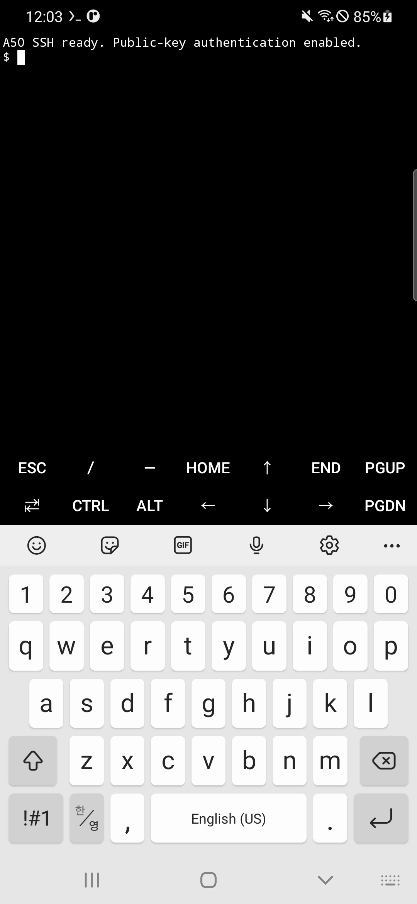
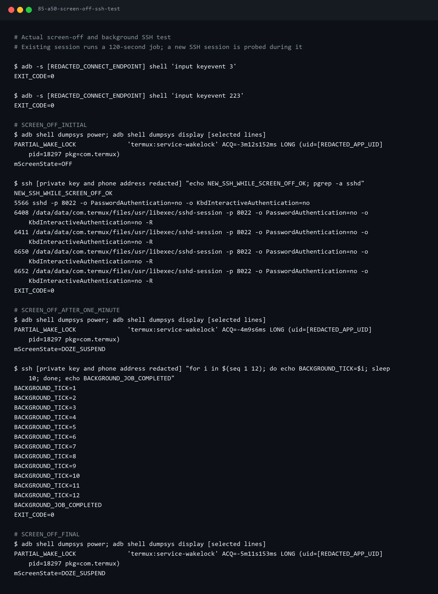
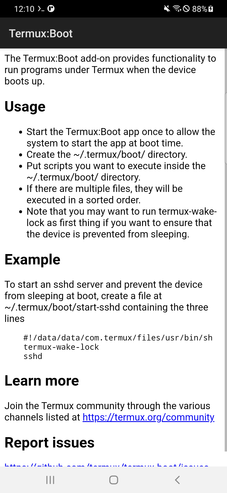
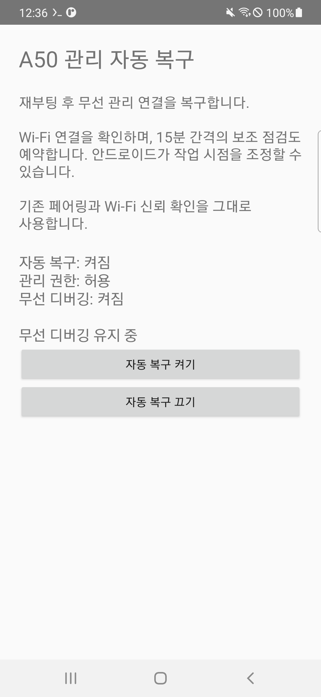
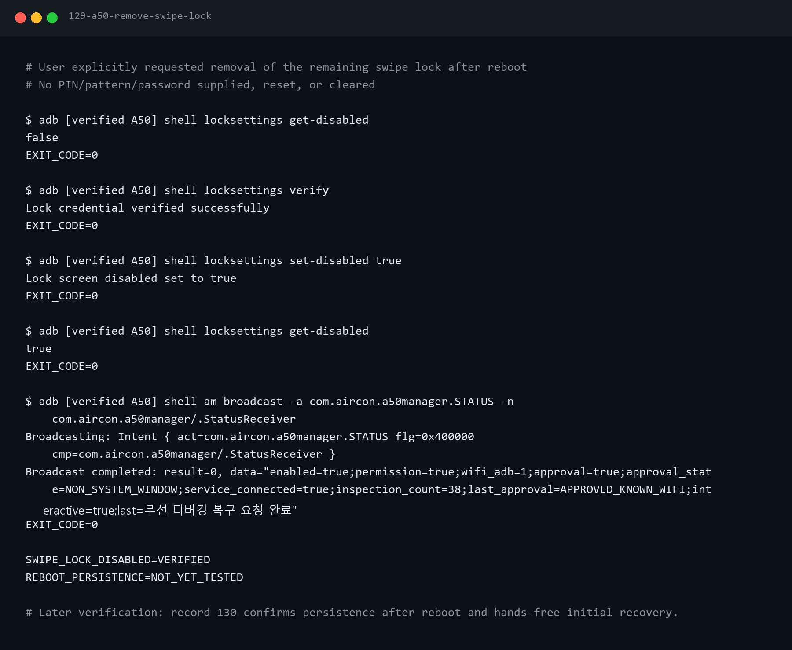
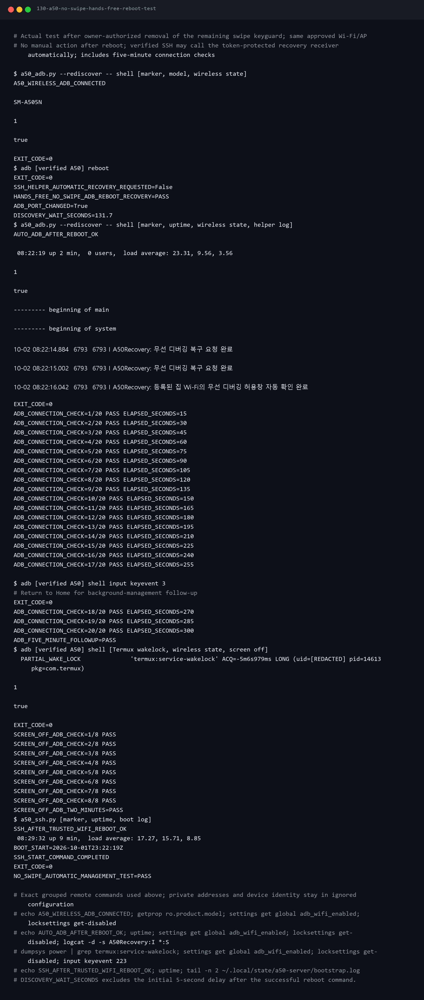
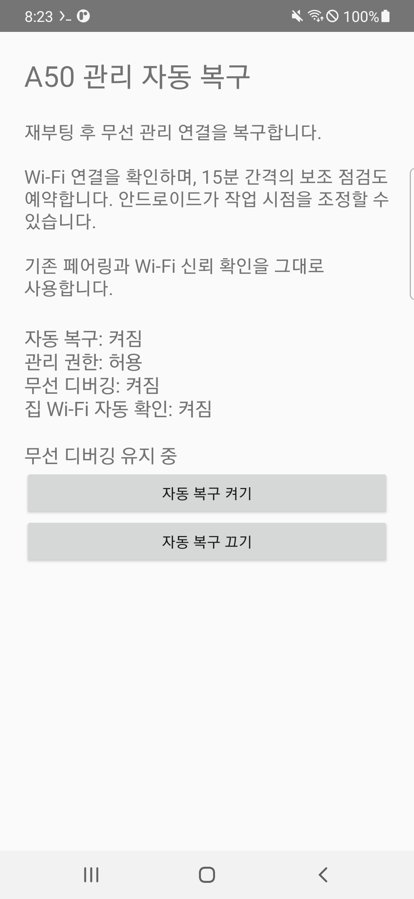

# 1편 — Galaxy A50 공기계를 원격으로 관리할 준비하기

상태: **SSH·무선 ADB의 수동 조작 없는 재부팅 복구와 초기 화면 꺼짐 검증 완료** (2026-10-02)

스마트홈의 각 Raspberry Pi는 해당 집의 센서와 에어컨 제어를 맡는다.
가족 계정과 여러 집의 알림을 구분할 중앙 서버를 준비하기 위해 남는 Galaxy A50을
실험 장비로 정했다. 이번 글에서는 서버를 설치할 수 있도록 원격 관리 환경까지 만든다.

## 기기와 초기화

모델은 SM-A505N이다. 삼성 공식 사양은 RAM 4GB, 저장 공간 64GB다.
직접 점검한 소프트웨어는 Android 11, Android 보안 패치 2023-02-01이다.
One UI 3.1과 공장초기화 완료는 사용자 확인으로 기록했다.

초기화는 필요한 데이터를 백업한 뒤 설정 → 일반 → 초기화 → 디바이스 전체
초기화에서 진행한다. 인증이 필요하면 휴대폰에서 직접 입력한다.
초기화 재부팅·환영 화면 사진은 촬영하지 않았다. 사진 때문에 초기화를 반복하지 않는다.

이 모델은 2026-10-01 확인한 삼성 정기 보안 업데이트 대상 목록에 없었다.
현재는 사설망 시험 장비로 사용하며 고객용 운영 적합성은 별도로 평가한다.

## Termux를 설치하고 Wi-Fi로 접근하기

F-Droid에서 Termux를 설치했다. 실제 확인한 앱 버전은 0.118.3이다.
Termux에서 패키지 목록을 갱신하고 OpenSSH를 준비했다.

    pkg update
    pkg install openssh
    whoami

위 블록은 재현용 설치 명령이다. 설치 과정을 직접 캡처한 것처럼 표현하지 않는다.
사용자가 확인한 사용자명·Wi-Fi 주소는 공개 자료에서 제거했다.

USB를 쓰지 않기로 했기 때문에 개발자 옵션의 무선 디버깅을 켜고 PC와 페어링했다.
페어링용 포트와 연결용 포트가 다르므로 실제 표시된 값을 사용했다.
인증 코드는 로그·공개 이미지에 보존하지 않는다.

## 공개키 SSH 연결

PC에서 A50 전용 Ed25519 키를 만들고 공개키만 Termux에 등록했다.
기존 authorized_keys 내용은 보존하고 디렉터리 권한은 700, 파일 권한은 600으로 설정했다.

    sshd -p 8022 -o PasswordAuthentication=no -o KbdInteractiveAuthentication=no

이 옵션으로 실행한 SSH에 PC에서 공개키로 접속했다.
개인키·전용 known_hosts와 비공개 접속 정보는 저장소 밖 또는 Git 제외 경로에 둔다.
다음 작업은 로컬 관리 도구로 같은 키와 확인된 호스트에 다시 접속할 수 있다.

화면의 준비 메시지만으로 성공을 판단하지 않았다.
실제 원격 응답 SSH_CONNECTION_OK와 종료 코드 0을 확인했다.
[SSH 연결의 세부 실행·오류 기록](02-termux-private-ssh.md)은 이 글의 보충 자료다.

## 화면이 꺼져도 실행 유지하기

Termux를 Android 배터리 최적화 예외에 넣고 termux-wake-lock을 실행했다.
기기의 foreground service와 실제 partial wake lock을 확인했다.

홈 화면으로 이동하고 화면을 끈 다음 기존 SSH 연결의 작업을 120초 동안 실행했다.
10초 간격 출력이 12회 모두 완료됐고 중간에 새 SSH 연결도 성공했다.
충전·Wi-Fi 연결 상태에서 수행한 초기 시험이며 24시간 안정성 결과는 아니다.

## 재부팅 뒤 자동 시작하기

Termux와 같은 F-Droid 배포처의 Termux:Boot 0.8.1을 설치하고 한 번 열었다.
Boot 앱도 배터리 최적화 예외로 설정했다.

로컬의 scripts/android/start-a50-ssh.sh를 ~/.termux/boot/10-start-ssh에 배포했다.
구문 검사와 파일 SHA-256 일치를 확인했다.
스크립트는 wake lock 요청과 공개키 SSH 시작을 수행하고 부팅 로그를 남긴다.

A50을 정상 재부팅하고 수동으로 Termux를 여는 명령 없이 접속을 시험했다.
146.8초 뒤 SSH 연결이 돌아왔고 새 부팅 기록에서 SSH 시작을 확인했다.
이 시험 전에 사용자가 화면 잠금을 없앴다. 잠금을 다시 설정한 조건은 재검증 대상이다.

[백그라운드·부팅 설정의 세부 자료](03-background-recovery.md)에는
APK 설치 시간 초과와 Windows 줄바꿈 문제의 실패·해결 기록도 남겼다.

## 현재 확보한 상태

### 무선 디버깅을 매번 켜지 않기 위한 추가 작업

SSH 부팅 복구와 Android 앱·화면을 관리하는 무선 ADB 복구는 별개다.
첫 시험에서는 SSH가 돌아왔지만 ADB는 240초 동안 발견되지 않았다.
변하는 포트만 자동 탐색해도 디버깅 자체가 꺼져 있으면 연결할 수 없다.

로컬에서 작은 관리 APK를 작성·서명해 A50에 설치했다.
최초 ADB 연결에서 설정 권한을 부여하고, 앱이 부팅 뒤 Wi-Fi 연결 상태를 확인해
무선 디버깅 설정 하나만 복구하도록 구성했다. 보조 작업은 15분 주기로 예약하며
실행 시점은 Android가 늦출 수 있다. PC에서는 기존에 페어링한 A50을 자동 발견하고
기기 정보를 검사한 뒤 명령을 실행한다. IP·포트를 매번 입력하지 않는다.

첫 앱 적용 시험에서는 재부팅 뒤 새 포트로 연결됐으나 4분 뒤 다시 끊겼다.
사용자가 Android의 Wi-Fi 사용 허용 팝업을 확인했다. 최초 팝업에서
‘이 네트워크에서 항상 허용’을 체크하고 허용해야 한다. 이 확인은 우회하지 않는다.
초기 복구와 지속 연결 검증을 구분하며 후속 시험 결과를 별도로 기록한다.

항상 허용을 저장했는데도 다음 재부팅에서 다시 실패했다. 현재 접속 지점의 허용
정보가 저장돼 있음을 실제로 확인했고 부팅 로그에 keyStore 파싱 오류가 있었다.
사용자의 체크 누락으로 단정하지 않는다. 소유자가 이미 허용한 집 Wi-Fi의 시스템
무선 디버깅 허용창만 확인하는 접근성 보완을 설치했다. 0.4.0에서는 집 Wi-Fi 이름과
접속 지점이 모두 일치하는 창을 처리하고, 화면을 잠깐 깨우며, SSH의 비공개 토큰 요청을
받아 복구한다. 실제 창의 체크박스와 허용 버튼 자동 처리를 확인했다. 화면을 끄고
디버깅을 한 번 비활성화한 시험도 약 9초 만에 복구했고 2분간 SSH·ADB가 유지됐다.

### 암호 없음과 드래그 잠금 없음은 다르다

다음 재부팅에서는 Wi-Fi 허용창이 기다렸고 사용자가 기본 드래그 잠금화면을 해제하자
자동 허용이 진행됐다. 암호·패턴을 없애도 드래그 화면은 남을 수 있다. 이 시험을
수동 조작 없는 복구로 기록하지 않았다. 사용자가 드래그 화면도 없애 달라고 요청했다.

확인된 A50에서 비밀번호 인자 없는 locksettings verify 성공을 확인하고
locksettings set-disabled true를 적용했다. 다시 읽은 저장값도 true였다.
암호·패턴을 초기화하는 명령은 실행하지 않았다. 다음 재부팅에서는 손대지 않고
약 2분 20초 뒤 새 포트로 ADB가 연결됐다. 명령 뒤 5초 대기 후의 자동 발견 대기는 131.7초였다. 잠금 없음 설정도 재조회에서 true였고,
앱 로그에 집 Wi-Fi 허용창 자동 확인 완료가 있었다. 이때 PC의 SSH 복구 요청 없이
Android 부팅 복구만으로 연결됐다. 새 PIN이나 패턴을 설정한 상태는 별도 검증 대상이다.

증거는 122~130의 실제 기록과 일지에 보존한다. 일반 서버용 SSH 부팅 복구와
무선 ADB의 자동 허용·지속 연결 결과를 구분한다.

재부팅 뒤 15초 간격 20회, 총 5분 동안 ADB 연결을 확인했다. 관리 앱을 홈 화면 뒤로
보내고 화면을 끈 뒤에도 15초 간격 8회, 총 2분 연결을 유지했다. 새로운 SSH 연결도
성공했고 최종 읽기 상태에서 화면 꺼짐(interactive=false), 무선 디버깅 켜짐과 잠금 없음이
유지됐다(130·133). 같은 집 Wi-Fi·충전·암호 없는 조건의 초기 검증이며 24시간 결과는 아니다.

관련 실패·해결 과정: 기록 97·100~105와
[자동 관리 설계](../../decisions/android-server-management.md).

같은 Wi-Fi에서 공개키 SSH로 원격 관리할 수 있고 화면 꺼짐과 정상 재부팅을 시험했다.
중앙 API·데이터베이스·FCM 연동은 아직 설치하지 않았다.
외부 사설망 접속과 장시간 운영 시험도 후속 작업이다.

**2편은 불필요한 앱 정리와 자원 측정부터 시작해 실제 중앙 서버를 구축하는 과정**이다.
서버를 설치하기 전에 휴대폰의 필수 기능을 유지하면서 운영 환경을 정리한다.

## 출처와 기록

- https://www.samsung.com/sec/support/model/SM-A505NZOAKOO/
- https://security.samsungmobile.com/workScope.smsb
- https://f-droid.org/en/packages/com.termux/
- https://github.com/termux/termux-boot
- https://developer.android.com/tools/adb
- [실제 검증 일지](../../journal/2026-10-02-a50-background-ssh-verification.md)

폰 화면 5장은 실제 캡처다. 터미널 PNG는 실제 명령·출력을 민감정보 제거 후
렌더링한 재구성 자료이며 TXT 원문도 함께 보존했다.
