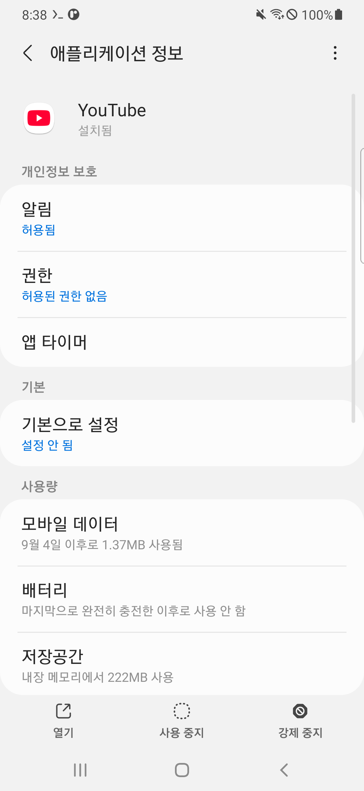
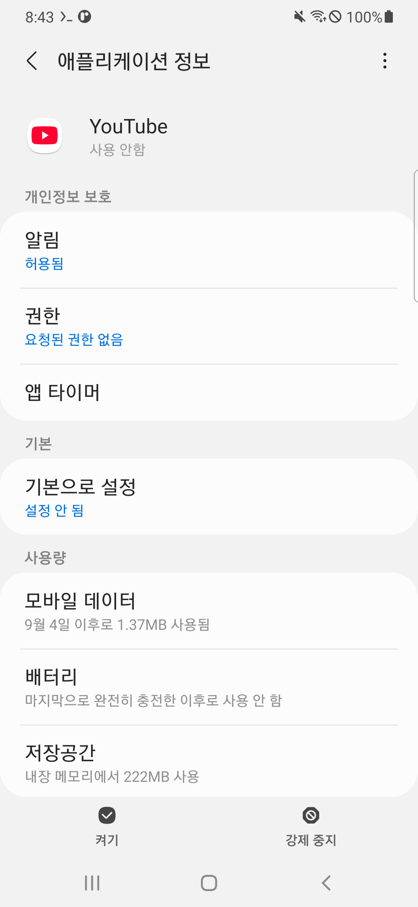
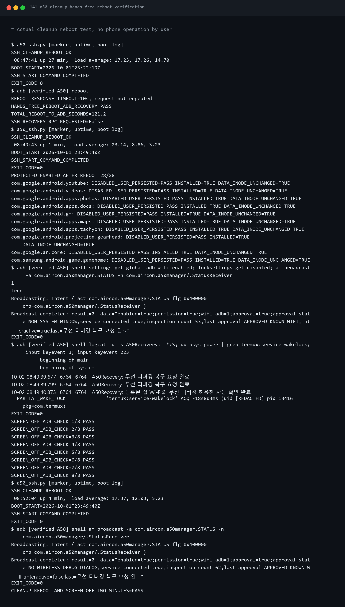

# 2편 — A50 운영 환경 정리와 중앙 서버 구축

상태: **앱 정리·중앙 서버 기반 구축·단기 복구 검증 완료 — 가구 인증·FCM 연결 전** (2026-10-02)

1편에서 원격 접속과 화면 꺼짐·재부팅 복구를 준비했다.
2편은 휴대폰을 가벼운 중앙 서버로 운영하기 위한 환경 정리와 실제 서비스 구축을 다룬다.

사용자 요청으로 앱 정리보다 사람이 매번 디버깅을 켜지 않아도 되는 관리 복구를
우선했다. 자동 관리의 실패와 수정은 1편과 2026-10-02 일지에 기록한다.
이후 사용자가 휴대폰을 조작할 수 없는 상태에서 앱 정리를 요청했다.
확인된 원격 접속으로 작업했으며, 앱을 삭제하거나 데이터를 초기화하지 않았다.

## 초기 준비 단계의 측정값

정리 전 SSH로 free -m을 실행했다.

| 항목 | 출력값 |
| --- | --- |
| RAM total | 3604 MiB |
| RAM used | 1753 MiB |
| RAM free | 83 MiB |
| buff/cache | 1767 MiB |
| RAM available | 1416 MiB |
| swap used / total | 250 / 2047 MiB |
| 데이터 영역 여유 | 49G |

free만 보면 부족해 보이지만 available은 회수 가능한 메모리를 반영한다.
Android는 종료된 앱과 파일을 캐시해 메모리를 활용하므로 사용량 감소만으로
최적화 성공을 판단하지 않는다. 앱별 메모리·CPU·실제 서버 응답과 유지 여부를 함께 본다.
[Android 공식 메모리 관리 설명](https://developer.android.com/topic/performance/memory-management)

부팅 7분 뒤 load average도 높게 측정됐다. 당시에는 CPU·대기 작업을
구분하지 못했다. 아래 후속 측정과 함께 해석하며 앱 정리로 해결됐다고 기록하지 않는다.
Termux UID로 dumpsys meminfo를 호출한 결과 Can't find service: meminfo였으며,
앱별 상세 점검에는 무선 디버깅의 shell 권한을 사용한다.

증거: [95 TXT](../../assets/terminal/95-a50-server-resource-baseline.txt).

## 정리 범위

사용자는 불필요한 앱 정리·최적화를 요청했고 휴대폰에 필수적인 구성은 유지하라고 명시했다.
선정한 일반 앱만 사용 중지해 먼저 복구 가능한 상태로 시험한다.
패키지명 일부가 비슷하다는 이유로 일괄 제거하거나 원격 debloat 목록을 그대로 실행하지 않는다.

유지 대상: Android 시스템, 홈·설정·키보드·파일 선택기·설치 관리자,
Wi-Fi·네트워크·충전·배터리 관리, Google Play 서비스와 관련 기반 구성,
Termux·Termux:Boot, 원격 관리 경로, 앱 설치·업데이트와 브라우저.
다른 앱이 의존하는 공용 구성도 유지한다.

## 실제 사용 중지한 앱

| 앱 | 실제 패키지 |
| --- | --- |
| YouTube | com.google.android.youtube |
| Google TV | com.google.android.videos |
| Google Photos | com.google.android.apps.photos |
| Google Drive | com.google.android.apps.docs |
| Gmail | com.google.android.gm |
| Google Maps | com.google.android.apps.maps |
| Google Meet/Duo | com.google.android.apps.tachyon |
| Android Auto | com.google.android.projection.gearhead |
| Google Play Services for AR | com.google.ar.core |
| Game Launcher | com.samsung.android.game.gamehome |

AR용 구성과 Google Play 서비스(com.google.android.gms)는 서로 다른 패키지다.
FCM과 앱 설치에 필요한 Google Play 기반 구성은 유지했다.
전화·블루투스·카메라·갤러리·브라우저도 유지했다.

선정 앱이 상시 시스템 앱이나 공용 라이브러리 제공자가 아닌지 실제 기기의
패키지 정보를 점검했다. Maps·Android Auto·AR에는 sharedUser 메타데이터가
있었지만 이름이 자기 패키지와 같고 실제 UID를 사용하는 패키지도 각각 자기
하나뿐임을 확인했다. 시스템과 UID를 공유하는 앱에 이 예외를 적용하지 않는다.

처음 두 미리보기는 패키지 출력 파싱과 보수적인 UID 검사에서 중단됐다.
기기 변경 없이 원인을 확인한 뒤 수정하고 검증했다.
실패 기록 [135](../../assets/terminal/135-a50-consumer-app-cleanup-preview.txt)·
[136](../../assets/terminal/136-a50-consumer-app-cleanup-preview.txt)도 보존했다.
정상 미리보기는 [137](../../assets/terminal/137-a50-consumer-app-cleanup-preview.txt),
실제 적용은 [139 TXT](../../assets/terminal/139-a50-consumer-app-cleanup-apply.txt)다.





후자의 ‘켜기’ 버튼으로 복원할 수 있고 설치 용량도 남아 있다.
사용 중지는 APK 저장 공간을 회수하는 삭제 작업이 아니다.

## 복구 가능한 적용 방식

로컬 scripts/android/a50_app_cleanup.py는 인자 없이 실행하면 미리보기만 한다.
고정된 10개 외 패키지는 처리하지 않으며, 앱마다 보호 대상 28개의 활성 상태와
각 대상의 설치 여부·데이터 디렉터리 식별값 유지 여부를 확인했다.
처음 상태는 공개 저장소에서 제외된 .deploy/a50/ 아래에 저장했다.
데이터 내용 전체의 체크섬을 비교한 검증은 아니다.

```text
python scripts/android/a50_app_cleanup.py
python scripts/android/a50_app_cleanup.py --apply
python scripts/android/a50_app_cleanup.py --restore
python scripts/android/a50_app_cleanup.py --restore --apply
```

마지막 명령만 실제 복원을 수행한다. 원래 기본 활성 상태였던 앱에는 pm default-state,
명시적으로 켜져 있던 앱에는 pm enable을 사용한다. 실제 전체 복원은 실행하지 않았다.
오류 시 이번 실행에서 바꾼 대상만 원래 상태로 되돌리는 경로도 준비했다.
파싱·시스템 앱 거부·허용 목록·복원 명령·단독 UID 확인에 관한 6개 로컬 검사가
기존 ADB 검사 11개와 함께 통과했다. 실제 오류 복원 시험은 실행하지 않았다.

## 같은 부팅에서 정리 전후 비교

USB 충전·화면 꺼짐 상태에서 약 10분 간격으로 읽었다. 두 측정 사이에
앱 정보 화면 확인과 설정 앱 실행도 있었으므로 순수한 성능 실험으로 해석하지 않는다.
기준은 /proc/meminfo이며 kB를 1024로 나눠 MiB로 표시했다.

| 항목 | 직전: 부팅 15분 | 직후: 부팅 26분 |
| --- | ---: | ---: |
| MemAvailable | 1482.8 MiB | 1475.1 MiB |
| MemFree | 131.5 MiB | 194.0 MiB |
| Cached | 1459.8 MiB | 1379.7 MiB |
| 사용 중인 swap | 286.0 MiB | 313.8 MiB |
| dumpsys cpuinfo의 TOTAL | 2.8% | 1.5% |
| D 상태 작업 | 17개 | 17개 |
| 배터리 온도 | 30.9°C | 30.5°C |

정리 전 선택 앱 중 YouTube·Google TV·Gmail·Android Auto의 프로세스 PSS
합계는 196,464 KiB, 약 191.9 MiB였다. 정리 뒤에는 대상 10개 앱의 프로세스가
PSS 목록에 없었다. 다른 시스템·앱·캐시도 변하므로 이를 전체 RAM 절감량으로
치환하지 않는다. MemAvailable은 오히려 약 7.7 MiB 줄어 **뚜렷한 전체 메모리
개선은 확인하지 못했다**. 앱의 불필요한 실행을 제한한 결과와 성능 개선 주장을 구분한다.

3초 간격 top 두 번째 표본도 전체 8코어 기준 약 2% 수준의 낮은 CPU 사용을
보였다. 높은 load average만으로 CPU가 과부하라고 판단하지 않았다.
일반 Linux 부하 계산은 실행 작업과 중단 불가능한 대기 작업을 함께 센다.
[Linux 커널 부하 계산 설명](https://github.com/torvalds/linux/blob/master/kernel/sched/loadavg.c)

실제 D 상태 작업은 보안·제조사 커널 스레드였고, /proc/stat의 procs_blocked는 0이었다.
D 상태 관찰을 실제 디스크 병목 17개로 해석하지 않는다. 높은 부하와 대기 작업의
관련성은 가설이며 제조사 커널의 정확한 대기 원인은 확정하지 못했다.
해당 작업을 강제로 종료하거나 전원·보안 구성, zRAM을 변경하지 않았다.

원문: [138 TXT](../../assets/terminal/138-a50-before-cleanup-resource-baseline.txt),
[140 TXT](../../assets/terminal/140-a50-same-boot-before-after-resources.txt).
두 기록의 같은 이름 PNG는 실제 출력을 재구성한 터미널 자료다.

## 정리 후 운영 검증

적용 직후 보호 대상 28개 활성 상태, 데이터 디렉터리 식별값, SSH·페어링 ADB
응답을 확인했다. 정상 재부팅 1회 후 사용자 조작 없이 121.2초 만에 검증된 ADB가
돌아왔고 별도 SSH도 응답했다. 최초 재부팅 명령 응답은 10초 시간 초과여서
요청을 반복하지 않았다. 기기 자체 관리 앱의 부팅 복구가 허용창을 처리했다.

재부팅 후 보호 대상 28개와 일반 앱 10개의 사용 중지 상태·설치 여부·데이터
디렉터리 식별값 유지, 잠금 없음 설정과 Termux wake lock을 확인했다.
홈 화면에서 화면을 끈 뒤 15초 간격으로 8회 ADB 연결을 검증하고 2분 뒤 SSH도
확인했다. 관리 앱의 최종 상태는 interactive=false, service_connected=true,
wifi_adb=1이었다. 같은 집 Wi-Fi·충전 조건의 단기 검증이다.
증거: [141 TXT](../../assets/terminal/141-a50-cleanup-hands-free-reboot-verification.txt).



## 중앙 서버 실행 기반 구축

두 번째 작업에서는 실제 Python 실행 환경, 상태 확인 API, 작은 SQLite 저장소,
서비스 감독·로그 제한·부팅 자동 시작을 준비했다. 사용자 휴대폰 조작은 요구하지 않았다.
Pi의 기존 제어 서비스와 분리한 services/central-server/를 로컬 기준본으로 사용한다.
가구 인증·초대·알림 발송 기능을 완성한 단계는 아니다.

### 설치한 구성과 선택 이유

| 구성 | 실제 설치 버전·설정 |
| --- | --- |
| Termux Python | 3.14.6 |
| SQLite | 3.53.4, Python 기본 sqlite3 사용 |
| Flask | 3.1.3 |
| Waitress | 3.0.2, 작업 스레드 2개 |
| termux-services / runit | 0.13-1 / 2.3.1 |
| API | 휴대폰 내부 127.0.0.1:8001 |
| 영구 저장소 | ~/.local/share/aircon-central/central.sqlite3 |

Waitress는 별도 서버로 Flask 앱을 실행한다. 개발용 flask run을 부팅 서비스로
사용하지 않았다. Waitress 자체는 Python으로 구현돼 별도 컴파일 의존성이 없다.
[Flask 공식 배포 안내](https://flask.palletsprojects.com/en/stable/deploying/waitress/)

Flask의 간접 의존성인 MarkupSafe는 실제 A50에서 네이티브 빌드가 필요했고 성공했다.
Python 패키지 설치가 clang 등 도구를 함께 가져왔으며 설치 전 추가 디스크 사용
예상은 588MB였다. 실행 프로세스의 RAM 사용과 설치 파일 크기는 구분한다.
Python 환경의 기본 pip를 따로 업그레이드하지 않고 프로젝트 가상환경을 사용했다.

### 실제 배포 절차

```text
python scripts/android/a50_record.py --label central-runtime-packages --script scripts/android/prepare_a50_runtime.sh --timeout 600
python -m pytest tests/test_central_server_foundation.py -q
python scripts/android/deploy_a50_central.py
python scripts/android/deploy_a50_central.py --apply
```

기존 SSH 연결 설정은 공개키·기존 호스트 키를 검증하며 비공개 파일에서 읽는다.
배포 도구 기본 명령은 읽기 전용 계획 확인이다. 실제 배포는 --apply로만 수행한다.
소스 11개 파일은 SHA-256 기준 릴리스 디렉터리에 넣고 current 링크로 실행한다.
기존 배포 파일과 기록이 다르면 중단해 원격 변경을 보존한다.
데이터베이스·로그·비밀값은 소스 릴리스 밖에 둔다.

첫 릴리스: v0.1.0-ccd62f777a96a998.
소스와 설치한 훅의 모든 체크섬 일치를 확인했다.
명령과 실제 설치 출력은 [143](../../assets/terminal/143-a50-central-runtime-packages.txt),
미리보기 [146](../../assets/terminal/146-a50-central-deploy-preview.txt),
실제 적용 [147](../../assets/terminal/147-a50-central-deploy-apply.txt)에 보존했다.

### 자동 시작과 제한된 복구

별도 ~/.termux/boot/20-start-central 훅이 서비스 데몬을 시작한다.
기존 10-start-ssh는 변경하지 않았다. 원래 sshd·ssh-agent 서비스의 down 파일도
유지해 중앙 서비스 시작이 SSH 설정을 바꾸지 않게 했다.
서비스 명령은 runit이 감독한다.
[Termux 공식 서비스 관리](https://github.com/termux/termux-services/blob/master/README.md)

비정상 종료는 재시작하되 5분 안에 5회 실패하면 down 파일과 오류 기록을 남겨
반복 시작을 중단한다. 정상 중지·재시작의 종료 신호는 실패로 세지 않는다.
기기 재부팅도 이 중지 표시를 유지한다. 서버 장애 시 기존 SSH로 원인을 확인하고
수정한 뒤 명시적으로 다시 시작할 수 있다.
앱 로그와 서비스 출력 로그 각각 1MiB+백업 3개, 합계 약 8MiB로 제한했다.
부팅 기록은 최근 100줄을 유지한다. 영구 DB의 용량 제한 정책은 향후 실제 데이터
보존 요구를 정할 때 추가하며, 이번에는 임의 삭제 규칙을 넣지 않았다.

### API와 영구 저장소 확인

GET /health/live는 프로세스 생존, GET /health/ready는 실제 SQLite 읽기를 확인한다.
저장소가 없거나 오류가 나면 준비 확인은 503을 반환하며 빈 DB를 새로 만들지 않는다.
DB 초기화도 모르는 기존 스키마를 덮어쓰지 않고 중단한다.
GET /는 중앙 서버 준비 상태를 보여준다.

```text
python scripts/android/verify_a50_central.py
python scripts/android/verify_a50_central.py --exercise-recovery --reboot
```

첫 명령은 점검만 한다. 두 번째는 서버 프로세스 1회 종료·기기 재부팅·화면 꺼짐
검증을 명시적으로 실행한다. 실제 첫 점검에서는 다음을 확인했다.

- 생존·저장소 확인 모두 HTTP 200, SQLite integrity_check=ok.
- 4개 클라이언트에서 준비 확인 요청 8개 정상 응답. 실제 4가구 부하 시험은 아니다.
- 휴대폰 내부 API 성공, LAN 주소의 8001 연결 거부. 공용 공개·포트포워딩은 하지 않았다.
- 서버 RSS 36,732 KiB, 약 35.9 MiB. 서버 작업자 1개 기준이며 전체 Android RAM은 아니다.
- 서버 프로세스만 한 번 SIGKILL한 뒤 새 PID와 준비 응답 복구, 실패 기록 1회 확인.
- 재시작 뒤 기존 DB 메타데이터 유지·SSH 부팅 파일 변경 없음·소스 체크섬 일치.

5회 실패 자동 중지는 로컬 보호 검사로 확인했고, 실제 A50에서는 강제 종료 1회만
시험했다. 원문은 [148](../../assets/terminal/148-a50-central-runtime-verification.txt)이다.
정상 재부팅 후 122.0초 만에 ADB가 돌아왔고 중앙 API도 준비 응답을 반환했다.
재부팅 전 메타데이터, 기존 SSH 부팅 파일, 설치 소스와 훅의 체크섬이 유지됐다.
화면 꺼짐 상태에서 15초 간격 8회 준비 응답과 ADB를 확인하고 마지막 SSH·DB
무결성 검사도 통과했다. 관리 상태는 interactive=false, wifi_adb=1이었다.
동일 Wi-Fi·충전 조건의 화면 꺼짐 2분 시험이며 장시간 운영 완료를 뜻하지 않는다.


최종 읽기 전용 점검 [151](../../assets/terminal/151-a50-central-final-readonly.txt)에서는
준비 화면 HTTP 200과 정상 동작 문구, 서버 RSS 36,212 KiB(35.4MiB),
유휴 2초 표본의 서버 단일 코어 CPU 0.0%, 시스템 RAM available 1301MiB,
저장 공간 여유 48G를 확인했다. 준비 확인 중 RSS는 39,264KiB(38.3MiB)까지
측정됐다. 샘플 사이 시간·부팅 단계가 달라 앱 정리 직전 값과 성능 비교하지 않는다.
보호 앱 28개 활성·일반 앱 10개 사용 중지·화면 꺼짐도 유지됐다.
휴대폰 브라우저를 여는 캡처 요청은 작업 도구의 자동 승인 정책이 차단해 실행되지
않았다. 실제 단말 화면으로 꾸미지 않고 HTTP 확인 원문·터미널 재구성 이미지를 보존했다.

처음 로컬 검사는 Windows에 없는 비차단 파일 플래그에서 실패했다.
Android용 runit 제어와 Windows 파일 기반 검사를 구분해 수정했고 8개 검사가 통과했다.
실패 [144](../../assets/terminal/144-a50-central-local-guard-before-fix.txt),
해결 후 [145](../../assets/terminal/145-a50-central-local-tests.txt)를 함께 보존했다.
원격 변경 보존·미리보기·기존 훅 충돌 검사 4개를 추가해 최종 12개 검사가
통과했다([150](../../assets/terminal/150-a50-central-final-local-checks.txt)).
배포 뒤 다시 미리보기를 실행해 원격 파일 일치도 확인했다
([149](../../assets/terminal/149-a50-central-deploy-preview.txt)).

운영 명령과 복구 방법: [서버 README](../../../services/central-server/README.md).

## 작업 순서

1. 앱 목록·메모리·CPU·배터리·현재 상태 기록 — 완료.
2. 명확한 일반 앱만 선정하고 사용 중지 전 상태와 복구 방법 보존 — 완료.
3. SSH·Wi-Fi·설정·부팅 자동 실행과 같은 조건의 자원 측정 — 완료.
4. 중앙 서비스 실행 환경과 작은 데이터베이스 준비 — 완료.
5. 로컬에서 구현·검증한 서버 배포·로그·자동 시작·상태 확인 — 완료.
6. 화면 꺼짐·재부팅 검증 — 완료. 다른 장비 접속·장시간 운영은 후속 작업.

가구 인증·권한 분리·실제 FCM 발송 성공은 서버 기반 구축과 구분해 기록한다.
상태 확인용 중앙 API만 준비했으며 Firebase 자격 증명은 설치하지 않았다.
