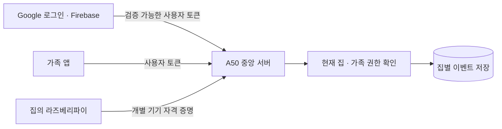
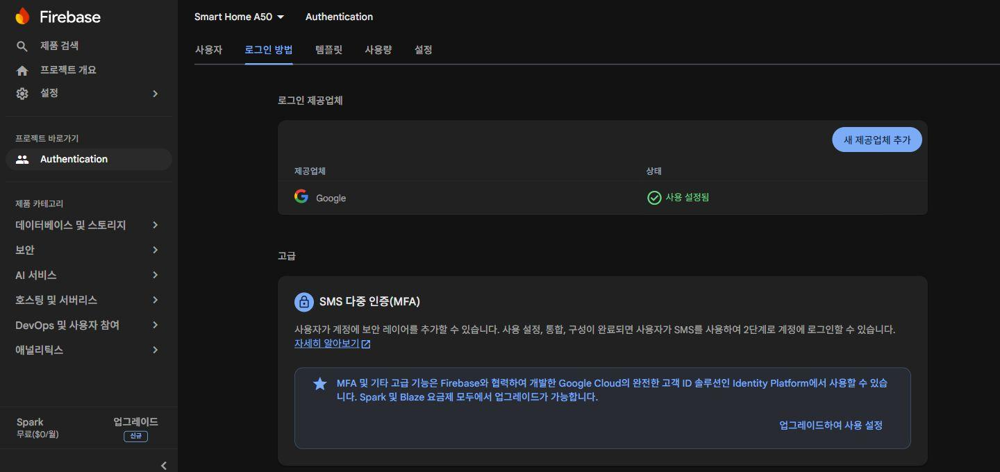

# 3편 — Google 로그인과 집마다 분리된 가족 권한

2026-10-02. A50 중앙 서버 0.2.0의 집·가족·기기 등록 API를 구현하고 배포했다.
Firebase 무료 Spark 프로젝트를 만들고 Google 로그인 제공자를 활성화했다.
Android 앱의 실제 Google 로그인과 FCM 수신은 다음 단계다. 이 글의 가족·기기 검증은
서명한 테스트 계정과 가상 허브를 사용했으며 실제 가족이나 Pi를 등록하지 않았다.

## 왜 로그인만으로는 부족한가

앱을 설치하고 Google로 로그인해도 모든 집의 알림을 받을 수 있어서는 안 된다.
로그인은 ‘누구인지’를 확인한다. 중앙 서버의 가족 등록은 ‘어느 집을 볼 수 있는지’를 결정한다.
각 집에 소유자와 가족 목록을 두고, 요청할 때마다 현재 권한을 확인한다.



그림의 앱과 Pi는 연결할 대상이다. 이번에는 중앙 API와 등록·권한 구조를 검증했다.
휴대폰 내부 주소의 8001 포트만 유지했다. 다른 집이나 외부 앱의 접속 통로는 아직 구성하지 않았다.

## Google 로그인 설정

노트북의 Firebase Console에서 Smart Home A50 프로젝트를 무료 Spark 요금제로 생성했다.
Google 애널리틱스와 유료 결제는 연결하지 않았다. Firebase 약관 동의 및 Google 로그인
저장·현재 계정의 지원 이메일 사용은 사용자에게 확인받고 진행했다.
Authentication → 로그인 방법 → Google에서 공개용 이름과 지원 이메일을 정해 저장했다.
지원 이메일은 앱 사용자에게 보일 수 있으므로 개인 주소를 계속 사용할지는 출시 전에 검토한다.



위 이미지는 실제 콘솔 화면이다. 공개 자료에서 개인 계정 영역은 제외했다.
프로젝트 ID는 장비의 비공개 설정 파일에 저장했다. 서비스 계정 키는 이 단계에 필요하지 않았다.
Android 앱 등록과 앱 서명 지문 등록은 APK 개발 때 수행한다.

## 토큰 검증과 가족 권한

서버는 Google의 HTTPS 공개 인증서를 받아 Firebase ID 토큰의 RSA 서명, 프로젝트 ID,
발급자, 만료 시간, 발급·인증 시간, 사용자 ID를 확인한다. Google 로그인 제공자와 확인된
이메일도 요구한다. Google OAuth 액세스 토큰을 이 API에 그대로 보내는 방식이 아니다.
검증 방식의 기준은 [Firebase ID 토큰 검증 공식 문서](https://firebase.google.com/docs/auth/admin/verify-id-tokens)다.

사용자 ID·역할을 요청 본문이나 임의 헤더로 보내도 권한이 생기지 않는다.
권한은 현재 SQLite의 가족 등록에서 읽는다. 소유자가 가족을 제외하면 기존 로그인 토큰이
아직 유효해도 그 집의 조회는 거부된다. 존재하지 않는 집과 다른 집 접근은 모두 404로 응답한다.

| 역할 | 이번에 가능한 작업 |
| --- | --- |
| 소유자 | 집 생성·조회, 가족 초대·역할 변경·제외, 기기 등록·해제, 이벤트 조회 |
| 가족(member) | 참여한 집·기기 목록·이벤트 조회 |
| 조회 전용(viewer) | 참여한 집·기기 목록·이벤트 조회 |

현재 제어 명령 API는 없다. member와 viewer의 제어 차이는 실제 명령 API를 만들 때 적용해야 한다.
계정 자체의 Firebase 전역 토큰 폐기 여부를 실시간 확인하는 기능도 아직 없다.
집에서 가족을 제외하는 즉시 차단과 Firebase 계정 전체 폐기는 별개다.

## 가족 초대

소유자가 가족의 Google 이메일과 역할을 지정해 초대한다. 초대는 24시간 동안 유효하며
한 번만 수락할 수 있다. 초대 문자열은 소유자가 전달하고, 중앙 서버가 이메일을 발송하지 않는다.
다른 이메일로 로그인한 사람이 문자열을 알아도 수락하지 못한다.
이미 로그인한 계정은 고유 사용자 ID에도 묶어 계정 재생성으로 기존 권한을 가져가지 못하게 했다.

초대 원문은 DB에 저장하지 않고 해시만 보관한다. 동시 수락은 트랜잭션으로 처리한다.
가족 제외보다 오래된 미사용 초대로 재가입할 수 없다. 제외한 사람을 다시 받으려면 소유자가
새 초대를 만들어야 한다. 순서는 서버 시계 대신 감사 기록의 증가 번호로 비교한다.

## 라즈베리파이의 집 등록

운영자가 SSH 관리 경로에서 허브를 준비하면 기기 전용 자격 증명과 10분 동안 유효한 등록 코드를 만든다.
일반 앱 API로 자격 증명을 발급할 수는 없다. 발급 자료는 새 비공개 파일에만 저장하며
터미널에 표시하지 않는다. 실제 Pi에 이 자료를 설치하는 단계는 아직 진행하지 않았다.

소유자가 등록 코드를 제출하면 그 허브를 자기 집에 연결한다. 사용한 코드는 재사용할 수 없고,
허브를 다른 집으로 옮기는 요청도 거부된다. 현재 집 하나당 활성 허브는 하나다.
기기를 해제하면 기존 자격 증명의 이벤트 수신을 즉시 차단하며 과거 이벤트는 보존한다.
기기 교체는 기존 기기 해제 후 새 등록으로 진행한다.

기기가 이벤트를 보내면 서버가 등록된 집을 찾는다. 기기 요청에 집 ID를 추가하면 거부한다.
이벤트의 일반 payload에 집 ID 같은 글자가 있어도 소속 집 판정에는 사용하지 않는다.
재전송은 기기별 event_id로 중복을 제거하고, 같은 ID에 다른 내용은 409로 거부한다.

## A50 설치와 데이터 보존

Termux의 미리 빌드된 python-cryptography 50.0.2를 설치했다. cffi 2.1.1은 실제 A50에서
빌드됐고 pycparser 3.0을 설치했다. 서버 가상환경은 system-site-packages로 해당 네이티브
라이브러리를 사용한다. 앱 라이브러리 버전은 requirements.txt에 고정했다.

```text
python scripts/android/a50_record.py --label auth-dependencies --script scripts/android/prepare_a50_auth.sh --timeout 300
python -m pytest tests/test_central_households.py tests/test_central_server_foundation.py tests/test_a50_central_deploy.py -q
python scripts/android/deploy_a50_central.py
python scripts/android/deploy_a50_central.py --apply
python scripts/android/test_a50_households.py
python scripts/android/configure_a50_firebase.py --project-id [FIREBASE_PROJECT_ID]
python scripts/android/verify_a50_households.py
```

실제 적용 전에 기존 소스·부팅 파일의 체크섬을 비교했다. 서버를 정상 중지하고 SQLite backup API로
일관된 백업을 만든 뒤 스키마 1을 2로 확장했다. 기존 설치 식별값과 SSH 부팅 파일은 유지됐다.
DB·설정·로그는 릴리스 소스에서 제외하며, 모르는 원격 변경이 있으면 덮어쓰지 않는다.
현재 서비스만 재시작했다. 이번 0.2.0에서 기기 재부팅 시험은 다시 하지 않았다.

## 실패와 수정

첫 로컬 검사에서 JWT 라이브러리가 프로젝트 ID가 포함된 audience 배열을 허용했다.
Firebase 규격에 맞게 audience가 정확히 해당 프로젝트 ID 문자열인지 추가 검사했다.
가족의 소유자 역할 요청 검사는 입력 검증 400이 먼저 발생하므로, 권한 검사 시험은 유효한
member 역할 변경 요청으로 수정했다. 초기 출력 발췌와 수정 후 결과를 기록으로 보존했다.

장비의 읽기 전용 점검 스크립트를 시스템 Python으로 실행하자 jwt 모듈이 없다는 오류가 났다.
서버 자체 장애는 아니었다. 서버 전용 가상환경의 Python으로 실행해 해결했다(158 → 160).
Firebase 콘솔의 특정 캡처 호출도 시간 초과가 났으므로 현재 화면 캡처로 완료 화면을 보존했다.

## 확인한 결과와 남은 일

로컬 관련 검사 30개, A50의 인증·가족·저장소·복구 제한 검사 26개가 통과했다.
테스트용 RSA 서명은 실제 검증 코드를 통과했고 잘못된 서명·프로젝트·만료 토큰은 거부됐다.
다른 집 조회, 초대 탈취·재사용·동시 수락, 가족 제외 후 접근, 다른 집 기기 재등록,
이벤트 집 바꾸기·중복 충돌, 해제된 기기 전송을 검사했다.

운영 DB에는 테스트 계정·기기를 넣지 않았다. A50에서 Google HTTPS 인증서 가져오기·파싱,
스키마 2 무결성, 백업의 스키마 1, 기존 식별값·SSH 보존, 코드 체크섬을 확인했다.
운영 API는 인증 없음·위조 토큰에 401을 반환했다. LAN 주소의 8001 포트는 열리지 않았다.
서버 RSS는 이 시점 40,612 kB였다. 장기간 운영이나 실제 3~4가구 부하 측정은 아니다.

다음 단계는 Android APK의 Google 로그인·집 등록·가족 초대 화면을 연결하는 일이다.
그 뒤 실제 Pi 등록·외부 접속 통로·FCM 발송과 다른 집 알림 미수신을 검증한다.
현재 ‘어디서나 알림 수신’이 완성됐다고 해석하면 안 된다.

실행 자료: [153 의존성](../../assets/terminal/153-a50-auth-dependencies.txt),
[154 미리보기](../../assets/terminal/154-a50-central-deploy-preview.txt),
[155 배포](../../assets/terminal/155-a50-central-deploy-apply.txt),
[156 A50 테스트](../../assets/terminal/156-a50-household-native-tests.txt),
[157 설정](../../assets/terminal/157-a50-firebase-private-config.txt),
[158 점검 오류](../../assets/terminal/158-a50-household-production-verification.txt),
[159 운영 상태](../../assets/terminal/159-a50-central-runtime-verification.txt),
[160 수정 후 점검](../../assets/terminal/160-a50-household-production-verification.txt).
각 TXT와 같은 이름의 PNG는 실제 실행 출력을 읽기 좋게 재구성한 터미널 자료다.

로컬 실패 발췌는 [161](../../assets/terminal/161-a50-household-initial-local-failures.txt),
최종 로컬 검사는 [162](../../assets/terminal/162-a50-household-final-local-checks.txt)에 보존했다.
