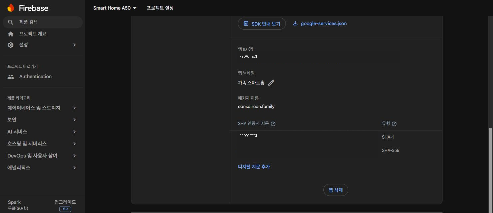
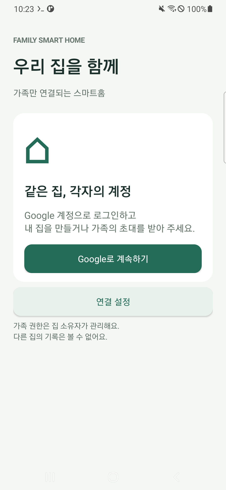
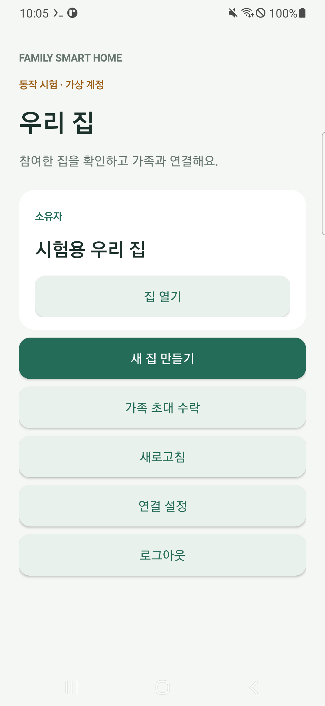
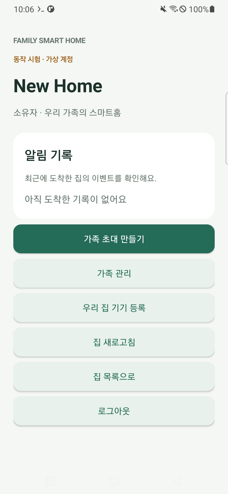
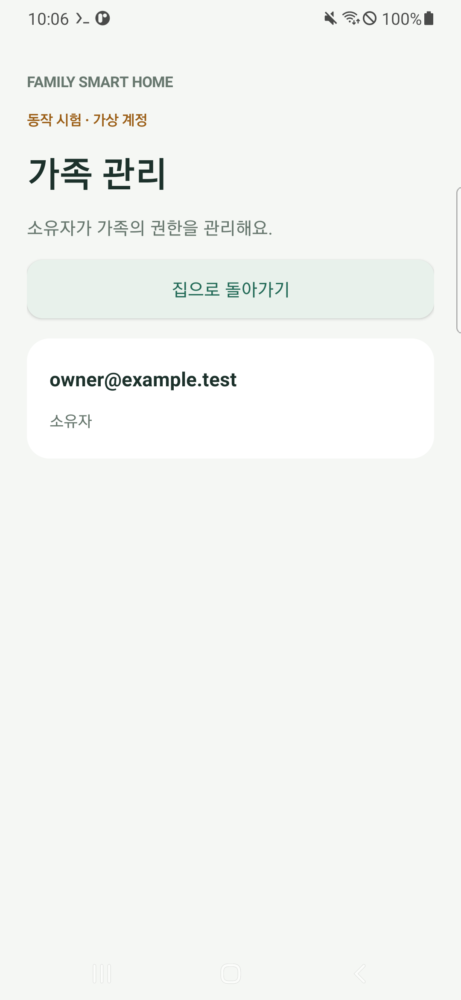
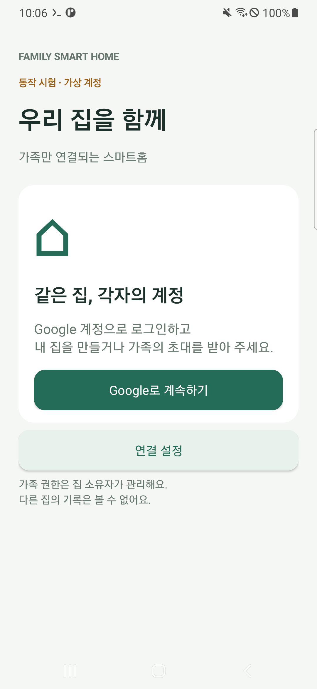
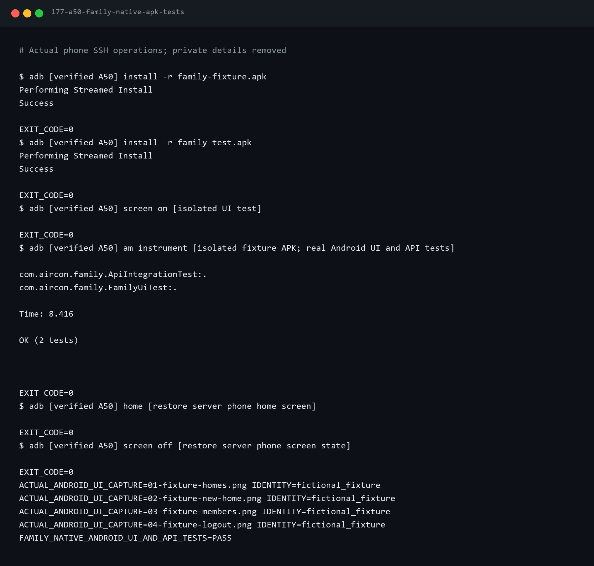

# 4편 — 가족 스마트홈 APK와 Google 로그인 연결

2026-10-02 작업 기록. `android/family-app`에 가족용 Android 앱을 만들었다.
기존 A50 관리 앱과 별개이며, 집·가족 API는 3편의 A50 중앙 서버를 사용한다.
시험 APK 빌드·A50 UI/API 검사, 실제 Firebase 구성의 개발·배포 APK 빌드와 서명·분리 검사를
완료했다. A50에 배포 APK를 설치하고 Firebase 초기화·로그인 시작 화면을 확인했다.
실제 계정으로 Google 로그인을 완료하는 시험과 외부 API 접속·FCM은 다음 단계다.

## 이번 단계의 경계

Google 로그인이 사용자를 식별하고, 중앙 서버가 집과 가족 권한을 판단한다.
앱 설치만으로 다른 집에 참여할 수 없다. 소유자는 새 집을 만들고 특정 Google 이메일에
가족 또는 조회 전용 초대를 발급한다. 지정 계정이 유효한 코드를 수락해야 참여한다.
FCM 푸시, 실제 Pi 연결과 외부 HTTPS 접속 경로는 이후 단계다.

현재 운영 API는 A50 내부의 8001 포트에서만 듣는다. 다른 휴대폰에서 사용할 실제 주소는
아직 제공되지 않았다. 공유기 포트포워딩이나 공개 바인딩을 이번 단계에서 설정하지 않았다.

## 준비물과 앞선 단계

- Windows 개발 환경과 Python 가상환경, 앞선 관리 앱의 JDK 17 준비.
- A50에 Termux SSH·무선 ADB 자동 관리와 중앙 서버 0.2.0.
- Firebase Spark 프로젝트에서 Google 로그인 제공자 활성화.
- 실제 Google 로그인 시험에는 Google 계정과 Google Play 서비스가 있는 휴대폰.

실기기 A50은 Android 11이며 Google 계정 수는 **0개**로 측정됐다.
가족 화면·권한은 별도의 가상 계정으로 검증하고, 실제 Google 로그인을 성공했다고
표현하지 않는다. 계정 추가·비밀번호 입력은 자동화하지 않는다.

## 1. 공식 도구 준비

저장소 최상위에서 기존 Python 가상환경을 활성화하고 실행한다.

```powershell
python scripts/android/prepare_family_tools.py
python scripts/android/prepare_family_signing.py
```

SDK 36, Build Tools 36.0.0, Platform Tools는 Google의 공식 저장소 XML에 기록된
체크섬과 비교한다. Gradle 8.13은 공식 배포의 SHA-256과 비교한다.
AGP는 8.13.2, Java는 17이다. 재현할 때 같은 버전을 사용한다.
다른 컴퓨터에서는 JDK 17 설치 후 `prepare_family_tools.py --java-home <JDK_17_절대경로>`를
사용하거나 `JAVA_HOME`을 설정한다. 도구는 실제 Java 주 버전이 17인지 검사한다.
가상 계정 시험에 필요한 Python 패키지는 `python -m pip install -r services/central-server/requirements.txt`로 준비한다.
빌드·도구 설치 기록은 실제 출력을 민감정보 제거한 TXT와 PNG로 보존한다.

가족 앱의 서명 키는 RSA 3072비트 PKCS12이며 저장소 밖의 비공개 폴더에 보관한다.
키와 비밀번호 파일을 모두 안전하게 백업해야 같은 서명으로 업데이트할 수 있다.
기존 A50 관리 앱의 키를 바꾸거나 덮어쓰지 않는다.
`.deploy/family-app/signing.json`은 키 위치와 공개 지문을 담는 로컬 파일이고 Git에서 제외한다.

## 2. Firebase에 Android 앱 등록

Firebase Console → 프로젝트 설정 → 일반 → 내 앱 → Android 앱 추가로 이동한다.
패키지 이름 `com.aircon.family`, 닉네임 `가족 스마트홈`을 입력한다.
패키지 이름은 Firebase 등록과 APK에 정확히 같아야 한다.
전용 키의 공개 SHA-1과 SHA-256을 앱 설정에 등록한다.
사용자가 이 등록·지문 연결을 승인했고, 콘솔에서 앱과 두 지문이 저장된 것을 확인했다.



이 이미지는 실제 콘솔 화면이다. 계정 영역·프로젝트 앱 식별자·지문 값은 공개용에서 제거했다.
개인 서명 키와 비밀번호는 Google에 전송하지 않았다.

**Google 제공자를 켜고 지문을 저장한 다음** `google-services.json`을 다시 다운로드한다.
`.deploy/family-app/google-services.json`에 보관한다. 웹 OAuth 클라이언트 ID
(`client_type: 3`)가 있는 파일이 필요하다. Android OAuth 클라이언트 ID를
Credential Manager의 서버 클라이언트 ID에 넣으면 로그인 설정이 맞지 않는다.

이 설정은 APK 안에 포함되는 클라이언트 정보다. Firebase 서버 관리 권한을 주는
서비스 계정 개인 키를 앱에 포함하지 않는다. 실제 설정 파일은 저장소에서 제외한다.

이번 브라우저 자동 다운로드에서는 다운로드 이벤트가 시간 초과됐다.
사용자가 바탕화면에 저장한 파일 두 개의 내용이 같음을 확인했고, 프로젝트·앱 ID·패키지·
전용 SHA-1·웹 클라이언트를 검사한 뒤 비공개 빌드 설정으로 복사했다.
원본 다운로드 파일은 보존했다. 독자는 다음 도구로 값이 출력되지 않는 검증과 복사를 재현할 수 있다.

```powershell
python scripts/android/import_family_firebase.py --source "<google-services.json 경로>" --project-id <내 Firebase 프로젝트 ID>
```

## 3. 실제 배포 APK 빌드

```powershell
python scripts/android/build_family_app.py
python scripts/android/verify_family_apk.py
```

로컬 `android/family-app`이 기준본이다. 한글 작업 경로와 빌드 캐시를 분리하기 위해
매 실행마다 별도 ASCII 경로에 소스를 복사한다. 이전 빌드의 삭제된 소스가 다음 APK에
남지 않도록 새 staging 폴더를 쓴다. 서명 설정·Firebase 구성은 비공개 staging에서만 결합한다.

출력은 `tmp/family-app-build/family-debug.apk`와 `family-release.apk`이다.
개발 APK만 같은 기기의 `127.0.0.1`·`localhost` HTTP 접속을 허용한다.
배포 APK는 HTTPS만 허용하고, 인증서 검증과 서버 리디렉션 자동 추적을 해제하지 않는다.
사용자는 Google 로그인 후 소유자가 안내한 서버 주소를 설정한다.
아직 외부 접속 경로가 없으므로 다른 휴대폰의 `localhost`에 A50 서버가 있다고 생각하면 안 된다.

실제 구성 빌드는 1분 46초에 성공했고 production 단위 검사 2개도 통과했다.
배포 APK 0.1.0은 3,888,953바이트이고 SHA-256은 아래와 같다.

```text
30842377eaaba3626b9dd80c7888a092e99227927f265e23d4c4a6e8406ca12b
```

APK는 Git에 넣지 않는다. 로컬 빌드 결과와 사용자 바탕화면에 전달한 사본의 해시가 일치함을 확인했다.
검사 도구는 실제 APK에서 Firebase 앱·프로젝트·API 키·웹 클라이언트 포함을 확인하고 값은 출력하지 않는다.
manifest가 참조하는 컴파일된 네트워크 정책도 확인한다. 개발 빌드만 루프백 예외,
배포 빌드는 HTTP 예외 없이 시스템 인증서를 사용한다.

```powershell
python scripts/android/install_test_family_app.py --production-only --release
python scripts/android/install_test_family_app.py --production-only --release --apply
```

첫 명령은 설치할 파일의 미리보기다. 두 번째는 기존 관리 연결로 검증한 A50에 배포 APK를 설치하고
로그인 시작 화면을 검사·캡처한다. fixture 검사를 다시 실행하거나 운영 계정을 생성하지 않는다.
A50 설치 결과 `Success`, 실행 결과 `Status: ok`, 로그인 화면의 실제 버튼 존재를 확인했다.



이 화면은 실제 Firebase 설정을 담은 배포 APK다. 계정 선택이나 로그인 성공 화면은 아니다.
Google 계정이 있는 휴대폰에서 APK 설치 → ‘Google로 계속하기’ → 계정 선택 후 결과를 확인한다.
현재 배포 APK는 로그인 뒤 중앙 서버 주소 입력 화면으로 이어진다. 아직 외부 API 주소가 없으므로
집 등록까지 완료됐다고 판단하지 않는다.

자료: [실제 구성 빌드](../../assets/terminal/189-a50-family-apk-build.txt),
[최종 APK 검사](../../assets/terminal/191-a50-family-apk-verification.txt),
[A50 배포 APK 설치·시작](../../assets/terminal/192-a50-family-native-apk-tests.txt).

## 4. 가족 화면과 독립된 실기기 시험

앱은 다음 흐름을 제공한다.

1. Google Credential Manager로 Google 계정을 선택하고 Firebase에 로그인한다.
2. Firebase ID 토큰으로 중앙 서버에 현재 집 목록을 요청한다.
3. 소유자가 집을 만들거나, 지정 이메일의 가족이 초대를 수락한다.
4. 소유자는 역할 변경·가족 참여 해제·우리 집 기기 등록을 수행한다.
5. 집별 기록을 조회하고 로그아웃한다. 오래된 계정의 응답은 화면에 반영하지 않는다.

독립된 시험 APK는 `com.aircon.family.fixture`다. 화면에 ‘동작 시험 · 가상 계정’이
표시된다. 시험 서버는 루프백 8765 포트·임시 DB·임시 RSA 키를 사용하고 40분 후 종료한다.
운영 DB·Firebase 사용자 등록·실제 가족·실제 Pi를 변경하지 않는다.
Google 연결 설정이 없는 경우에도 시험용 APK만 만들 수 있다.

```powershell
python scripts/android/prepare_family_fixture.py
python scripts/android/build_family_app.py --fixture-only
python scripts/android/verify_family_apk.py
python scripts/android/install_test_family_app.py
python scripts/android/install_test_family_app.py --apply
python scripts/android/stop_family_fixture.py
```

실제 Firebase 설정이 준비됐다면 `--fixture-only` 대신 `--tests`를 사용한다.
시험은 Android의 실제 HTTP 전송과 실제 화면을 대상으로 한다.
다른 집 접근 거부, 가족의 관리 API 거부, 소유자의 역할 변경, 이메일 지정 초대,
초대 재사용 거부, 가족 해제 후 기록 조회 거부, 리디렉션 거부와 위조 토큰 거부를 확인한다.
UI 시험은 집 만들기·가족 관리·로그아웃 후 집 정보 제거를 확인하고 실기기 화면을 캡처한다.

시험 토큰은 `.deploy`와 별도 fixture APK에만 담긴다.
검증 도구는 실제 APK의 서명과 전용 인증서 일치를 비교하고, production APK에
시험 토큰 자산·시험 계정 코드가 없는지 검사한다.

이번에는 Android 단위 검사 **2개**, A50 실기기 검사 **2개**가 통과했다.
실기기 출력은 `OK (2 tests)`이고 검사 시간은 8.416초다.
실제 API 시험은 Google에 연결한 계정 대신 임시 서명 계정을 사용한다.
기존 관리·중앙 서버 관련 로컬 검사도 47개 통과했다.









이 화면은 A50에서 직접 캡처한 시험 APK이며 Google 로그인을 완료한 실제 계정 화면이 아니다.
시험 뒤 기록된 임시 프로세스만 종료하고 A50을 홈 화면·화면 꺼짐 상태로 복원했다.
운영 사용자·기기는 0개, 운영 DB 무결성 정상, SSH 부팅 파일과 배포 소스 체크섬 유지도 확인했다.

## 문제와 해결 기록

- 첫 빌드에서 의존성 준비 시간이 길어 Java 네트워크 응답 대기 상태를 점검했다.
  원인 확정 없이 IPv6나 특정 저장소의 장애라고 단정하지 않는다.
  빌드 프로세스를 중단했으므로 해당 로그의 `daemon disappeared`는 자연 발생한
  앱 오류나 메모리 부족의 증거가 아니다.
- 같은 실행에서 Platform Tools 미설치·라이선스 경고를 확인했다.
  공식 패키지를 체크섬 검증 후 SDK 도구 준비 항목에 추가했다.
- 저장소 요청의 연결·응답 대기에 30초 제한을 두고 Android 플러그인은 공식
  모듈 좌표로 해결하도록 구성했다. 재실행 결과로 해결 여부를 판단한다.
- Firebase 설정 다운로드 시간 초과는 앱 등록 실패와 구분한다.
  등록과 지문 저장은 확인됐지만 파일 저장은 별도로 확인해야 한다.
- fixture 앱 이름 변경에서 manifest merge 충돌이 발생했다. 시험 manifest에
  `tools:replace="android:label"`을 명시해 시험 이름을 적용했고 다음 빌드에서 해결됐다(172→175).
- UI 검사 코드의 `closeSoftKeyboard`는 Espresso와 ViewActions에 모두 있어 모호했다.
  ViewActions의 메서드를 명시하고 `doesNotExist`의 정적 import를 추가해 수정했다(173→175).
- 배포 APK의 XML을 소스 경로로 읽는 검사에서 실패했다(190). release 최적화가 내부 파일명을
  줄인 것이 원인이다. 컴파일된 리소스 표에서 실제 경로를 찾고 manifest 참조까지 비교하도록
  수정해 검사를 통과했다(191). APK의 HTTPS 설정을 바꾸지는 않았다.
- Windows 리소스 표 출력을 기본 CP949로 읽을 때 디코딩 오류가 발생했다.
  검증 도구가 SDK 출력 인코딩을 UTF-8로 지정하도록 수정했다.
- Windows Java 출력의 한글이 깨진 초기 로그는 그대로 실패 자료로 남겼다.
  후속 빌드에서 Java 표준 출력·오류 인코딩을 UTF-8로 지정해 정상 글자를 확인했다.

실제 명령·출력 자료: [빌드 성공 TXT](../../assets/terminal/175-a50-family-apk-build.txt),
[APK 검사 TXT](../../assets/terminal/176-a50-family-apk-verification.txt),
[A50 실기기 시험 TXT](../../assets/terminal/177-a50-family-native-apk-tests.txt).
각 파일과 같은 이름의 PNG도 보존한다.
실행 중인 시험 서버가 있을 때 준비 도구를 다시 실행하면 중단한다.
임시 키·토큰을 덮어쓰지 않는 재실행 보호도 검사했다. 재시험은 기존 시험 서버를 종료한 뒤
새로 준비·빌드·설치하는 순서를 따른다.



## 검증 상태와 다음 단계

현재 상태는 날짜별 [작업 기록](../../journal/2026-10-02-family-android-app.md)에 남긴다.
실제 Google 계정 로그인·외부 HTTPS 연결·FCM 푸시 수신은 별도 검증이 필요하다.

공식 자료: [Firebase Google 로그인](https://firebase.google.com/docs/auth/android/google-signin),
[Android Credential Manager](https://developer.android.com/identity/sign-in/credential-manager-siwg),
[Firebase Android 설정](https://firebase.google.com/docs/android/setup).
