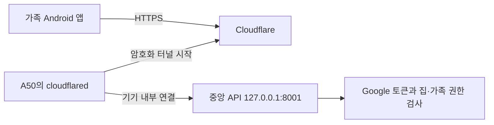
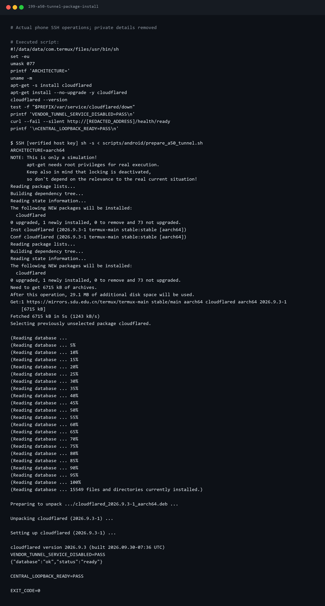
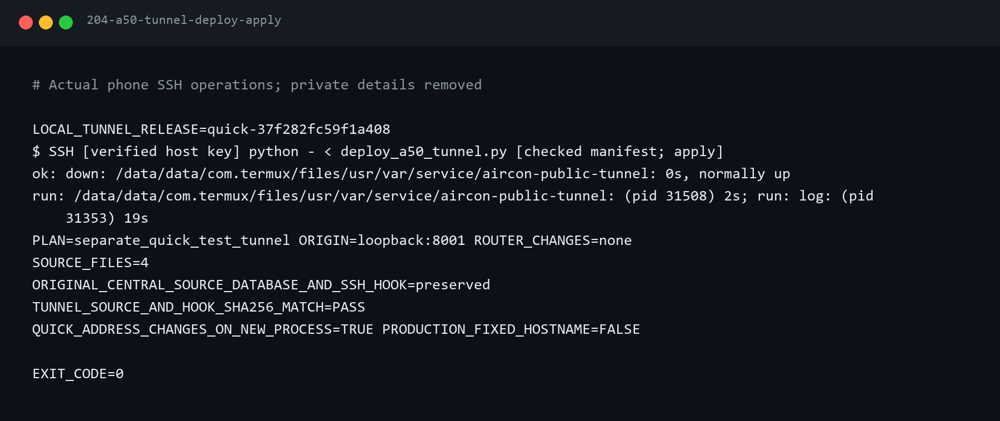
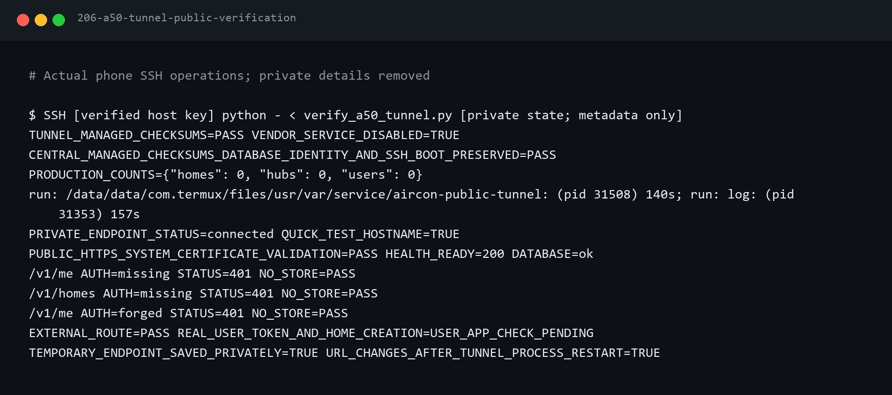
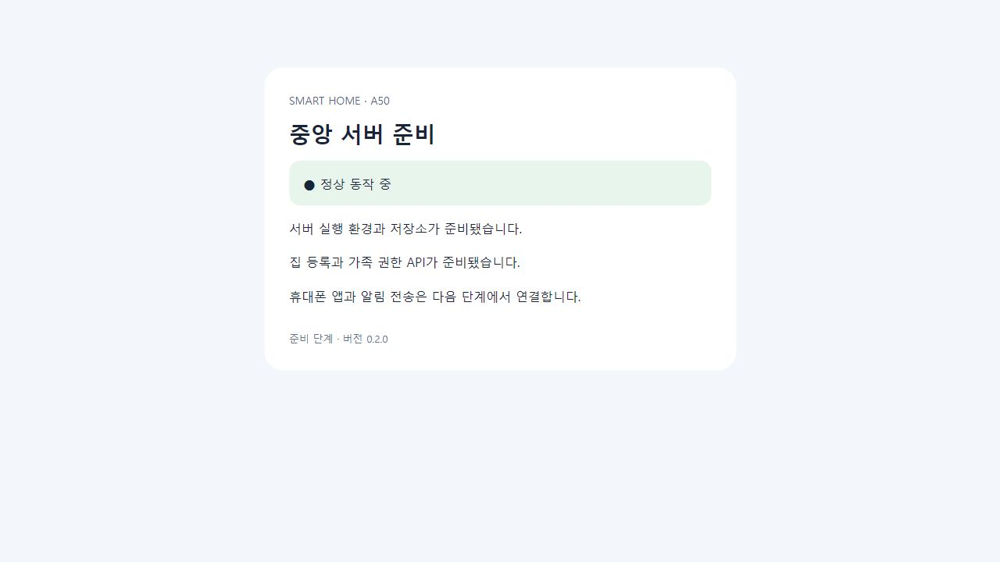

# 5편 — 다른 휴대폰에서 A50 중앙서버에 연결하기

2026-10-02. 다른 휴대폰에서 Google 로그인은 됐지만 중앙서버 주소가 필요했다.
A50 내부의 `127.0.0.1:8001`은 다른 휴대폰에서 사용할 주소가 아니다.
이번에는 A50에 직접 HTTPS 통로를 만들고 외부 응답을 확인한다.

도메인이 아직 없어 **Cloudflare Quick Tunnel 시험 주소**를 사용했다.
주소는 터널이 다시 시작되면 바뀐다. 고정 운영 주소까지 완성한 단계는 아니다.
Cloudflare 공식 안내에서도 Quick Tunnel은 개발·시험용이며 가동 시간 보장을 제공하지 않는다.

## 연결 구조



노트북은 개발·점검에 사용한다. 앱 요청의 운영 중계는 A50에서 수행한다.
공유기 포트포워딩과 Pi의 기존 Tailscale 설정을 변경하지 않는다.
Cloudflare는 HTTPS를 종료하고 요청을 처리하는 중계자이며, 중앙 API가 로그인·가족 권한을 검사한다.
주소를 안다는 이유만으로 가족 데이터에 접근할 수는 없다.

## 준비물

- 1~3편의 A50 Termux SSH·부팅 관리·중앙 API와 4편의 실제 Firebase 구성 APK.
- 확인된 SSH 연결 정보·전용 호스트 키. 실제 값은 `.deploy/`에서 관리한다.
- A50의 인터넷 연결. 이번 작업은 A50 화면을 직접 누르지 않고 SSH로 수행했다.
- Google 로그인된 별도 휴대폰. Google 계정을 A50에 추가하지 않는다.

## 1. 터널 도구 설치

저장소 최상위에서 실행한다.

```powershell
python scripts/android/a50_record.py --label tunnel-package-install --script scripts/android/prepare_a50_tunnel.sh --timeout 300
```

스크립트는 APT 설치 시뮬레이션을 먼저 보여 주고 cloudflared만 설치한다.
이번 측정은 기존 패키지 업그레이드 0개, 신규 1개, 추가 디스크 29.1MB였다.
설치 버전은 2026.9.3-1이다. 저장소 시점에 따라 버전은 달라질 수 있다.
패키지 기본 서비스는 비활성 상태로 두고 자체 전용 서비스를 사용한다.



## 2. 로컬 검사와 변경 미리보기

```powershell
python -m pytest tests/test_a50_public_tunnel.py -q
python scripts/android/deploy_a50_tunnel.py
```

검사는 정상 중지 제외·실패 예산·손상 이력 중단·이전 주소 초기화·원격 변경 보존을 확인한다.
7개 검사를 통과했다. 미리보기는 원격 파일을 생성하거나 서비스를 시작하지 않는다.
현재 중앙 소스·DB·SSH 훅을 건드리지 않는 별도 소스 4개 배포임을 확인한다.

## 3. A50에 명시적으로 반영

```powershell
python scripts/android/deploy_a50_tunnel.py --apply
```

`~/services/aircon-public-tunnel/`에 체크섬별 릴리스를 만들고
`$PREFIX/var/service/aircon-public-tunnel`에 별도 실행·종료·로그 훅을 설치한다.
현재 원격 파일이 이전 배포와 다르면 중단하므로 사용자 변경을 덮어쓰지 않는다.
기존 중앙 부팅 훅이 runit 전체 서비스 디렉터리를 실행해 별도 부팅 훅은 추가하지 않는다.

첫 실행에서는 새 서비스 디렉터리를 runit이 아직 인식하지 못해 시작 명령이 실패했다.
`supervise/ok` 생성 대기를 넣고 재배포해 해결했다. 오류(203)와 해결(204)을 모두 보존한다.
이번에는 서비스의 정상 중지·재시작을 확인했으며 기기 자체 재부팅은 시험하지 않았다.



로그는 각각 1MiB+백업 3개로 제한한다. 5분 내 비정상 종료 5회면 중단한다.
관리 SSH와 중앙 API는 계속 사용할 수 있다. 실제 접속 주소와 원문 로그는 비공개 파일에 둔다.

## 4. 외부 HTTPS와 인증 차단 확인

```powershell
python scripts/android/verify_a50_tunnel.py
```

검증 도구는 장비의 체크섬·실행 상태·현재 주소를 읽고, 노트북에서 공개 HTTPS 주소로 요청한다.
시스템 인증서 검증을 켜고 리디렉션을 따라가지 않는다.

| 검사 | 실제 결과 |
| --- | --- |
| HTTPS 인증서와 `/health/ready` | 통과·200·DB 정상 |
| `/v1/me`, `/v1/homes` 로그인 정보 없음 | 401 |
| `/v1/me` 위조 토큰 | 401 |
| 응답 캐시 방지 | no-store |
| 중앙 소스·DB 런타임 식별자·관리 SSH 훅 | 보존 |



실제 외부 주소로 연 준비 페이지도 캡처했다. 이 화면은 서버 준비 상태를 보여 주며,
앱에서 실제 계정의 토큰을 수락했다는 증거로 사용하지 않는다.



## 5. 로그인된 앱에서 주소 저장

검증 후 실제 주소는 로컬의 `.deploy/a50/tunnel-endpoint.json`에 저장된다.
그 파일의 `endpoint.url` 값을 로그인된 가족 앱의 중앙서버 주소 칸에 입력한다.
형식은 `https://발급받은이름.trycloudflare.com`이다. 뒤에 포트 8001이나 `/v1`을 붙이지 않는다.
기존 서버 주소를 바꾸면 앱이 계정 연결을 해제하므로 다시 Google 로그인한다.

첫 저장 후 집 목록·집 만들기 화면이 보이는지 확인한다. 실제 집을 만들면 소유자 권한으로
가족 초대를 진행할 수 있다. 이번 원격 점검 시점에는 운영 사용자·집·허브가 0개였고,
사용자 휴대폰의 실제 API 연결 결과는 확인을 요청한 상태다.
토큰·이메일·초대 코드를 블로그용 캡처에 노출하지 않는다.

이후 사용자가 A50에 직접 Google 로그인했고, 원래 배포 APK로 실제 HTTPS 집 목록·
`A50 테스트 집` 등록·소유자 관리 화면·클라이언트 재실행 후 세션 유지를 확인했다.
후속 검증 절차와 캡처는 [5편 보충](05a-a50-user-google-login.md)에 정리한다.

## 주소 변경과 다음 단계

터널 재시작·A50 재부팅 후에는 새 주소가 발급된다. 자동으로 서비스가 다시 실행되는 것과
앱에 저장한 주소가 계속 유효한 것은 별개다. 현재 주소는 원격 점검으로 확인할 수 있다.
고정 주소는 도메인과 named tunnel 준비 후 연결한다. Quick Tunnel에는 SSE 지원과
가동 시간 보장이 없으므로 실제 제품 운영에 계속 쓰지 않는다.
FCM 푸시와 실제 Pi 연결·장시간 시험은 후속 단계다.

중지·복구 명령은 [운영 절차](../../../services/central-tunnel/README.md),
실패 원인·증거는 [날짜별 기록](../../journal/2026-10-02-a50-external-https.md)에 있다.

공식 자료: [Quick Tunnels](https://developers.cloudflare.com/tunnel/get-started/quick-tunnels/),
[고정 Tunnel 준비](https://developers.cloudflare.com/tunnel/get-started/),
[Termux 공식 패키지](https://github.com/termux/termux-packages/blob/master/packages/cloudflared/build.sh).
