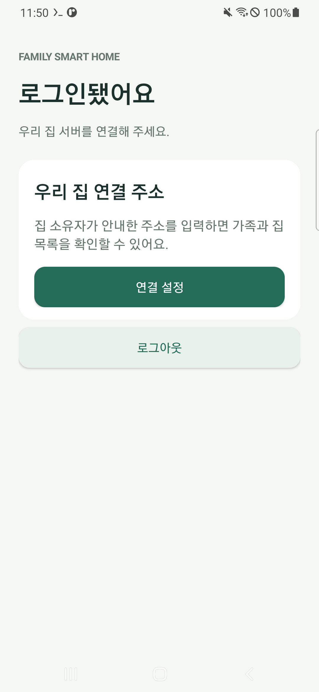
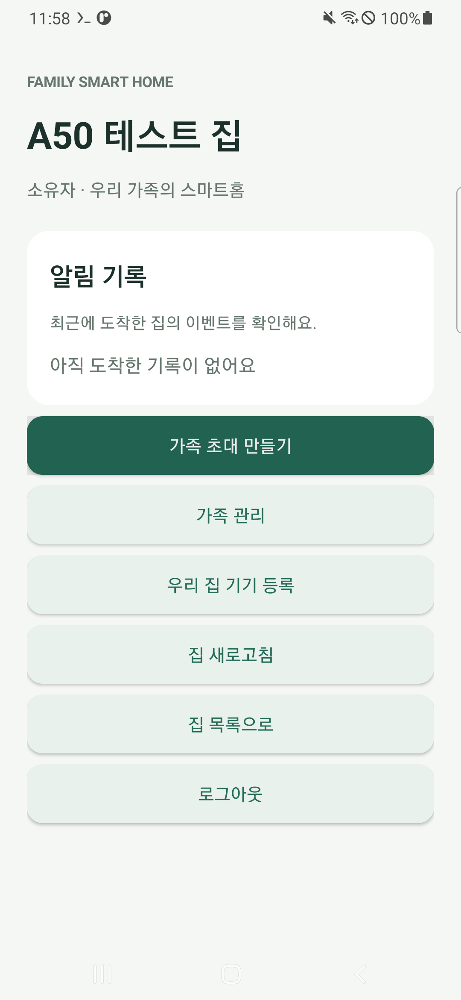
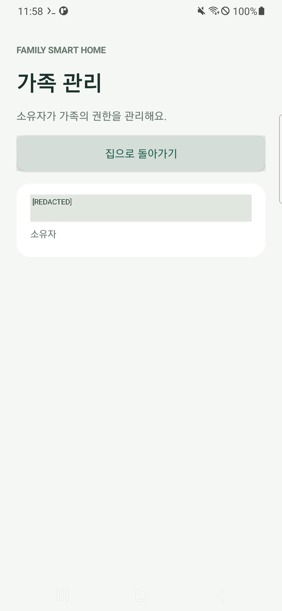

# 5편 보충 — A50을 만지지 않고 직접 Google 로그인하기

사용자가 A50에 가족 APK를 설치해 시험해 달라고 요청했고, Google 로그인은 직접 하겠다고 했다.
서버용 A50에는 Google 계정이 없으므로 가상 계정 검사만으로 실제 로그인을 대신하지 않는다.
노트북에 A50 화면을 띄워 사용자에게 로그인 입력을 넘기는 방법을 준비했다.

## 설치 확인

```powershell
python scripts/android/install_test_family_app.py --production-only --release --apply
```

4편에서 검증한 서명·해시의 배포 APK를 `install -r`로 다시 설치한다. 앱 데이터를 삭제하지 않는다.
설치 Success·앱 COLD 실행 527ms·Firebase 세션 초기화·로그인 시작 화면 확인을 기록했다(208).
이 결과는 실제 Google 로그인 성공과 구분한다.

## 화면 도구 준비

```powershell
python scripts/android/prepare_a50_mirror.py
python scripts/android/open_a50_mirror.py
```

공식 Genymobile/scrcpy v4.1 Windows 64비트 ZIP(11,305,298바이트)의 공식 SHA-256을 확인했다.
저장소의 `tmp/`에 압축을 풀며 Windows 전체 설치나 장비의 네트워크 변경은 하지 않는다.
실행 전 준비된 모든 파일을 검증한 ZIP과 다시 비교한다.
기존 무선 ADB를 자동으로 찾아 모델·고유 장치 값을 확인한 뒤 그 A50만 선택한다.
장치 주소나 ADB 포트를 새로 입력하거나 USB를 연결할 필요가 없다.

`A50 - Family Smart Home` 창이 열리면 사용자가 직접 앱의 Google 버튼을 눌러 로그인한다.
비밀번호·인증 코드를 채팅에 보내거나 자동화 도구에 보관하지 않는다.
음성 전송·영상 녹화·자동 클립보드 동기화를 끄며 로그인 입력 중에는 블로그 캡처를 하지 않는다.
입력은 사용자가 직접 하고, 완료 보고 후 가족 앱의 결과만 별도로 확인한다.

Google 또는 Android가 보안 화면의 미러링을 제한하면 그 보호를 우회하지 않는다.
그 경우 A50에서 직접 입력 가능한 시점에 계정 추가를 완료한다.
화면 도구는 현재 노트북의 ADB 연결을 사용하며 임의의 다른 PC에서 인터넷만으로 접속하는
원격 관리 주소를 새로 만든 것이 아니다.

시험이 끝나면 화면 창의 닫기를 눌러 미러링을 종료한다. 중앙 서버·SSH는 그대로 동작한다.
준비 단계에서는 실제 로그인·API 연결·집 등록을 기다렸다. 이후 아래 시험을 완료했다.

## 사용자 로그인 후 실제 배포 APK 시험

사용자가 로그인 완료를 알렸고, A50 앱의 “로그인됐어요” 화면을 직접 확인했다.
현재 검증된 HTTPS 주소를 앱의 연결 설정에 저장하고 실제 인증된 집 목록까지 확인했다(214).
처음 입력할 때는 이전 서버 주소가 없으므로 로그인 세션을 유지했다.



사용자는 시험 집 이름을 `A50 테스트 집`으로 지정했다. 이미 다른 집 한 개가 있어 보존했다.
배포 APK의 인증·권한·서버 코드를 바꾸지 않고, 전용 서명 검사 APK에서 실제 화면을 조작했다.
한글 이름은 키 이벤트 대신 Android 접근성의 `ACTION_SET_TEXT`로 입력했다.
검사 APK는 Google 토큰·비밀번호를 읽거나 가상 계정으로 실제 로그인을 대체하지 않는다.

```powershell
python scripts/android/build_family_app.py --production-smoke-only
python scripts/android/run_a50_family_smoke.py --home-name "A50 테스트 집"
python scripts/android/run_a50_family_smoke.py --home-name "A50 테스트 집" --apply
python scripts/android/verify_a50_households.py
```

빌드는 전용 검사 APK만 `tmp/family-app-smoke-tests/`로 내보낸다.
바탕화면의 배포 APK와 원래 빌드 파일·해시 기록은 유지한다.
실행 도구는 검사 APK의 서명·대상 패키지와 A50에 설치된 원래 release APK의 해시를 확인한다.
기본은 미리보기다. 반영 시 검사 APK만 설치하고, 사용자의 실제 로그인 상태에서 선택한 집을
만들거나 같은 이름이 이미 있으면 재사용한다. 매번 새 집을 만들지 않는다.

실기기 JUnit 검사 **OK (1 test), 4.26초**를 확인했다(221).
앞선 실행(219)에서 실제 집과 소유자 페이지까지 성공했으나 캡처 저장에서 멈췄고,
최종 실행은 이미 만든 집을 재사용했다. 운영 집은 기존 1개와 시험 집 1개, 사용자 1명·허브 0개다.




캡처 전에 Android Canvas로 이메일·주소가 표시된 노드를 가린다. 공개용 이미지가 장비 밖으로
나오기 전에 처리하며 원문 계정 화면은 저장소에 올리지 않는다.
검사 후 원래 release 앱을 종료·재실행해 같은 Google 세션과 서버 주소로 집 목록이 다시
표시되는 것을 확인했다(COLD 실행 354ms). 기존 집과 계정 데이터는 삭제하지 않았다.
DB 무결성·원래 런타임 식별자·서버 소스·SSH 부팅 훅 유지도 확인했다(222~223).
미러링을 종료하고 A50을 홈 화면·화면 꺼짐 상태로 돌렸다. 서버는 계속 실행한다.
계정과 시험 집은 다음 단계에 사용할 수 있도록 남겼다.

## 실패와 해결을 따라가기

- UI 트리에서는 빈 EditText의 안내 문구가 text 값으로 보인다. 빈 값만 기대한 보호 검사가
  멈췄다(211). 안내 문구와 실제 입력을 구분했고 기존 로그인 상태는 유지했다.
- 키보드가 열리면 저장 버튼 위치가 바뀐다. 입력 전 좌표를 사용한 실행은 목표 화면을
  확인하지 못했다(212). 입력 후 새 UI 트리로 버튼을 찾아 주소 저장·집 목록을 확인했다(214).
- 최초 실기기 검사에는 Activity 시작 규칙이 빠져 집 목록을 기다리다 실패했다(217).
  `ActivityTestRule`로 원래 MainActivity를 실행하도록 수정했다.
- release 앱 안에서 검사 APK의 내부 저장 경로에 캡처를 쓰려다 ENOENT가 발생했다(219).
  대상 앱의 `getExternalFilesDir("test-captures")`를 사용하고 해당 실제 경로를 검사 결과로
  전달해 Android 쉘에서 가린 PNG만 읽도록 수정했다. 광범위한 저장 권한을 추가하지 않았다.
- 초기 실패 출력과 해결 후 출력 모두 같은 이름의 TXT·PNG 쌍으로 보존한다.

이 시험은 실제 Google 로그인·집 등록·소유자 화면까지 확인한 결과다.
다른 실제 계정의 가족 초대·FCM 알림 수신·실제 Pi 연결·고정 도메인은 후속 시험이다.

공식 자료: [scrcpy 프로젝트](https://github.com/Genymobile/scrcpy),
[Windows 배포와 검증값](https://github.com/Genymobile/scrcpy/blob/master/doc/windows.md),
[무선 ADB 연결](https://github.com/Genymobile/scrcpy/blob/master/doc/connection.md),
[클립보드 동기화 옵션](https://github.com/Genymobile/scrcpy/blob/master/doc/control.md).
