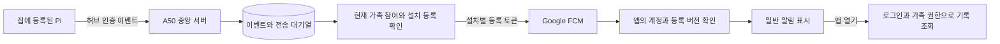
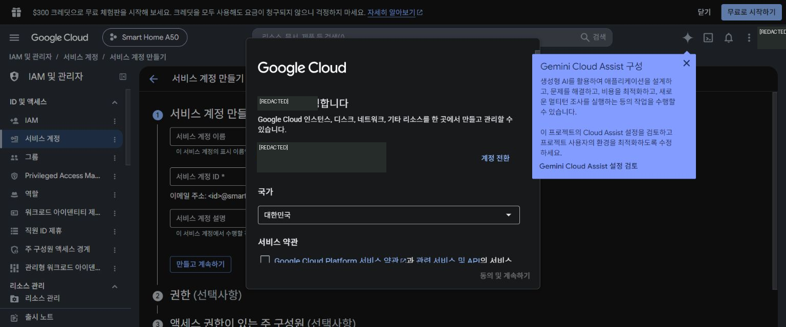
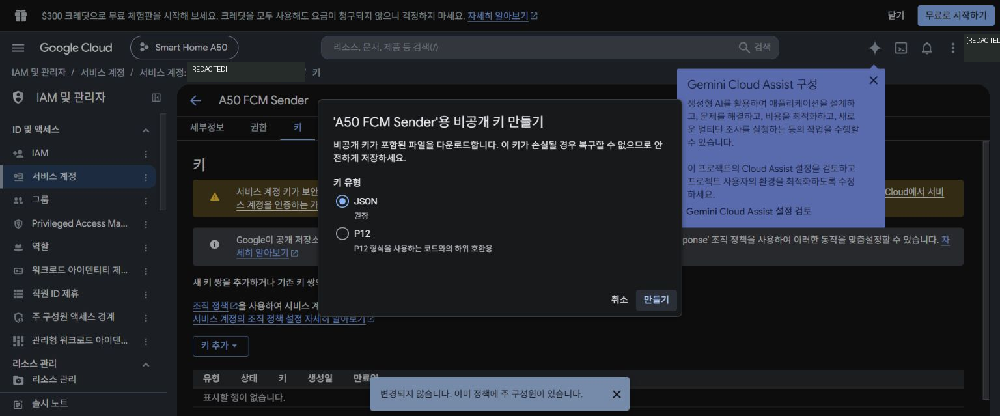
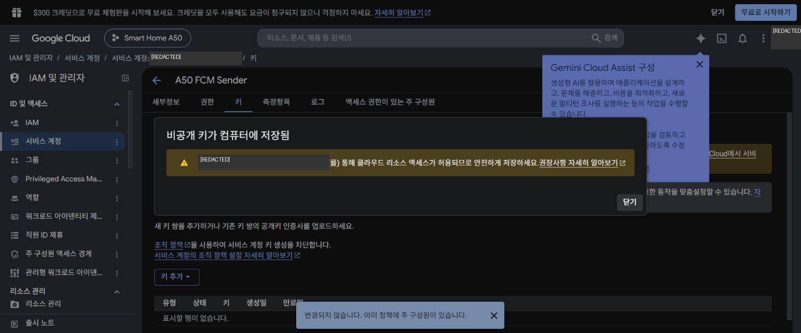
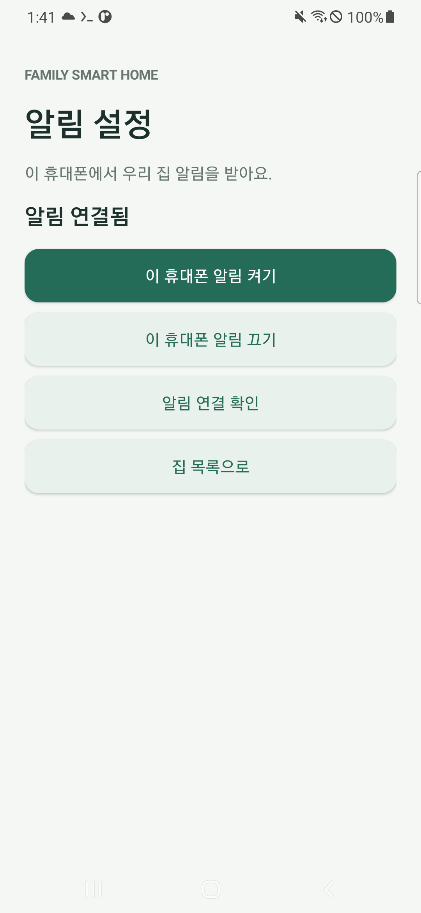
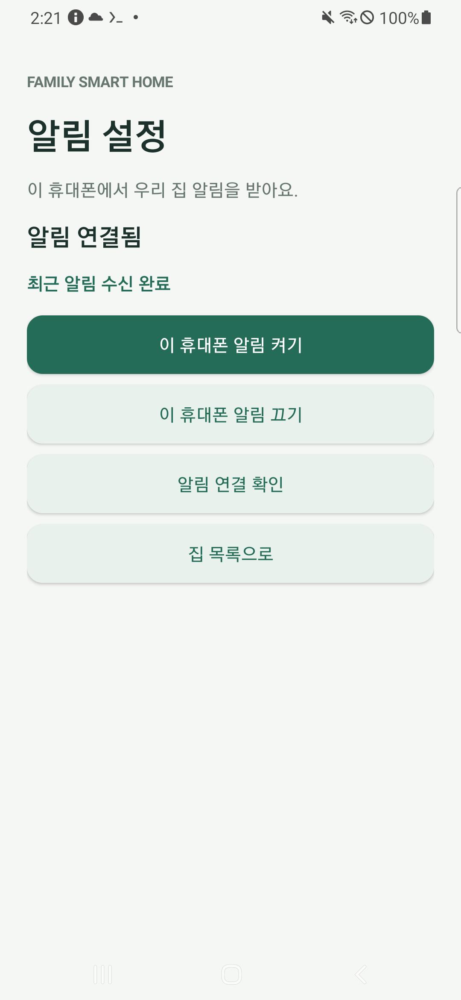

# 6편 — 가족에게만 보내는 FCM 알림 연결

작성: 2026-10-02. 서버 0.3.0·앱 0.2.0 배포, 실제 Google 계정의 설치 등록, 전송 전용 키 연결을 완료했다. **실제 FCM 메시지가 A50 앱의 백그라운드·화면 꺼짐 조건에서 수신되고 알림으로 게시되는 것을 각각 확인했다.** 최초 키 다운로드 경로와 UI 검사 실패도 해결 과정과 함께 보존했다. 다른 가족 단말·실제 Pi 센서·장시간 시험은 별도 단계다.

## 1. 앞 단계의 준비 상태 확인

[5편](05-external-https-connection.md)과 [실제 A50 로그인 보충](05a-a50-user-google-login.md)을 먼저 완료한다. 관리 SSH와 무선 ADB의 비공개 연결 설정, 실제 Firebase Android 구성, 전용 앱 서명 키, HTTPS 주소가 필요하다. 인증 키나 기기 주소를 이 글이나 Git에 복사하지 않는다.

이번 장비는 SM-A505N, Android 11, One UI 3.1이다. 서버는 Termux에 있고 사용자 계정 1개, 집 2개, 실제 허브 0개인 상태에서 시작했다. 사용자가 선택한 `A50 테스트 집`을 재사용한다. 이미 등록된 다른 집은 삭제하거나 이름을 바꾸지 않는다.

## 2. 알림 수신 권한의 기준 정하기



집 이름을 FCM topic으로 만들고 앱이 구독하는 것만으로 가족 권한을 정하지 않는다. 서버 DB가 현재 가족을 판단한다. 설치 등록에는 임의 설치 ID·설치 증명·현재 로그인 계정·FCM 등록 토큰을 사용한다. 토큰은 전화번호나 로그인 비밀번호가 아니다. 화면·로그·블로그로 출력하지 않는다.

전송 직전 가족 참여가 해제됐거나 설치 계정·토큰이 바뀌면 이전 작업은 취소한다. FCM에는 센서 값과 집 이름을 넣지 않는다. 앱이 상세 기록을 읽을 때 기존 가족 권한 API를 다시 사용한다. 자세한 결정과 경쟁 조건은 [결정 0015](../../decisions/0015-family-fcm-installations.md)에 있다.

## 3. 로컬에서 서버 시험하기

프로젝트의 기존 Python 가상환경에서 실행한다.

```powershell
.venv/Scripts/python.exe -m pip install -r services/central-server/requirements.txt
.venv/Scripts/python.exe -m pytest -q tests/test_central_push_api.py tests/test_central_push.py tests/test_central_fcm.py tests/test_central_households.py tests/test_central_server_foundation.py tests/test_a50_central_deploy.py tests/test_a50_public_tunnel.py tests/test_a50_adb.py tests/test_a50_app_cleanup.py
```

실제 결과: 76개 통과. 가구 격리·소유자 전용 시험 요청·다른 설치 전송 차단·서명 인증·설치 증명 충돌·토큰 회전·권한 회수·로그아웃·대기열 재시작·만료·이벤트 중복·전송 오류 분류를 검사했다. 시험에서 Google에 알림을 보내지 않는다.

처음에는 존재하지 않는 시험 파일 이름을 지정해 pytest가 실행되지 않았다. 실제 파일 목록을 확인하고 수정했다. 실패 출력도 보존했다. 이 결과와 실제 단말 수신 결과는 구분한다.

## 4. A50 서버에 명시적으로 배포하기

```powershell
.venv/Scripts/python.exe scripts/android/deploy_a50_central.py
.venv/Scripts/python.exe scripts/android/deploy_a50_central.py --apply
.venv/Scripts/python.exe scripts/android/verify_a50_households.py
.venv/Scripts/python.exe scripts/android/verify_a50_tunnel.py
```

첫 명령은 변경 미리보기다. 기존 배포 파일의 체크섬이 다르면 덮어쓰지 않고 중단한다. 실제 반영은 DB를 일관된 SQLite 백업으로 보존한 뒤 중앙 서버만 잠깐 중지·갱신·재시작한다.

이번 배포에서 스키마 2→3으로 `installations`, `push_messages`, `push_jobs` 테이블을 추가했다. 기존 사용자·집·가족 참여·이벤트·런타임 식별값을 보존했다. 스키마 1·2 백업의 무결성도 확인했다. 코드와 장비 파일의 체크섬, SSH 부팅 훅, HTTPS 상태, 위조 인증 거부를 확인했다. 터널 프로세스는 재시작하지 않아 기존 시험 주소를 유지했다.

서버 키가 없으면 설치 등록은 가능하지만 시험 알림 API는 503을 반환한다. 전송 성공으로 표시하지 않는다.

## 5. Google Cloud 전송 전용 계정과 키 준비

1. Firebase 프로젝트 설정 → 클라우드 메시징에서 **Firebase Cloud Messaging API(V1) 사용 설정됨**을 확인한다. 이번 프로젝트는 이미 켜져 있었다. 기존 서버 키 방식이나 웹 VAPID 키를 만들지 않는다.
2. ‘서비스 계정 관리’에서 같은 프로젝트의 Google Cloud 콘솔을 연다.
3. 처음 이용하는 계정은 국가·필수 약관 화면이 나타날 수 있다. 사용자가 약관 동의와 전송용 계정·키 연결을 승인한 뒤 진행했다. 이번 작업은 제품화 개발 목적이므로 현재·향후 상업적 사용 계획 항목을 선택했다. 이메일 업데이트·무료 체험·결제 연결은 신청하지 않았다.
4. 서비스 계정 ID `a50-fcm-sender`, 표시 이름 `A50 FCM Sender`를 만든다.
5. 프로젝트 역할은 **Firebase Cloud Messaging API Admin** 하나를 지정한다. 프로젝트 소유자·편집자·Firebase 인증 관리자를 전송 계정에 주지 않는다. 추가 서비스 계정 사용자·관리자도 등록하지 않는다.
6. 해당 계정 → 키 → 키 추가 → 새 키 만들기 → JSON을 선택한다. 실제 JSON은 비공개 파일로 보관한다. Android의 `google-services.json`과 다른 파일이다. 개인 키는 APK에 넣으면 안 된다.







Google Cloud에서는 키가 컴퓨터에 저장됐다고 안내했지만 생성 전에 다운로드 이벤트를 연결하지 못해 저장 경로를 얻지 못했다. 처음에는 파일 검색 결과도 0이었다. 바탕화면의 `google-services.json` 두 개는 앱 설정 파일이라 서버 키로 사용할 수 없었다. 이후 사용자가 키를 다시 다운로드했다고 알려줘 바탕화면에서 전송용 서비스 계정 JSON을 확인했다. 별도 키를 중복 생성하지 않았고, 키 내용은 채팅이나 캡처에 쓰지 않았다.

실제 파일을 확인한 뒤 다음 미리보기와 반영을 실행했다:

```powershell
.venv/Scripts/python.exe scripts/android/configure_a50_fcm.py --source "[서버키_JSON_절대경로]"
.venv/Scripts/python.exe scripts/android/configure_a50_fcm.py --source "[서버키_JSON_절대경로]" --apply
```

이 도구는 프로젝트·전용 서비스 계정·RSA 개인 키 형식을 먼저 검사한다. 비공개 SSH 표준 입력으로만 전달하며 출력에 키를 쓰지 않는다. 다른 장비 키를 덮어쓰지 않는다. A50의 `~/.config/aircon-central/fcm-service-account.json`을 0600으로 보관하고 설정 파일을 백업한 뒤 중앙 서버만 재시작한다. 키 형식 검사와 API 준비 확인은 실제 FCM 인증·수신 증거가 아니다.

이번 반영에서 키 파싱·0600 권한·서버 ready를 확인했고 전송 작업자의 시작을 확인했다. 뒤의 실제 전송이 Google에 접수되고 단말 콜백·알림 게시까지 통과했다. 키 연결 때문에 관리 SSH나 시험용 HTTPS 터널을 재시작하지 않았다.

## 6. Android 앱 업데이트와 실제 설치 등록

```powershell
.venv/Scripts/python.exe scripts/android/build_family_app.py
.venv/Scripts/python.exe scripts/android/verify_family_apk.py
.venv/Scripts/python.exe scripts/android/update_a50_family_app.py
.venv/Scripts/python.exe scripts/android/update_a50_family_app.py --apply
.venv/Scripts/python.exe scripts/android/build_family_app.py --production-smoke-only
.venv/Scripts/python.exe scripts/android/run_a50_family_smoke.py --home-name "A50 테스트 집" --push-test registerRealInstallation --apply
```

APK 0.2.0/versionCode 2는 기존 Google 로그인 서명 키를 유지한다. 업데이트는 `install -r`이며 앱 데이터를 지우지 않는다. 단위 검사 4개, 서명·실제 Firebase 구성·시험 계정 제외·release HTTPS 정책 검사를 통과했다. A50에서 실제 Google 세션을 이용한 설치 등록 검사는 5.361초에 통과했다. 이후 클라이언트 재실행에도 세션·서버 주소·기존 집을 확인했다.

일반 사용자는 새 APK를 기존 앱 위에 설치하고 **집 목록 → 알림 설정 → 이 휴대폰 알림 켜기 → 알림 연결 확인** 순서로 진행한다. ‘알림 연결됨’은 등록 완료 표시다. Android 13 이상은 알림 권한 요청이 추가된다. A50의 Android 11은 채널·앱 알림 설정을 확인한다. 사용자가 거절한 알림 권한을 강제로 부여하지 않는다.



## 7. 실제 수신 시험

소유자로 `A50 테스트 집`을 열고 **이 휴대폰에 시험 알림 보내기**를 누른다. 이 버튼은 해당 소유자의 지정한 앱 설치 하나에만 보낸다. 같은 집에서도 다른 가족의 휴대폰에 임의 시험 알림을 보내지 않는다. 시험 요청은 집당 1분에 한 번으로 제한한다.

백그라운드 자동 검증 명령은 다음과 같다.

```powershell
.venv/Scripts/python.exe scripts/android/run_a50_family_smoke.py --home-name "A50 테스트 집" --push-test receiveRealFCMWhileBackgrounded --apply
```

이 검사는 실제 UI로 시험 전송을 요청하고 홈 화면으로 이동한 뒤, 백그라운드 전환 후의 실제 수신 콜백 시각과 이 앱이 게시한 시험 알림을 확인한다. Google API의 접수 상태만으로 통과하지 않는다. 센서 이벤트나 임의 허브를 운영 DB에 만들지 않는다.

첫 실행은 집 이벤트 조회가 진행 중인 비활성 전송 버튼을 너무 빨리 눌러 실패했다. 당시 전송 작업은 0개였다. 검사 도구가 버튼의 활성화를 기다리도록 수정하고 검사 APK만 다시 빌드했다. 실제 release APK나 사용자 데이터는 바꾸지 않았다. 수정 후 실제 백그라운드 수신 검사는 8.669초에 `OK (1 test)`였다(255). 앱 재실행 후에도 실제 세션·HTTPS 주소·기존 집을 확인했다.

수신 후 화면 캡처가 이전 프레임을 보여준 문제는 UI idle·짧은 프레임 대기·문구 재확인으로 해결했다. 수정된 백그라운드 검사와 실제 설정 캡처는 8.771초에 다시 통과했다(261).



화면 꺼짐은 별도 명령으로 검사한다.

```powershell
.venv/Scripts/python.exe scripts/android/run_a50_family_smoke.py --home-name "A50 테스트 집" --push-test receiveRealFCMWhileScreenOff --apply
```

이 검사는 기존 계정의 Firebase SDK와 원래 인증 API로 지정한 소유자의 집을 확인한다. 홈 화면 전환 후 전원을 끄는 입력을 보내고 `PowerManager.isInteractive() == false`를 확인한 다음 시험 전송을 요청한다. 휴대폰 밖으로 ID 토큰을 내보내거나 인증을 우회하지 않는다. 새 콜백 시각·실제 알림 게시·수신 시점에도 화면이 꺼져 있는 조건을 모두 확인하고 8.227초에 통과했다(258). 이후 화면을 켜 실제 수신 상태를 캡처했다.


조건은 A50 Android 11·같은 Wi-Fi·충전 중·기존 Termux 서버 운영 상태의 즉시 시험이다. 서버와 시험 수신 앱을 같은 A50에서 실행했다. 화면을 끈 직후의 성공을 밤새 대기·깊은 절전·다른 제조사 단말·다른 네트워크까지 검증한 결과로 확대하지 않는다.

## 현재 남은 검증

다른 휴대폰 APK 업데이트·가족 초대·수신, 실제 서로 다른 집 계정의 수신 격리, 장시간·깊은 절전·네트워크 변경·새 FCM 설정 후 재부팅 조건, 실제 Pi 센서 이벤트가 남아 있다. 가구 격리는 로컬 검사로 확인했고, 이번 실제 단말은 소유자 계정 하나다. 임시 HTTPS 주소는 터널 재시작 후 바뀔 수 있어 운영 고정 주소도 별도 준비해야 한다.

## 공식 문서

- [Google 서비스 계정으로 FCM 서버 인증](https://firebase.google.com/docs/cloud-messaging/auth-server)
- [Android 알림 권한·등록 토큰](https://firebase.google.com/docs/cloud-messaging/android/get-started)
- [데이터 메시지의 foreground/background 수신](https://firebase.google.com/docs/cloud-messaging/android/receive-messages)
- [토큰 갱신과 만료 처리](https://firebase.google.com/docs/cloud-messaging/manage-tokens)

원문 TXT와 같은 내용의 PNG는 `docs/assets/terminal/`에 함께 보존한다. 휴대폰 화면 캡처는 실제 앱에서 얻은 결과이며, 이메일·서버 주소는 내보내기 전에 가린다. 이번 단계는 화면·서버 로그로 재현할 수 있어 사용자가 휴대폰 실물 사진을 찍을 필요가 없다.
