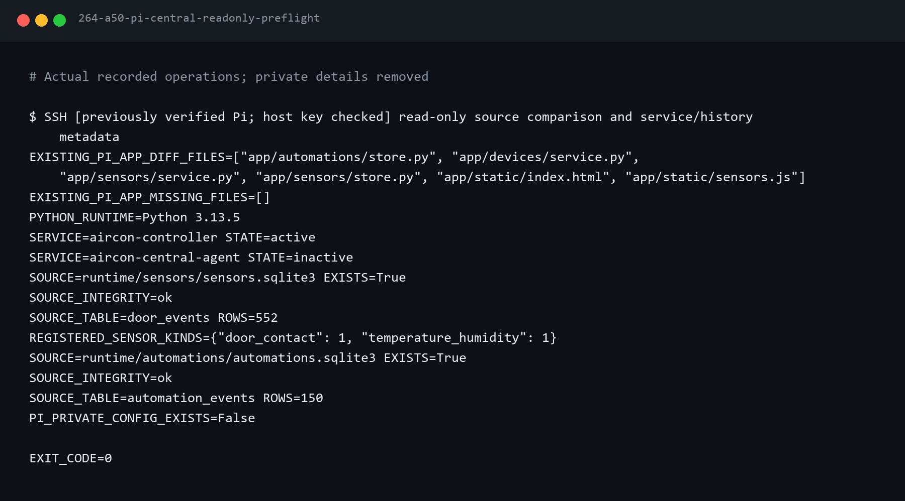
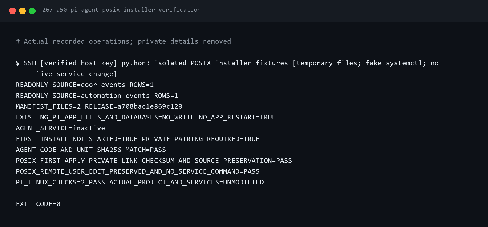
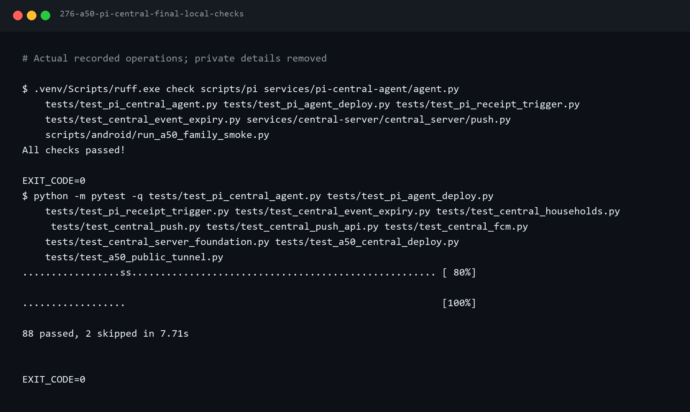
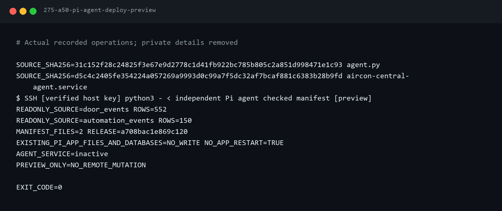
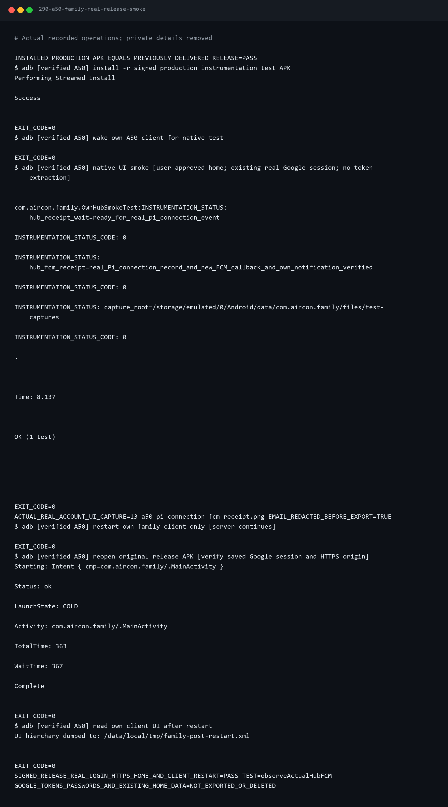
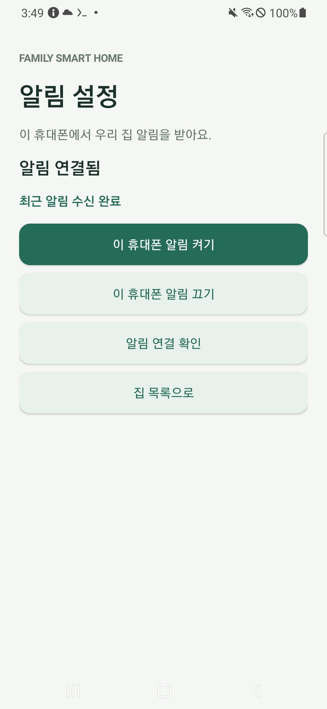
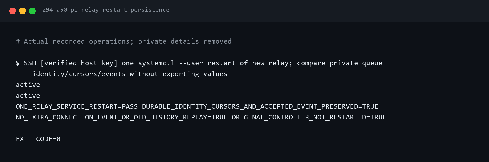

# 7편 — Raspberry Pi의 새 기록을 우리 집 알림으로 연결하기

작성 기준: 2026-10-02. **실제 Pi를 ‘A50 테스트 집’에 연결했고, A50 화면 꺼짐 상태에서 Pi발 FCM
콜백·알림 게시를 확인했다.** 새 기록 자동 전송 서비스는 active·enabled이며 서비스 재시작 후에도
진행 위치를 유지했다. 실제 물리 문 변화·다른 가족 단말·장시간 시험은 남아 있다.

6편에서 A50 앱의 실제 FCM 콜백과 알림 게시를 확인했다. 이제 기존 Raspberry Pi에서 발생하는
문 상태 변화와 자동화 경고를 같은 집의 가족에게 연결한다.


## 1. 기존 시스템부터 확인한다

기존 Pi 제어 서비스가 활성이고 센서·자동화 DB 무결성이 `ok`인지 읽기 전용으로 확인했다.
처음 조사한 문 기록은 552건, 자동화 기록은 150건이다. 센서 상태에는 문 센서와 온습도 센서가 있다.
개별 주소와 장치 식별자는 공개 기록에서 제거했다.

원격 앱 파일 여섯 개는 로컬과 달랐다. 확인해 보니 [9월 12일 기록](../../journal/2026-09-12-project-improvements.md)의
로컬 전용 안정성 개선이 배포되지 않은 상태와 일치했다. 기존 앱을 갱신하지 않고 별도 연결 서비스로 준비했다.



## 2. 새 기록만 읽고, 재전송에 대비한다

연결 서비스는 기존 DB를 읽기 전용으로 조회한다. 처음 시작하면 현재 마지막 번호를 자체 DB에 저장한다.
기존 702건을 새 알림으로 보내지 않는다. 이후 문 열림·닫힘, 경고 발생·해제 기록만 대기열에 담는다.
온습도 측정값 전체를 계속 보내는 단계는 아니다.

전송 직전에 기록 ID와 본문을 자체 SQLite에 저장한다. 응답을 받지 못해 같은 기록을 다시 보내도
중앙 서버는 중복을 알아보고 같은 기록·알림 작업을 다시 만들지 않는다. MAC·방 이름·원시 MQTT와
자동화 snapshot은 전송 본문에 포함하지 않는다. 상세 설정과 경로는
[연결 서비스 안내](../../../services/pi-central-agent/README.md)에 정리했다.

## 3. 오래된 알림이 다시 울리지 않도록 한다

문·경고 알림은 원래 발생 시점부터 240초까지 유효하다. Pi 대기열과 중앙 서버가 같은 만료시간을
사용한다. 끊긴 통신이 복구됐다는 이유로 만료시간을 다시 늘리지 않는다. A50 서버 0.3.1은
`notification_expires_at`을 추가로 검사하며 기존 계정·집·설치를 보존한다. DB 스키마는 3이다.

미완료 대기열 1,000건, 최대 8회 재시도, 로그 1MiB × 4개, 서비스 시작 300초 내 3회 제한을 둔다.
기존 DB가 교체되거나 기록 번호가 초기화됐을 때는 자동 재전송 대신 조사하도록 중단한다.

## 4. 로컬·실제 Pi 환경에서 검사한다

초기 Windows 배포 검사에서 `WinError 1314`가 나왔다. Linux용 심볼릭 링크를 만들 Windows 권한이
없어서 생긴 검사 환경 문제였다. 이 실패를 숨기지 않고 [원문](../../assets/terminal/265-a50-pi-installer-windows-symlink-failure.txt)으로 남겼다.
이 두 검사는 Pi의 임시 폴더에서 별도로 실행했다. 실제 운영 서비스 명령을 대체해 기존 서비스와
프로젝트 파일을 바꾸지 않고 설치·체크섬·원격 사용자 수정 보존을 확인했다.



최종 로컬 검사는 **88개 통과, Windows에서 Linux 전용 2개 제외**다. 제외한 두 검사는 위 실제 Pi
환경에서 통과했다. 통신 응답이 유실된 재시도도 한 번만 저장되고 원래 만료시간·가족 범위가 유지됨을 검사했다.
시험 앱 빌드도 성공했다. 배포 APK 0.2.0과 사용자의 기존 Google 로그인은 보존했다.



## 5. 먼저 미리보기한다

프로젝트 폴더에서 실행한다. A50 관리 준비와 실제 Google 로그인·알림 연결, 서버 0.3.1이 필요하다.
재현하는 사람은 `scripts/pi/pi_session.py`의 SSH 접속 값을 자신의 확인한 Pi 환경에 맞게 준비한다.
주소·키를 채팅이나 공개 캡처에 넣지 않는다.

```powershell
.venv/Scripts/python.exe scripts/pi/deploy_central_agent.py
.venv/Scripts/python.exe scripts/pi/link_central_agent.py --home-name "A50 테스트 집"
```

기본 동작은 읽기 전용이다. 코드 미리보기에서 관리 파일 2개·현재 Pi 서비스 비활성·원본 DB의
현재 기록 수를 확인했다. 연결 미리보기에서는 기존 Pi 제어 서비스 활성·사용자 linger 활성,
A50 준비 상태·서버 버전과 기존 허브 없음도 확인했다. 새 키·집 연결·서비스 시작은 수행하지 않는다.



A50에는 미리보기 후 중앙 0.3.1만 반영했다. 정상 중지·SQLite 일관 백업·시작 뒤 소스 체크섬,
준비 상태와 외부 HTTPS 인증 차단을 확인했다. 터널 프로세스와 주소를 유지했다.
A50 시험 APK가 정상 Google SDK·소유자 API로 ‘A50 테스트 집’의 소유자와 등록 허브 0개를 확인했고
앱 재실행 후 로그인도 유지됐다([실제 출력](../../assets/terminal/272-a50-family-real-release-smoke.txt)).

## 6. 승인받은 첫 연결을 실행한다

프로젝트 규칙의 보안·인증 변경 확인이 필요한 단계다. 전용 Pi 허브 키·현재 소유자의 테스트 집 연결·
새 기록 자동 전송을 사용자가 승인한 뒤 아래 명령을 실제 적용했다. 첫 등록 전용 명령이므로
연결 완료한 Pi에서 반복 실행하지 않는다. 기존 키·등록이 있으면 보존하고 중단하도록 되어 있다.

```powershell
.venv/Scripts/python.exe scripts/pi/link_central_agent.py --home-name "A50 테스트 집" --apply
```

도구가 소유자를 다시 확인하고 독립 서비스를 배포했다. A50에 전용 허브 키를 만들고 Pi 비공개
설정에 전달했다. 두 파일 권한은 0600이다. 일회용 코드는 기존 Google 로그인과 정상 소유자 API로
소비했고 정확한 허브·집 연결을 확인했다. Google 토큰과 장기 허브 키는 노트북 파일·APK·GitHub·
블로그에 저장하지 않았다. 노트북·앱 자체 저장 공간의 일회용 코드 파일은 사용 후 제거했다.

문 552건·자동화 150건을 건너뛴 뒤 실제 `hub.connection_test` 한 건을 보냈다. 이 기록은 센서
변화와 구분한다. 시험 앱이 화면을 끄고 준비를 알린 다음 Pi가 전송하도록 순서를 맞췄다.
실제 FCM 콜백·앱 자체 알림 게시·해당 집의 연결 기록과 수신 때도 화면 꺼짐을 확인했다.
검사는 **8.137초에 통과**했다. 기존 배포 APK·Google 로그인은 유지했다.





## 7. 서비스 시작과 기록 보존을 확인한다

수신 확인 후 새 서비스를 자동 시작했다. `active`·`enabled`, 자동 재시작 횟수 0이었다.
Pi 연결 서비스 메모리는 당시 26,368kB였다. 기존 에어컨 서비스와 기존 여섯 앱 파일은 유지됐다.
대기열은 연결 시험 accepted 1건·pending 0건이며 진행 위치는 문 552·자동화 150이다.
중앙 DB는 사용자 1·집 2·허브 1·이벤트 1·설치 1이고, 다른 집 이벤트는 0건이다.
전송 작업 accepted 4건 중 기존 시험 3건과 이번 연결 시험 1건을 구분했다.

새 연결 서비스만 한 번 재시작해 대기열 식별자·진행 위치·수락된 이벤트가 그대로인지 비교했다.
기존 에어컨 서비스를 재시작하지 않았고 알림을 다시 보내지도 않았다. Pi 전체 재부팅 시험은 하지 않았다.



연결 완료 뒤 반복할 수 있는 읽기 전용 점검 명령:

```powershell
.venv/Scripts/python.exe scripts/pi/verify_central_agent.py
```

이 명령은 코드 체크섬·비공개 파일 권한·진행 위치·대기열·서비스 상태와 A50의 허브 연결·집별 기록·
준비 상태를 확인한다. 키 내용·Google 토큰·FCM 토큰은 출력하지 않는다.

## 8. 현재 비용

이번 작업에서 결제 수단 연결, Blaze 전환, 클라우드 서버 임대, 도메인 구매를 수행하지 않았다.
FCM은 무료이고 현재 사용하는 Google 소셜 로그인도 무료 범위다.
[Firebase 공식 요금표](https://firebase.google.com/pricing),
[Spark 요금제 안내](https://firebase.google.com/docs/projects/billing/firebase-pricing-plans)를 2026-10-02에 확인했다.
시험 주소는 무료 Quick Tunnel이며 유료 터널 상품을 신청하지 않았다.
[Cloudflare 안내](https://developers.cloudflare.com/workers/wrangler/commands/tunnel/).
기존 A50·Pi와 인터넷을 사용한다. 기기 전기 사용량과 기존 통신비는 별도이며 측정하지 않았다.
현재 비용은 서비스 구성에 대한 설명이고 결제 계정의 전체 청구 내역을 조회한 것은 아니다.

## 남은 검증과 사진

새 물리 문 상태 변화, 다른 가족 휴대폰 수신, 장시간 운용을 차례로 확인한다.
물리 문 센서 시험 단계에서 센서 설치 사진과 실제 열림·닫힘 사진이 필요하다. 아직 사진을 요청하지 않았다.
키 발급·소프트웨어 검사는 원격으로 진행할 수 있다.

현재 HTTPS는 임시 터널 주소다. 터널 프로세스가 바뀌면 주소도 바뀌므로 운영 제품에는 고정 주소가
필요하다. 현재는 실제 Pi 연결 알림과 자동 전송 실행·새 서비스 재시작 후 보존까지 확인했다.
물리 문 센서 변화의 종단 간 수신은 아직 확인하지 않았다.
터미널 PNG는 같은 이름의 실제 출력 TXT를 렌더링한 재구성 자료다.
