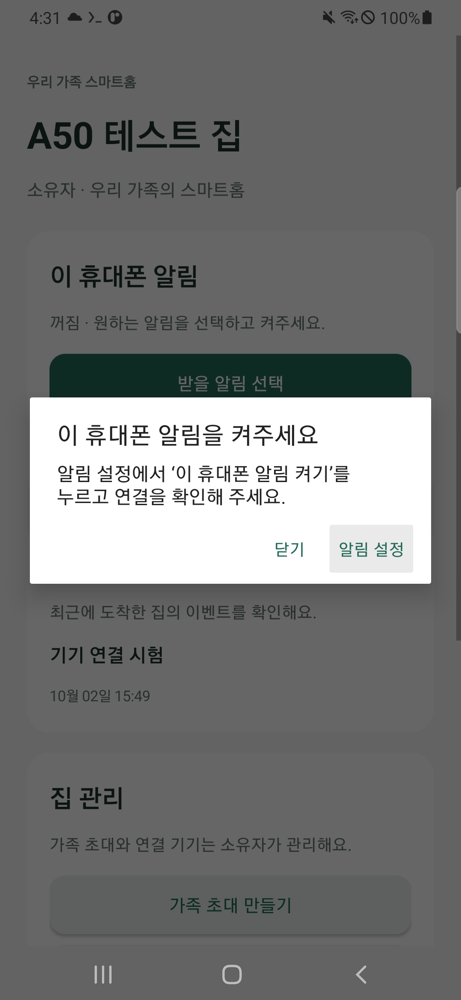
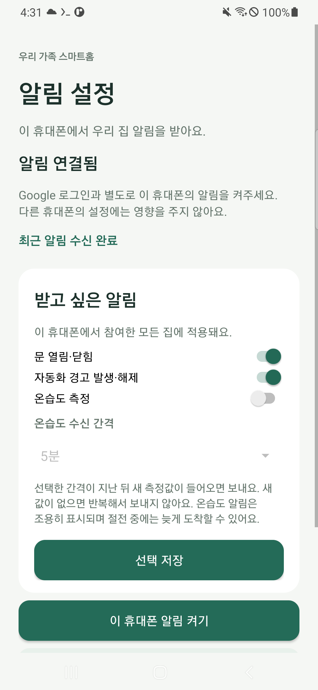
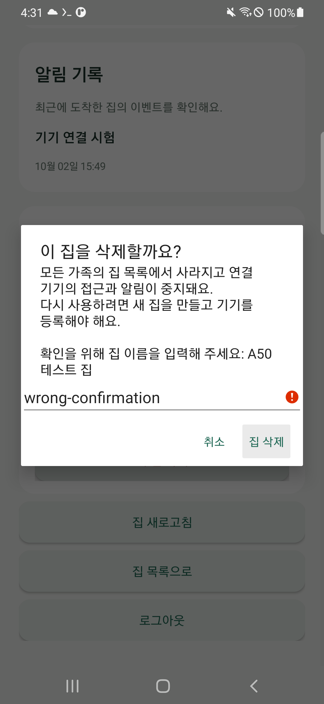

# 8편 — 받고 싶은 알림 선택·집 관리·오류 안내

2026-10-02, 앱 0.3.0·A50 중앙 서버 0.4.0·DB 스키마 4. 기존 Google 로그인·집·허브 키를 유지한 업데이트다.
사용자가 다른 휴대폰에서 같은 계정으로 시험 알림 수신에 성공한 뒤, 모호한 오류 안내와 알림 선택·집 삭제·화면 개선을 요청했다.

## 1. ‘등록 충돌’과 ‘알림이 꺼짐’을 구분한다

0.2.0에서 알림을 켜지 않고 시험 버튼을 누르면 서버는 `installation_not_registered`와 409를 반환했다.
앱은 모든 409를 ‘이미 등록됐거나 다른 등록과 충돌했어요’로 표시했다. 같은 Google 계정이 여러 휴대폰에서 충돌한 사례는 아니었다.

0.3.0에서는 시험 전에 이 휴대폰의 상태를 확인한다. 꺼짐은 ‘이 휴대폰 알림을 켜주세요’,
등록 진행 중은 ‘알림 연결 준비 중’, 휴대폰·채널 권한 차단은 ‘휴대폰에서 알림을 허용해 주세요’로 안내한다.
설정으로 이동하는 버튼을 함께 제공한다. 실제 등록 충돌·10대 등록 한도·1분 시험 제한·소유자 권한·만료된 초대·서버 설정 미완료도 구분한다.
등록 작업의 오류는 알림 설정 화면에 사람이 읽을 수 있는 설명으로 남긴다. 서버 원문·토큰을 그대로 표시하지 않는다.



## 2. 휴대폰마다 받을 알림을 선택한다

기존 APK 위에 같은 서명의 0.3.0을 설치한다. 앱을 삭제하거나 기존 Google 계정으로 다시 등록할 필요는 없다.

1. 집 목록의 ‘알림 설정’ 또는 집 화면의 ‘받을 알림 선택’을 연다.
2. 문 열림·닫힘, 자동화 경고 발생·해제, 온습도 측정을 선택한다.
3. 온습도를 켰다면 1·5·15·60분 중 수신 간격을 선택한다.
4. ‘선택 저장’을 누른다. 알림이 꺼져 있다면 ‘이 휴대폰 알림 켜기’도 누른다.
5. ‘알림 연결 확인’에서 ‘알림 연결됨’을 확인한 뒤 집의 시험 알림을 보낸다.

기본 선택은 문·경고 켜짐, 온습도 꺼짐, 온습도 간격 5분이다. 선택은 이 휴대폰에서 참여한 모든 집에 적용된다.
같은 계정의 다른 휴대폰 설정은 바뀌지 않는다. 기기 연결 시험과 직접 요청한 시험 알림은 센서 종류 선택과 별개다.



## 3. 온습도는 새 보고를 읽고 간격을 제한한다

실제 Pi의 `sensor_states`에서 온습도 센서 1개와 `temperature_c`·`humidity_percent` 필드를 확인했다.
문 변화와 달리 온습도는 매번 추가되는 이력이 아니라 최신 상태 행이다. 독립 연결 서비스가 이 행을 읽기 전용으로 조회한다.
처음에는 기존 보고를 기준으로 저장해 재발송하지 않는다. 이후 보고 시각이 새로워지면 유효한 온도·습도만 전달한다.
센서 원시 ID·MAC·방 이름·원시 MQTT·배터리 값은 이 전송 자료에 넣지 않는다.

중앙 서버는 휴대폰별 선택과 마지막 온습도 전송 예약 시각을 저장한다.
예를 들어 5분 간격이면 마지막 예약부터 5분이 지난 뒤 들어온 새 보고가 다음 알림 대상이다.
고정 시각의 타이머 발송이나 센서 자체의 측정 주기를 바꾸는 기능은 아니다. 새 보고가 없으면 같은 값을 반복 발송하지 않는다.
한 집에 여러 온습도 센서가 추가되어도 해당 휴대폰의 간격은 전체 온습도 알림에 적용한다.
서버·연결 서비스가 재시작해도 진행 위치와 간격 제한을 유지한다.

알림 선택은 대기열 등록 때와 전송 직전에 확인한다. 앱도 수신 시 선택을 다시 확인해 이미 전송 중이던 꺼진 종류를 표시하지 않도록 한다.
온습도는 FCM NORMAL 우선순위와 별도의 낮은 중요도 채널을 사용한다. 절전 중 전달은 늦어질 수 있다.
[Firebase 공식 우선순위 안내](https://firebase.google.com/docs/cloud-messaging/android-message-priority).
온습도 알림은 문 알림과 별도로 표시한다. 푸시에는 종류와 수신 증명만 넣고 측정값은 인증된 집 기록 API에서 조회한다.

점검 당시 온습도 마지막 보고는 2,014초 전이었다. 실제 새 보고·온습도 알림의 종단 간 수신은 아직 검증하지 않았다.
없는 측정값이나 문 변화를 만들어 실제 센서 시험이라고 기록하지 않는다.

## 4. 집 추가·삭제와 화면을 정리한다

집 목록에서 기존 ‘새 집 만들기’로 집을 추가한다. 집 화면을 ‘이 휴대폰 알림’·‘알림 기록’·‘집 관리’ 카드로 구분했다.
기록은 ‘기기 연결 시험’, ‘문 열림’, ‘문 닫힘’, ‘자동화 경고’, ‘온습도 측정’과 수신 시각으로 표시한다.
온습도 기록에서는 실제 값도 볼 수 있다. Android 뒤로 가기는 관리·설정에서 집 또는 집 목록으로 돌아간다.

삭제는 **소유자만 집 화면 → 집 관리 → 이 집 삭제**에서 한다. 영향을 설명한 뒤 정확한 집 이름을 입력해야 한다.
서버에서도 소유자와 이름을 확인하고 한 트랜잭션으로 집·가족 참여·허브·미사용 초대·대기 전송을 비활성화한다.
집은 모든 가족 목록에서 사라지며 기존 허브 키로 새 기록을 보낼 수 없다. 다시 쓰려면 새 집·기기 연결이 필요하다.
내부 데이터는 감사·복구 판단을 위해 남긴다. 이미 FCM에 수락된 알림은 회수할 수 없고, 이를 삭제 성공으로 꾸미지 않는다.



실제 사용자 집은 삭제하지 않았다. 유효한 삭제의 권한 차단·집 목록 제외·키와 초대 차단·대기열 취소·기존 기록 보존은 격리된 로컬 DB에서 검사했다.

## 5. 검사·배포·실패도 기록한다

로컬 관련 검사 **83개 통과**. 이후 온습도 NORMAL 전송도 포함한 제공자 검사 **9개 통과**와 변경 모듈 Ruff 검사를 완료했다.
APK의 기존 Android 단위 검사 4개, 빌드·배포 서명·실제 Firebase 구성·HTTPS·가상 토큰 제외 검사를 통과했다.
잘못 적은 검사 파일명으로 첫 검사 명령이 실패한 출력(303)을 남기고 실제 파일 목록으로 수정해 실행했다(305).

```powershell
.venv/Scripts/python.exe scripts/android/deploy_a50_central.py
.venv/Scripts/python.exe scripts/pi/deploy_central_agent.py
# 변경 대상과 서비스 영향 안내 뒤 명시적으로 반영
.venv/Scripts/python.exe scripts/android/deploy_a50_central.py --apply
.venv/Scripts/python.exe scripts/pi/deploy_central_agent.py --apply
.venv/Scripts/python.exe scripts/android/verify_family_apk.py
.venv/Scripts/python.exe scripts/pi/verify_central_agent.py
```

A50는 SQLite 일관 백업 후 스키마 3→4를 추가 변경하고 준비 상태·소스 체크섬을 확인했다.
Pi는 독립 연결 서비스만 재시작했다. 기존 문 552·자동화 150 위치, 전용 키, 기존 제어 서비스는 유지했다.
실제 서버는 기존 집 2개·활성 설치 2개를 유지했다. A50의 선택은 문 1·온습도 0·경고 1·간격 5분이었다.
기존 다른 휴대폰의 0.2.0도 계속 사용할 수 있지만 새 선택 화면은 0.3.0 업데이트가 필요하다.

A50 배포 APK를 데이터 보존 업데이트한 뒤, 실제 Google 계정으로 꺼짐 안내·선택 화면·틀린 이름 삭제 방어를 **7.351초**에 확인했다.
업데이트가 끝나기 전에 시작한 첫 검사에서는 설치된 APK 해시가 다르다고 중단됐다(311). 설치 완료 후 검사(312)는 통과했다.
화면 꺼짐 실제 FCM 콜백·알림 게시는 **8.553초**에 통과했다(316).
처음 백그라운드 검사(313)는 ‘수신이 Home 전환 이후여야 함’ 조건에서 실패했다. 기존 검사는 전송을 요청한 다음 Home으로 이동해 수신과 전환이 경쟁할 수 있었다.
이 실패의 실제 콜백 시각은 충분히 기록하지 않아 원인을 확정하지 않았다. 검사 순서를 백그라운드 확인 → 정상 소유자 API 전송으로 바꾸고 결과 진단을 추가했다.
수정 검사(319)는 **8.902초**, 새 콜백·백그라운드 이후 콜백·알림 게시 모두 true로 통과했다. 운영 APK를 이 검사 수정 때문에 바꾸지는 않았다.


최종 설치본: 바탕화면 `가족스마트홈-0.3.0.apk`, 4,406,053바이트.
SHA-256: `2bebf45c903cccf48af1bb2d22c7aeec03e77f781a003a1ee731ee48909514b1`.
이미지와 같은 이름의 실제 TXT 원문은 `docs/assets/terminal/300~`에 보존한다. 터미널 PNG는 실제 출력을 렌더링한 재구성 자료다.
마지막에 A50을 홈·화면 꺼짐으로 복구하고 SSH·자동 관리·중앙 준비 상태·코드 체크섬을 확인했다(322~325). Pi 연결 서비스는 active/enabled·자동 재시작 0, 당시 RSS 26,788kB였다. 소프트웨어 검사와 실제 사용자 집 삭제·새 물리 측정 시험을 구분해 기록한다.
이 단계도 새로운 유료 서비스·도메인·결제 계정을 신청하지 않았다.

## 남은 확인

사용자 휴대폰의 0.3.0 업데이트와 선택 저장, 실제 새 온습도 보고·문 변화 수신, 서로 다른 가족 계정·장시간 운용을 확인한다.
집 삭제 실기기 검사에서는 확인 화면만 열고 취소했으며 실제 사용자 데이터는 삭제하지 않았다.
