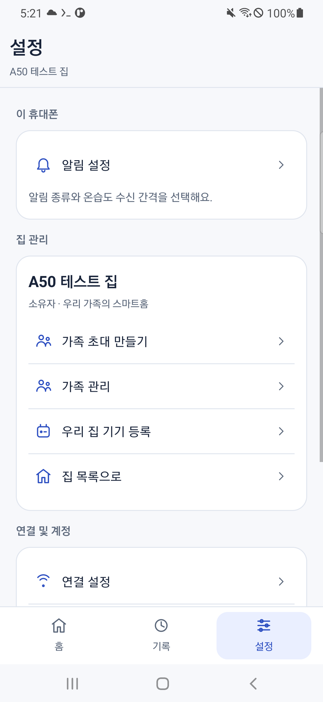
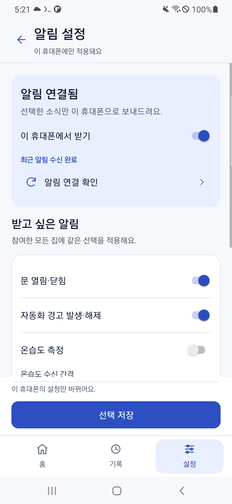
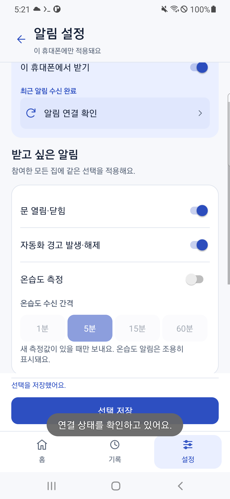
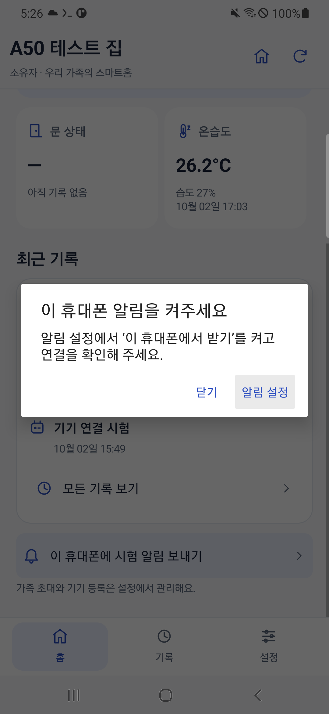
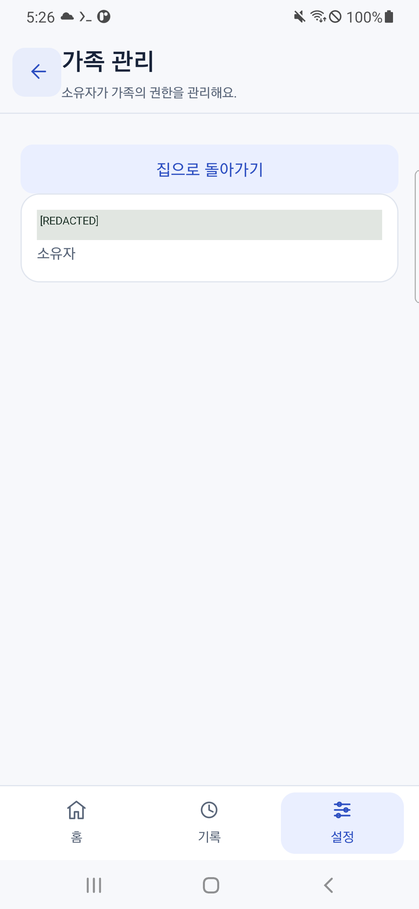
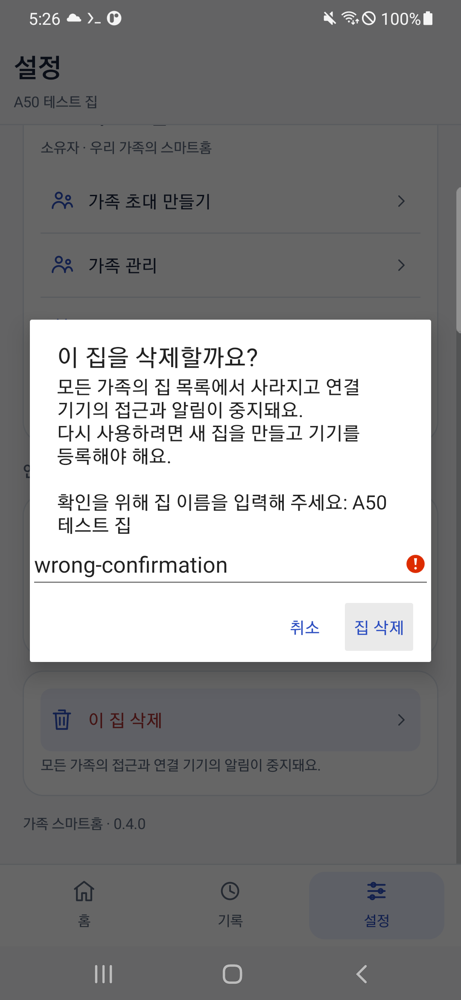

# 가족 스마트홈 화면 개편과 스크롤 위치 유지

2026년 10월 2일, 앱 0.4.0으로 홈과 기록과 설정을 나눴다. 버튼을 누른 뒤 화면이 맨 위로 이동하는 문제도 수정했다. 이 글은 화면 구조를 정한 근거, 코드에서 발견한 원인, 같은 계정과 집을 유지한 실제 A50 검사, 따라 할 수 있는 빌드와 검증 순서를 기록한다.

중앙 서버는 기존 0.4.0을 계속 사용한다. 이번 작업은 Android 앱과 검증 도구 변경이며 서버 설정이나 Raspberry Pi 코드를 배포하지 않았다.

## 기존 화면에서 불편했던 점

기존 앱은 집 상태, 알림, 긴 이벤트 목록, 가족 초대, 기기 등록, 집 삭제를 한 화면 아래로 이어 붙였다. 기록이 늘수록 관리 버튼까지 이동해야 하는 거리가 길어졌다. 강조 버튼이 많아 자주 사용할 기능을 고르기도 어려웠다.

알림 선택 저장과 연결 확인은 `notificationSettings()`를 다시 호출했다. 이 함수가 `screen()`에서 새 `ScrollView`를 만들고 `setContentView()`를 실행하므로 현재 스크롤과 화면 안의 선택 상태가 초기화됐다. `onResume()`도 로그인된 사용자를 매번 집 목록으로 보내서 휴대폰 알림 설정이나 홈 화면에서 돌아올 때 원래 화면이 사라졌다. 코드에서 확인한 두 원인은 별도로 처리해야 한다.

이전 알림 선택 화면은 [0.3.0 캡처](../../assets/hardware/family-app/15-a50-notification-choices.png)에 보존했다. 이전 자료를 새 화면으로 덮어쓰지 않았다.

## 인터넷 자료를 화면 구조에 적용한 방법

Google은 Google Home 개편에서 집 전체를 보는 홈과 집의 이벤트를 보는 Activity를 구분했다. 이 프로젝트도 집 요약과 전체 기록을 분리하는 데 이 구성을 참고했다. 카메라나 AI 기능을 구현했다는 뜻은 아니다. [Google Home 공식 개편 소개](https://blog.google/products-and-platforms/devices/google-nest/google-home-app-gemini-redesign/).

Android 공식 디자인 문서는 같은 단계의 주요 목적지 세 개에서 다섯 개에 하단 내비게이션을 권장한다. 우리 앱의 현재 기능에 맞춰 홈, 기록, 설정 세 개로 정했다. 가족 권한이나 연결 주소처럼 자주 바꾸지 않는 항목은 설정 안에 둔다. [Android 레이아웃과 탐색 패턴](https://developer.android.com/design/ui/mobile/guides/layout-and-content/layout-and-nav-patterns?hl=en).

글씨는 크기 차이와 색으로 제목, 본문, 보조 설명을 구분한다. 버튼과 스위치의 터치 영역은 최소 48dp로 만들었다. 본문 색의 대비는 실제 색상 계산으로 15.69 대 1, 흰 바탕의 보조 글씨는 5.73 대 1, 옅은 파란 바탕의 보조 글씨는 4.99 대 1, 주요 버튼은 7.00 대 1이었다. 이는 선택한 색의 계산값이며 모든 화면과 장애 유형에 대한 접근성 인증은 아니다. [Android 접근성 지침](https://developer.android.com/guide/topics/ui/accessibility/apps), [실제 계산과 서버 대조 원문](../../assets/terminal/332-a50-ui-design-and-central-readonly.txt).

## 새 화면에서 할 수 있는 일

| 화면 | 표시와 동작 |
| --- | --- |
| 집 목록 | 참여한 집 열기, 새 집 만들기, 가족 초대 수락 |
| 홈 | 이 휴대폰의 알림 상태, 마지막 문과 온습도 기록, 최근 기록 최대 세 개, 소유자 시험 알림 |
| 기록 | 최근 집 기록 최대 50개와 전체 및 문 및 온습도 및 경고 필터 |
| 설정 | 휴대폰 알림 설정, 소유자의 가족 초대와 권한 관리와 기기 등록, 집 선택, 연결 설정, 로그아웃, 소유자 집 삭제 |
| 알림 설정 | 이 휴대폰의 수신 스위치, 문과 경고와 온습도 선택, 1분 및 5분 및 15분 및 60분 간격, 하단에 고정한 선택 저장 |

문과 온습도는 서버에서 실제로 조회한 마지막 기록이다. 값이 없으면 대시와 아직 기록 없음을 표시한다. 현재 온라인 상태나 현재 문 상태를 추정해 만들지 않는다. 표시한 시각은 중앙 서버가 기록을 받은 시각을 휴대폰의 시간대로 바꾼 값이다. 최근 50개 안에 해당 종류의 기록이 없으면 그 상태도 확인할 수 없다.

실제 검사 중 중앙에 온습도 보고 두 개가 들어왔다. 읽기 전용 DB 점검에서 최신 값은 온도 26.21°C, 습도 26.99%였다. 화면은 한 자리 온도와 정수 습도로 반올림한다. 이 사실은 집 기록 전달과 조회를 확인한 것이며 온습도 FCM 콜백을 확인한 것은 아니다. 당시 A50은 온습도 알림이 꺼져 있었다.






## 버튼을 눌러도 위치를 유지하는 구현

알림 저장과 연결 확인은 화면을 새로 만들지 않고 현재 상태 글씨만 바꾼다. 등록 작업이 바뀌면 앱의 설정 변경 리스너가 상태를 갱신한다. 알림 종류와 간격을 고르는 컨트롤은 그대로 남으므로 비동기 등록 결과가 와도 편집 중인 값이 초기화되지 않는다.

앱 복귀 시에는 로그인 시작 화면인 경우에만 집 목록으로 이동한다. 이미 알림을 고르고 있거나 기록을 읽고 있다면 그 화면을 유지한다. 알림 권한 결과도 현재 상태만 갱신한다.

다른 화면으로 이동할 때는 화면 종류와 선택한 집에 따라 스크롤 위치를 보관한다. 화면을 다시 열면 레이아웃 배치 뒤 해당 위치를 복원한다. 집 새로고침과 비동기 기록 갱신도 기존 위치를 유지한다. 처음 선택한 다른 집은 그 집 화면의 위치로 시작한다.

로그인과 집 권한은 기존 Firebase 인증과 서버 검사를 사용한다. 서버 요청의 계정과 화면 세대 검사도 유지했다. 화면에 소유자 메뉴가 보인다는 사실이 서버의 권한 검사를 대신하지 않는다.

## 실제 A50 검증

로컬 단위 검사 네 개와 배포 APK 빌드가 통과했다. 서명, 실제 Firebase 설정, 시험 계정 토큰 제외, HTTPS 정책도 확인했다. [최종 빌드](../../assets/terminal/331-a50-family-apk-build.txt), [배포 APK 검사](../../assets/terminal/333-a50-family-apk-verification.txt).

같은 서명 APK를 `install -r`로 설치해 기존 Google 로그인과 연결 주소, 집을 유지했다. 앱을 강제 종료한 뒤 다시 시작해 기존 집이 보이는 것도 검사했다. [A50 설치](../../assets/terminal/335-a50-ui-v040-final-install.txt).

실제 APK에서 다음 회귀 검사를 통과했다. [native 검사 원문](../../assets/terminal/336-a50-family-real-release-smoke.txt).

- 알림 설정을 315px 아래로 이동한 뒤 선택 저장과 연결 확인을 눌러도 같은 `ScrollView`와 315px 위치를 유지했다.
- 저장하지 않은 온습도 선택을 만든 뒤 홈 화면으로 나갔다 돌아와도 같은 화면, 위치, 선택이 남았다. 이 선택은 저장된 설정을 바꾸지 않았다.
- 뒤로 갔다 알림 설정을 다시 열면 315px 위치가 복원됐다.
- 홈에서 200px 아래로 이동해 집 새로고침을 해도 200px을 유지했다. 기록 탭에 갔다 돌아와도 같은 위치였다.
- 문 필터에 온습도 기록이 섞여 나오지 않았다. 하단 설정 메뉴를 눌러 알림 상세에서 설정 첫 화면으로 돌아갔다.



알림 꺼짐 안내, 소유자 가족 화면과 틀린 이름의 집 삭제 차단은 9.407초 통과했다. 실제 집은 삭제하지 않았다. [검사 원문](../../assets/terminal/341-a50-family-real-release-smoke.txt).

이 검사의 첫 실행에서는 집 아래쪽 시험 버튼을 누른 뒤 위쪽의 받을 알림 선택을 찾지 못했다. UI 검사 도구가 아래 방향으로만 스크롤하던 것이 원인이었다. 위와 아래의 위치를 비교해 두 방향으로 탐색하도록 바꿨고 같은 운영 APK에서 통과했다. 앱의 위치 유지 기능을 없애서 검사를 맞추지 않았다. [실패 원문](../../assets/terminal/338-a50-family-real-release-smoke.txt), [실패 출력 PNG](../../assets/terminal/338-a50-family-real-release-smoke.png), [실패 직전 안내 화면 보존](../../assets/hardware/family-app/14-a50-notification-off-guidance-v040-test-failure.png).







최종 앱의 화면 꺼짐 FCM 검사는 7.342초 통과했다. 먼저 화면이 비활성이고 앱이 백그라운드인 것을 확인한 뒤 같은 소유자 API로 이 설치만 지정해 요청했다. 새 FCM 콜백과 실제 알림 게시를 확인할 때까지 화면이 꺼져 있었다. 토큰과 비밀번호는 내보내지 않았다. [실제 수신 검사](../../assets/terminal/342-a50-family-real-release-smoke.txt).


최종 로컬 APK와 바탕화면 APK와 A50 설치 APK의 SHA-256이 일치했다. versionCode 5와 versionName 0.4.0도 확인했다. 중앙 서버 및 터널은 실행 중이고 집 두 개와 허브 한 개와 설치 두 개, 각 휴대폰의 서로 다른 선택도 유지됐다. 마지막에 홈 화면으로 돌아가 화면을 끈 뒤 무선 ADB 관리 상태와 SSH, 중앙 readiness와 DB 무결성을 확인했다. [배포 파일과 최종 상태](../../assets/terminal/343-a50-ui-v040-delivery-and-screen-off.txt).

## 같은 절차로 빌드하고 확인하기

Firebase 앱 설정과 전용 서명 설정, 승인된 A50 SSH 및 ADB 정보는 저장소 밖의 `.deploy/`에서 준비한다. 준비 방법은 이 시리즈 4편부터 6편에 있다. 공개 예제에 개인 키와 서비스 계정 JSON을 넣지 않는다.

프로젝트 루트에서 실행한다. Windows에서는 프로젝트 가상 환경의 Python을 사용한다.

```powershell
.venv/Scripts/python.exe scripts/android/build_family_app.py
.venv/Scripts/python.exe scripts/android/verify_family_apk.py
# 검증된 A50 무선 ADB 연결 대상으로 같은 서명 APK를 업데이트한다.
# 아래 자리표시자는 자신의 연결 대상으로 바꾼다.
adb -s '<검증된_A50_연결대상>' install -r tmp/family-app-build/family-release.apk
.venv/Scripts/python.exe scripts/android/build_family_app.py --production-smoke-only
.venv/Scripts/python.exe scripts/android/run_a50_family_smoke.py --home-name 'A50 테스트 집' --ui-test redesignedNavigationKeepsScrollAndDraft --capture-suffix v040-final --apply
```

운영 APK를 먼저 같은 서명으로 업데이트하고 설치 완료를 확인한 뒤 native 검사를 실행해야 한다. 검증 도구는 APK의 해시와 시험 앱의 서명 및 정확한 대상 패키지를 확인한다. 운영 앱의 데이터 초기화나 Google 토큰 내보내기를 하지 않는다. 자동 검사는 지정한 기존 시험 집을 사용한다. 안내와 화면 꺼짐 수신은 다음과 같이 별도로 검사할 수 있다.

```powershell
.venv/Scripts/python.exe scripts/android/run_a50_family_smoke.py --home-name 'A50 테스트 집' --push-test verifyNotificationGuidanceAndChoices --capture-suffix v040-final --apply
.venv/Scripts/python.exe scripts/android/run_a50_family_smoke.py --home-name 'A50 테스트 집' --push-test receiveRealFCMWhileScreenOff --capture-suffix v040-final --apply
```

화면 꺼짐 검사는 이미 이 휴대폰의 알림이 연결된 상태에서 실행한다. 같은 집의 시험 요청 제한에 걸린 경우 오류를 보존하고 허용 시각 뒤 검사한다. 실제 센서 값을 조작해 알림을 시험하지 않는다.

블로그 터미널 PNG는 실제 UTF-8 TXT 출력에 민감정보를 제거하고 프로젝트의 렌더러로 만든 자료다. 휴대폰 화면 PNG는 실제 native 캡처이며 이메일은 단말에서 가린 뒤 내보낸다. 새 출력 18개는 TXT와 PNG를 짝으로 보존했고 이미지 메타데이터와 문서 연결 및 민감 값 검사를 통과했다. [최종 자료 검사](../../assets/terminal/344-a50-ui-v040-artifact-audit.txt). 화면 꺼짐 검사의 캡처는 수신 후 화면을 켜서 얻는다.

## 배포 파일과 남은 확인

새 배포 파일은 `가족스마트홈-0.4.0.apk`이며 versionCode는 5다. 최종 서명 APK는 4,406,065바이트, SHA-256은 다음과 같다.

```text
354a309ca39cf8b7ec82b1feba5ac00c7216f424a5e9bbcc72f9676528b85e87
```

0.3.0 위에 업데이트 설치하면 된다. 사용자의 다른 휴대폰에서 새 UI 확인, 물리 문 변화, 온습도 FCM 실제 콜백, 다른 가족 계정과 장시간 운영 검증은 이번 화면 검사와 구분한다. 화면 재생성이나 프로세스 종료 뒤 저장하지 않은 선택을 복구하는 기능은 이번 작업에서 검증하지 않았다.
