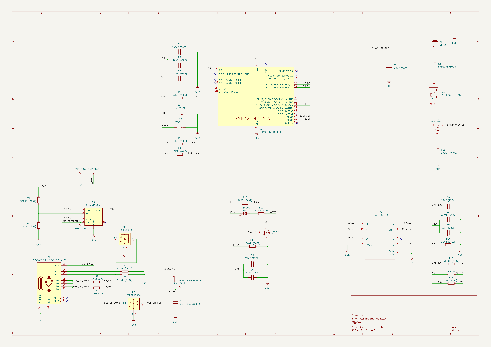

# PCB 제작 2편 — KiCad 회로도 검토, ERC 0건이 놓친 버튼 접점

[이전: 요구사항과 부품 선정](01-requirements-and-parts.md) · [시리즈 목차](README.md) · [다음: PCB 배치와 배선](03-pcb-layout-and-routing.md)

> KiCad 10.0.1에서 검토한 실제 설계 기록이다. 기준은 이번 사용자 설계의 최종 작업본이며, 이전 Rev A나 SuperMini 브레드보드 회로가 아니다. 제작 전 검사와 실물 시험 결과를 구분해 설명한다.

## 선이 연결되었다고 실제 부품까지 검증된 것은 아니다

PCB 작업을 시작할 때 원본 회로도의 ERC 결과는 0건이었다. 회로도와 PCB의 패드 네트도 일치했다. 하지만 제조사 도면과 대조하는 과정에서 RESET과 BOOT 버튼의 내부 접점이 풋프린트 번호와 맞지 않는 것을 발견했다.

이번 작업에서 가장 큰 교훈은 “검사 통과”의 범위를 정확히 이해해야 한다는 점이었다. ERC는 등록된 핀의 전기적 성격과 연결 규칙을 검사한다. 라이브러리의 풋프린트가 실제 부품 내부 구조를 잘못 표현했다면, 그 잘못된 정의를 믿고 정상이라고 판단할 수 있다.

그래서 검토는 전원과 신호를 블록별로 나누고, **데이터시트 핀 → 심볼 핀 → 풋프린트 패드 → 실제 네트** 순서로 진행했다. 아래 내용은 이 과정에서 확인한 회로와 제작 전 수정 사항이다.



전체 회로도는 축소 화면에서 부품 값이 작게 보일 수 있으므로 [회로도 이미지 원본을 열어 확대](../../assets/hardware/user-pcb-20260920/schematic.png)하면 된다. 아래 설명의 참조 번호는 이 최종 회로도와 일치한다.

## 1. 전원 입력과 선택 회로

USB 전원은 J1의 VBUS에서 F1을 거쳐 `USB_5V`로 들어간다. 배터리는 BT1에서 F2, SW3, Q2를 거쳐 `BAT_PROTECTED`로 들어간다. 두 경로는 U1 TPS2116에서 선택되어 `VSYS`로 합쳐진다.

| 신호 | 최종 연결 | 검토한 내용 |
| --- | --- | --- |
| USB 입력 | J1 VBUS → F1 → U1 VIN1 | USB 입력을 배터리와 직접 연결하지 않음 |
| 배터리 입력 | BT1+ → F2 → SW3 → Q2 → U1 VIN2 | 스위치와 PMOS 방향, 실제 G/S/D 번호 |
| 출력 | U1 패드 2·7 → VSYS | 두 출력 핀 모두 연결 |
| 우선순위 | MODE는 USB_5V, PR1은 R3/R4 분압 | 현재 회로의 USB 우선 설정 |

R3 300kΩ과 R4 100kΩ을 사용한 PR1 분압은 데이터시트의 명목 기준전압으로 계산하면 약 4V의 USB 입력 기준이 된다. 이는 실제 측정된 전환 전압이 아니며 저항 오차와 IC 사양을 고려해야 한다. 전원 선택 기능 자체는 [TI TPS2116 데이터시트](https://www.ti.com/lit/ds/symlink/tps2116.pdf)를 기준으로 대조했다.

Q2는 `DMP2035U-7`이고, 이 회로에서는 배터리 쪽이 드레인, 보호된 출력 쪽이 소스다. 이름만 보고 익숙한 스위칭 회로 방향으로 바꾸지 않고 바디 다이오드를 포함해 역극성 보호 연결을 검토했다. SW3는 배터리 가지에만 있으므로 USB 전원까지 끄는 전체 전원 스위치는 아니다.

## 2. TPS63802로 3.3V 만들기

U5 TPS63802는 `VSYS`를 입력받아 `3V3_REG`를 만든다. 이후 R16 0Ω을 지나 모듈과 IR 회로의 `+3V3`로 연결된다. L1은 두 스위칭 핀 사이에 연결된 0.47µH 인덕터다.

| U5 신호 | 패드 번호 | 최종 연결 |
| --- | --- | --- |
| VIN / EN | 10 / 1 | VSYS |
| MODE / AGND / GND | 2 / 3 / 8 | GND |
| L1 / L2 | 9 / 7 | 인덕터 L1의 양쪽 |
| VOUT | 6 | 3V3_REG |
| FB | 4 | R15 511kΩ / R14 91kΩ 분압 |

선택한 저항의 명목값으로 계산하면 출력 설정은 약 3.308V다. 이는 회로 의도를 점검하는 계산값이며 실제 출력 측정값이 아니다. EN은 기존 시제품 설계대로 VSYS에 연결했고, 별도의 배터리 저전압 차단 회로를 추가하지 않았다.

커패시터는 숫자만 같으면 끝나는 부품이 아니다. C10은 명목 10µF, C8은 명목 22µF지만, 세라믹 커패시터의 실효 용량은 인가 전압과 온도 등에 영향을 받는다. 이 컨버터의 해당 설계 조건에서는 입력 실효 용량 4µF 이상, 3.3V 출력 실효 용량 7µF 이상을 확인해야 한다. 최종 선정품의 특성과 실제 배치도 함께 검토 대상이다. [TI TPS63802 데이터시트](https://www.ti.com/lit/ds/symlink/tps63802.pdf)

배치 단계에서는 C10과 C8을 해당 전원·접지 핀 가까이에 두고, 인덕터의 스위칭 경로와 FB 경로를 분리했다. 회로도상 동일한 네트라도 긴 우회 배선과 짧은 전원 루프는 같은 결과를 내지 않을 수 있기 때문이다. 구체적인 배선은 다음 편에서 다룬다.

## 3. H2 전원과 부팅 핀

모듈에는 3.3V와 접지 외에 EN, GPIO8, GPIO9의 기본 상태를 구성했다. EN은 R7 10kΩ으로 올리고 C4 1µF를 접지에 연결했다. RESET 버튼 SW1을 누르면 EN이 접지로 내려간다. GPIO9는 R8 10kΩ으로 올리고 BOOT 버튼 SW2로 접지에 연결하며, GPIO8에도 R9 10kΩ 풀업을 둔다.

여기서 GPIO 번호와 모듈 패드 번호를 구분해야 한다.

| 기능 | GPIO/신호 이름 | 모듈 패드 |
| --- | --- | --- |
| 전원 | 3V3 | 3 |
| 리셋/활성화 | EN | 8 |
| 부팅 설정 | GPIO8 | 22 |
| BOOT 버튼 | GPIO9 | 23 |
| IR 출력 | GPIO4 | 18 |
| USB D− | GPIO26 | 26 |
| USB D+ | GPIO27 | 27 |

GPIO8·9는 리셋 시 부팅 설정에 관여한다. 기본 플래시 부팅과 다운로드 부팅은 같은 상태가 아니므로, 버튼과 풀업을 일반 입력 회로처럼만 검토하면 안 된다. 모듈의 VBAT도 이름만 보고 AA를 직접 연결하지 않았다. 이번 연결은 모듈의 기본 내부 전원 구성을 사용한다. [Espressif 모듈 핀 정의와 부팅 설정](https://documentation.espressif.com/esp32-h2-mini-1_mini-1u_datasheet_en.html)

## 4. USB 데이터와 CC를 따로 확인하기

USB-C 커넥터를 사용한다고 자동으로 USB 데이터가 연결되는 것은 아니다. 이번 회로에서는 다음 경로를 확인했다.

- GPIO26 → R1 22Ω → J1 D−
- GPIO27 → R5 22Ω → J1 D+
- CC1 → R2 5.1kΩ → GND
- CC2 → R6 5.1kΩ → GND
- U3는 데이터선, U4는 CC선의 ESD 보호

CC1과 CC2는 각각 별도의 저항으로 접지에 연결했다. D+와 D−는 같은 모양의 선 두 개이지만 극성을 바꿔 연결하면 안 되므로, 커넥터의 A/B 접점과 MCU 핀까지 대조했다.

ESD 부품은 최종적으로 `TPD2EUSB30DRTR`, 즉 비-A형을 선택했다. 기존 심볼에 연결된 문서가 A형을 가리키고 있어 선택 부품과 일치하도록 정리했다. 데이터시트 링크가 있다고 해서 그 링크가 실제 구매 부품을 설명하는지는 별개의 확인 항목이다.

## 5. IR 송신부: GPIO는 신호만, 전류는 MOSFET으로

IR 부분은 다음과 같은 저측 스위칭 회로다.

```text
+3V3 → R12 33Ω → D1 애노드 / 캐소드 → Q1 드레인
                                                Q1 소스 → GND
GPIO4 → R10 100Ω → Q1 게이트
                       └→ R11 100kΩ → GND
```

R12는 LED 전류를 제한한다. R10은 게이트 직렬 저항이고 R11은 게이트를 접지 쪽으로 당기는 저항이다. 역할이 다르므로 서로 대신하는 부품이 아니다. Q1은 AO3400A이며 패드 1/2/3이 각각 G/S/D인지를 실제 풋프린트와 확인했다.

3.3V, 33Ω, LED 순방향 전압을 1.2~1.6V로 가정하면 단순 계산상 전류는 약 52~64mA다. MOSFET·배선 전압강하 등을 생략한 추정이며 측정값이 아니다. 송신 파형의 듀티비, LED 방향, 실제 펄스 전류와 도달 거리는 제작 후 확인해야 한다. 이전 실험의 GPIO8 설정을 새 PCB에 그대로 적용하면 안 된다.

## 6. 발견한 핵심 오류: 4단자 버튼의 내부 연결

선정한 XKB `TS-1187A-B-A-B`는 네 단자가 각각 독립적인 스위치가 아니다. 제조사 도면에서 위쪽 두 접점 A–B는 내부에서 항상 연결되어 있고, 아래쪽 C–D도 항상 연결되어 있다. 버튼을 누르면 두 묶음이 이어진다. [XKB TS-1187A 제조사 도면](https://datasheet.lcsc.com/datasheet/pdf/56c8799ae5193945a16a1ffbe378246a.pdf)

원래 풋프린트는 위쪽을 1/2, 아래쪽을 3/4로 번호 매겼다. 반면 회로도는 2핀 스위치 심볼로 SW1의 1/2를 EN/GND에 연결했다. 실제 부품을 이대로 실장하면 위쪽 내부 공통 접점 때문에 버튼을 누르지 않아도 EN이 접지에 연결된다. SW2의 BOOT도 같은 문제다.

| 실제 내부 접점 | 기존 풋프린트 | 수정한 풋프린트 |
| --- | --- | --- |
| 위쪽 두 단자: 항상 연결 | 1 / 2 | 1 / 1 |
| 아래쪽 두 단자: 항상 연결 | 3 / 4 | 2 / 2 |
| 누를 때 | 두 묶음 연결 | 심볼의 1 ↔ 2 연결 |

수정은 버튼의 위치나 크기를 바꾸는 것이 아니라, 실제 공통 접점에 맞게 같은 패드 번호를 부여하는 방식으로 했다. 최종 라이브러리 이름은 프로젝트 내부의 `cypark:TS-1187A-B-A-B_XKB`를 유지했다. 감사 중 만든 `_2Pin` 이름은 임시 검토용이므로 최종 프로젝트에서 그 이름을 찾을 필요는 없다.

이 문제는 제조 후 고장 난 보드에서 측정한 결과가 아니다. **제조사 도면과 설계 연결을 대조해 제작 전에 발견·수정한 오류**다. 또한 모든 4단자 버튼이 같은 방향으로 연결된다고 일반화하면 안 된다. 대체 부품을 고를 때는 그 제품의 접점 도면부터 다시 확인해야 한다.

## 7. 같은 패키지 이름이어도 land가 같지는 않았다

F1과 F2가 모두 1206이라고 해서 같은 풋프린트를 그대로 쓰지 않았다. L1도 외형이 비슷한 인덕터 모델에 맞추는 대신 정확한 선정품의 도면과 비교했다. 아래 치수는 풋프린트의 로컬 좌표 기준이며 단위는 mm다.

| 부품 | 최종 패드 크기 | 패드 중심 | 수정 근거 |
| --- | --- | --- | --- |
| F1 BNstar SMD1206-050C-16V | 1.25 × 2.00 | ±1.40 | 최대 몸체 폭을 고려한 설계상 여유 |
| F2 Yenji SMD1206P100TF | 1.00 × 1.90 | ±1.50 | 제조사 권장 land 명목치 |
| L1 Murata DFE201612E-R47M=P2 | 0.80 × 1.80 | ±0.80 | 제조사 권장 land |

F1 자료에는 권장 PCB land가 없었다. 따라서 이를 “제조사 권장 패드 적용”이라고 기록하지 않았다. 최종 패드는 설계상 조정이며 조립사의 DFM 검토가 필요하다. F2는 제조사 패드 도면을 따랐고, L1은 권장 패드와 코어 아래 동박·홀 주의사항을 함께 반영했다. [BNstar 부품 자료](https://datasheet.lcsc.com/datasheet/pdf/9805b486ee62b848d009b5edc742c366.pdf), [Yenji 제조사 자료 5쪽](https://file.elecfans.com/web2/M00/78/08/poYBAGNoe5eAXgHvAAWgpvrl3s4691.pdf), [Murata 규격서](https://pim.murata.com/asset/pim4/inductor/J(E)TE243A-0006_PDF_INDUCTOR)

L1의 중앙 코어 동박 금지는 양면에, 몸체 아래 홀·비아 금지는 별도로 적용했다. 이 금지 영역의 사각형 치수는 제조사의 도면을 그대로 복사한 것이 아니라, 몸체와 land 치수를 바탕으로 보수적으로 구현한 설계 규칙이다.

R16도 회로도 값에는 0402라고 적혀 있었지만 PCB는 0805였다. 실제 형상과 일치하도록 값을 `0R (0805)`로 고쳤다. 사람이 보는 값, BOM의 주문 번호, PCB 형상 중 어느 하나만 확인하면 이런 차이를 놓치기 쉽다.

## 8. KiCad에서 다시 확인할 순서

같은 작업을 따라 한다면 다음 순서가 도움이 된다. 새로 검사를 실행한 기록이 아니라, 이번 경험에서 정리한 재현용 점검 순서다.

1. 정확한 MPN과 제조사 도면을 먼저 고정한다.
2. 심볼의 핀 기능·번호를 데이터시트와 비교한다.
3. 풋프린트의 패드 번호, 크기, 간격, 1번 방향을 비교한다.
4. 버튼처럼 내부 연결이 있는 부품은 접점 묶음까지 확인한다.
5. 변경한 풋프린트를 PCB에도 반영하고, 같은 번호의 모든 패드가 같은 네트를 갖는지 확인한다.
6. 회로도/PCB 일치, 미연결, ERC, DRC를 다시 검사한다.
7. 실제로 검사하지 않는 규칙과 아직 남은 실물 시험 항목을 함께 적는다.

커스텀 부품은 프로젝트 내부 라이브러리로 보존했다. KiCad 기본 라이브러리에서 같은 이름을 검색해 나오는 모양만으로 이번 수정 사항이 반영됐다고 판단하면 안 된다. 특히 SW1/SW2, F1/F2/L1, U5는 프로젝트가 사용하는 실제 라이브러리를 확인해야 한다.

최종 전체 작업본은 현재 프로젝트에서 활성화한 오류·경고 규칙 기준으로 ERC 0건, DRC 0건, 미연결 0건, 회로도/PCB 일치 차이 0건을 확인했다. 비활성 규칙까지 전부 검증했다거나 하드웨어의 정상 동작을 보증한다는 뜻은 아니다.


[실제 명령과 출력을 담은 텍스트 기록](../../assets/terminal/75-user-pcb-final-verification.txt)도 함께 보관했다. 위 최종 결과는 회로 검토와 뒤이은 배치·배선 수정까지 완료한 뒤의 결과다. 이 편의 핵심은 0이라는 숫자보다 **그 검사 밖에 있는 실제 부품 정보를 함께 확인했다는 것**이다.

[다음: PCB 배치와 배선](03-pcb-layout-and-routing.md) · [시리즈 목차](README.md)
