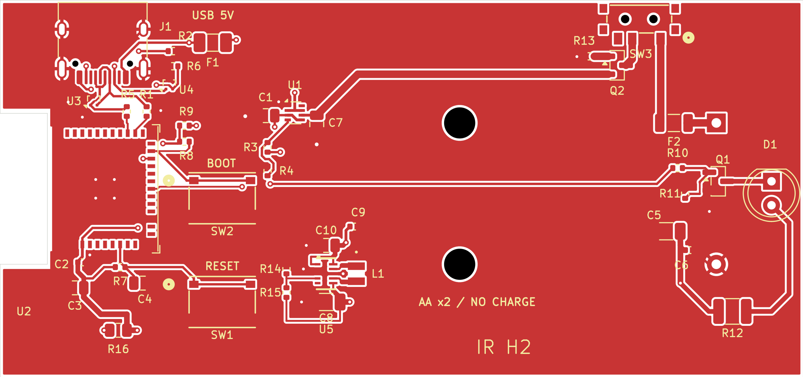
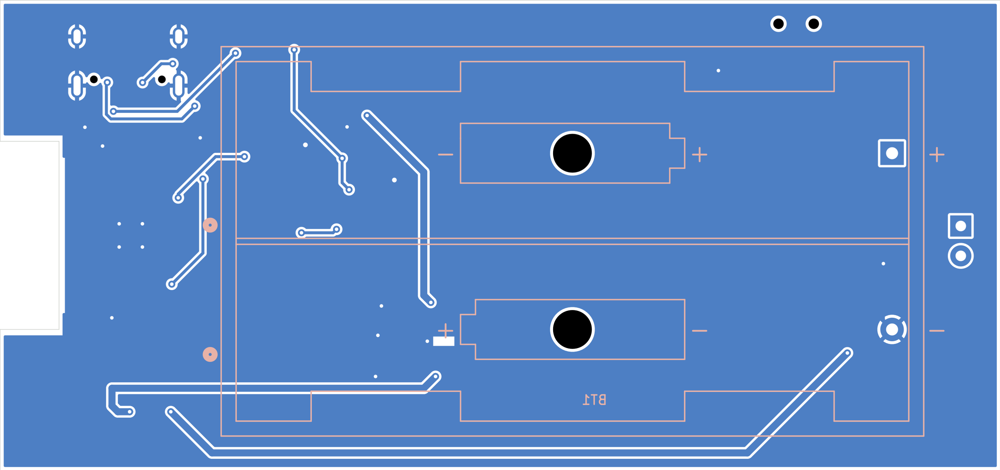
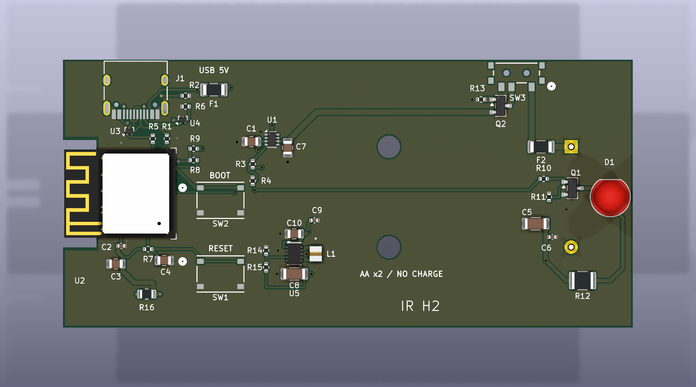
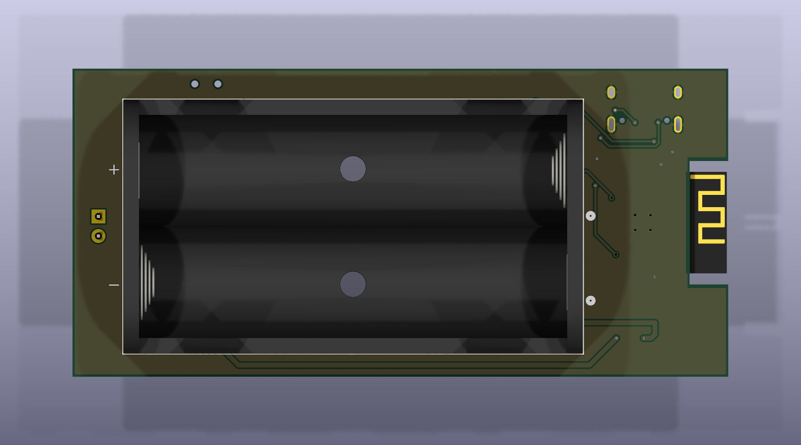

# ESP32-H2 Zigbee IR 노드 PCB 만들기 ③ — 내 배치를 살려서 배선 완성하기

> 설계 기준: KiCad 10.0.1, 2026-09-20 작업본. 이 글은 실제 CAD 수정·검사 기록을 정리한 것이다. 사진처럼 보이는 그림도 CAD 렌더링이며, 아직 제작한 PCB의 동작을 검증한 단계는 아니다.

[시리즈 목차](README.md) · [이전: 회로도와 풋프린트 검토](02-kicad-schematic-review.md) · [다음: JLCPCB 제조 파일과 검증](04-jlcpcb-manufacturing-checks.md)

## 이번에는 내가 그린 보드에서 출발했다

앞선 글에서는 회로 연결과 실제 부품의 접점을 대조했다. 이제 그 회로를 실제 PCB 위에서 연결할 차례다. 이번 작업의 중요한 조건은 “새로 배치한 다른 보드로 바꾸지 않기”였다. 내가 작성한 회로도와 아트워크를 기준으로 하고, 이미 위치를 정해서 잠근 부품은 그대로 남겼다.

배선 전에 먼저 프로젝트 전체를 백업했다. `user-design-20260920-022829` 스냅샷의 254개 파일을 검증했고, 이전에 별도로 만들었던 `codex-revA`는 활성 프로젝트에서 빼서 `retired-codex-revA`로 보관했다. 삭제하고 잊어버린 것이 아니라, 필요하면 복구할 수 있도록 분리한 것이다.

수정은 `artwork-current` 복사본에서만 진행했다. 마지막에는 원본 회로도와 PCB의 해시가 백업 때와 같은지 확인했다. 원본을 보존했는지, 새 작업본이 어떤 기준에서 출발했는지를 나중에도 설명할 수 있게 하려는 목적이다.

직접 따라 한다면 우선 현재 프로젝트를 저장하고 KiCad의 자동 저장 상태도 확인한 뒤, 프로젝트 파일뿐 아니라 사용자 라이브러리와 3D 모델을 함께 복사해 두자. `.kicad_pcb` 하나만 있으면 보드 형상은 열릴 수 있어도, 이후 부품을 갱신하거나 다른 컴퓨터에서 편집할 때 원래 라이브러리를 찾지 못할 수 있다.

## 바꿀 수 있는 것과 없는 것을 먼저 정했다

보드의 외곽은 85 × 40mm, 두께 설정은 1.6mm, 동박은 앞·뒷면 2층이다. 전기 부품은 총 42개이며, 배터리 홀더 BT1만 뒷면에 놓고 나머지 41개는 앞면에 둔다. 뒷면에 부품을 더 놓지 않는다는 조건이지, 뒷면 동박에 배선하지 않는다는 뜻은 아니다.

| 고정 부품 | 역할 | 이번 작업에서 유지한 것 |
| --- | --- | --- |
| J1 | USB 커넥터 | 위치·회전·앞면 배치 |
| U2 | ESP32-H2 모듈 | 위치·회전·앞면 배치 |
| D1 | IR LED | 위치·회전·앞면 배치 |
| SW3 | 배터리 경로 스위치 | 위치·회전·앞면 배치 |
| BT1 | AA 배터리 홀더 | 위치·회전·뒷면 배치 |

이 다섯 부품은 입력본의 좌표, 각도, 레이어, 잠금 상태를 기준 파일에 남기고 수정본과 정확히 비교했다. 나머지 부품은 외곽 안으로 정리하고, 실제 연결이 짧아지도록 회로 블록별로 배치했다. 커넥터나 LED의 위치는 기구물과 사용 방향에 영향을 주므로, 배선이 편하다는 이유로 임의 이동하지 않았다.

외곽에서는 하단의 겹친 5mm 선분 하나를 제거했다. 보드 크기를 줄인 것이 아니라 같은 자리에 중복되어 있던 선을 정리했다. 안테나 쪽의 잘려 나간 외곽도 유지했다.

## 처음부터 “오류 0개”인 보드는 아니었다

입력본의 회로도 ERC는 0건이었다. 하지만 PCB를 검사하자 DRC 위반 121건, 미연결 항목 68건이 나왔다. 회로도와 PCB의 패드 네트 차이가 없다는 것과 실제 배선이 완성됐다는 것은 다른 이야기였다.

앞 편에서 찾은 RESET·BOOT 버튼 접점도 먼저 수정했다. 틀린 풋프린트를 그대로 두고 미연결만 없애면, 잘못된 연결을 충실하게 배선한 보드가 될 수 있기 때문이다. 퓨즈와 인덕터 패드도 실제 선택 부품에 맞춘 뒤 본격적인 배선을 진행했다.

이때 기준을 “경고 숫자를 없애기”로 잡지 않았다. 보고된 위치로 이동해 어떤 연결·간격·형상 때문에 발생했는지 확인하고, 수정 후 다시 검사했다. 입력본의 수치와 최종 수치는 따로 기록해 두었다.

## 민감한 경로를 먼저 연결하고 나머지를 채웠다

이번에는 전원·USB·IR의 중요한 구간을 수동으로 먼저 배선하고, 나머지 연결에 로컬 `freerouter` 결과를 사용한 뒤 다시 보완했다. 자동 배선 결과는 완성 판정이 아니라 검토할 중간 결과로 취급했다. 기존 사용자 배선도 가능한 범위에서 유지했다.

전원부는 TPS63802와 인덕터, 입력·출력 커패시터 사이의 경로를 우선했다. 스위칭 노드가 불필요하게 멀리 돌아가지 않도록 하고, 출력 전압을 읽는 FB 연결은 스위칭 구간과 구분해 배선했다. 앞·뒷면에는 GND 영역을 두고 필요한 접지 연결을 보완했다.

USB 데이터선은 앞면에서 짧게 연결했고, 데이터선 자체에 레이어를 바꾸는 비아를 넣지 않았다. 다만 이 결과를 “90Ω 임피던스 제어가 보증된 USB 설계”로 표현하지는 않는다. 이번에는 연결·배선 형태를 검토했을 뿐, 제작사 적층으로 임피던스를 확정하거나 실물 USB 적합성 시험을 하지는 않았다.

IR 출력은 GPIO4에서 저항을 거쳐 MOSFET을 구동하는 현재 회로를 따랐다. 이전 ESP32-H2 SuperMini 브레드보드 시험의 GPIO8과 혼동하면 안 된다. PCB를 받아 시험할 때는 새 보드용 펌웨어 핀 설정부터 맞춰야 한다.

KiCad에서 같은 순서로 작업한다면 부품을 옮길 때마다 연결선의 방향을 보고, 전원 블록과 커넥터 주변부터 배선한 뒤 나머지를 연결하는 식으로 진행할 수 있다. 마지막에는 동박 영역을 다시 채운 상태에서 검사해야 한다. 채우기 전 화면에 보이는 연결만으로 접지가 완성되었다고 판단하지 않는 것이 이번 작업의 점검 원칙이었다.

최종 KiCad 데이터에서 내보낸 앞면 동박·실크·외곽이다. 빨간색은 편집·출력용 레이어 색이며 실제 주문할 솔더마스크 색을 뜻하지 않는다.

이 뒷면 레이어 그림은 앞면과 비교하기 위한 **위에서 투영한 방향**이다. 실물 보드를 뒤집어서 본 사진과는 좌우 방향이 다르고, 일부 뒷면 문자가 뒤집혀 보이는 것도 그 때문이다.

## 모듈 패드 안의 비아를 밖으로 옮겼다

원본에는 모듈 패드 안에 열린 비아 9개가 있었다. 이 구조를 그대로 두기보다 패드 사이에 솔더마스크로 덮는 비아 4개를 배치하는 방식으로 수정했다. 목적은 리플로 과정에서 패드의 납이 구멍으로 빠질 수 있는 경로를 줄이는 것이었다. 실제 납땜 시험으로 불량률을 비교한 결과는 아니다.

바꾼 네 비아의 드릴 가장자리와 패드 사이 최소 간격은 CAD 기준 약 0.22123mm였다. 최종 보드 전체에는 비아 38개가 있고, 드릴 지름 0.3mm 36개와 0.4mm 2개로 구성된다. 모두 양면 텐팅으로 설정했다.

여기서 텐팅은 설계 파일에서 솔더마스크로 비아를 덮도록 설정했다는 뜻이다. 충전·도금으로 비아를 메우는 공정을 요청했다는 뜻은 아니다. 실제 제조 결과는 주문 옵션과 제조사 검토에서 다시 확인해야 한다.

안테나 금지 영역과 L1 인덕터의 금지 영역도 유지했다. L1은 중앙 코어 아래 양면 동박 금지, 몸체 아래 비아 금지 조건을 풋프린트에 반영했다. 안테나 주변을 비워 두었다는 사실만으로 Zigbee 통신 거리나 RF 성능이 검증되는 것은 아니며, 이는 제작 후 시험 항목으로 남겼다.

## 예상 밖의 문제: 라이브러리에 저장하니 금지 영역이 틀어졌다

회로·배선 외에도 도구 처리 과정에서 문제가 한 번 더 나왔다. 최종 풋프린트를 프로젝트 내부 라이브러리로 저장할 때, 포함된 금지 영역의 좌표 변환이 제대로 처리되지 않아 L1과 U2의 PCB·라이브러리 비교가 맞지 않았다.

부품이 회전하고 이동한 상태의 형상을 라이브러리 기준 좌표로 되돌리는 과정에서, 포함된 영역까지 같은 좌표계를 적용해야 했다. 해결은 저장할 풋프린트의 위치를 `fp.SetPosition(0,0)`으로 정규화한 뒤 라이브러리에 저장하는 것이었다. 이 코드는 라이브러리로 내보낼 복사 객체에 적용하는 처리이며, 보드 위의 고정 부품을 원점으로 옮기라는 뜻이 아니다.

경고를 숨기는 대신 저장 방식을 수정하고 KiCad의 기본 검사로 다시 비교했다. 이 문제는 원래 회로의 전기적 오류가 아니라, 라이브러리 스냅샷을 만드는 처리의 오류로 구분해 기록했다. 재사용할 라이브러리를 만들 때는 패드뿐 아니라 금지 영역까지 제대로 따라오는지 확인해야 한다는 교훈이었다.

## 최종 결과와 그림을 읽는 방법

최종 배선·비아 항목은 402개다. KiCad 10.0.1의 현재 프로젝트 설정으로 검사한 결과는 DRC 오류·경고 0건, 미연결 0건, 회로도/PCB 일치 차이 0건이었다. 잠긴 다섯 부품의 배치도 입력본과 정확히 일치했다.

앞면에는 배터리 홀더를 제외한 부품을 배치했다. 위 그림은 제작 사진이 아니라 CAD 3D 렌더링이다.

뒷면 부품은 BT1 하나다. J1·SW1·SW2·SW3는 준비된 3D 모델이 없어 몸체가 그림에서 생략될 수 있다. LED의 일반적인 빨간 모델도 실제 TSAL6200의 외관이나 빛의 색을 재현한 것이 아니다. 부품이 그림에 안 보인다고 제조 데이터에서도 누락된 것은 아니므로, 판단은 PCB의 패드·부품 목록과 함께 해야 한다.

검사 0건 역시 현재 활성화된 error/warning 규칙 안에서의 결과다. courtyard 미정의나 일부 풋프린트 필터처럼 원래 비활성화된 검사가 있으며, 보고서의 `ignored_checks`에 남아 있다. 이 한계를 숨기지 않고 다음 편의 제조 검토로 넘겼다.

## 이번 편에서 얻은 것

이번 작업의 결과는 내 배치 의도를 유지한 채 모든 네트를 연결하고, 검사 가능한 제조 준비 상태로 정리한 PCB다. 실물로 전원이 켜지고 에어컨을 제어했다는 결과는 아직 아니다.

따라서 아트워크를 마친 뒤에도 원본 보존 여부, 고정 부품 위치, 회로도 일치, 미연결, 금지 영역, 풋프린트 라이브러리를 각각 확인했다. “배선이 다 보인다”보다 이 점검 묶음이 이번 단계의 종료 기준이었다.

상세 근거는 [실제 작업 기록](../../journal/2026-09-20-user-pcb-artwork.md)과 [릴리스 메모](../../hardware/user-pcb-release-notes.md)에 남겼다. 다음 편에서는 이 PCB에서 만든 Gerber·드릴·BOM·CPL을 어떻게 다시 검증했는지, 그리고 주문 전에 무엇이 남아 있는지 정리한다.

[다음 편: JLCPCB 제조 파일과 주문 전 검증](04-jlcpcb-manufacturing-checks.md)
