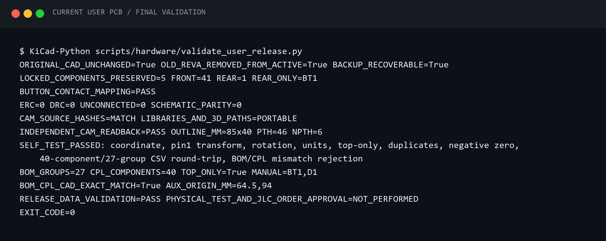
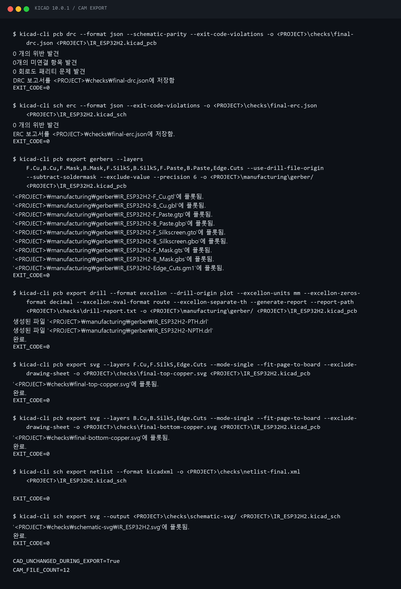
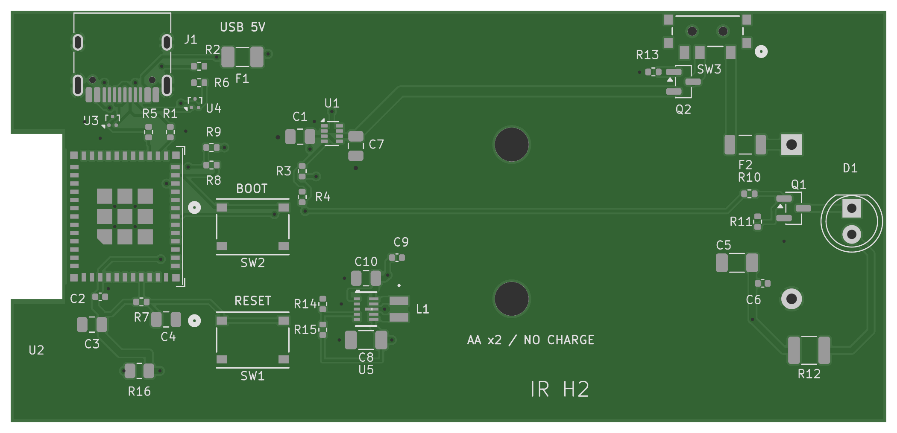
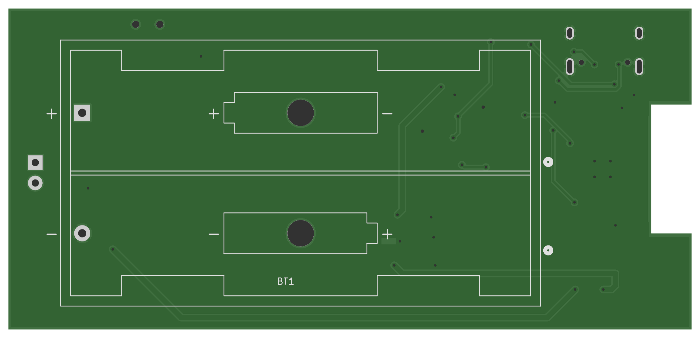

# ESP32-H2 Zigbee IR 노드 PCB 만들기 ④ — JLCPCB 주문용 파일 만들고 다시 검증하기

> 검사·출력 기준: KiCad 10.0.1, 2026-09-20 작업본. 현재 완료 범위는 사용자 검토용 제조 파일 준비까지다. JLCPCB 주문·조립 승인이나 제작된 보드의 동작 검증을 완료한 글은 아니다.

[시리즈 목차](README.md) · [이전: PCB 배치와 배선](03-pcb-layout-and-routing.md)

## 배선이 끝났다고 바로 주문하지는 않았다

앞 편에서 PCB의 미연결을 0건으로 만들었다. 이제 제조사에 넘길 자료가 필요하다. 여기서 확인할 대상은 두 가지다. 하나는 CAD 설계 자체이고, 다른 하나는 그 CAD에서 출력한 제조 파일이다.

CAD가 맞아도 내보내는 레이어나 원점, 실장 대상이 달라지면 제출 파일은 달라질 수 있다. 이번에는 최종 설계를 저장한 뒤 ERC·DRC를 실행하고, 제조 파일을 생성한 다음, 별도 파서로 Gerber와 드릴을 다시 읽는 순서로 진행했다. 출력 전후의 CAD 해시도 비교해 내보내기 과정에서 설계가 바뀌지 않았는지 확인했다.

## 1. 검사 0건의 의미부터 분명히 했다

최종 검사 결과는 다음과 같다. 초기 PCB의 DRC 121건·미연결 68건은 수정 전 수치이며, 아래와 섞어서 읽으면 안 된다.

| 검사 | 이번 결과 | 확인한 범위 |
| --- | --- | --- |
| ERC | 오류·경고 0건 | 현재 활성화된 회로도 검사 규칙 |
| DRC | 오류·경고 0건 | 현재 활성화된 PCB 검사 규칙 |
| 미연결 | 0건 | 설계 네트의 미연결 항목 |
| 회로도/PCB 일치 | 차이 0건 | 저장된 회로도와 PCB의 일치 |
| 원본 보존 | 해시 일치 | 원본 회로도·PCB 등 기준 파일 |
| 잠긴 부품 | 5개 모두 일치 | 좌표·회전·면·잠금 상태 |

검사 보고서에는 `ignored_checks`도 있다. 예를 들어 ERC의 풋프린트 필터 검사, DRC의 courtyard 미정의나 일부 풋프린트 형식 검사가 비활성화되어 있다. 따라서 “KiCad에서 가능한 모든 검사를 통과했다”가 아니라 “현재 프로젝트의 활성 검사에서 오류·경고가 없었다”가 정확한 표현이다.

다음은 실제 실행한 검증 프로그램의 출력을 민감정보 없이 보존한 자료다. 하단의 `PHYSICAL_TEST_AND_JLC_ORDER_APPROVAL=NOT_PERFORMED`도 결과의 일부다.



[검색·복사용 TXT 원문](../../assets/terminal/75-user-pcb-final-verification.txt)

## 2. CAD를 직접 다시 검사하려면

아래는 실제 사용한 옵션을 독자가 자기 작업본에서 실행할 수 있도록 상대 경로로 정리한 **재현 예시**다. 이미 실행해 얻은 출력은 위 캡처와 뒤의 TXT 원문에 따로 있다. 이 예시를 적었다고 독자의 보드까지 검사한 것은 아니다.

`kicad-cli`가 실행 가능한 PowerShell에서, 회로도·PCB·프로젝트 파일이 함께 있는 복사본 폴더를 현재 위치로 잡는다. 기존 최종 보고서를 덮어쓰지 않도록 결과는 `blog-checks`에 저장한다. 보드에서 동박 영역을 다시 채우고 저장한 뒤 진행한다.

```powershell
New-Item -ItemType Directory -Path '.\blog-checks' -Force
kicad-cli sch erc --format json --exit-code-violations -o '.\blog-checks\erc.json' '.\IR_ESP32H2.kicad_sch'
$LASTEXITCODE
kicad-cli pcb drc --format json --schematic-parity --exit-code-violations -o '.\blog-checks\drc.json' '.\IR_ESP32H2.kicad_pcb'
$LASTEXITCODE
```

`--schematic-parity`를 넣어 회로도와 PCB의 일치도 함께 검사한다. 종료 코드와 JSON 내부의 위반·미연결·제외 항목을 같이 확인한다. 명령 옵션의 근거는 [KiCad 10 CLI 공식 문서](https://docs.kicad.org/10.0/en/cli/cli.html)이며, 이번 작업에서 실제 실행한 버전은 10.0.1이다.

## 3. 제조사가 받을 파일을 역할별로 나눴다

제조 패키지 안의 핵심 파일은 다음과 같다.

```text
manufacturing/
├─ gerber/                  # 동박·마스크·인쇄·페이스트·외곽·드릴
├─ assembly/
│  ├─ jlc-bom.csv           # 어떤 부품을 실장하는지
│  ├─ jlc-cpl.csv           # 어디에, 어느 방향으로 놓는지
│  ├─ assembly-review.csv   # 핀 1·좌표·부품 선택 주의사항
│  ├─ part-selection.json   # 부품 선택 매핑
│  └─ README-assembly.md    # 주문 전 확인사항
└─ JLCPCB-Gerber-IR_ESP32H2.zip
```

Gerber 레이어는 `F.Cu`, `B.Cu`, `F.Mask`, `B.Mask`, `F.SilkS`, `B.SilkS`, `F.Paste`, `B.Paste`, `Edge.Cuts`의 9개다. 여기에 Gerber job 파일 1개, 도금 관통홀 PTH와 비도금홀 NPTH 드릴 파일 2개를 더해 총 12개를 생성했다.

“앞면에 실장한다”는 것과 “앞면 Gerber만 필요하다”는 것은 다르다. 이 보드는 뒷면에도 동박과 배선이 있으므로 뒷면 제조 레이어가 필요하다. 다만 뒷면 SMT 실장을 하지 않기 때문에 뒷면 페이스트 데이터는 비어 있다.

## 4. 원점과 단위를 통일했다

Gerber·드릴·부품 배치 좌표의 기준이 다르면 모양이 맞아도 서로 어긋날 수 있다. 이번에는 KiCad 절대 좌표 `(64.5, 94.0)mm`를 드릴·실장 원점으로 사용했다. 화면의 작업 그리드 원점과 구분해야 하는 값이다.

별도 검증에서는 다음 좌표 변환으로 원본과 출력을 비교했다.

```text
CAM X = KiCad X - 64.5
CAM Y = 94.0 - KiCad Y
```

출력 단위는 mm다. 이 보드의 원점을 다른 보드에 그대로 복사할 필요는 없다. 중요한 것은 자기 보드에서 정한 드릴·실장 원점과 제조 출력 옵션이 서로 일치하는지 확인하는 것이다.

아래는 같은 옵션으로 Gerber와 드릴을 내보내는 **재현 예시**다. 결과는 기존 제조 폴더 대신 `blog-cam`에 생성한다.

```powershell
New-Item -ItemType Directory -Path '.\blog-cam' -Force
kicad-cli pcb export gerbers --layers F.Cu,B.Cu,F.Mask,B.Mask,F.SilkS,B.SilkS,F.Paste,B.Paste,Edge.Cuts --use-drill-file-origin --subtract-soldermask --exclude-value --precision 6 -o '.\blog-cam\' '.\IR_ESP32H2.kicad_pcb'
kicad-cli pcb export drill --format excellon --drill-origin plot --excellon-units mm --excellon-zeros-format decimal --excellon-oval-format route --excellon-separate-th --generate-report --report-path '.\blog-cam\drill-report.txt' -o '.\blog-cam\' '.\IR_ESP32H2.kicad_pcb'
```

`--use-drill-file-origin`과 `--drill-origin plot`으로 같은 기준을 사용했다. 슬롯은 route 방식으로 내보내고 PTH와 NPTH를 분리했다. 출력 옵션은 [KiCad CLI의 Gerber·드릴 설명](https://docs.kicad.org/10.0/en/cli/cli.html)을 참고할 수 있다.



[전체 명령·출력 TXT](../../assets/terminal/76-user-pcb-cam-export.txt). 캡처의 `<PROJECT>`는 개인 작업 경로를 제거한 표기다.

## 5. 42개 부품인데 CPL에는 왜 40개일까

PCB에는 부품이 42개다. 이 중 BT1 배터리 홀더와 D1 IR LED는 직접 납땜하기로 했으므로 PCBA 대상에서 제외했다. 나머지 앞면 40개만 CPL에 들어간다. 같은 제조사 부품 번호·LCSC 코드·실제 풋프린트 조합을 묶으면 BOM은 27개 그룹이 된다. BOM 27줄이 부품 총 27개라는 뜻은 아니다.

혼합형 USB 커넥터 J1은 PCBA 목록에 포함했다. 관통홀 요소가 있다는 이유만으로 모든 부품을 일괄 제외하지 않고, 실제 조립 계획에 맞춰 대상을 정했다. 주문 시에는 선택한 조립 서비스가 해당 부품과 공정을 처리할 수 있는지 별도로 확인해야 한다.

BOM과 CPL은 다시 읽어서 부품 목록이 일치하는지, 중복이나 누락은 없는지, 앞면만 들어갔는지, 좌표와 단위가 원본과 맞는지 검사했다. 실제 결과는 `BOM_GROUPS=27`, `CPL_COMPONENTS=40`, `TOP_ONLY=True`, `MANUAL=BT1,D1`이다.

파일 형식의 기본 근거는 [JLCPCB의 KiCad BOM·CPL 안내](https://jlcpcb.com/help/article/how-to-generate-the-bom-and-centroid-file-from-kicad)와 [Pick & Place 파일 안내](https://jlcpcb.com/help/article/pick-place-file-for-pcb-assembly)다. 부품 재고·가격·조립 서비스 조건은 주문 시점에 다시 확인해야 하며, 이번 기록은 견적을 확정한 자료가 아니다.

## 6. 만든 Gerber를 다른 도구로 다시 읽었다

내보내기 명령이 성공했다는 사실만으로 끝내지 않았다. KiCad가 아닌 Gerbonara 1.6.3으로 실제 Gerber와 Excellon 드릴을 읽고, KiCad 원본의 좌표와 비교했다. 단위 변환과 출력 반올림을 고려해 좌표에는 0.002mm, 드릴 지름에는 0.0011mm의 비교 허용 오차를 사용했다. 이 숫자는 제조 공차가 아니라 파일 비교용 허용 오차다.

| 재읽기 항목 | 확인 결과 |
| --- | --- |
| 외곽 중심선 | 8개 선분, 85 × 40mm, 안테나 쪽 절개 유지 |
| PTH | 46개: 원형 42개와 USB 셸 슬롯 4개 |
| NPTH | 원형 6개 |
| 드릴 좌표·지름·슬롯 끝점 | CAD와 일치 |
| 동박·마스크·페이스트 | 예상 패드 중심 누락 없음 |
| 비아 38개 | 양면 마스크 개방 없음 |
| 뒷면 페이스트 | 비어 있음 |
| 검사 전후 CAD·제조 파일 | 해시 변경 없음 |

몇 가지 차이는 오류로 단정하지 않고 원인을 확인했다. Gerber job에 표시된 크기는 85.05 × 40.05mm였지만, 이는 0.05mm 외곽선 두께를 포함한 경계였다. 실제 외곽 중심선 기준 크기는 85 × 40mm로 같았다.

별도 파서는 드릴 도금 유형을 `unknown`으로 읽기도 했다. 이때 파일 이름만 믿지 않고 Excellon 원문의 `Plated`와 `NonPlated` 헤더를 확인했다. 파서 경고와 실제 설계 오류를 구분해 기록한 이유다.

물론 패드 중심이 존재한다는 검사가 모든 개구 형상·납땜 품질·전기적 동작까지 증명하지는 않는다. 이 단계에서 확인한 것은 제조 출력의 일부 구조와 좌표가 원본 CAD와 일치한다는 사실이다.





위 두 그림은 부품을 올린 3D 화면이 아니라 **실제 출력한 Gerber를 별도 도구로 읽은 CAM 렌더링**이다. 뒷면은 뒤집어 보는 방향으로 표시했다. 녹색 배경 역시 시각화 색이며 제조 완료 사진이나 주문 색상 확정 기록은 아니다.

## 주문 버튼을 누르기 전에 남은 일

CPL의 Mid X/Y는 KiCad 풋프린트 원점이다. 사용자 풋프린트의 원점이 실제 부품 흡착 중심과 같다고 자동으로 보장되지는 않는다. 이번에는 JLCPCB용 회전 보정값을 추측해서 넣지 않았다. 따라서 제조사의 실장 미리보기에서 다음 항목을 직접 확인해야 한다.

- [ ] 각 부품이 올바른 풋프린트 위치와 중심에 놓이는가?
- [ ] IC의 핀 1, 다이오드·MOSFET 등 방향성 부품의 방향이 맞는가?
- [ ] BT1과 D1이 PCBA 대상에서 제외되고, J1은 포함되어 있는가?
- [ ] 선택한 정확한 부품 번호와 패키지가 CAD·BOM·판매 목록에서 일치하는가?
- [ ] 모듈 조립에 필요한 서비스·검사 조건과 당일 재고·견적을 확인했는가?
- [ ] 비아 텐팅, 구멍·슬롯, 외곽과 제조사 DFM 의견을 확인했는가?
- [ ] 제조사 검토에서 변경이 필요하다면 CAD부터 수정하고 파일을 다시 만들었는가?

실장 방향을 확인하지 않고 “검증 스크립트가 통과했으니 그대로 주문하면 된다”고 넘기지는 않았다. 현재 패키지는 검토용이며, 이 글 작성 과정에서도 주문이나 결제는 진행하지 않았다.

## 설계 시리즈의 마무리, 실물 시험의 시작점

여기까지로 요구사항·회로도·아트워크·제조 파일 준비의 네 단계를 정리했다. 다음은 제작된 시제품에서 별도로 해야 할 검증이다. 전원과 단락 여부, USB 연결·부팅, AA/USB 전원 경로, 대기·송신 전류, 발열, GPIO4 IR 출력·도달 거리, Zigbee 연결을 확인해야 한다. 실제 시험의 전원 조건과 결과는 그때 기록할 예정이다.

현재 보드에는 충전 회로, 별도의 AA 저전압 차단, 배터리 전압 측정 기능이 없다. 배터리 스위치를 꺼도 USB가 연결되어 있으면 켜질 수 있다. 6개월~1년 수명은 아직 측정한 성과가 아니며, 이번 제조 파일 검증이 그 목표를 보장하지도 않는다.

이번 단계에서 확실하게 말할 수 있는 결과는 **원본과 배치 의도를 보존한 설계를 완성하고, 검사 결과와 제조 파일의 일치 근거를 남겼다**는 것이다. 실물 성공담은 보드를 받아 실제로 확인한 뒤 다음 글에 적기로 했다.

근거 자료: [작업 일지](../../journal/2026-09-20-user-pcb-artwork.md), [릴리스 메모](../../hardware/user-pcb-release-notes.md), [최종 검증 TXT](../../assets/terminal/75-user-pcb-final-verification.txt), [제조 출력 TXT](../../assets/terminal/76-user-pcb-cam-export.txt).

[시리즈 목차로 돌아가기](README.md)
