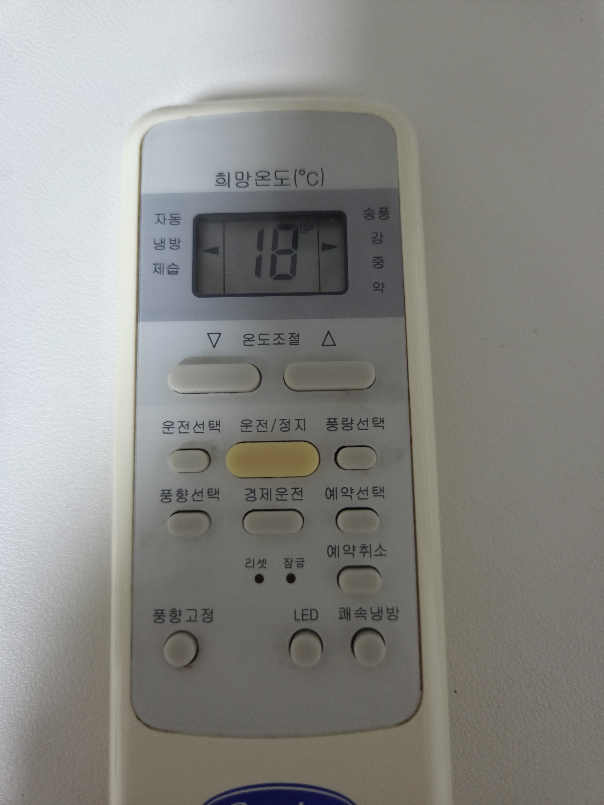
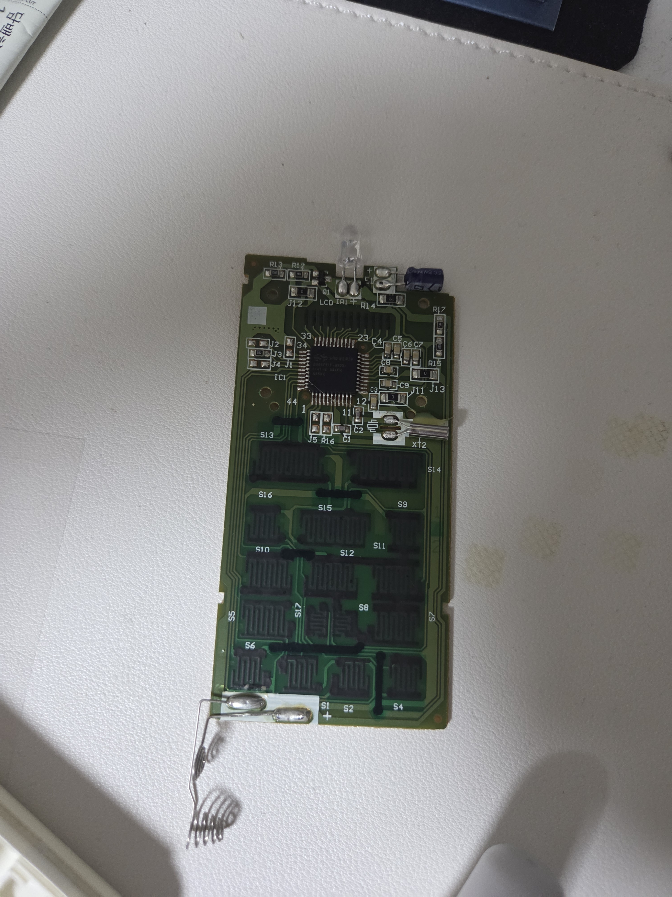
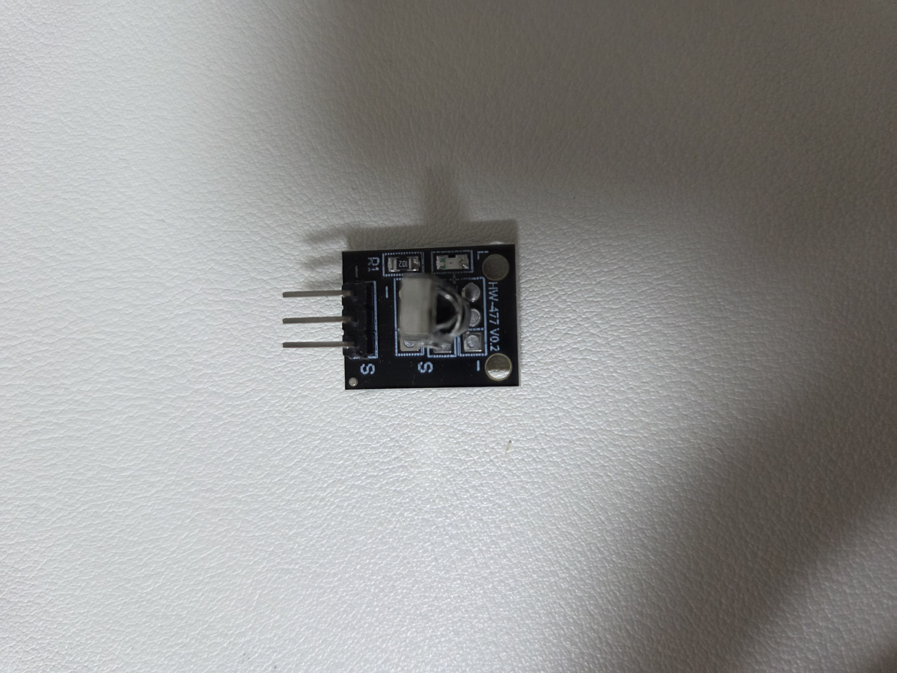
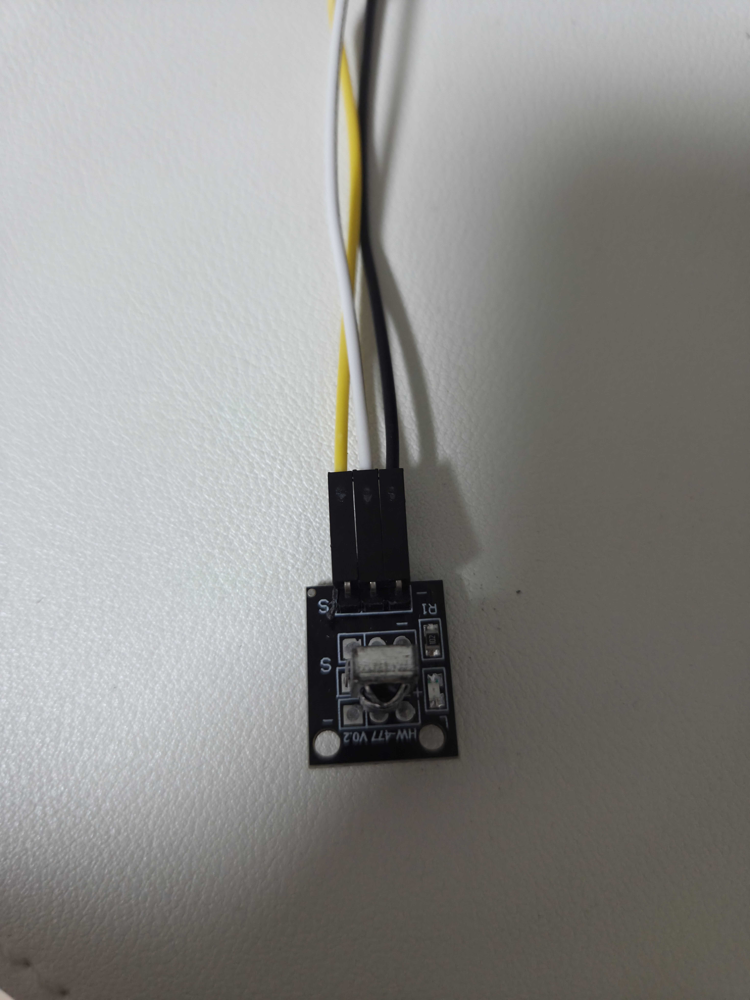
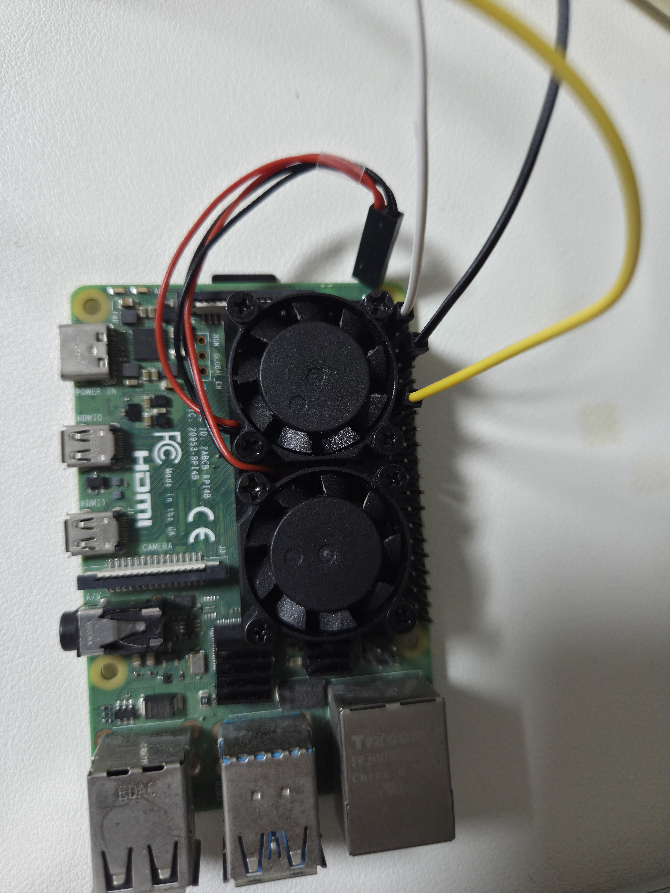
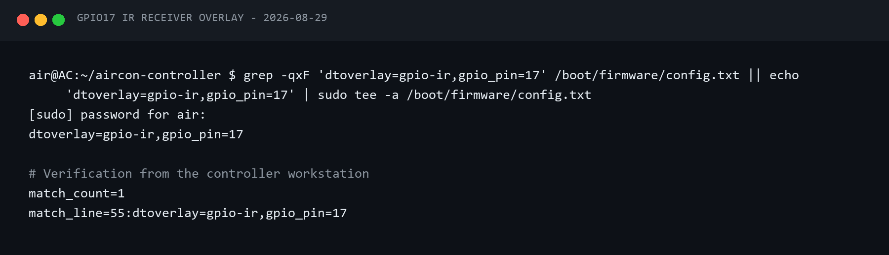
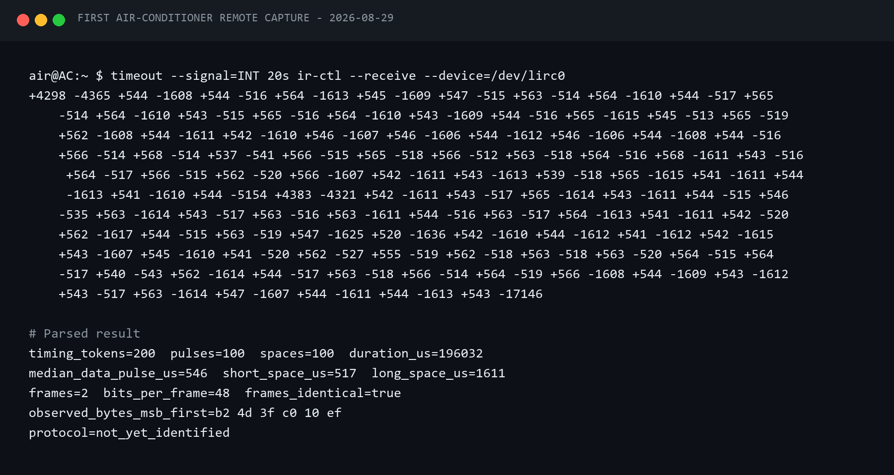
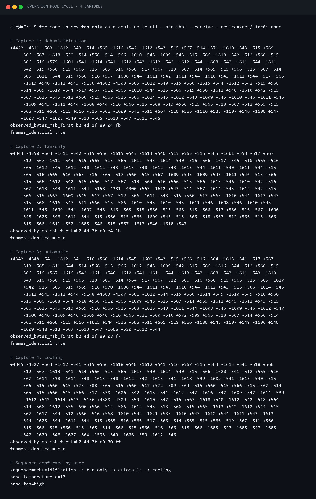
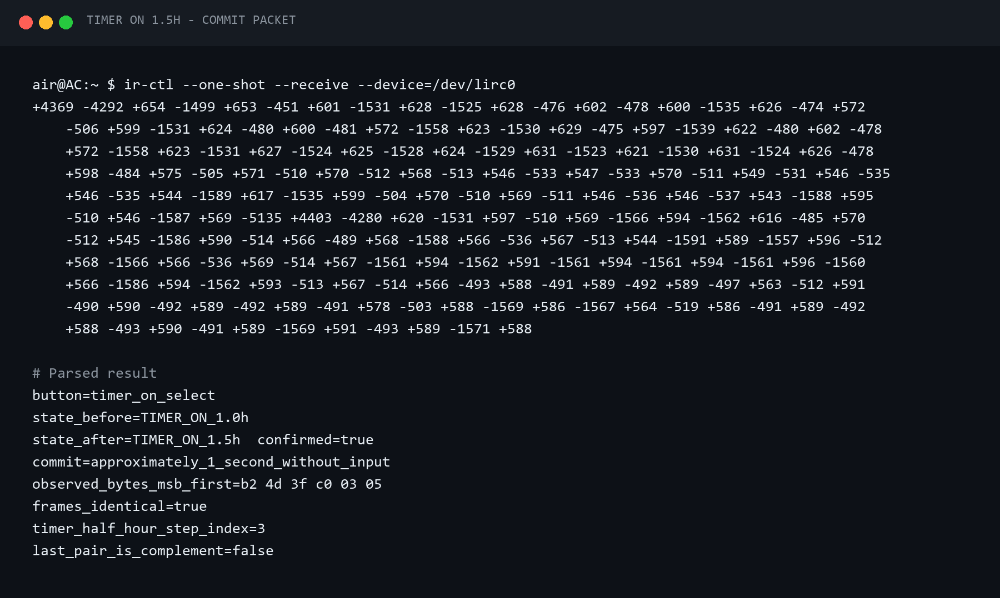

# Step 2 — 기존 리모컨 IR 신호 하이재킹

> 여기서 말하는 하이재킹은 내가 소유한 Carrier CS-A061GS 에어컨 리모컨의 적외선 신호를
> 수신기로 기록하고, 의미 있는 명령 데이터로 재구성한 과정이다. 이 단계에서는 송신하지 않고
> **수신·분석·저장**까지만 완성한다.

## 1. 왜 버튼 코드 하나만 복사하면 안 될까

TV 리모컨처럼 버튼마다 짧은 고정 코드가 전송될 것으로 예상했지만 에어컨 리모컨은 달랐다.
전원, 운전 모드, 희망 온도, 풍량 같은 현재 설정을 하나의 상태 프레임에 담아 보내는 방식이었다.
따라서 `온도 올림` 버튼의 코드 하나를 저장하는 대신 다음 조건을 함께 기록해야 했다.

- 전원 상태
- 자동·냉방·제습·송풍 모드
- 희망 온도
- 자동·약·중·강 풍량
- 풍향, 경제 운전, 쾌속 냉방, LED 같은 순간 명령

목표 구조도 단순한 버튼 목록이 아니라 다음과 같이 잡았다.

```text
기존 리모컨
   ↓ 적외선
HW-477 수신기
   ↓ GPIO17 / Linux LIRC
원시 pulse·space
   ↓ 파서와 분석기
Carrier CS-A061GS 명령 프로필
```

## 2. 리모컨과 수신 모듈 확인

리모컨을 분해해 PCB를 확인했다. 전면에는 투명 IR LED와 구동 트랜지스터 `Q1`이 있었고,
MCU에는 Sino Wealth `SH66P51F-AE031`, PCB에는 `16214-15597` 표기가 보였다. 에어컨 모델은
사용자가 확인한 Carrier `CS-A061GS`였다.





수신기는 `HW-477 V0.2`를 사용했다. 판매 자료에는 1838 계열 수신 헤드, 2.7~5.5V,
37.9kHz 또는 38kHz로 설명돼 있었다. 다만 38kHz는 오실로스코프로 직접 측정한 값이
아니므로 이후 문서에서도 **판매 자료 기준값**으로 구분했다.

멀티미터가 없는 상태였기 때문에 GPIO에 5V가 유입될 가능성을 만들지 않도록 수신 모듈을
3.3V로 먼저 시험했다. 실제로 안정적으로 신호가 잡혀 이 구성을 유지했다.



## 3. Raspberry Pi 배선

최종 수신 배선은 다음과 같다. 물리 핀 번호와 BCM 번호를 혼동하지 않게 둘 다 기록했다.

| HW-477 | Raspberry Pi 4B | 역할 |
|---|---|---|
| VCC | 물리 핀 1, 3.3V | 모듈 전원 |
| GND | 물리 핀 9, GND | 공통 접지 |
| OUT | 물리 핀 11, BCM GPIO17 | 복조된 디지털 신호 |

팬 때문에 물리 핀 6을 이미 사용하고 있어 다른 GND인 핀 9를 선택했다. 노이즈가 있다면
VCC와 GND 사이에 100nF 세라믹 커패시터를 모듈 가까이에 추가할 수 있지만, 첫 시험에서는
필수는 아니었다.





배선을 바꿀 때는 Pi 전원을 끄고 작업했다.

## 4. Linux에서 IR 수신 장치 만들기

Raspberry Pi 부트 설정에 수신용 overlay를 추가했다.

```text
dtoverlay=gpio-ir,gpio_pin=17
```

재부팅 후 `/dev/lirc0`가 생겼고 당시에는 수신 기능만 제공했다. 장치 기능과 실제 원시 수신은
각각 확인했다.

```bash
ir-ctl --features --device=/dev/lirc0
ir-ctl --receive --device=/dev/lirc0
```





이 글의 터미널 이미지는 공개용으로 계정과 주소를 제거해 다시 만든
`SANITIZED TERMINAL RECORD`다. 실제 측정값은 같은 이름의 텍스트 기록과 원시 캡처에
남겨 두었다.

## 5. 한 번에 한 조건만 바꾸며 캡처하기

에어컨 프레임은 현재 상태 전체를 포함하므로 실험 조건이 흐트러지면 어느 비트가 무엇인지
알 수 없다. 기준 상태를 정하고 한 번에 한 필드만 바꿨다.

```text
기준: 냉방 · 17℃ · 강풍
온도: 17 → 18 → 19 → 20℃
풍량: 자동 → 약 → 중 → 강
운전: 자동 → 냉방 → 제습 → 송풍
기타: 전원 OFF, 풍향, 경제, 쾌속, LED
```

초기에 온도 신호를 연속으로 캡처했는데 서로 같은 값이 나왔다. 풍량 표시가 사라진 상태와
리모컨 내부 상태가 섞인 것이 원인이었다. 풍량을 자동으로 명시한 뒤 온도만 변경해 다시
캡처하자 규칙이 드러났다.

예약 기능도 조사했지만 최종 제품에서는 Raspberry Pi가 스케줄을 직접 실행하는 편이 더
명확했다. 리모컨 예약 패킷은 참고 자료로만 남기고 1차 제어 명령에서는 제외했다.





## 6. 48비트 프레임 분석

대부분의 버튼 조작은 같은 6바이트 프레임을 두 번 보냈다. 관찰한 대표 타이밍은 다음과 같다.

| 구간 | 관찰값 |
|---|---:|
| 리더 pulse | 약 4,350µs |
| 리더 space | 약 4,350µs |
| 데이터 pulse | 약 560µs |
| 논리 0 space | 약 520µs |
| 논리 1 space | 약 1,610µs |
| 프레임 사이 | 약 5,150µs |

원시 캡처를 pulse·space 토큰, 압축 텍스트, JSON 세 형식으로 보존했다. 처음 파서는 프레임
끝의 긴 idle space까지 데이터 쌍으로 세어 49비트로 오판했다. 마지막에 대응 pulse가 없는
고아 space를 데이터에서 제외하도록 고쳐 48비트로 안정적으로 복원했다.

대표 명령은 다음과 같았다.

```text
POWER_OFF       b2 4d 7b 84 e0 1f
MODE_AUTO       b2 4d 1f e0 08 f7
MODE_DRY        b2 4d 1f e0 04 fb
MODE_FAN        b2 4d 3f c0 e4 1b

FAN_AUTO        ... bf 40
FAN_LOW         ... 9f 60
FAN_MEDIUM      ... 5f a0
FAN_HIGH        ... 3f c0
```

17~20℃를 직접 캡처해 비교하니 온도 필드는 단순 증가가 아니라 Gray code 형태로 변했다.
21~30℃는 이 규칙으로 생성하되, 직접 측정한 값과 생성값을 `commands.json`에서 구분했다.

## 7. 수신 코드를 계층으로 나누기

다른 리모컨을 추가할 수 있게 GPIO 읽기와 Carrier 분석을 한 파일에 묶지 않았다.

```text
LIRC 장치 계층       /dev/lirc*에서 원시 타이밍 수집
캡처 서비스 계층     타임아웃·파일 이름·원본 보존
프로토콜 계층         pulse/space → 48비트·6바이트
기기 프로필 계층      Carrier 모델별 의미와 명령
API 계층              캡처 요청·결과 조회
```

실제 API로 한 번만 캡처했을 때 199개 타이밍 토큰을 얻었고,
`b2 4d 3f c0 13 04` 프레임 두 개로 복원됐다. 원시·압축·JSON 파일 세 개가 같은 캡처 ID로
저장됐고, 당시 수신 단계 테스트 14개도 통과했다.

프로필은 다음 구조로 만들었다.

```text
device_profiles/
└─ air_conditioner/
   └─ Carrier/
      └─ CS-A061GS/
         ├─ profile.json
         ├─ packet.md
         ├─ commands.json
         ├─ captures/
         └─ assets/
```

`packet.md`는 사람이 읽는 실험·추론 기록이고, `commands.json`은 프로그램이 사용하는
명령 데이터다. 원시 캡처를 별도로 남겼기 때문에 나중에 파서가 바뀌어도 다시 분석할 수 있다.

## 8. Step 2의 결과와 남은 경계

이 단계에서 완성한 것은 다음 네 가지다.

- GPIO17 수신 회로와 Linux LIRC 장치
- 반복 가능한 원시 캡처 API
- Carrier 48비트 프레임 분석과 명령 데이터
- 다른 모델로 교체 가능한 프로필·프로토콜 계층

아직 실제 에어컨으로 신호를 보내지는 않았다. Step 3에서는 이 패킷을 직접 화면에 노출하지
않고 `냉방 24℃ 강풍` 같은 의미 기반 명령으로 감싼다. 실제 IR 송신 회로와 에어컨 반응
확인은 Step 4에서 진행한다.

## 원본 기록

- [IR 수신 소프트웨어 구현](../journal/2026-08-29-ir-receiver-software.md)
- [환경 구성 이후의 실제 캡처 과정](../journal/2026-08-29-environment-setup.md)
- [Step 2 계획](../plans/step-2-ir-learning-control.md)
- [IR 모듈 판별과 배선](../hardware/ir-modules.md)
- [Carrier CS-A061GS 패킷 분석](../../device_profiles/air_conditioner/Carrier/CS-A061GS/packet.md)
- [반복 가능한 문제 해결 기록](../troubleshooting.md)
