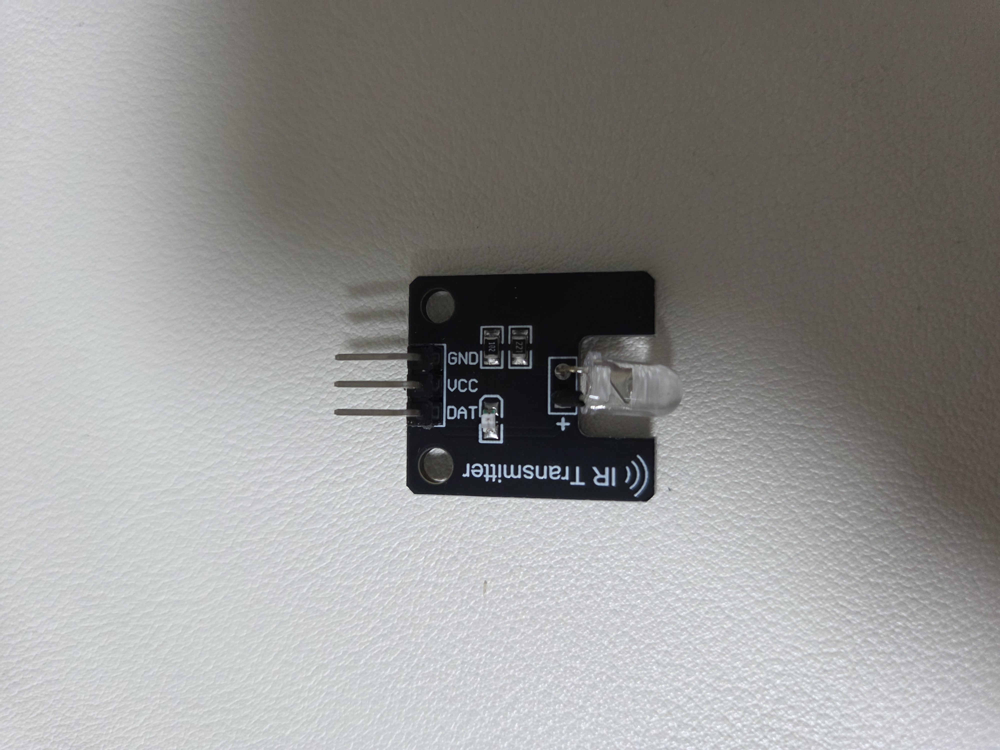
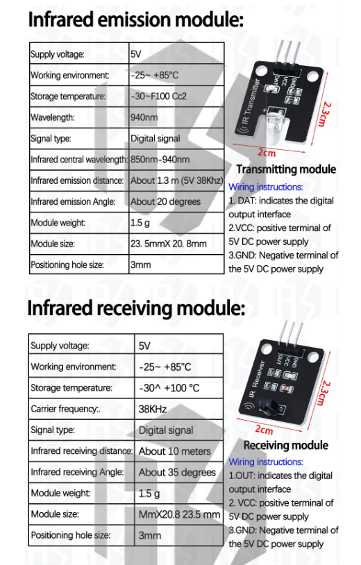

# Step 4 — IR 송신기 구성과 실제 에어컨 제어

> Step 3의 `mock-ir` 어댑터를 GPIO18 기반 실제 송신기로 교체하고, 웹 UI에서 보낸 Carrier
> 명령으로 에어컨이 실제 동작하는 것까지 검증한 과정이다. 제어에 쓰는 것은 수신기가 아니라
> **IR 송신기**다.

## 1. 왜 GPIO에 모듈 DAT를 바로 연결하지 않았나

사용한 IR 송신 모듈은 `VCC`, `GND`, `DAT` 세 핀이 있고 판매 자료에는 5V·38kHz용으로
표시돼 있었다. Raspberry Pi GPIO는 3.3V 로직이며 핀 하나로 IR LED의 순간 전류를 직접
감당하게 해서는 안 된다.

처음에는 `DAT`를 GPIO에 바로 연결하거나 5V 레벨 변환 IC를 쓰는 방안을 검토했다. 그러나
모듈 내부 연결을 완전히 확인하지 못한 상태에서 가장 단순하고 안전하게 제어하기 위해
P2N2222A NPN 트랜지스터로 모듈의 GND를 스위칭했다. GPIO는 트랜지스터 베이스에 작은 전류만
공급한다.

모듈에는 `221` 표기의 IR LED 직렬 저항 약 220Ω과 `102` 표기의 표시 LED 저항 약 1kΩ이
이미 실장돼 있어 모듈 LED에 별도의 직렬 저항은 추가하지 않았다.





## 2. 최종 송신 회로

실제로 사용한 회로는 다음과 같다.

```text
Raspberry Pi 물리 핀 2, 5V ─────┬──── IR 모듈 VCC
                                └──── IR 모듈 DAT

IR 모듈 GND ───────── P2N2222A Collector
P2N2222A Emitter ───── Raspberry Pi GND, 물리 핀 14

BCM GPIO18, 물리 핀 12 ── 1kΩ ── P2N2222A Base
P2N2222A Base ─────────── 10kΩ ── GND
```

`DAT`와 5V를 묶은 이유는 DAT로 파형을 직접 입력하기 위해서가 아니다. 모듈 입력을 활성 상태로
고정하고 트랜지스터가 모듈 전체의 접지 경로를 빠르게 여닫도록 한 로우사이드 스위치 구성이다.
38kHz 반송파와 데이터 envelope는 GPIO18이 트랜지스터를 켜고 끄면서 만든다.

1kΩ 베이스 저항은 GPIO에서 베이스로 흐르는 전류를 제한하고, 10kΩ 저항은 부팅 중 GPIO가
떠 있을 때 트랜지스터가 우연히 켜지는 것을 막는다. 부품명이 같아 보여도 P2N2222A의 C/B/E
배열은 제조사에 따라 다를 수 있으므로 실제 구매 부품의 데이터시트로 핀을 확인해야 한다.

배선은 Pi 전원을 끈 상태에서 구성했고, 외부 5V 전원 대신 Pi의 5V 핀을 사용했다. 이 소형
단일 모듈은 Pi 전원으로 충분했지만 여러 IR LED나 고출력 송신기를 병렬로 늘릴 경우 전원과
트랜지스터 정격을 다시 계산해야 한다.

## 3. Linux 송신 장치 활성화

GPIO18을 Linux LIRC 송신 장치로 만들기 위해 부트 overlay를 추가했다.

```text
dtoverlay=gpio-ir-tx,gpio_pin=18
```

재부팅 뒤 예상과 달리 장치 번호가 바뀌었다.

| 장치 | 실제 기능 |
|---|---|
| `/dev/lirc0` | raw IR 송신 |
| `/dev/lirc1` | raw IR 수신 |

장치 번호를 이름처럼 믿으면 안 된다. `ir-ctl --features`로 `Can send raw`와
`Can receive raw`를 확인해야 한다. 첫 서비스 설정은 송신기를 `/dev/lirc1`로 지정해 API가
안전하게 `available: false`를 반환했다. 실제 기능을 확인한 뒤 `/dev/lirc0`로 고쳐 서비스를
재시작했다.

## 4. Mock 어댑터를 실제 `ir-ctl`로 교체

Step 3까지는 UI 명령이 프로필에서 프레임을 찾은 뒤 Mock 이력에만 기록됐다. 여기에
`IrCtlTransport`를 추가했다.

```text
6바이트 Carrier 프레임
  ↓ MSB 우선 48비트
리더 + pulse/space 데이터 + stop + 프레임 간격
  ↓ 임시 ir-ctl 파일
ir-ctl --send --device=/dev/lirc0
  ↓ GPIO18 / 38kHz
P2N2222A + IR 모듈
```

전송 계층은 다음 안전장치를 포함한다.

- 송신 장치와 raw-send 기능 사전 확인
- 명령 프레임 형식 검증
- 동시에 두 명령이 섞이지 않도록 프로세스 내 잠금
- 임시 파일 정리와 실행 시간 제한
- 최근 100개 명령 이력 제한
- 장치 없음은 HTTP 503, 실행 실패는 HTTP 502
- 실제 `ir-ctl` 성공 이후에만 마지막 요청 상태 갱신

`hardware_output: true`는 운영체제가 송신 요청을 성공적으로 처리했다는 뜻이다. 에어컨이
실제로 받았는지는 IR의 단방향 특성상 별도의 물리 관찰이 필요하다.

## 5. 로컬에서 먼저 검증

하드웨어 없이 검증할 수 있는 부분은 로컬에서 끝냈다.

- `power_off`를 직렬화한 타이밍이 Step 2 캡처 구조와 일치
- 장치 미존재·미지원 기능·실행 오류 처리
- 전송 잠금과 이력 제한
- 전체 테스트 31개 통과
- Ruff 정적 검사와 `compileall` 통과

그 뒤 승인된 배포에서 앱 코드와 서비스 설정을 Pi로 전송하고 SHA-256을 비교했다. GPIO
overlay 추가와 재부팅은 별도 시스템 변경으로 진행했고, 장치 번호를 바로잡는 최소 수정도
다시 승인 후 반영했다.

최종 상태 API는 다음 의미를 갖게 됐다.

```json
{
  "transport": "ir-ctl",
  "device": "/dev/lirc0",
  "available": true,
  "hardware_output": true
}
```

## 6. 첫 실송신: LED는 깜빡였지만 에어컨은 무반응

API로 `power_off` 한 번을 전송했다. 서버 기록에는 38kHz, 2개 프레임, 총 약 179,670µs가
남았고 서비스 오류도 없었다. 모듈의 가시광 표시 LED도 깜빡였다. 하지만 처음에는 에어컨이
반응하지 않았다.

표시 LED 점멸은 GPIO와 모듈 전류가 움직였다는 단서일 뿐, 적외선 광량·방향·반송파가
수신부에 충분히 도달했다는 증거는 아니다. 이때 가능한 원인은 다음과 같았다.

- 송신 LED와 에어컨 수신창의 방향 불일치
- 모듈의 짧은 유효 거리와 좁은 조사각
- 실제 IR LED가 아닌 표시 LED만 확인한 경우
- 반송파 또는 타이밍 오차
- 트랜지스터 핀 배열이나 배선 오류

회로와 서버 로그를 다시 바꾸기 전에 송신기를 에어컨 수신창 가까이 두고 정면으로 향하게
했다. 그러자 같은 명령으로 에어컨이 정상 반응했다. 원인은 파장이 짧아서가 아니라 모듈의
광출력·거리·방향 조건이었다.

## 7. 최종 결과

마지막에는 다음 전체 경로가 실제로 연결됐다.

```text
휴대폰·PC 웹 UI
  ↓ Tailscale : 8001
FastAPI 의미 기반 명령
  ↓ Carrier CS-A061GS 프로필
IrCtlTransport
  ↓ /dev/lirc0 · GPIO18
P2N2222A + 5V IR 송신 모듈
  ↓
Carrier 에어컨 실제 반응
```

이로써 네 단계의 최초 목표인 외부 웹 제어 기반, 기존 리모컨 패킷 학습, 반응형 UI 연결,
실제 에어컨 송신까지 완성됐다.

현재 모듈의 약한 광출력을 개선하려면 에어컨 수신창에 송신기를 고정하거나, 적절한 전류 계산과
트랜지스터 정격을 전제로 고출력 IR LED 여러 개를 사용해야 한다. 소프트웨어에서 같은 명령을
무작정 반복하는 것은 상태 토글 명령을 두 번 실행할 위험이 있어 광학 문제의 해법으로 삼지
않는다.

## 8. 다음 확장

Raspberry Pi가 모든 방의 IR LED를 직접 배선하는 구조는 확장성이 낮다. 후속 설계에서는 Pi를
중앙 두뇌와 로컬 MQTT 브로커로 두고, 각 방에는 `ESP32-H2 + Zigbee + IR` 노드를 배치한다.
노드는 의미 명령이나 검증된 패킷을 받아 IR을 송신하고, 필요하면 온습도·PMS7003 같은 센서도
함께 제공한다. 이 내용은 이번 4편과 분리한 다음 시리즈의 주제다.

## 게시 전 추가할 자료

최종 배선 사진과 실송신 터미널 화면은 아직 `docs/assets`에 보관되지 않았다. 게시 전에는
다음 두 장을 촬영하되 사설 IP와 계정 정보가 보이지 않게 한다.

1. GPIO18·1kΩ·10kΩ·P2N2222A·IR 모듈 전체 배선
2. `/api/v1/ir/transmitter`와 실제 명령 성공 기록

## 원본 기록

- [IR 송신 소프트웨어와 실기 검증](../journal/2026-08-30-ir-transmitter-software.md)
- [IR 모듈 판별·회로·안전 주의](../hardware/ir-modules.md)
- [웹 서비스 운영 절차](../operations/web-service.md)
- [트러블슈팅](../troubleshooting.md)
- [Zigbee IR 노드로 확장할 전송 계층](../architecture/zigbee-ir-node-future.md)
