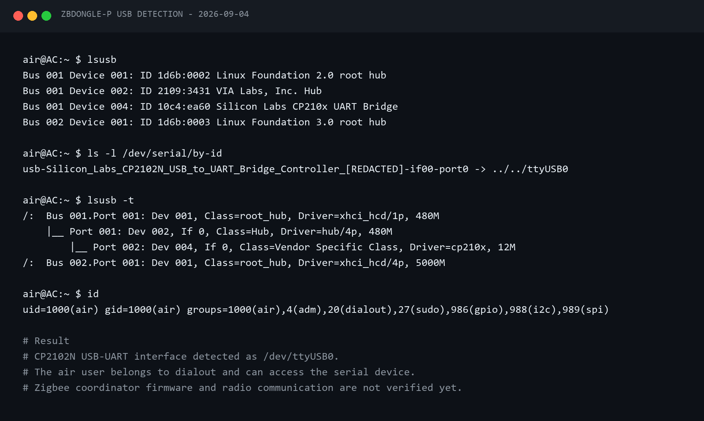
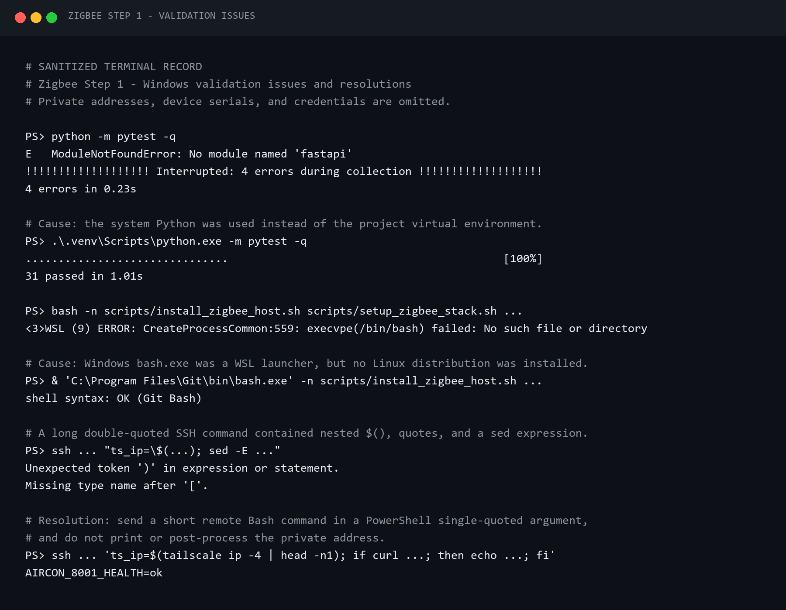
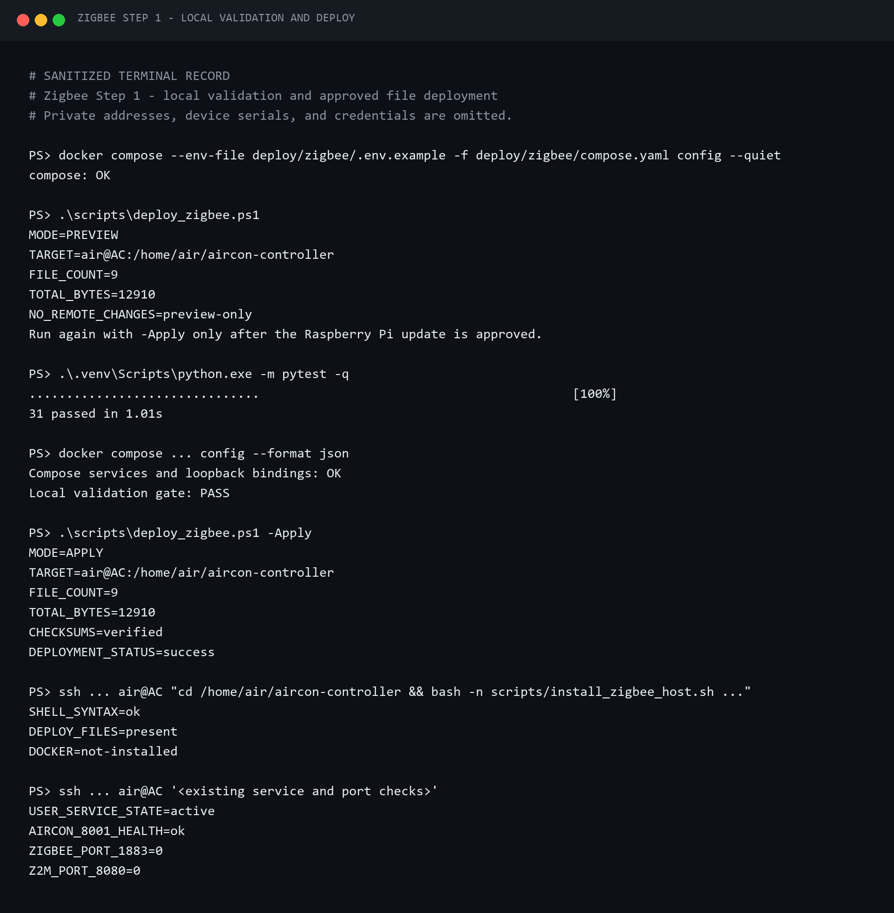
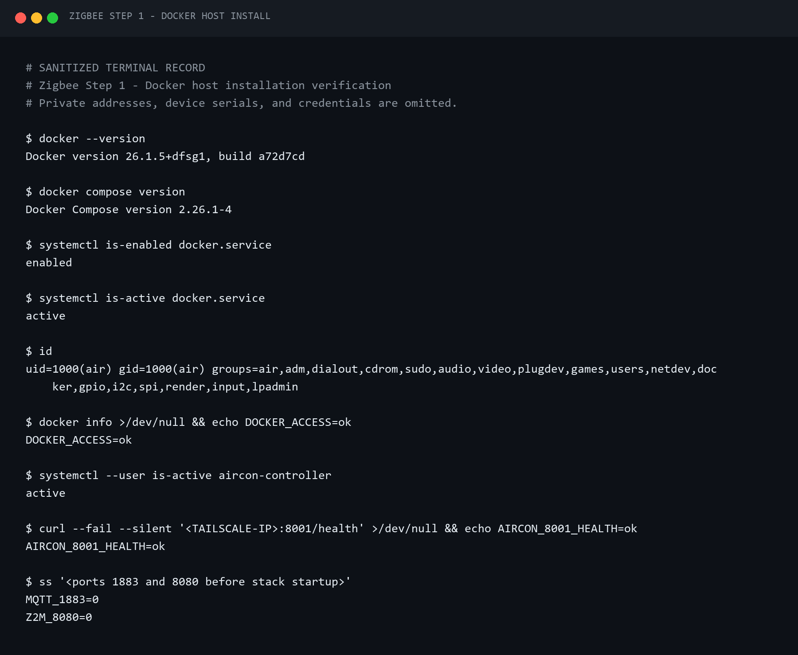
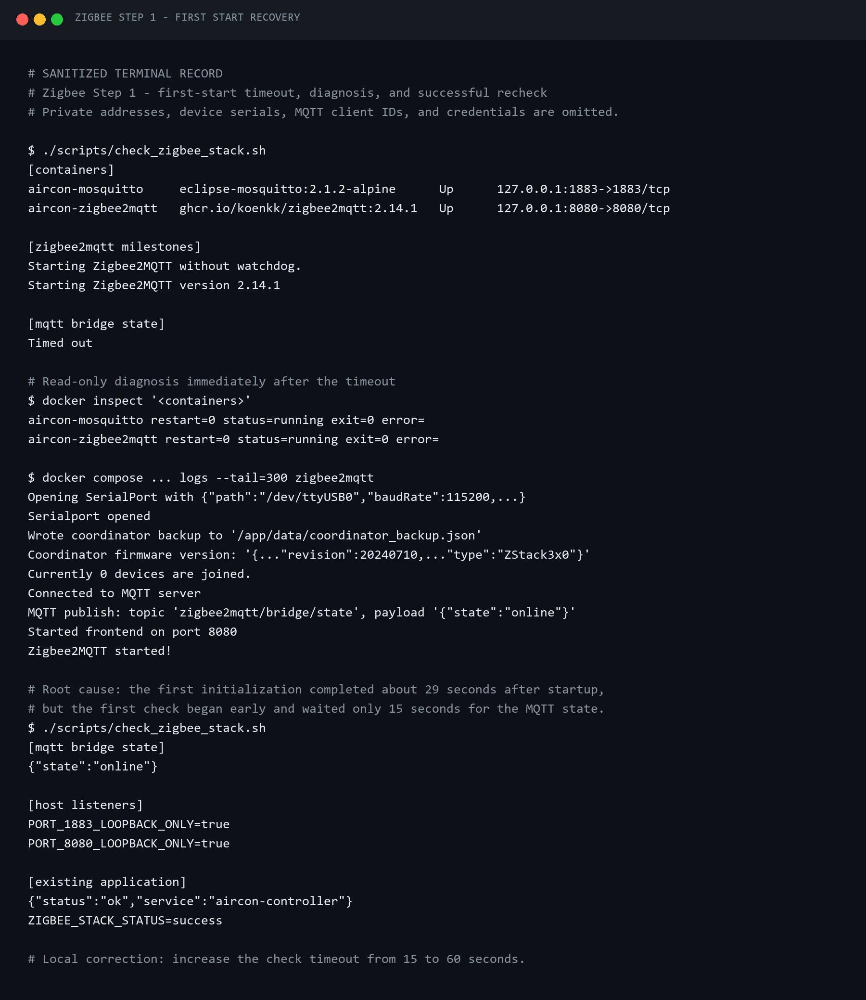
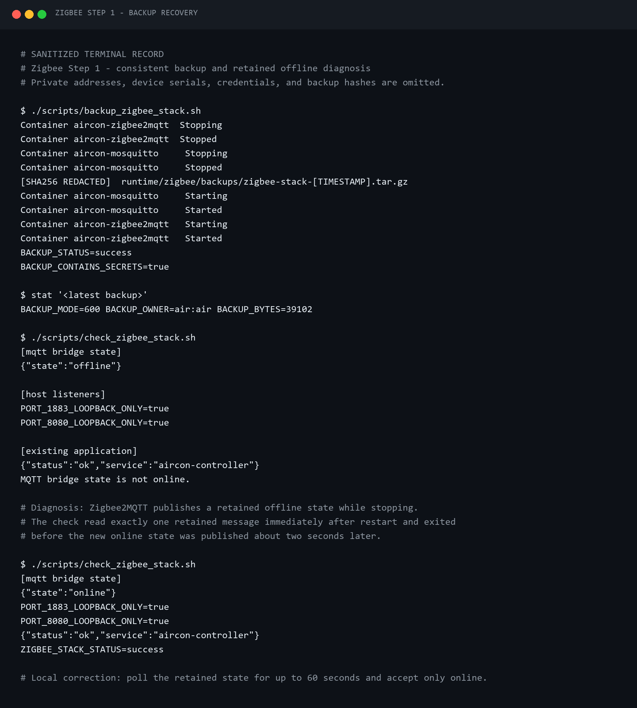
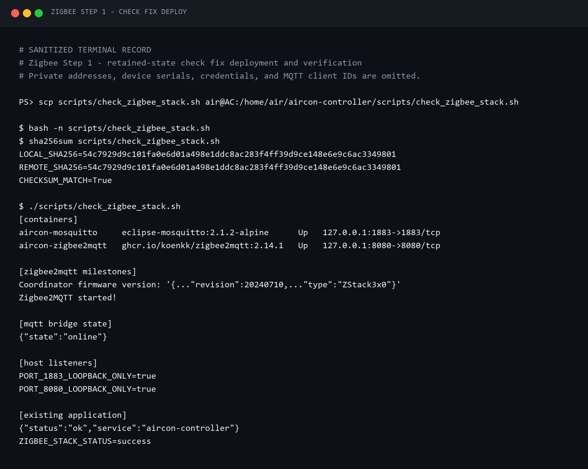
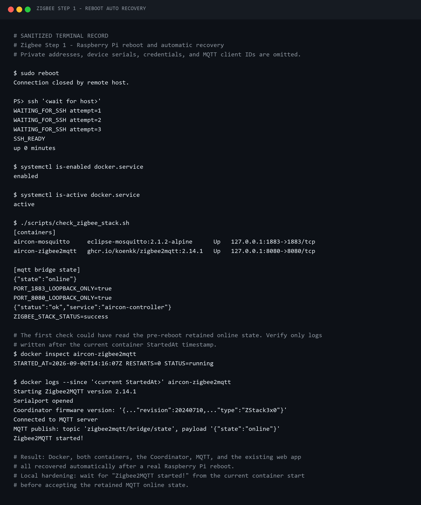
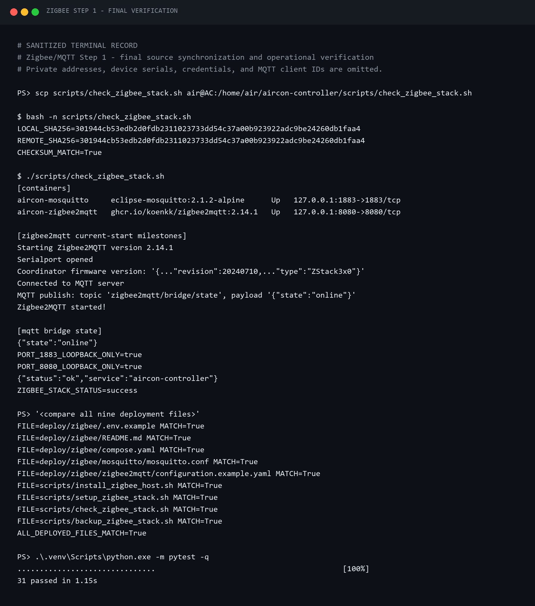

# Raspberry Pi를 Zigbee2MQTT 게이트웨이로 만들기

이 글은 에어컨 원격 제어 프로젝트를 스마트홈 플랫폼으로 확장하는 두 번째 시리즈의
Step 1이다. Raspberry Pi에 SONOFF ZBDongle-P를 연결하고, 로컬 Mosquitto와
Zigbee2MQTT를 설치해 다음 단계에서 상용 Zigbee 센서를 붙일 수 있는 게이트웨이를 만든다.

최종 구성은 다음과 같다.

```text
Zigbee 센서·노드
      │ Zigbee 3.0
      ▼
SONOFF ZBDongle-P
      │ USB serial
      ▼
Zigbee2MQTT ── MQTT ── Mosquitto
      │                    │
      └──── Raspberry Pi ──┘
                  │
                  └─ 기존 FastAPI 스마트홈 서비스 :8001
```

이번 단계에서는 동글 펌웨어를 변경하거나 센서를 페어링하지 않는다. 기존 FastAPI
서비스도 그대로 유지한다. 목표는 Coordinator, MQTT broker, 부팅 자동 복구와 백업까지
안정적으로 준비하는 것이다.

## 1. 시작 전 환경과 설계 선택

테스트 장비는 Debian 13 Trixie arm64가 설치된 Raspberry Pi다. 사전 점검 결과 Docker,
Docker Compose, Mosquitto는 아직 설치되지 않았고, 기존 스마트홈 앱은 포트 8001에서
정상 동작 중이었다. 새로 사용할 1883과 8080 포트에는 충돌이 없었다.

Zigbee2MQTT를 호스트에 직접 설치하지 않고 다음 두 서비스만 Docker Compose로
분리했다.

- Mosquitto `2.1.2-alpine`: 로컬 MQTT broker
- Zigbee2MQTT `2.14.1`: Zigbee와 MQTT 사이의 변환 계층
- 기존 FastAPI: 현재 사용 중인 사용자 systemd 서비스 유지

이 구조를 선택한 이유는 Node.js 의존성을 Raspberry Pi 호스트와 분리하고, 이미지 버전을
고정해 설치와 복구를 반복 가능하게 만들기 위해서다. 정상 동작 중인 FastAPI까지
컨테이너로 옮기는 불필요한 변경도 피할 수 있다.

MQTT 포트와 Zigbee2MQTT 관리 화면은 외부에 공개하지 않았다.

```yaml
ports:
  - "127.0.0.1:1883:1883"  # Mosquitto
  - "127.0.0.1:8080:8080"  # Zigbee2MQTT frontend
```

따라서 Pi 내부 애플리케이션만 MQTT와 관리 화면에 접근한다. 외부에서 사용하는 웹
서비스는 기존과 같이 Tailscale을 통한 8001 포트만 유지한다.

## 2. ZBDongle-P가 제대로 인식됐는지 확인하기

먼저 USB 장치를 꽂고 Pi에서 제조사 ID, 커널 드라이버와 직렬 장치를 확인했다.

```bash
lsusb
lsmod | grep cp210x
ls -l /dev/ttyUSB* /dev/serial/by-id/*
id
```

확인된 핵심 정보는 다음과 같다.

- USB ID: `10c4:ea60`
- USB-UART: Silicon Labs CP2102N
- 커널 드라이버: `cp210x`
- 실제 직렬 장치: `/dev/ttyUSB0`
- 권한: `root:dialout`, 모드 `0660`
- 서비스 사용자: `dialout` 그룹 포함



설정에는 `/dev/ttyUSB0`를 직접 저장하지 않았다. USB를 다시 꽂거나 부팅 순서가 바뀌면
번호가 달라질 수 있기 때문이다. 호스트에서는 `/dev/serial/by-id/...`의 안정적인 경로를
찾고, 컨테이너 안에서만 `/dev/ttyUSB0`으로 매핑했다.

ZBDongle-P는 Texas Instruments Z-Stack 계열이므로 Zigbee2MQTT의 adapter는
`zstack`으로 지정했다.

```yaml
serial:
  port: /dev/ttyUSB0
  adapter: zstack
```

2.4 GHz Wi-Fi가 채널 4를 사용하고 있어 Zigbee는 채널 20으로 시작했다. 채널 변경은
네트워크를 만든 뒤에는 재페어링을 요구할 수 있으므로 초기에 정하는 것이 좋다.

## 3. 재현 가능한 설치 파일 준비하기

저장소에는 다음 파일을 두었다.

```text
deploy/zigbee/
├─ compose.yaml
├─ .env.example
├─ mosquitto/
│  └─ mosquitto.conf
└─ zigbee2mqtt/
   └─ configuration.example.yaml

scripts/
├─ install_zigbee_host.sh
├─ setup_zigbee_stack.sh
├─ check_zigbee_stack.sh
├─ backup_zigbee_stack.sh
└─ deploy_zigbee.ps1
```

코드와 운영 데이터를 분리한 것도 중요한 부분이다. MQTT 비밀번호, Zigbee network key,
frontend token과 Coordinator 상태는 배포 파일에 넣지 않고 Pi의
`runtime/zigbee/`에서 최초 실행 시 생성한다. 이 폴더는 코드 동기화 대상이 아니며,
비밀 파일과 백업은 권한 `600`으로 제한한다.

Mosquitto는 익명 접속을 거부하고 Zigbee2MQTT 전용 계정으로만 연결한다. 컨테이너 로그는
각각 10 MB 파일 3개로 제한해 장기간 운용 시 SD 카드가 로그로 가득 차는 것도 막았다.

## 4. 로컬 검증에서 만난 Windows 함정

Pi에 보내기 전에 Compose 설정, 셸 문법과 기존 Python 테스트를 로컬에서 검사했다. 이때
세 가지 문제가 있었다.

첫째, 시스템 Python으로 `pytest`를 실행하자 `ModuleNotFoundError: fastapi`가 발생했다.
코드 문제가 아니라 프로젝트 가상환경이 아닌 Python을 사용한 것이 원인이었다.

```powershell
.\.venv\Scripts\python.exe -m pytest
```

가상환경으로 실행하자 기존 테스트 31개가 모두 통과했다.

둘째, Windows의 `bash.exe`가 Git Bash가 아니라 WSL 실행기를 가리키고 있었고 설치된
Linux 배포판도 없어 `execvpe(/bin/bash) failed`가 발생했다. Git Bash의 실행 파일을
명시해 네 개의 셸 스크립트를 `bash -n`으로 검사했다.

셋째, PowerShell → `ssh.exe` → 원격 Bash로 긴 명령을 한 줄에 전달할 때 `$()`와
따옴표가 로컬에서 먼저 해석되거나 CRLF가 섞였다. 이후 원칙을 다음처럼 바꿨다.

- 짧은 읽기 명령만 SSH 인수로 직접 전달한다.
- 여러 줄 작업은 LF로 저장한 `.sh` 파일로 만든다.
- 배포 전후 SHA-256을 비교한다.
- PowerShell 안에 원격 Bash 코드를 길게 중첩하지 않는다.



오류 출력을 버리지 않고 남겨둔 덕분에, 같은 인용 문제가 뒤에서 다시 나타났을 때 Pi의
문제가 아니라 Windows 명령 전달 문제임을 빠르게 구분할 수 있었다.

## 5. Preview 후 Raspberry Pi에 배포하기

배포 스크립트는 기본 동작이 preview다. 전송될 파일 수, 크기와 SHA-256만 보여주고
원격 장비는 변경하지 않는다.

```powershell
.\scripts\deploy_zigbee.ps1 `
  -PiHost "<PI_HOST>" `
  -IdentityFile "<SSH_PRIVATE_KEY>"
```

목록을 확인하고 승인한 뒤에만 `-Apply`를 붙인다.

```powershell
.\scripts\deploy_zigbee.ps1 `
  -Apply `
  -PiHost "<PI_HOST>" `
  -IdentityFile "<SSH_PRIVATE_KEY>"
```

이번 배포에서는 Zigbee 관련 파일 9개, 총 12,910바이트만 전송했다. 기존 파일을 삭제하지
않았고, 전송 뒤 원격 SHA-256과 `bash -n`도 통과했다.



이 과정에서 기존 앱 상태를 `systemctl`로 확인했을 때 `inactive`가 보여 잠시 혼동했다.
앱은 시스템 서비스가 아니라 사용자 systemd 서비스였으므로 올바른 명령은 다음과 같다.

```bash
systemctl --user status <SERVICE_NAME>
```

또한 기존 앱은 Tailscale 주소에 바인딩되어 있어 Pi의 `127.0.0.1:8001`로 요청하면
실패하는 것이 정상이다. 실제 바인딩 주소의 `/health`는 정상 응답했다.

## 6. Docker 설치와 사용자 권한

Pi 프로젝트 폴더에서 설치 스크립트를 실행했다.

```bash
sudo ./scripts/install_zigbee_host.sh
```

이 스크립트는 Debian 패키지의 Docker와 Compose를 설치하고 Docker 서비스를 부팅 시
자동 시작하도록 설정한다. 실행 후에는 그룹 변경이 현재 셸에 반영되도록 SSH를 다시
접속했다.

```bash
docker --version
docker compose version
systemctl is-enabled docker.service
systemctl is-active docker.service
id
```

검증 결과 Docker `26.1.5+dfsg1`, Compose `2.26.1-4`가 설치됐고 Docker 서비스는
`enabled`, `active`였다. 사용자도 `docker`, `dialout` 그룹에 포함되어 일반 사용자로
컨테이너와 동글에 접근할 수 있었다.



여기서 `docker` 그룹은 사실상 높은 시스템 권한을 갖는다는 점을 기억해야 한다. 이 Pi는
단일 목적 장비로 운용하고 SSH 접근을 제한했다.

## 7. Zigbee2MQTT 첫 기동과 15초 타임아웃

이제 비밀정보와 런타임 폴더를 만들고 스택을 기동했다.

```bash
./scripts/setup_zigbee_stack.sh
./scripts/check_zigbee_stack.sh
```

첫 점검은 `Timed out`으로 실패했다. 하지만 컨테이너 두 개는 모두 실행 중이고 재시작
횟수도 0이었다. 로그를 더 살펴보니 ZBDongle-P 첫 초기화가 약 29초 걸렸고, 그 뒤에는
다음 과정이 모두 정상적으로 끝났다.

- 직렬 포트 열기
- Coordinator 백업 생성
- 펌웨어 `ZStack3x0`, revision `20240710` 인식
- Mosquitto 인증 연결
- `zigbee2mqtt/bridge/state`에 `online` 발행
- Zigbee2MQTT frontend 시작



원인은 동글이나 권한이 아니라 점검 코드의 15초 제한이었다. 대기시간을 60초로 늘려
첫 기동과 느린 SD 카드 환경에서도 충분히 기다리도록 수정했다.

## 8. 백업 후 retained `offline`을 성공으로 착각하지 않기

Zigbee 네트워크에는 페어링 정보와 network key가 포함된다. SD 카드 장애나 재설치 때
네트워크를 복구하려면 런타임 데이터를 백업해야 한다.

```bash
./scripts/backup_zigbee_stack.sh
```

백업 스크립트는 Mosquitto와 Zigbee2MQTT를 잠시 정지해 일관된 스냅샷을 만든 뒤 다시
시작한다. 생성된 백업은 약 39 KB였고 권한은 `600`이었다. 백업에는 비밀번호와 Zigbee
network key가 포함되므로 블로그 파일이나 저장소에 업로드하면 안 된다.

문제는 재시작 직후 점검에서 나타났다. MQTT 구독이 `offline`을 받았지만 약 2초 뒤에는
`online`이 발행됐다. Zigbee2MQTT가 종료 시 retained `offline`을 저장하고, 기존 점검은
구독 직후 받은 첫 메시지 한 개만 판정했던 것이다.



점검 코드를 최대 60초 동안 반복 조회하고 `online`만 성공으로 인정하도록 고쳤다. 수정한
스크립트 한 파일만 다시 배포하고 체크섬을 확인했다.



## 9. 재부팅 검증과 ‘오래된 online’ 문제

서비스가 지금 실행되는 것만으로는 상시 게이트웨이라고 할 수 없다. Raspberry Pi를 실제로
재부팅한 뒤 Docker, 컨테이너, 동글, MQTT와 기존 8001 앱이 모두 돌아오는지 확인했다.

```bash
sudo reboot
```

재접속 후 Docker는 `enabled`, `active`였고 두 컨테이너와 루프백 포트도 복구됐다. 그러나
retained `online` 한 줄만 보고 성공이라고 판단하면 안 된다. Mosquitto가 재부팅 전에
저장한 오래된 메시지일 수 있기 때문이다.

그래서 현재 컨테이너의 `StartedAt` 이후 로그에서 아래 항목을 확인하도록 점검을 한 번 더
강화했다.

- 현재 부팅에서 직렬 포트가 다시 열렸는가
- Coordinator firmware가 새로 인식됐는가
- MQTT에 다시 연결했는가
- 현재 실행의 `Zigbee2MQTT started!`가 있는가
- 비정상 컨테이너 재시작이 없는가



재부팅 후 약 31초에 Coordinator가 인식됐고 새 `online`이 발행됐다. 기존 FastAPI의
8001 health도 정상으로 돌아왔다.

## 10. 최종 성공 기준

마지막으로 배포 기준 파일 9개의 로컬·Pi SHA-256을 비교했고 모두 일치했다. 기존 Python
테스트 31개도 다시 통과했다.



Step 1의 완료 조건은 다음과 같다.

- [x] ZBDongle-P가 CP2102N 직렬 장치로 인식됨
- [x] 안정적인 `/dev/serial/by-id/...` 경로 사용
- [x] Mosquitto와 Zigbee2MQTT 기동
- [x] 현재 Coordinator 시작 로그와 MQTT `online` 확인
- [x] 1883과 8080을 `127.0.0.1`에만 노출
- [x] MQTT 익명 접속 차단과 비밀정보 분리
- [x] 런타임 백업 생성 및 권한 제한
- [x] Raspberry Pi 재부팅 후 자동 복구
- [x] 기존 FastAPI 8001 서비스 보존

이제 Raspberry Pi는 제조사 클라우드 없이 Zigbee 장치를 받아들이는 로컬 게이트웨이가
됐다. 다음 Step 2에서는 알리에서 구입한 도어 센서와 온습도 센서를 실제로 페어링하고,
MQTT payload와 기기별 특성을 분석한다.

## 참고 자료

- [Zigbee2MQTT 시작 안내](https://www.zigbee2mqtt.io/guide/getting-started/)
- [Zigbee2MQTT Linux 설치 안내](https://www.zigbee2mqtt.io/guide/installation/01_linux.html)
- [Zigbee2MQTT Z-Stack 어댑터 안내](https://www.zigbee2mqtt.io/guide/adapters/zstack.html)

실제 명령과 출력의 원문은 `docs/assets/terminal/23-*.txt`부터 `31-*.txt`까지 보존했고,
세부 실험 기록은 `docs/journal/2026-09-05-zigbee-step1-gateway.md`에 정리했다.
