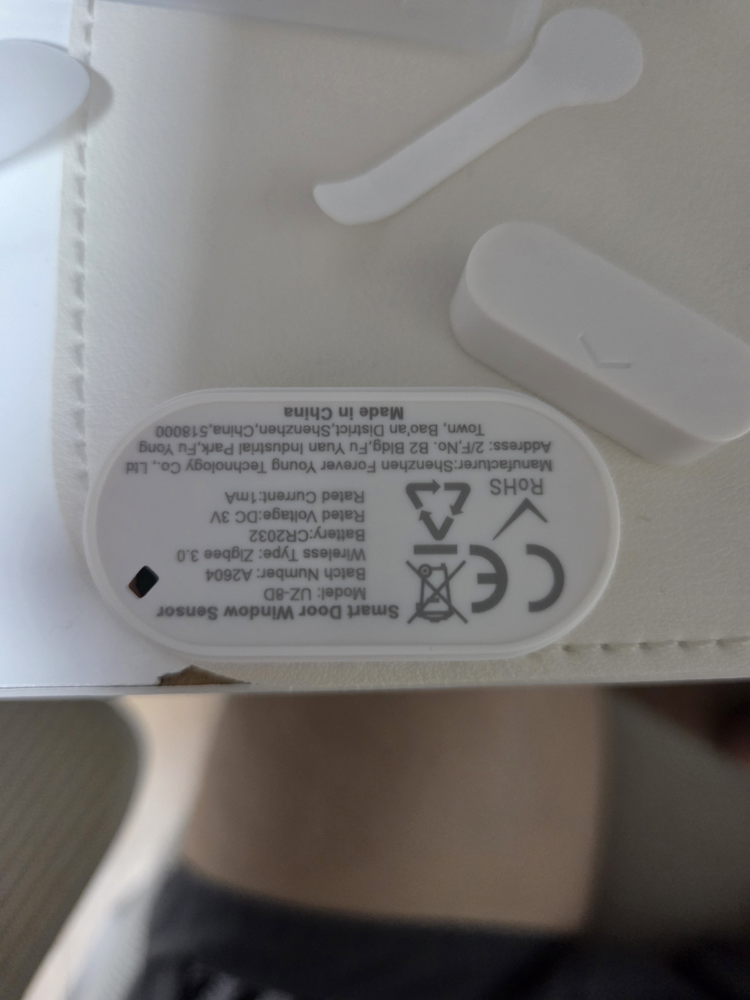
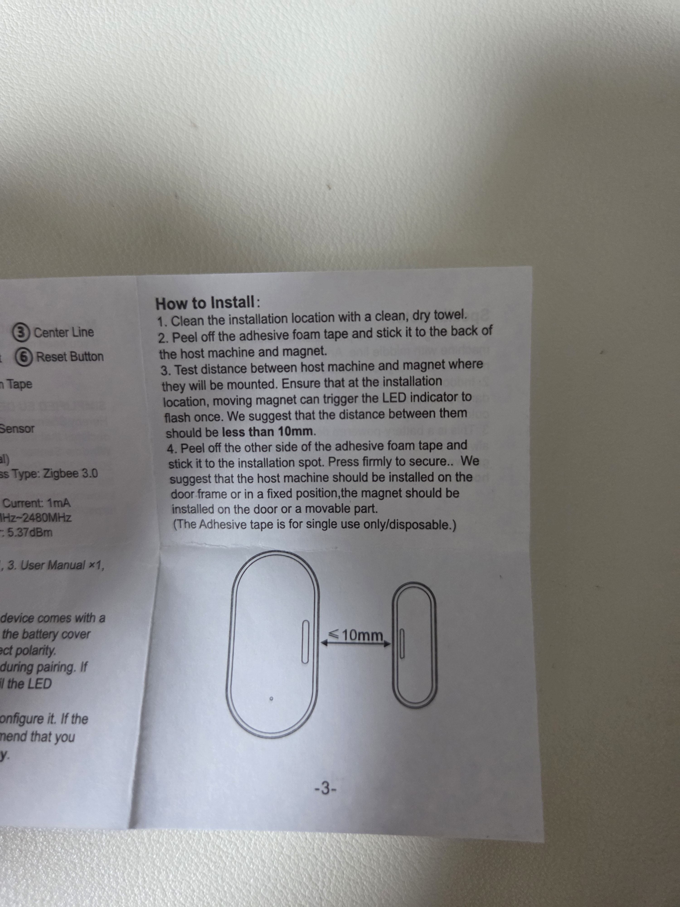
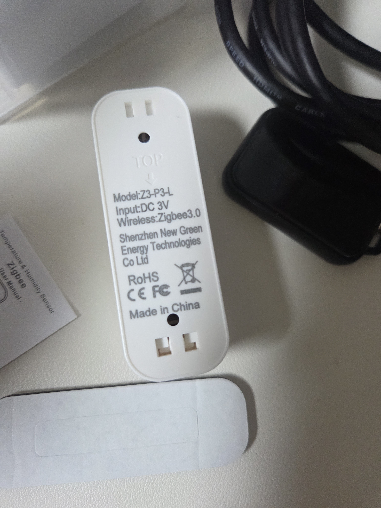
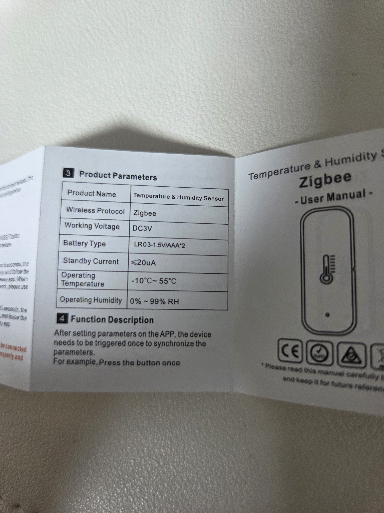
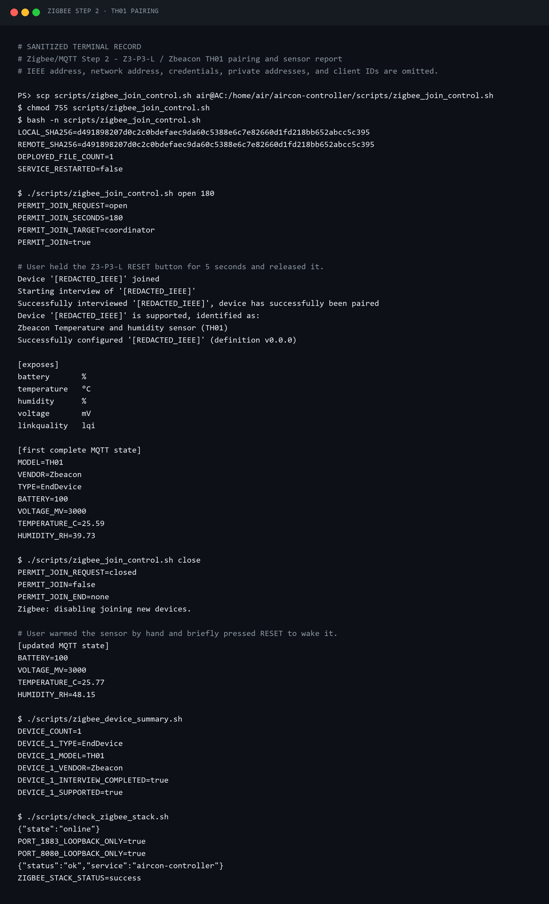
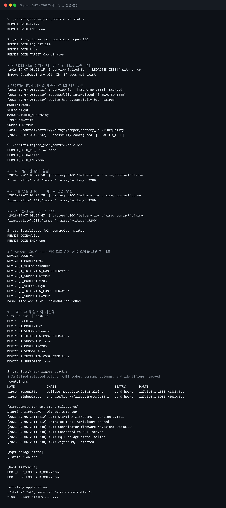
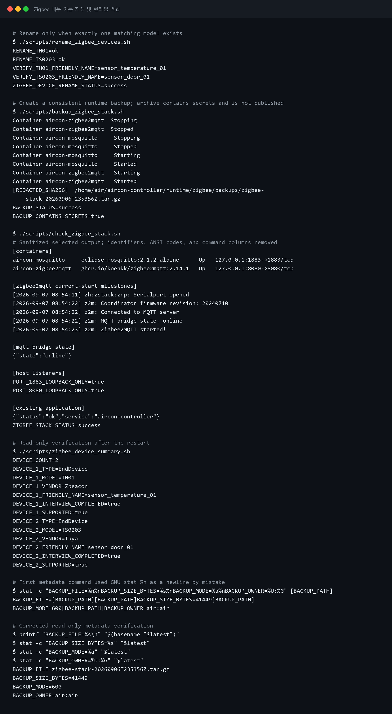
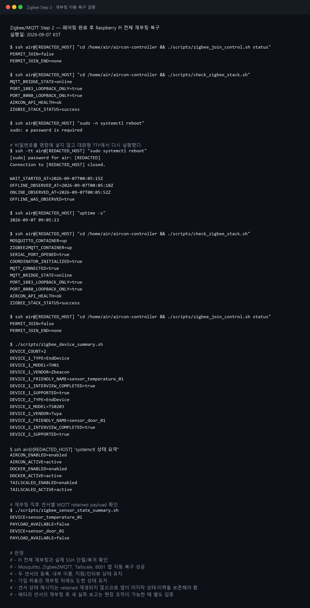

# 알리 Zigbee 온습도·도어 센서를 제조사 클라우드 없이 연결하기

## 이번 편에서 만든 것

앞 편에서 Raspberry Pi, ZBDongle-P, Mosquitto와 Zigbee2MQTT로 로컬 게이트웨이를
구성했다. 이번에는 알리에서 구입한 배터리식 센서 두 개를 제조사 앱이나 클라우드 없이
직접 가입시켰다.

- 실물 `Z3-P3-L` 온습도 센서 → Zigbee에서는 `Zbeacon TH01`
- 실물 `UZ-8D` 도어·창문 센서 → Zigbee에서는 `Wing/TS0203`, Tuya 정의로 지원
- 온도·습도·배터리와 문 열림·닫힘 MQTT 보고 확인
- `contact=true`는 닫힘, `contact=false`는 열림으로 실험 확정
- 내부 이름을 `sensor_temperature_01`, `sensor_door_01`로 고정
- 런타임 백업과 Raspberry Pi 전체 재부팅 후 자동 복구 확인

실제 설치 위치의 장시간 통신 품질과 자동 보고 주기는 대시보드를 구현한 뒤 Step 3
최종 통합시험에서 확인한다. 이 글은 **Step 3 개발을 시작하는 데 필요한 장치 식별과
데이터 계약을 확보한 시점**을 Step 2의 완료 기준으로 삼는다.

## 왜 제조사 앱을 쓰지 않았나

최종 구조에서는 센서가 제조사 클라우드가 아니라 집 안의 Raspberry Pi로 직접 상태를
보내야 한다.

```text
온습도·도어 센서
        ↓ Zigbee
ZBDongle-P Coordinator
        ↓
Zigbee2MQTT
        ↓ 로컬 MQTT
FastAPI → 웹 대시보드
```

센서가 MQTT를 직접 사용하는 것은 아니다. Zigbee2MQTT가 Zigbee 메시지를 로컬 MQTT
토픽으로 변환한다. MQTT 1883과 Zigbee2MQTT 관리 화면 8080은 Raspberry Pi의 loopback
인터페이스에만 열어 두고 인터넷에 공개하지 않았다.

## 준비한 센서

### 도어·창문 센서 UZ-8D



실물 라벨에서 확인한 내용은 Zigbee 3.0, CR2032 3 V, 모델 `UZ-8D`다. 동봉 설명서는
자석과 본체 표시를 맞추고 간격을 10 mm 이하로 설치하라고 안내한다.



### 온습도 센서 Z3-P3-L



실물 라벨은 `Z3-P3-L`, Zigbee 3.0, DC 3 V라고 적혀 있다. 설명서 기준 전원은 AAA
배터리 두 개이고 대기 전류는 20 µA 이하로 표기돼 있다.



여기서 중요한 점은 **제품 껍데기에 적힌 모델명과 Zigbee 네트워크에서 보고되는 모델이
다를 수 있다는 것**이다. 외관 모델명만 보고 지원 여부를 확정하지 않고 실제 인터뷰
결과를 기준으로 판단했다.

## 페어링 전에 확인한 것

페어링을 시작하기 전에 게이트웨이와 기존 에어컨 웹앱이 정상인지 확인했다.

```bash
cd /home/air/aircon-controller
./scripts/check_zigbee_stack.sh
./scripts/zigbee_join_control.sh status
```

성공 기준은 다음과 같았다.

```text
MQTT bridge             online
MQTT 1883               loopback only
Zigbee2MQTT UI 8080     loopback only
기존 8001 API           health ok
permit_join             false
```

장치 가입은 기본적으로 닫아 둔다. 새 장치를 넣을 때만 Coordinator를 대상으로 180초
열고, 성공하거나 실패하면 바로 닫는 방식을 사용했다. 여러 장치를 동시에 초기화하면 어떤
실물이 어떤 Zigbee 주소인지 헷갈릴 수 있으므로 반드시 한 대씩 진행했다.

```bash
./scripts/zigbee_join_control.sh open 180
# 센서 한 대만 페어링
./scripts/zigbee_join_control.sh close
```

## 온습도 센서 페어링

먼저 온습도 센서만 준비하고 가입 창을 열었다. 설명서대로 RESET 버튼을 약 5초 누른 뒤
놓자 가입, 인터뷰와 구성이 한 번에 완료됐다.

```text
외관 모델        Z3-P3-L
Zigbee 모델      TH01
제조사           Zbeacon
장치 유형        배터리 End Device
지원 여부        Zigbee2MQTT 네이티브 지원
제공 기능        battery, temperature, humidity, voltage, linkquality
```

첫 완전한 상태 보고는 다음과 같았다.

```text
온도       25.59 °C
습도       39.73 %RH
배터리     100 %
전압       3000 mV
```

가입 성공만으로 센서가 실제 값을 보고한다고 단정하지 않았다. 센서를 손으로 감싸고 버튼을
짧게 눌러 깨우자 온도 25.77 °C, 습도 48.15 %RH로 값이 바뀌었다. 온도와 습도가 실제
자극에 반응해 MQTT까지 전달되는 것을 확인한 것이다.



## 도어센서 첫 인터뷰 실패

도어센서는 첫 시도에서 제조사 문자열 `Wing`이 보인 직후 네트워크를 떠났고 인터뷰가
실패했다.

```text
Interview failed
Error: DatabaseEntry with ID '3' does not exist
```

인터뷰가 참조하던 임시 데이터베이스 항목보다 장치가 먼저 사라진 상황으로 판단했다.
데이터베이스를 손으로 수정하거나 서비스를 재시작하지 않았다. 가입 시간이 남아 있는 동안
RESET을 표시등이 깜박일 때까지 약 5초 다시 눌렀다. 두 번째 시도에서는 인터뷰와 구성이
정상 완료됐다.

```text
외관 모델        UZ-8D
Zigbee 모델      TS0203
manufacturer     Wing
장치 유형        배터리 End Device
지원 여부        Tuya Door/window sensor 네이티브 정의
제공 기능        contact, battery, voltage, tamper, battery_low, linkquality
```

이 경험으로 얻은 교훈은 두 가지다.

1. 설명서에 적힌 제품군 모델명만으로 Zigbee 변환기를 미리 고르지 않는다.
2. 첫 인터뷰 실패만으로 미지원 장치라고 판단하지 말고, 장치를 다시 페어링 모드로 깨워
   한 번 더 인터뷰한다.

## `contact` 값은 직접 확인해야 한다

`contact`라는 이름만 보고 `true=열림`이라고 추측하면 자동화가 반대로 동작할 수 있다.
자석을 실제로 붙이고 떼면서 MQTT 값을 비교했다.

| 실제 상태 | 자석 조건 | MQTT `contact` |
|---|---|---:|
| 열림 | 본체에서 2~3 cm 이상 떨어짐 | `false` |
| 닫힘 | 표시를 맞추고 10 mm 이내 | `true` |
| 다시 열림 | 다시 떨어뜨림 | `false` |

따라서 이 장치에서는 `true=닫힘`, `false=열림`으로 확정했다. 대시보드와 자동화 계층은
원시 불리언을 그대로 보여주지 않고 `open/closed`라는 의미 기반 상태로 변환한다.



## Windows CRLF 문제도 만났다

장치 정보를 공개 가능한 형태로 요약하는 로컬 Bash 스크립트를 PowerShell 파이프로 Pi에
전달한 첫 실행은 정상 결과 뒤에 다음 오류를 남겼다.

```text
bash: line 45: $'\r': command not found
```

PowerShell이 전달한 Windows CR 문자가 원격 Bash 입력 끝에 포함된 것이 원인이었다.
원격에서 표준입력의 CR을 제거한 뒤 실행해 해결했다.

```bash
tr -d '\r' | bash -s
```

이것은 센서나 Zigbee 네트워크 문제가 아니라 개발 PC와 Linux 사이의 개행 차이였다.
실제 배포 파일은 계속 LF와 SHA-256 검증을 사용한다.

## 내부 이름 고정과 백업

IEEE 주소를 UI나 코드의 기기명으로 쓰지 않았다. Zigbee 통신에 사용할 안정적인 내부
이름과 사용자가 보는 이름을 분리했다.

| 장치 | 내부 이름 | 향후 UI 표시 예시 |
|---|---|---|
| TH01 | `sensor_temperature_01` | 거실 온습도 |
| TS0203 | `sensor_door_01` | 현관문 |

이름 변경 후 Zigbee2MQTT를 다시 시작해 이름이 유지되는지 확인했다. 이어서 Coordinator,
Zigbee2MQTT와 Mosquitto 런타임 백업을 만들었다. 백업에는 네트워크 키와 MQTT 인증정보가
포함될 수 있으므로 권한을 `600`으로 제한하고 저장소나 블로그에 올리지 않는다.



## Raspberry Pi 전체 재부팅 검증

마지막으로 컨테이너 재시작이 아니라 Raspberry Pi 전체를 재부팅했다. 최초 비대화식
재부팅은 `sudo: a password is required`로 실패했다. 비밀번호를 명령줄에 넣지 않고 SSH
TTY의 `sudo` 프롬프트에만 입력해 다시 실행했다.

실제 SSH 단절을 관찰한 뒤 약 34초 만에 다시 접속됐다. 현재 부팅의 로그를 기준으로 다음을
확인했다.

- Mosquitto와 Zigbee2MQTT 컨테이너 자동 시작
- ZBDongle-P 직렬 포트와 Coordinator 초기화 성공
- MQTT bridge `online`
- Tailscale과 8001 에어컨 웹앱 자동 복구
- 두 센서의 등록·내부 이름·지원 상태 유지
- `permit_join=false` 유지

재부팅 직후 센서별 MQTT 토픽에서는 직전 상태가 retained 메시지로 재생되지 않았다.
배터리식 센서가 그 순간 새 보고를 보낸다는 보장도 없다. Step 3에서는 FastAPI가 마지막
센서 상태와 도어 상태 전환 이력을 SQLite에 보존하고, `마지막 실제 보고 시각`과 저장된
값을 구분해 보여주기로 했다.



## 보안상 공개하지 않은 값

재현용 TXT와 PNG에는 다음 정보를 제거하거나 `[REDACTED]`로 바꿨다.

- Zigbee IEEE 주소와 네트워크 주소
- Coordinator 고유 ID
- MQTT 비밀번호와 Zigbee 네트워크 키
- SSH 키와 비밀번호
- 사설 IP와 Tailscale IP

공개 글의 명령은 구조와 성공 판단 기준을 보여주지만 각자의 인증정보는 직접 생성해야
한다.

## Step 2 완료와 이관 항목

이번 단계에서 다음 데이터 계약을 확정했으므로 FastAPI와 대시보드 개발을 시작할 수 있다.

- 온습도: `temperature`, `humidity`, `battery`, `voltage`, `linkquality`
- 도어: `contact`, `battery`, `voltage`, `tamper`, `battery_low`, `linkquality`
- 접점 의미: `true=closed`, `false=open`
- 내부 ID: `sensor_temperature_01`, `sensor_door_01`

다음 항목은 숨기지 않고 Step 3 마지막의 현장 통합시험으로 이관한다.

- 재부팅 뒤 도어 열기·닫기와 TH01 버튼으로 새 보고가 다시 들어오는지 확인
- 실제 설치 위치의 링크 품질과 도어 이벤트 누락률
- 온습도·배터리 자동 보고 주기와 변화 임계값

## 다음 편

Step 3에서는 MQTT 원문을 FastAPI의 공통 센서 상태로 변환하고 다음 기능을 구현한다.

- 문 열림·닫힘 발생 시각과 이력 저장
- `07:00–19:00` 자동 갱신 금지와 항상 가능한 수동 갱신
- 사용자가 바꿀 수 있는 자동 갱신 시간·간격
- 모바일, PC와 13인치 터치 대시보드
- SSH 없이 사용할 수 있는 `Zigbee 센서 추가` 마법사
- 문이 열린 채 에어컨이 켜진 상황 같은 로컬 자동화

## 참고 자료

- [Zigbee2MQTT 지원 기기 목록](https://www.zigbee2mqtt.io/supported-devices/)
- [Zbeacon TH01](https://www.zigbee2mqtt.io/devices/TH01.html)
- [Tuya TS0203](https://www.zigbee2mqtt.io/devices/TS0203.html)
- [Zigbee2MQTT 장치 페어링](https://www.zigbee2mqtt.io/guide/usage/pairing_devices.html)
- [새 장치 지원 절차](https://www.zigbee2mqtt.io/advanced/support-new-devices/01_support_new_devices.html)
