# FastAPI 스마트홈 UI에 Zigbee 센서와 자동화 연결하기

> Zigbee/MQTT 스마트홈 확장 시리즈의 Step 3이다. MQTT 수신·정규화·저장·REST API,
> 반응형 센서 UI, SSE 실시간 전달, 서버측 센서 설정, 시간 제한 페어링, 첫 경고 자동화와
> Raspberry Pi 터치 키오스크까지 운영 Pi v0.7.0에 배포했다. 실제 문 전환과 경고 발생·해제
> 현장시험은 아직 남아 있으므로 검증한 범위와 남은 범위를 글 끝에서 구분한다.

## 이번 편에서 완성한 것

- Zigbee2MQTT의 모델별 원시 값을 에어컨 UI와 분리된 센서 도메인으로 변환했다.
- 마지막 센서 상태, 사용자 지정 이름·공간·아이콘과 문 전환 이력을 SQLite에 저장했다.
- REST로 최초 상태를 읽고 SSE로 바뀐 센서만 갱신하는 반응형 대시보드를 만들었다.
- 한국 시간 기준 도어 이력과 온습도 자동·수동 화면 갱신 정책을 구현했다.
- 웹에서 30·60·120초 동안만 Zigbee 가입을 허용하고 자동으로 다시 닫도록 했다.
- 문이 열린 채 에어컨이 켜진 상태가 지속되면 경고와 이력을 남기는 첫 자동화를 추가했다.
- Raspberry Pi OS Lite에서 Cage와 Chromium만 사용하는 13인치 터치 키오스크를 구성했다.

완성 화면은 휴대폰에서는 앱처럼 한 열로, PC와 13인치 화면에서는 넓은 대시보드로 열린다.
외부 접속은 공용 포트포워딩 없이 기존 Tailscale 사설망과 8001 포트를 그대로 사용한다.

## 출발점

앞 편에서 두 센서를 Zigbee2MQTT에 연결하고 실제 데이터 계약을 확인했다.

```text
sensor_temperature_01 → temperature, humidity, battery, voltage, linkquality
sensor_door_01        → contact, battery, voltage, tamper, battery_low, linkquality
```

웹 UI가 이 원시 필드를 직접 사용하면 나중에 센서 모델을 바꿀 때 화면까지 수정해야 한다.
그래서 MQTT 수신, 의미 변환, 저장과 API를 별도 계층으로 나눴다.

```text
Zigbee2MQTT
  → PahoSensorBridge
  → SensorService
  → SensorStore(SQLite)
  → FastAPI REST
  → SSE + 반응형 대시보드
```

구현 파일도 같은 경계를 따른다.

```text
app/integrations/mqtt.py    MQTT 연결·구독·Zigbee2MQTT 제어 응답
app/sensors/service.py     원시 payload 검증·의미 변환·상태 병합
app/sensors/store.py       센서 상태·메타데이터·도어 이력 SQLite
app/automations/           서버에서 계속 동작하는 규칙과 이력
app/events.py              브라우저로 보내는 SSE 이벤트 허브
app/static/sensors.js      센서 카드·상세·페어링·부분 갱신
app/static/automations.js  자동화 설정·경고·이력 화면
```

UI가 Zigbee2MQTT 토픽을 직접 알지 않게 한 것이 핵심이다. 이후 다른 제조사의 센서를
추가해도 변환 계층만 확장하고 화면은 같은 `door_state`, `temperature_c` 같은 의미를 쓴다.

## 접점 값을 의미로 바꾸기

Step 2 실험에서 `contact=true`는 닫힘, `false`는 열림이었다. API에서는 이를 각각
`closed`, `open`으로 바꾼다. 제조사별 원시 필드 차이를 UI까지 끌고 가지 않기 위해서다.

온도와 습도도 `temperature_c`, `humidity_percent`처럼 단위가 드러나는 이름으로
정규화했다. 배터리만 따로 들어오는 부분 보고는 이전 문 상태와 병합한다.

## 문 이벤트가 중복되지 않게 저장하기

현재 상태와 발생 이력은 같은 것이 아니다. 첫 `closed` 보고는 기준 상태일 뿐 문이 방금
닫힌 증거가 아니므로 이력으로 만들지 않는다. 이후 값이 실제로 달라질 때만 이벤트를
추가한다.

```text
closed → closed  이력 없음
closed → open    열림 이벤트
open   → open    이력 없음
open   → closed  닫힘 이벤트
```

마지막 상태와 append-only 도어 이벤트는 `runtime/sensors/sensors.sqlite3`에 저장한다.
코드 배포와 런타임 DB가 분리돼 앱을 업데이트해도 이력이 삭제되지 않는다.

## MQTT 재연결

Paho MQTT 2.x의 Callback API VERSION2를 사용했다. FastAPI가 시작될 때 백그라운드
네트워크 루프를 시작하고 연결 성공 콜백에서 센서 토픽을 구독한다. 연결이 끊겼다가
복구되면 같은 콜백이 다시 실행돼 구독도 복원된다.

MQTT 자격정보는 코드나 저장소에 넣지 않았다. Pi에 이미 있는 Zigbee2MQTT 런타임 비밀에서
필요한 값만 `runtime/app.env`로 옮기고 권한을 `600`으로 제한했다.

웹에서 사용하는 주요 API는 다음과 같다.

| API | 역할 |
| --- | --- |
| `GET /api/v1/sensors/status` | MQTT 연결 상태와 저장 센서 수 |
| `GET /api/v1/sensors` | 모든 센서의 마지막 정규화 상태 |
| `GET /api/v1/sensors/{id}/events` | 도어 열림·닫힘 이력 |
| `PATCH /api/v1/sensors/{id}/metadata` | 이름·공간·아이콘 저장 |
| `POST /api/v1/zigbee/join` | 제한 시간 동안 새 기기 가입 허용 |
| `DELETE /api/v1/zigbee/join` | 가입 즉시 닫기 |
| `GET /api/v1/events` | 센서·기기·자동화 SSE 스트림 |
| `GET /api/v1/automations`, `PATCH /api/v1/automations/{id}` | 자동화 상태 조회·설정 |

## TH01에서 강제 갱신이 안 되는 이유

Zigbee2MQTT의 현재 `Zbeacon TH01` 정의는 temperature, humidity, battery, voltage를
공개하지만 모두 `/get` 읽기를 지원하지 않는다. 따라서 앱이 정해진 시간마다 센서를
강제로 깨워 새 측정을 받을 수는 없다.

대시보드의 자동 갱신은 센서 송신 주기가 아니라 서버가 이미 받은 최신값을 화면에
반영하는 주기로 구현한다. 수동 갱신도 서버의 최신 저장값을 즉시 다시 읽는 기능이라고
표시한다. 센서의 자율 보고는 화면 갱신 설정과 무관하게 계속 저장한다.

## 로컬과 Pi 검증

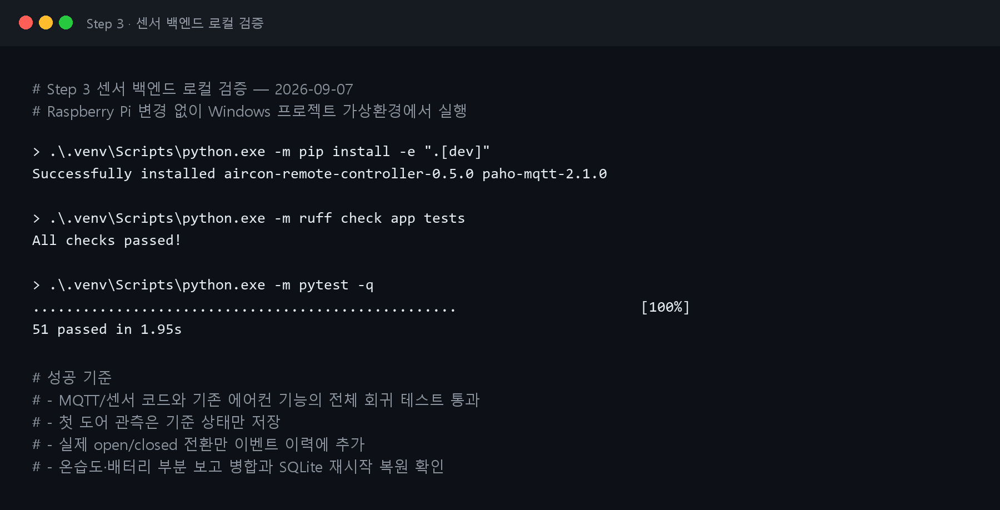

로컬 정적 검사와 기존 에어컨 기능을 포함한 51개 테스트가 모두 통과했다. 승인된 11개
파일만 Pi에 전송하고 원격 SHA-256을 검증한 뒤 서비스를 재시작했다.

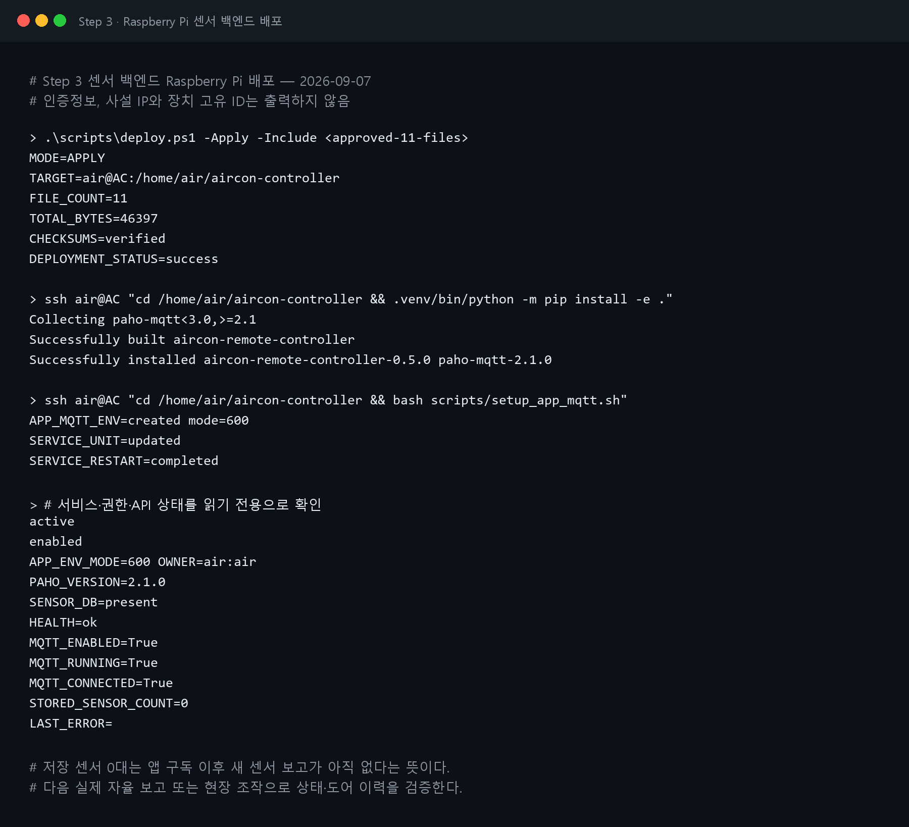

MQTT 연결과 SQLite 생성은 성공했다. 배포 직후 저장 센서 수는 0이었다. 앱 구독 이후
배터리 센서가 아직 새 보고를 보내지 않았기 때문이다. 다음 자율 보고 또는 현장 조작 전에는
실제 센서 통합이 성공했다고 단정하지 않는다.

## 센서 대시보드 첫 화면

기존 스마트홈 홈 화면의 `장면 먼저` 구조는 유지하고, 빠른 장면 아래에 `집 상태`를
추가했다. 저장된 센서 종류를 보고 카드가 자동으로 달라진다.

- 문 센서 카드는 현재 열림·닫힘과 마지막 상태 변경 시각을 보여준다.
- 상세 화면에서는 최근 20개 열림·닫힘 전환을 시간순으로 확인한다.
- 온습도 카드는 온도·습도·배터리와 마지막 보고 시각을 보여준다.
- MQTT가 끊겼거나 아직 보고가 없을 때도 성공 화면처럼 꾸미지 않고 별도 상태를 표시한다.

온습도 자동 화면 갱신은 기본적으로 한국 시간 `07:00~19:00` 동안 멈추고, 그 밖의 시간에는 5분 간격으로
서버의 최신 저장값을 읽는다. 사용자가 금지 시간, 간격과 사용 여부를 바꿀 수 있고 수동
새로고침은 항상 가능하다. 이 설정은 센서 측정 주기를 바꾸거나 Sleepy End Device를
강제로 깨우지 않는다.

센서 추가·관리 화면은 Zigbee2MQTT에서 발견한 센서를 목록으로 보여주고 이름, 공간과
아이콘을 정하게 했다. 표시 설정은 브라우저 로컬 저장소가 아니라 서버 SQLite의
`sensor_metadata`에 보존한다. 따라서 휴대폰, PC와 벽면 키오스크가 같은 이름과 공간을
공유하고 앱 재시작 뒤에도 유지된다.

같은 화면에서 Zigbee 가입을 30초, 60초 또는 120초 동안만 허용할 수 있다. FastAPI는
Zigbee2MQTT의 `bridge/request/permit_join`에 transaction을 붙여 요청하고 대응하는
`bridge/response/permit_join`을 기다린다. `bridge/info`의 종료 시각으로 남은 시간을
계산하고, 창을 닫거나 취소할 때는 즉시 0초 요청을 보내 가입을 막는다. 제한 시간이 끝나도
Zigbee2MQTT가 자동으로 닫는다. Coordinator는 목록에서 제외하고, 새 기기의 인터뷰와 지원
여부만 보여 준다.

로컬 개발 환경처럼 MQTT가 비활성화된 서버에서는 연결 시작 버튼을 비활성화해 성공한
것처럼 보이지 않게 했다. 테스트 중 SQLite의 `Row`에 `"column" in row`를 사용하면 열 이름이
아니라 값 포함 여부를 검사한다는 점 때문에 메타데이터가 `null`로 직렬화되는 버그도
발견했다. `row.keys()`를 집합으로 만든 뒤 열 존재를 확인하도록 고치고 재시작 영속성까지
회귀 테스트에 넣었다.

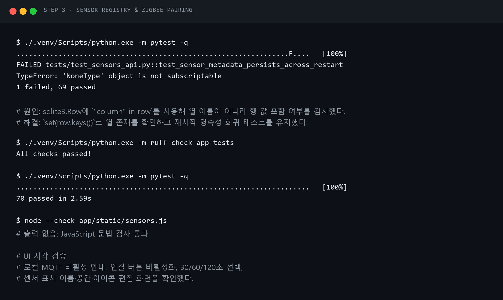

승인된 배포에서는 위 기능 파일 8개만 전송하고 체크섬을 검증했다. 실제 운영 MQTT에서
가입을 30초로 열었다가 즉시 닫았고, 시험 전후 기기 수가 2개로 같음을 확인했다. 운영
화면에도 가입 차단 상태와 기존 센서 2대가 표시됐다. 런타임 DB와 Zigbee 네트워크 설정은
배포하지도 초기화하지도 않았다.

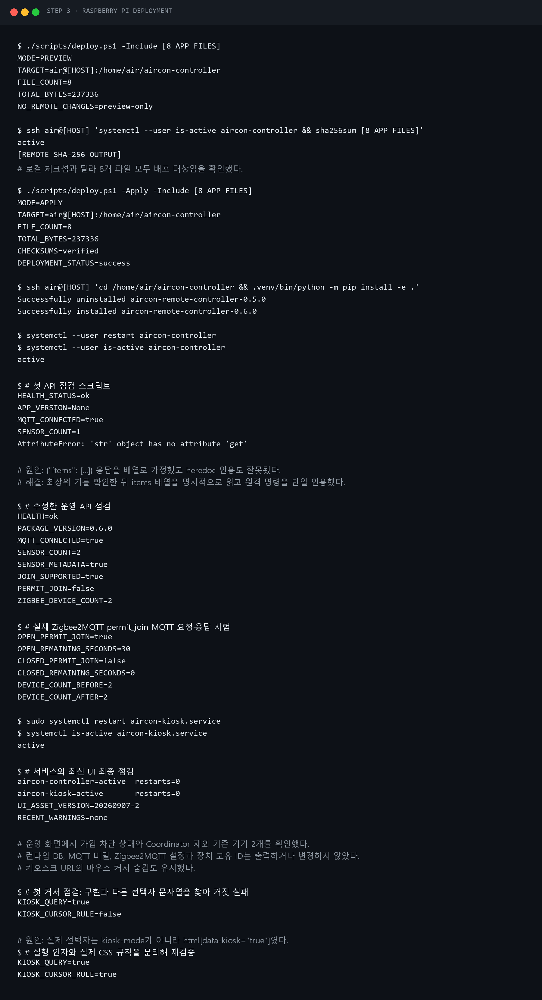

## Raspberry Pi 배포에서 생긴 검증 주소 문제

정적 UI 파일을 배포하고 서비스를 재시작한 뒤 처음에는 `127.0.0.1:8001`로 확인했다.
모든 요청이 실패해 서비스 문제처럼 보였지만 실제 Uvicorn 프로세스와 8001 리스닝 소켓은
정상이었다. 서버가 모든 인터페이스나 루프백이 아니라 Tailscale 주소에만 바인딩되어 있었기
때문이다. 실제 리스닝 주소로 다시 확인하자 루트 화면과 센서 CSS·JavaScript가 모두 HTTP
200을 반환했고 MQTT 연결과 두 센서의 저장 상태도 확인됐다.

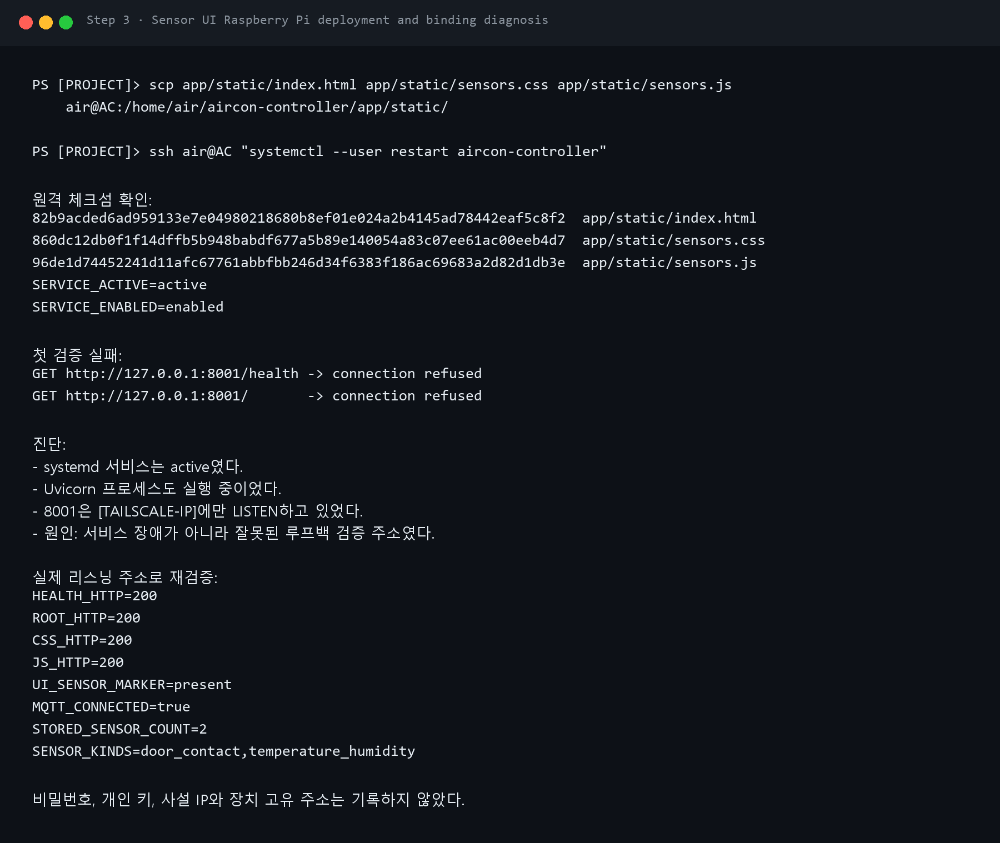

Lite OS에 13인치 화면만 연결하면 브라우저가 아니라 콘솔이 표시된다. 그래서 전체
데스크톱 대신 Cage Wayland 컴포지터와 Chromium만 설치했다. 별도 systemd 서비스가
디스플레이 연결, Tailscale 주소와 API health를 기다린 뒤 Pi 자신의 Tailscale 주소를
전체화면으로 연다.

첫 서비스 시작에서는 키오스크가 `tty1`의 기존 getty보다 먼저 시작돼, getty 종료 때의
`SIGHUP`을 받고 즉시 끝나는 순서 경쟁이 있었다. `After=getty@tty1.service`를 명시해
콘솔을 먼저 종료하도록 고쳤다. 수정 후 서비스는 `active`, 재시작 0회였고 화면이 연결되지
않은 현재는 5초 간격으로 안전하게 기다린다.

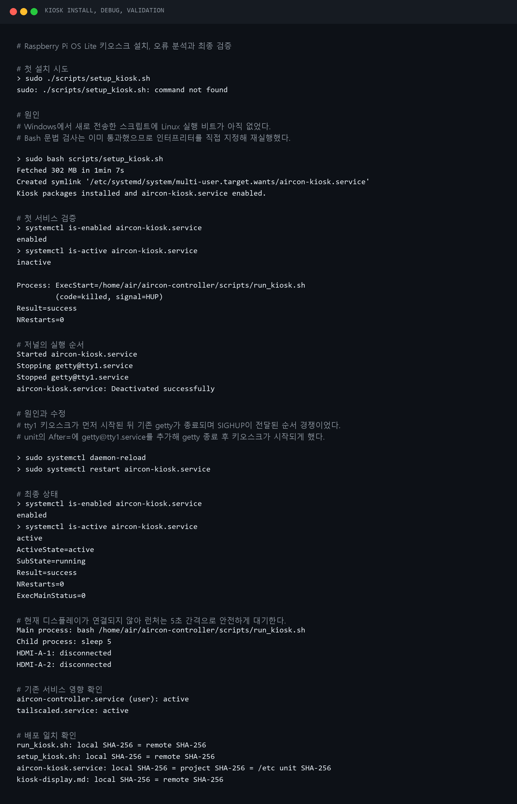

실제 13인치 화면 출력과 터치·회전·절전은 디스플레이를 연결한 뒤 이어서 확인한다.

실제 화면을 연결한 첫 부팅에서는 cloud-init 완료 문구가 남았다. HDMI의 1920×1200 모드와
USB 터치 입력은 인식됐고 Pi와 웹 서비스도 정상이라 부팅이나 케이블 문제는 아니었다.
키오스크 서비스가 active여도 Cage 아래 Chromium과 Wayland 소켓이 없다는 점이 핵심이었다.

로그인 세션 쪽 로그에서 Cage의 `Unable to open Wayland socket` 오류를 찾았다. 서비스의
`ProtectSystem=strict`는 유지하되 `/run/user/1000`만 쓰기 예외로 열고, Mesa와 Chromium
캐시는 프로젝트 런타임 폴더로 옮겼다. 재배포 후 `wayland-0` 소켓과 Cage 아래 Chromium
프로세스가 생겼고 서비스는 재시작 없이 유지됐다. Tailscale 경유 health도 200이었다.

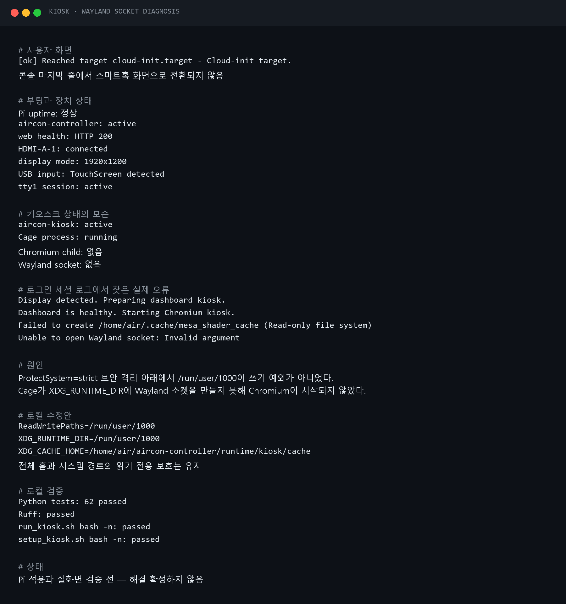

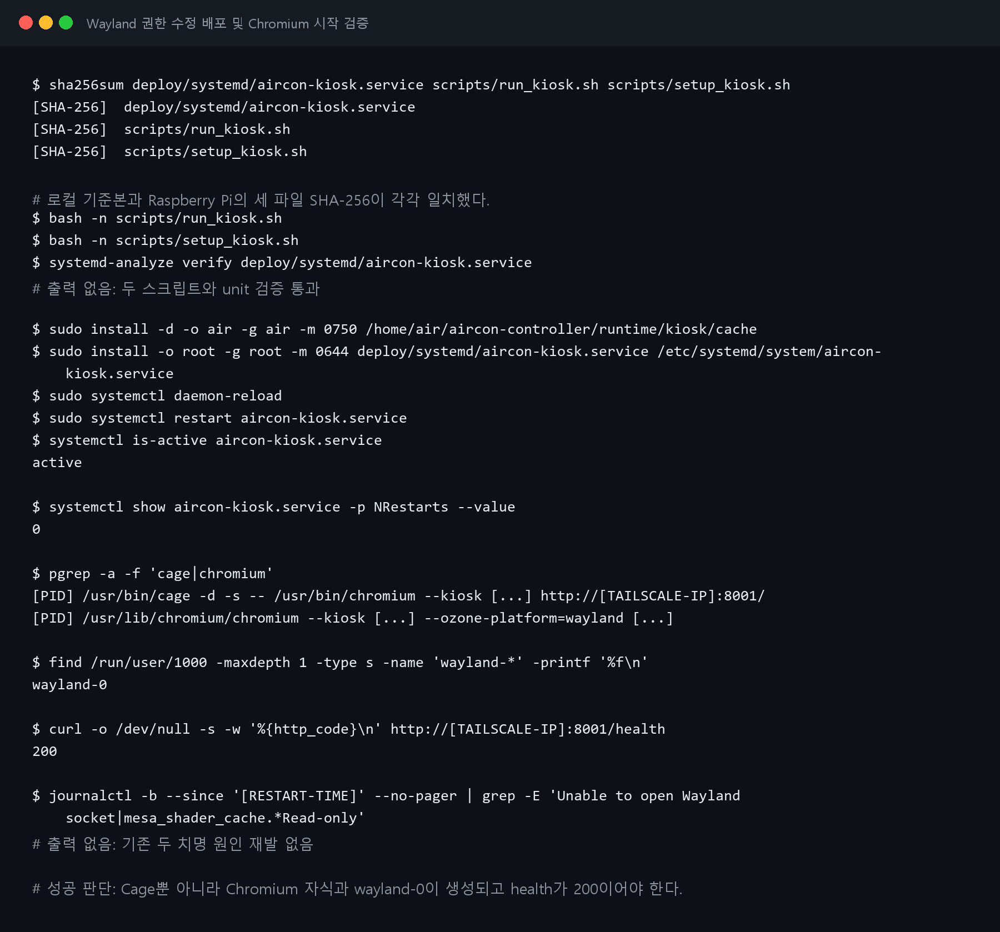

키오스크 화면은 최대 1920×1080의 PC 레이아웃으로 확장하고, 운영 화면에 남아 있던 디자인
검토용 상단 도구 모음은 제거했다. 테마와 `자동·휴대폰·PC` 화면 선택은 `더보기`로 옮겼다.
센서 새로고침도 카드 전체를 지우고 다시 만드는 대신 센서 ID별 기존 DOM을 유지하면서
달라진 값만 갱신한다. 도어 이력은 최초 로드 또는 실제 상태 변경 때만 다시 요청한다.

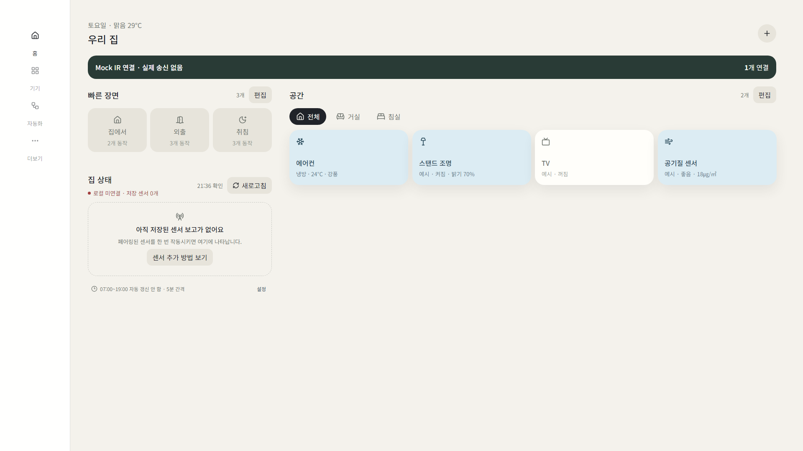

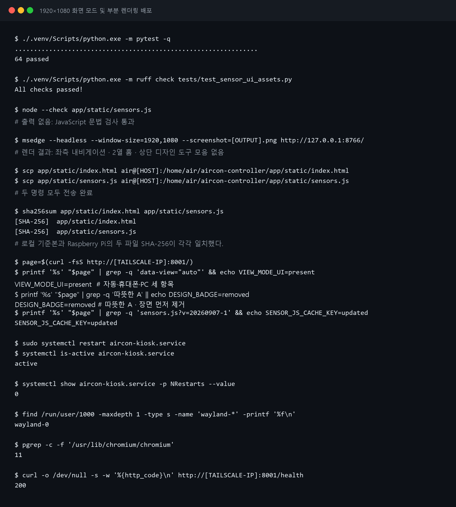

실제 터치 키오스크에 남아 있던 마우스 포인터는 키오스크 URL에만 `?kiosk=1`을 붙여 숨겼다.
일반 PC·휴대폰 접속의 커서는 그대로 유지된다. 변경 배포 후 Pi 전체를 재부팅해 웹앱과
키오스크뿐 아니라 Mosquitto와 Zigbee2MQTT도 함께 자동 복구되는 것을 확인했다.

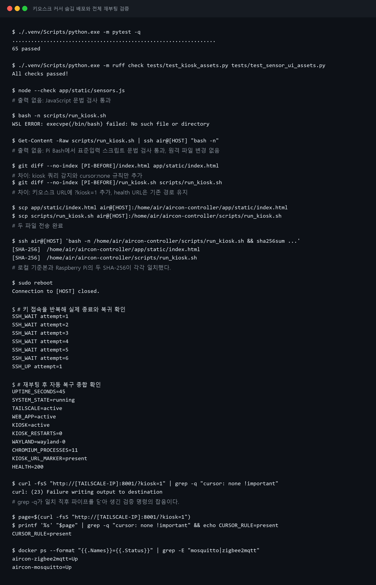

## 첫 상태 확인과 실제 상태 변경은 다르다

첫 운영 화면에서는 열림·닫힘 이력이 0건인데도 마지막 상태 변경 시각이 표시되는 모순을
발견했다. 최신 보고의 UTC 시각을 한국 시간으로 변환한 16:22는 정상이었다. 문제는 처음
받은 닫힘 상태를 백엔드가 이벤트로는 만들지 않으면서 변경 시각에는 넣은 데 있었다.

첫 보고는 센서의 기준 상태일 뿐 문이 그때 닫혔다는 증거가 아니다. 따라서 첫 보고는
`최초 상태 확인`, 이후 값이 실제로 달라진 경우만 `마지막 상태 변경`으로 표현하도록
수정했다. 이전 버전이 남긴 잘못된 변경 시각도 도어 이력이 전혀 없는 경우에만 앱 시작 시
자동으로 정리한다. 센서 상태와 실제 이벤트는 삭제하지 않는다.

첫 보정 코드는 최초 수신 시각과 기존 변경 시각이 같은 경우로 범위를 너무 좁게 잡았다.
운영 DB에서는 서버 수신 시각과 센서 원문의 보고 시각이 달라 보정되지 않았다. 실제 접점
전환은 반드시 이벤트도 함께 만든다는 저장 규칙을 기준으로 삼아, `이력 0건 + 변경 시각
있음`만 정리하도록 수정했다. 이 실패와 재검증도 해결 과정에 포함해 남겼다.

브라우저가 어떤 지역에서 열리더라도 이 스마트홈의 사건 시각은 한국 집 기준이어야 한다.
그래서 상세 정보와 열림·닫힘 기록의 절대 시각을 `Asia/Seoul`로 고정하고 화면에
`한국 시간`이라고 명시했다.

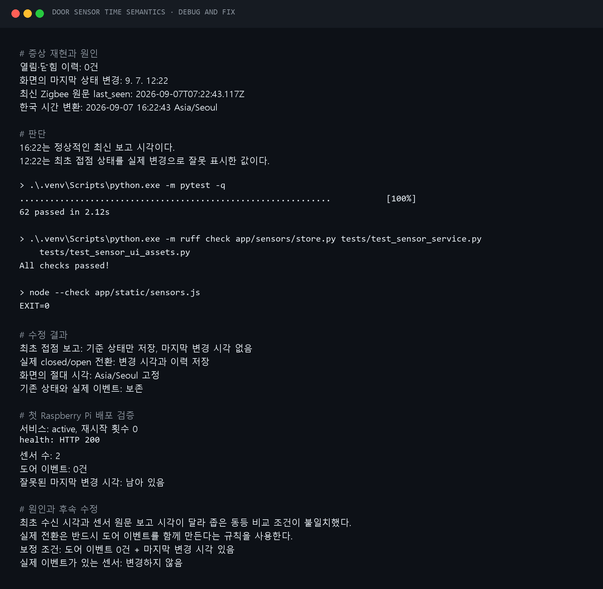

재배포 뒤 현재 닫힘 상태와 최초·마지막 보고는 그대로였고, 잘못된 변경 시각만 비워졌다.
도어 이벤트도 0건으로 유지돼 실제 이력이나 현재값을 삭제하지 않았음을 확인했다.

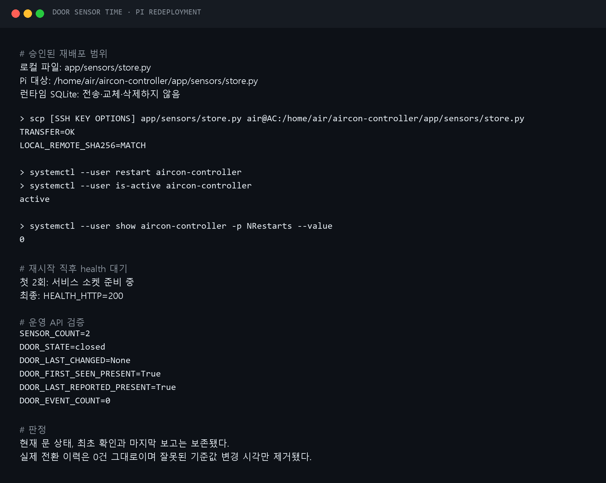

## 새 센서 보고를 SSE로 즉시 반영하기

센서 상태는 REST로 최초 로드하고, 이후 새 MQTT 보고는 `/api/v1/events`의 SSE로 보낸다.
현재 흐름은 서버→화면 단방향이므로 양방향 WebSocket 대신 브라우저 기본 `EventSource`를
사용했다. 연결이 다시 열리면 REST로 상태를 다시 읽어 끊긴 사이 상태를 복구한다.
다만 온습도 화면에는 자동 갱신 정책을 적용하므로 재접속했다고 금지 시간이나 설정 간격을
우회하지 않는다. 자동화 화면도 `stream.ready`를 받으면 REST로 규칙과 경고 이력을 복구한다.

도어 이벤트에서는 해당 센서 카드만 갱신한다. 도어 상태가 실제로 바뀐 경우에만 최근
이력을 다시 읽으므로 값 하나가 바뀔 때 전체 대시보드와 모든 이력을 다시 그리지 않는다.
온습도 SSE 보고는 서버에서 계속 저장하되 카드에는 즉시 반영하지 않는다. 카드 값은
설정 간격의 REST 조회, 수동 새로고침 또는 최초 화면 로드에서 반영한다.

배포 직전 검토에서 SSE 경로가 기존 자동 갱신 설정을 우회하는 회귀를 발견했다.
타이머에만 정책을 걸면 화면에 `지금은 일시 정지`라고 써 있어도 SSE로 온습도가 바뀌었다.
이를 고쳐 자동 REST 반영 때 활성화 여부, KST 정지 구간과 마지막 갱신 이후 간격을 모두
검사하게 했다. 수동 조회와 최초 화면 로드는 최신 저장값을 읽을 수 있게 유지했다.
실제 JavaScript 함수를 실행하는 Node 테스트 12개로 경계 시각, 자정 넘김, 다른 브라우저
시간대, 간격, 수동 우회와 도어 SSE 경로를 검증했다.

## 첫 안전 자동화

`문 열림 냉방 경고`는 열린 도어센서와 마지막 명령상 켜진 에어컨이 동시에 있을 때 타이머를
시작한다. 기본 5분이 지나도 조건이 유지되면 대시보드에 경고하고 SQLite에 한 건을 기록한다.
같은 조건을 반복 평가해도 경고는 중복되지 않는다. 문을 닫거나 에어컨을 끄면 경고가
해제되고 해제 이력도 남는다.

자동화 화면에서 기능을 켜고 끌 수 있으며 1·3·5·10·15·30분 중 지연 시간을 고른다.
설정, 현재 타이머와 이력은 브라우저가 아닌 Pi에 저장되므로 화면을 닫아도 감시는 계속된다.
여기서 에어컨 켜짐은 마지막 성공 IR 명령으로 추정한 상태다. 에어컨의 실제 전원 상태를
센서로 확인한 것은 아니며, 이 규칙은 UI 경고와 이력만 만들고 자동으로 IR을 송신하지 않는다.

로컬 정적 검사, JavaScript 구문 검사와 전체 74개 테스트가 통과했다. 첫 미리보기 포트가
이미 사용 중이라 Windows `10048` 오류가 났지만 기존 프로세스를 종료하지 않고 별도 포트로
재실행해 REST와 SSE 연결을 확인했다.

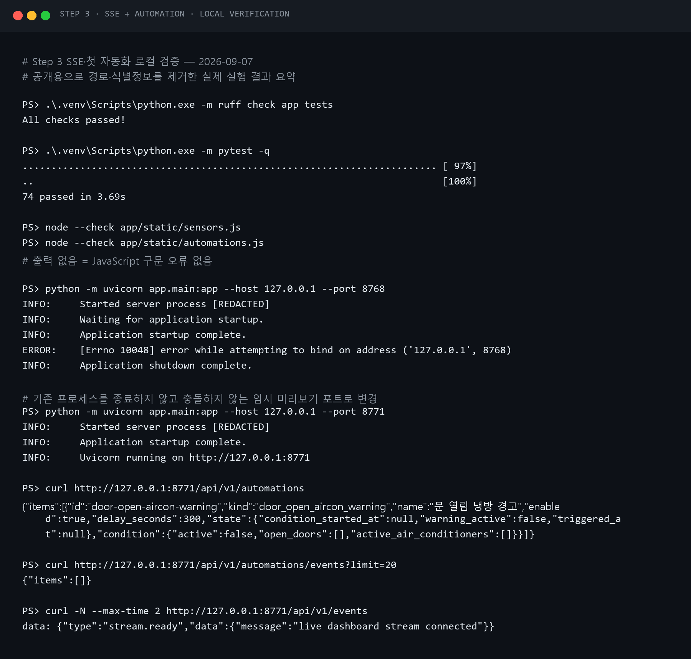

## v0.7.0 운영 배포와 검증 범위

2026-09-08 사용자 승인 후 코드 11개 파일, 총 227,084 bytes를 Pi에 배포했다.
로컬·원격 SHA-256 일치를 확인하고 패키지 버전을 0.7.0으로 적용한 뒤 웹앱과 키오스크를
재시작했다. Python 테스트 74개와 Node 테스트 12개가 모두 통과했다.

검증 시 앱과 키오스크는 `active`, `NRestarts=0`이었다. MQTT 연결은 정상이었고 저장된
센서 2개, Coordinator를 제외한 Zigbee 장치 2개가 유지됐다. 새 기기 가입은
`permit_join=false`로 닫혀 있었다. 자동화 규칙은 활성, 지연 300초, 현재 경고 없음,
발생·해제 이력 0건으로 조회됐다.

SSE는 HTTP 200으로 연결되고 `stream.ready`와 keep-alive가 수신됐다. 관찰 중 새 센서
이벤트는 0건이었다. 이번에는 실물 센서를 조작하거나 IR 명령을 보내지 않았으므로,
이 결과는 연결과 운영 상태 검증이지 문 전환·경고 실험의 성공 결과는 아니다.

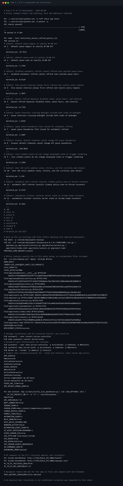

패키지 설치 중 오류와 복구 과정도 성공 결과와 별도로 보존했다. 실제 명령과 판단 근거는
[운영 배포 기록](../../journal/2026-09-08-step3-pi-live-deployment.md)에서 이어서 확인할 수 있다.

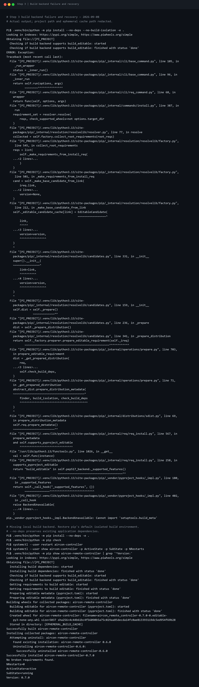

## 동글이 멈춘 운영 장애와 디스플레이 USB 전원

현장 도어 재시험 중에는 센서 보고만 없는 것으로 보였지만, 가입 허용과 닫기 명령까지
Coordinator 응답 시간 초과가 발생했다. 동글을 뺐다 다시 연결하자 Zigbee2MQTT는 장치
경로가 없는 순간 자동 재시작을 시도한 뒤 `exited`로 남았다. 장치가 다시 보인 뒤 컨테이너를
시작했을 때는 커널에 다음 오류가 기록되고 동글을 포함한 USB 주변 장치가 모두 사라졌다.

```text
xHCI host controller not responding
Host halt failed, -110
HC died; cleaning up
```

이 단계에서는 센서를 반복 조작하거나 재페어링해도 검증할 수 없었다. 네트워크 DB와 센서
등록을 지우지 않고 Pi를 한 번 정상 재부팅했다. 새 부팅에서 CP210x 동글, MQTT와
Zigbee2MQTT가 복구됐고 가입 닫기 요청에도 Coordinator가 `status=ok`, `time=0`으로
응답했다.

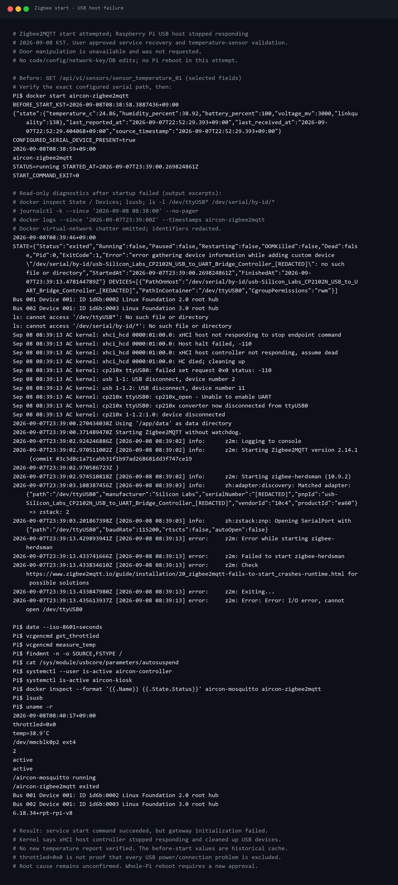

부팅 직후 받은 온습도 메시지는 전날 `last_seen`을 가진 저장값 재발행이었다. 이를 새 측정으로
오해하지 않고 센서 원문 시각을 기다렸다. 08:47:26(KST)에 온도 25.08°C, 습도 표시 38.92%의
새 MQTT 보고가 들어왔고 API의 `last_reported_at`도 같은 시각으로 갱신됐다. 이로써 적어도
TH01 → Coordinator → Zigbee2MQTT → MQTT → FastAPI 경로의 실제 복구를 확인했다.

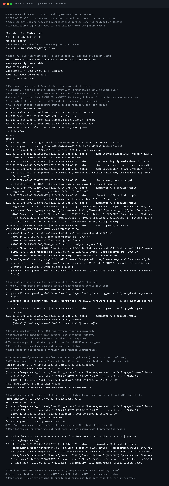

사용 중인 Pi 4 본체 어댑터는 공식 27W USB-C 제품이라 입력 전원 용량은 충분하다. 하지만
13.3인치 터치 모니터도 별도 어댑터 없이 Pi의 USB-A에서 구동하고 있었다. Pi 4의 하류 USB
전원은 네 포트 전체 합계 1.2A이므로 화면과 동글의 합산 부하를 의심할 이유가 있다.
`vcgencmd get_throttled=0x0`은 Pi 저전압 이력이 없다는 뜻이지 USB 분기 전류를 측정한 값은
아니다. 화면을 제거한 뒤 동글과 서비스는 정상이었지만 아직 장기 비교가 없어 전력 문제를
확정 원인으로 쓰지는 않는다.

운영 구성은 화면을 제조사가 지원하는 별도 전원 입력으로 구동하고 Pi에는 HDMI와 터치
데이터만 연결하는 방향으로 바꾼다. 전원과 터치가 한 포트에 결합된 모델이면 포트 설명을
확인한 뒤 역전류 방지 규격이 분명한 전원형 USB 허브를 검토한다. Zigbee Coordinator는
2.4GHz 간섭을 줄이도록 USB 2.0 포트와 50cm 이상의 연장 케이블을 사용하는 편이 좋다.

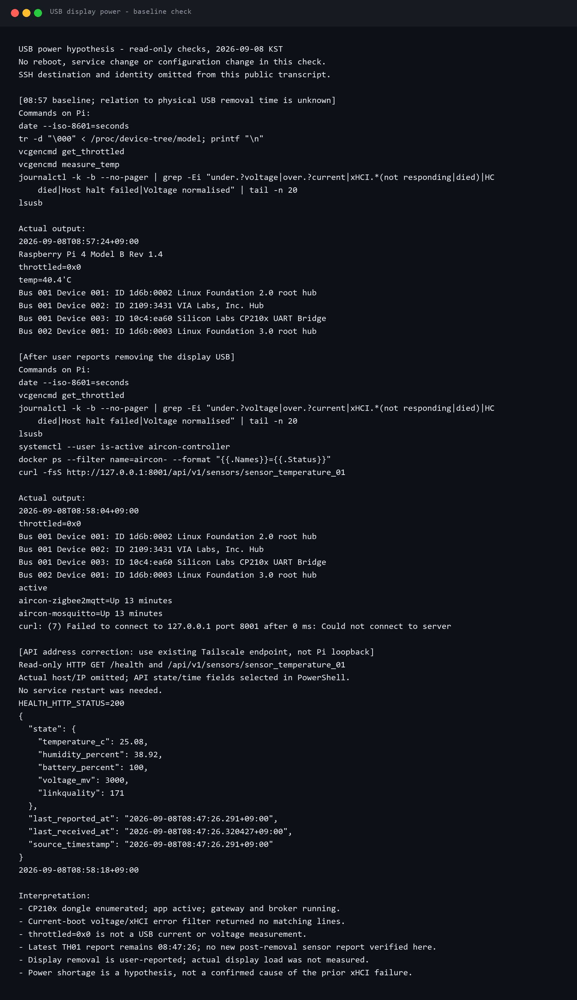

이 장애의 최초 원인은 아직 전원·USB 호스트·케이블 중 하나로 확정되지 않았다. 해결된 것은
재부팅 후 운영 경로 복구이며, 디스플레이 전원 분리는 재발 여부를 확인하기 위한 설계 변경이다.

## Step 3 완료 범위와 후속 현장 검증

Step 3의 코드 구현, 자동 테스트, 운영 배포, 키오스크 기동, API·SSE 연결과 온습도 실수신은
완료했다. 아래 항목은 현장 조건이 갖춰졌을 때 보충 검증한다.

- 배포된 Pi에서 실제 문 전환이 화면에 즉시 반영되는지 확인
- 경고 지연을 일시적으로 1분으로 설정해 발생·중복 방지·해제 이력 확인
- 디스플레이를 별도 전원으로 구동한 뒤 USB/xHCI 장애가 재발하는지 장기 관찰
- MQTT 단절·재연결과 화면 회전·절전 설정 검증

미완료 항목을 이미 성공한 것으로 쓰지 않되, 구현 완료와 현장 조건 때문에 미룬 시험도
구분한다. 따라서 이번 편은 **스마트홈 UI와 자동화의 구현·배포 완료**로 닫고, 실물 도어
전환과 장기 안정성 결과는 후속 기록으로 덧붙인다.

## 마무리

이번 단계에서 Zigbee 센서는 단순한 화면 숫자가 아니라 스마트홈의 상태 입력이 됐다.
도어센서와 온습도계가 같은 API와 저장 계층으로 들어오고, 브라우저를 닫아도 Pi가 상태와
자동화를 유지한다. 사용자 화면은 원시 Zigbee 패킷을 모르므로 다음 센서나 ESP32-H2 노드도
같은 구조에 추가할 수 있다.

다음 Step 4에서는 ESP32-H2, 940nm IR LED와 MOSFET으로 Zigbee IR 노드를 만들고,
Raspberry Pi가 의미 기반 에어컨 명령을 MQTT/Zigbee로 전달하도록 확장한다.

## 공식 참고

- [Eclipse Paho MQTT Python](https://eclipse.dev/paho/files/paho.mqtt.python/html/index.html)
- [Zigbee2MQTT MQTT Topics and Messages](https://www.zigbee2mqtt.io/guide/usage/mqtt_topics_and_messages.html)
- [Zigbee2MQTT 장치 페어링](https://www.zigbee2mqtt.io/guide/usage/pairing_devices.html)
- [Zbeacon TH01](https://www.zigbee2mqtt.io/devices/TH01.html)
- [Raspberry Pi USB 전원 한도](https://www.raspberrypi.com/documentation/computers/raspberry-pi.html#maximum-power-output)
- [Zigbee2MQTT 네트워크 안정성](https://www.zigbee2mqtt.io/how_tos/how_to_improve_network_range_and_stability.html)
