# Step 4 — ESP32-H2 Zigbee IR 노드로 에어컨 제어하기

전용 PCB 제작 비용을 고려해 ESP32-H2 SuperMini와 만능기판으로 먼저 IR 송신기를
만들었다. 목표는 휴대폰이나 집 안의 화면에서 버튼을 누르면, 작은 보드가
에어컨 리모컨처럼 적외선(IR)을 보내게 하는 것이다. **실제로 에어컨을 끄고,
대시보드에서 보낸 냉방 명령에 에어컨이 반응하는 것까지 확인했다.** 다만
무선 연결이 가끔 끊긴 원인과 장시간 안정성은 아직 확인 중이다.

이번 편의 연결 구조는 아래와 같다.

```text
대시보드 버튼 → 라즈베리파이 → Zigbee USB 동글 ⇢ ESP32-H2 → IR LED → 에어컨
                                      무선 통신
```

라즈베리파이에서는 **Zigbee2MQTT**가 동글을 관리한다. H2가 보낸 Zigbee 신호를
웹앱이 쓰는 메시지(MQTT)와 이어주는 프로그램이다. **H2가 MQTT를 직접
사용하거나 인터넷 계정에 가입하는 것은 아니다.** 처음 나오는 용어들은
필요한 단계에서 하나씩 설명하겠다.

## 먼저 적외선이 나오는지 확인했다

IR LED는 H2 보드의 GPIO5 핀에 연결했다. 보드에 올려둔 간단한 시험
프로그램에서 `c` 명령을 한 번 보내고 휴대폰 카메라로 LED를 봤다.
맨눈에는 보이지 않는 적외선이 카메라에는 잠깐 분홍색으로 잡혔다.

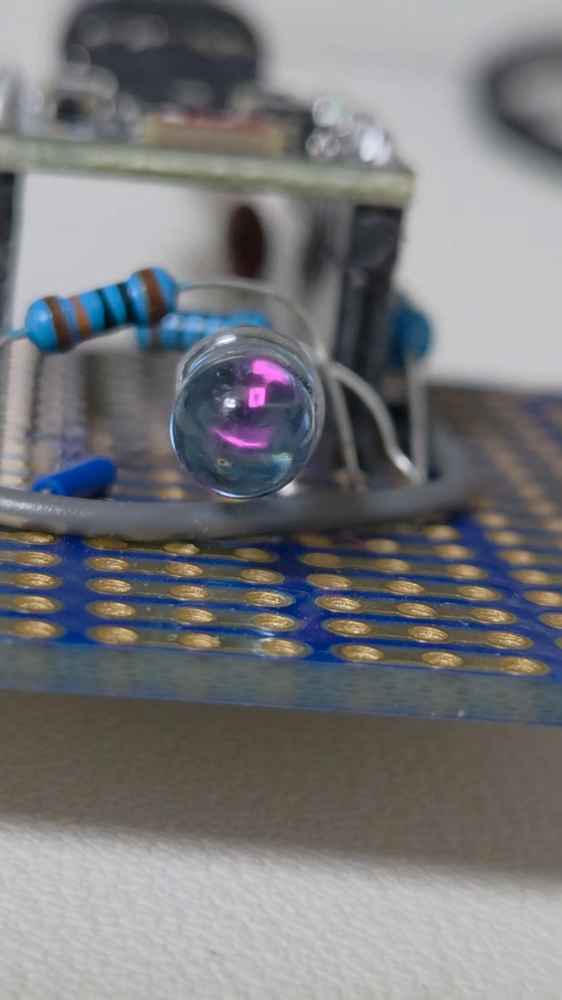

[발광 확인 영상 보기 — 6.8초, 무음 MP4](../../assets/hardware/esp32-h2-supermini-ir-gpio5-camera-test.mp4)

카메라에 보인다고 해서 에어컨이 신호를 알아들었다는 뜻은 아니다. 여기서는
LED가 빛을 냈다는 것만 확인했다. 설정한 38 kHz 주파수나 빛의 세기는 별도
장비로 측정하지 않았다. 공개용 영상에서는 음성과 촬영 정보를 제거했다.

시험 명령과 실제 출력은 [터미널 기록](../../assets/terminal/349-h2-perfboard-gpio5-camera-test.txt)에
남겨 두었다.

## PC에서 끄기 명령을 보내봤다

이번에는 에어컨을 켜고 IR LED를 에어컨 수신부로 향하게 했다. PC에서 보드에
`f` 명령을 **한 번** 보내자, 보드에는 `POWER_OFF` 송신 기록이 남았고
사용자는 에어컨이 실제로 꺼진 것을 확인했다.

이 [송신 로그](../../assets/terminal/350-h2-perfboard-carrier-power-off-first-test.txt)와
실물 확인으로 **유선 시험 1회 성공**을 기록했다. 아직 반복 성공률이나 최대
송신 거리를 측정한 것은 아니다. 다음에는 PC 선 없이 Zigbee로 같은 명령을
보내기로 했다.

## H2에 Zigbee 프로그램을 올렸다

처음 프로그램은 PC에서 명령을 받았다. 이제 H2가 **Zigbee로 명령을 받는
별도의 펌웨어**를 만들었다. 펌웨어는 보드 안에서 실행되는 프로그램이라는
뜻이다. 기존 PC 시험용 소스는 남겨두고 새 펌웨어를 따로 작성했다.
IR LED의 GPIO5 연결과 앞에서 확인한 끄기 신호는 그대로 사용했다. 보드를
켜거나 Zigbee에 연결하는 것만으로 적외선을 보내지는 않도록 했다.

제작에는 Espressif의 **ESP-IDF 5.5.4와 Zigbee 라이브러리**를 썼다. 이 둘이
글에서 말하는 SDK, 즉 H2용 프로그램을 만드는 개발 도구다. 가입해야 하는
온라인 서비스가 아니다. 처음에는 Zigbee 설정이 빠져 빌드가 실패했지만,
설정을 고친 뒤 빌드와 두 가지 기본 검사가 통과했다.

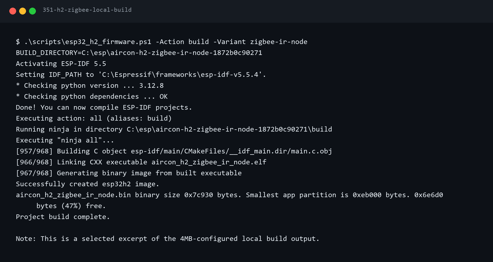

[빌드 출력 TXT](../../assets/terminal/351-h2-zigbee-local-build.txt) ·
[테스트 출력 TXT](../../assets/terminal/352-h2-zigbee-local-checks.txt)

라즈베리파이가 이 새 기기를 알아보도록 돕는 ‘변환기’도 PC에서 먼저 시험했다.
이 단계에서는 아직 라즈베리파이에 설치하지 않았다.

## 첫 부팅에서 Zigbee 연결에 실패했다

실물 H2 보드에 새 펌웨어를 올리기 전, 기존 프로그램과 보드의 저장 내용을
백업했다. 보드 저장 공간이 4 MB인 것도 확인하고 그 크기에 맞춰 기록했다.
백업에는 기기별 정보가 들어갈 수 있어 블로그에는 올리지 않았다.

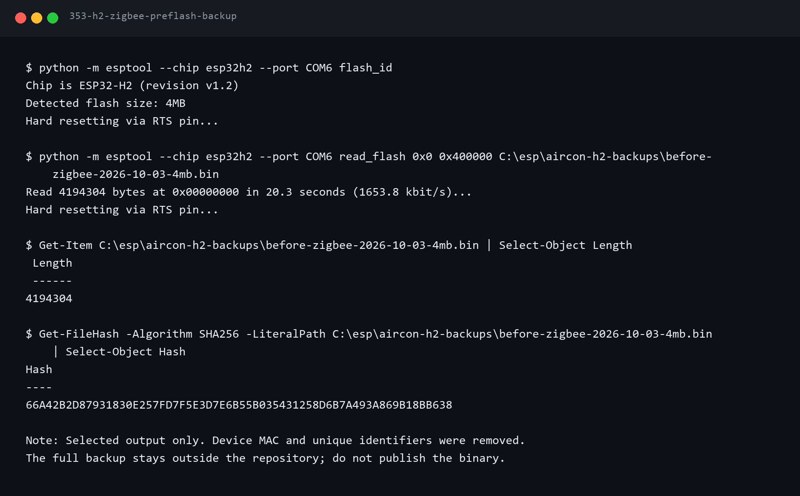

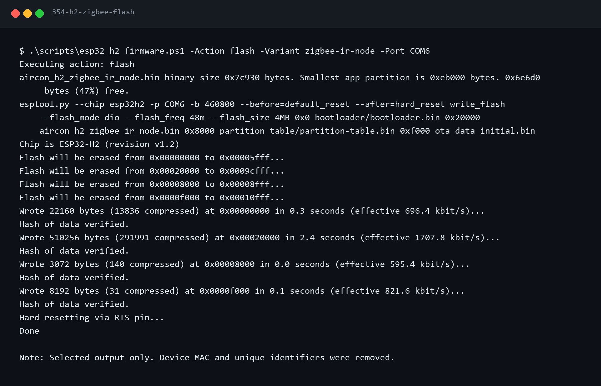

새 프로그램은 정상 부팅했지만, 첫 Zigbee 연결 시도에서는 네트워크를 찾지
못했다. 로그의 `0x03`이 그 실패를 뜻한다. 이때 IR 명령은 보내지 않았다.
처음부터 보드나 회로 고장으로 단정하지 않고, 라즈베리파이에서 새 기기
가입이 허용돼 있는지 확인하기로 했다.

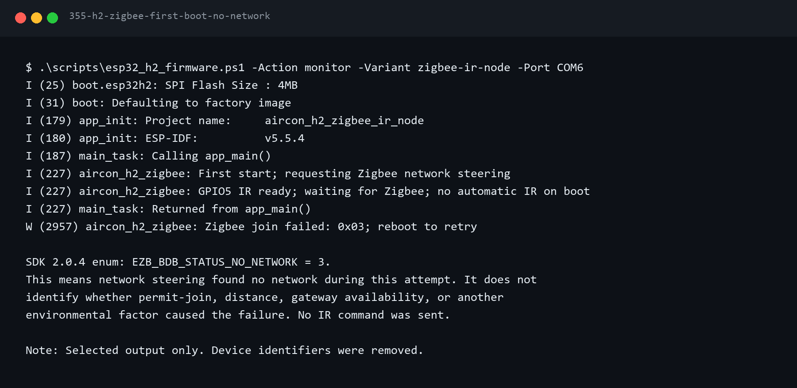

여기서 ‘가입’은 **H2가 집 안 Zigbee 무선망에 들어오는 것**이다. 인터넷
사이트에 회원가입하는 절차가 아니다. 라즈베리파이가 가입을 잠깐 허용하고,
H2가 동글을 찾아 연결해야 한다. 이때는 부팅까지만 성공했고 Zigbee 제어는
아직 되지 않았다.

## 새 기기 가입을 잠깐 허용하니 연결됐다

라즈베리파이의 Zigbee2MQTT를 확인하니 새 기기 가입이 닫혀 있었다.
가입을 **120초만 허용**하고 H2를 다시 켜자, H2에 `Zigbee joined`가
나타났다. Zigbee2MQTT에도 새 기기가 등록됐다. 연결을 확인한 뒤 가입
허용은 다시 껐다. 기존 온습도·도어 센서 등록은 건드리지 않았다.

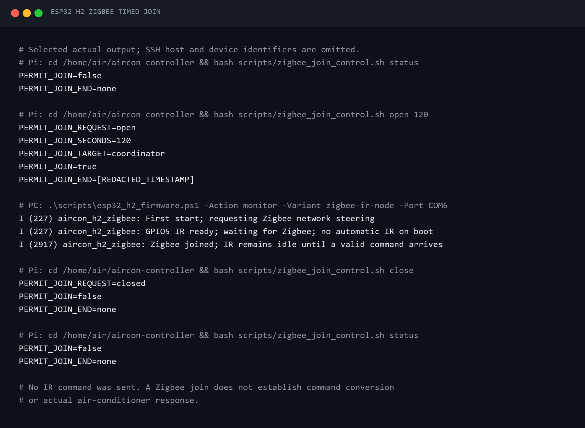

[가입 기록 TXT](../../assets/terminal/356-h2-zigbee-timed-join.txt)

그런데 기기 목록에서는 H2가 **‘미지원 기기’**로 보였다. Zigbee 무선망에는
들어왔지만 Zigbee2MQTT가 이 DIY 기기의 명령 형식을 아직 모르기 때문이다.
즉, **가입과 조작 가능 여부는 별개**다.

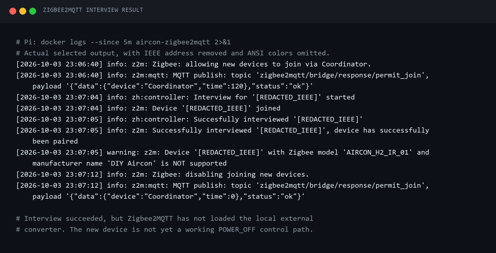

[기기 확인 기록 TXT](../../assets/terminal/357-h2-zigbee-interview-unsupported.txt)

이 단계에서는 아직 에어컨으로 IR을 보내지 않았다. 다음은 라즈베리파이가
H2의 명령을 알아듣도록 하는 작업이다.

## 변환기를 설치해 미지원 기기를 해결했다

**변환기**는 라즈베리파이의 Zigbee2MQTT에서 실행되는 작은 번역 파일이다.
웹앱이 보낸 ‘에어컨 끄기’를 H2가 알아듣는 Zigbee 명령으로 바꾸고, H2의
응답도 웹앱이 읽을 수 있게 해준다. H2 보드에 넣는 펌웨어와는 다른 파일이다.

설치 전에 라즈베리파이의 기존 설정을 비교하고 비공개로 백업했다. 변환기는
프로그램 코드를 실행할 수 있으므로 검토한 파일 **하나만** 설치하고 접근
권한도 제한했다. 자세한 보안 주의사항은 [Zigbee2MQTT 공식 안내](https://www.zigbee2mqtt.io/advanced/more/external_converters.html)를
참고했다.

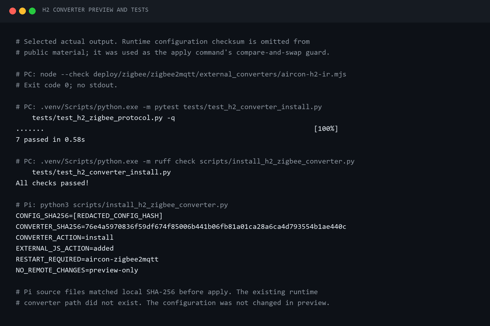

[미리보기·검사 기록 TXT](../../assets/terminal/358-h2-converter-preview-and-checks.txt)

Zigbee2MQTT만 다시 시작하자 H2가 **‘지원됨’**으로 바뀌었다. 기존 센서도
그대로 있었고, 새 기기 가입은 닫힌 상태였다.

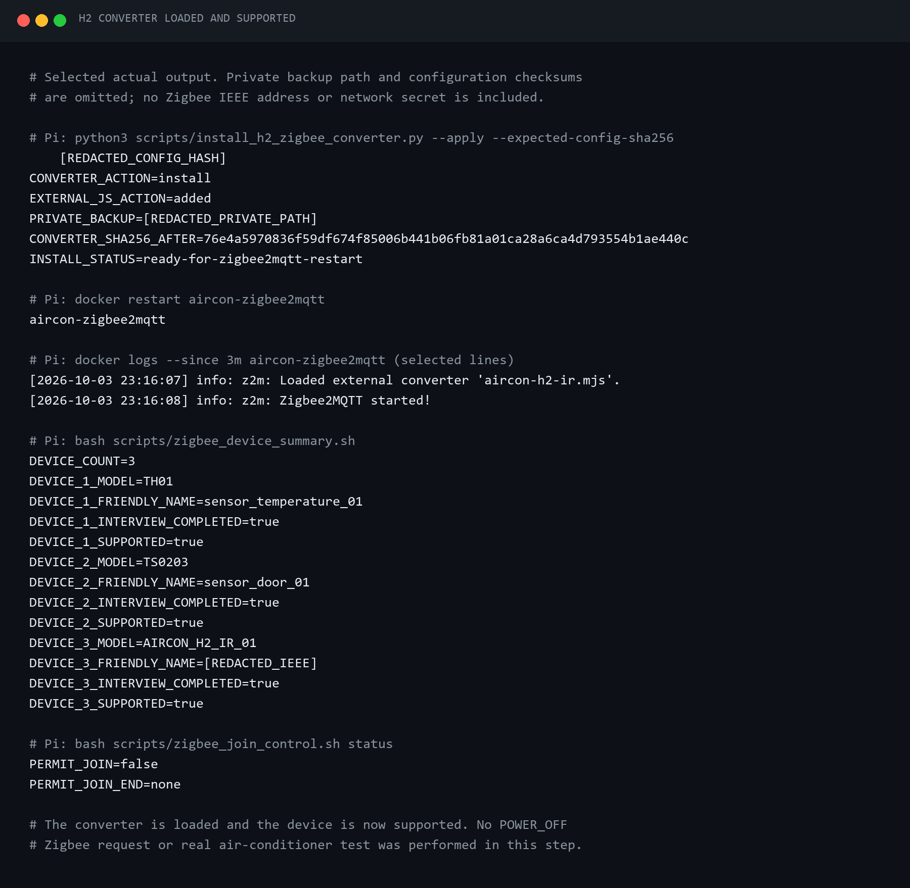

[적용·검증 기록 TXT](../../assets/terminal/359-h2-converter-loaded-supported.txt)

여기까지 확인한 것은 **H2 연결과 명령을 번역할 준비**다. ‘지원됨’ 표시만으로
에어컨이 움직였다고 할 수는 없으므로 실제 끄기 명령을 시험했다.

## Zigbee로 끄기 명령을 보내니 에어컨이 꺼졌다

먼저 라즈베리파이에서 H2가 연결돼 있고 Zigbee2MQTT가 이 기기를 지원하는지
확인했다. 실수로 명령을 여러 번 보내지 않도록 시험 도구도 미리 점검했다.

에어컨 앞에서 `POWER_OFF`를 **한 번만** 보냈다. 2026-10-03 23:23(KST),
H2는 명령을 받았다는 `accepted`와 적외선 송신을 끝냈다는 `sent`를
차례로 보냈다. 같은 요청에 대한 응답인지도 확인했다. 그 뒤 사용자가
**에어컨이 실제로 꺼졌다고 확인**했다. 자동 재전송은 하지 않았다.

`sent`는 보드가 신호를 보냈다는 뜻이지 에어컨 상태를 직접 읽었다는 뜻은
아니다. 그래서 보드 기록과 실물 확인을 따로 적었다.

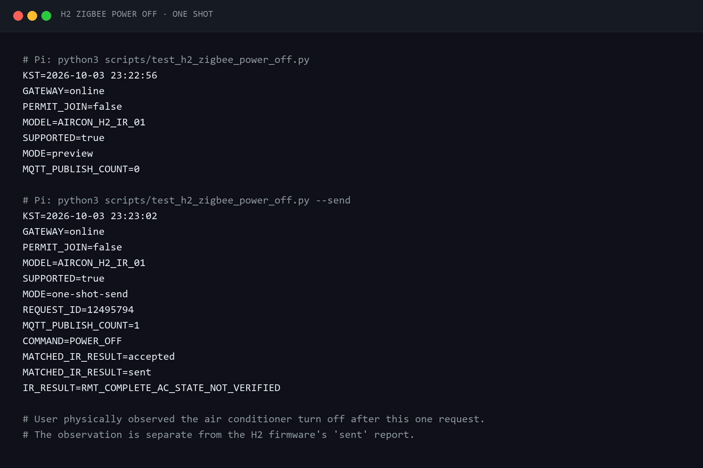

[시험 출력 TXT](../../assets/terminal/360-h2-zigbee-power-off-one-shot.txt)

이 시험으로 **Zigbee → H2 → IR → 에어컨** 경로를 한 번 확인했다.
아직 웹 대시보드 버튼으로 보낸 것은 아니므로, 다음에 화면을 연결했다.

## 대시보드에서 H2를 에어컨에 연결했다

H2에는 별도 가입 버튼이 없다. 처음 사용하는 보드라면 Zigbee2MQTT에서
새 기기 가입을 잠깐 허용한 뒤 전원을 연결하면 H2가 스스로 가입을 시도한다.
**BOOT 버튼은 이 펌웨어의 가입 버튼이 아니다.** 한 번 가입한 보드는 전원을
다시 넣어도 기존 네트워크로 돌아오므로 매번 가입 허용을 켤 필요가 없다.

Zigbee 가입과 **웹앱에 연결할 에어컨을 고르는 일**도 다르다. 라즈베리파이
기기 목록에서 H2가 ‘지원됨’으로 보인 뒤, 기존 에어컨 화면의
‘ESP32-H2 Zigbee IR 연결·변경’에서 H2를 선택했다. 이때는 끄기만 지원했고,
켜기·온도·모드 명령은 뒤에서 추가했다.

화면과 서버 기능을 로컬에서 검사한 뒤 라즈베리파이에 반영했다. 기존 파일은
백업하고, 전송한 파일이 로컬 원본과 같은지도 확인했다. 에어컨과 H2의 연결은
웹앱에 저장됐지만, **이 단계에서는 화면에서 IR 명령을 보내지 않았다.**

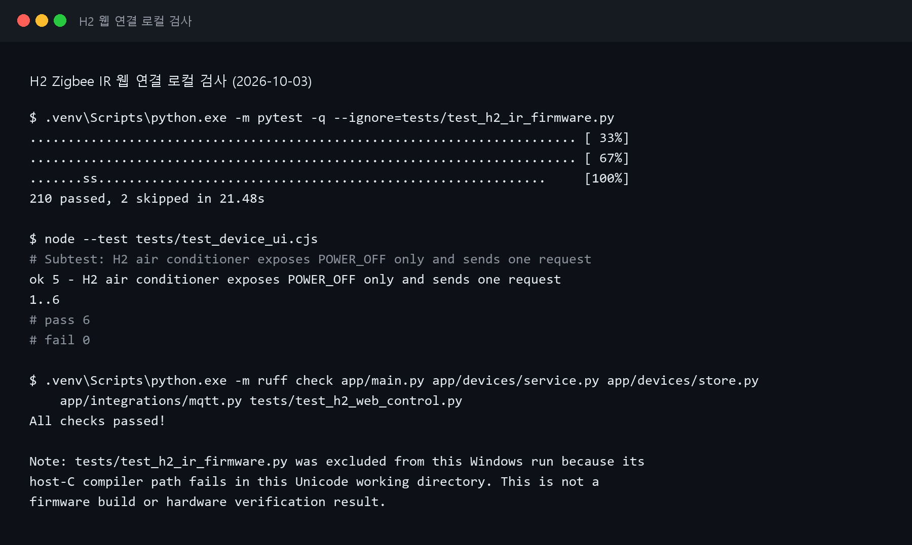

[로컬 검사 TXT](../../assets/terminal/361-h2-web-control-local-checks.txt)

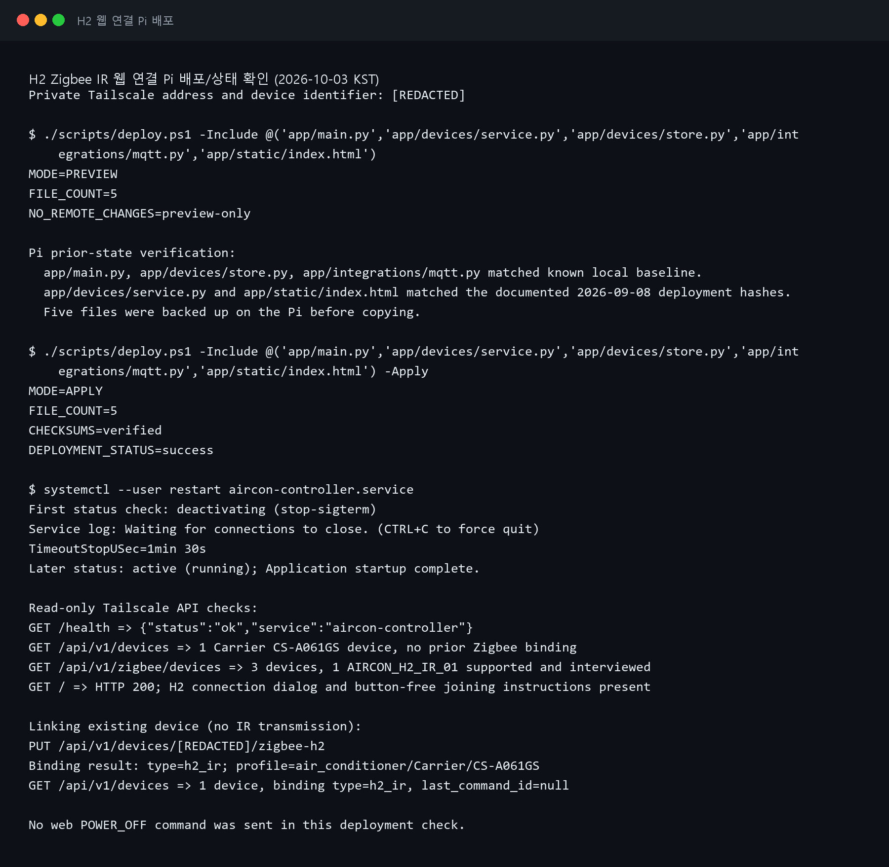

[배포·등록 확인 TXT](../../assets/terminal/362-h2-web-control-pi-deployment.txt)

즉, 여기까지는 화면과 기기의 연결만 확인했다. 앞의 끄기 시험은 시험 도구로
보낸 결과였고, 대시보드 버튼의 실물 시험은 아직 남아 있었다.

## 끄기 외에 냉방·온도·풍량도 넣었다

2026-10-04에는 끄기만 되던 펌웨어에 냉방 온도·풍량, 자동·제습·송풍,
절전·터보·풍향 같은 명령을 추가했다. ‘켜기’는 단순히 전원 상태를 뒤집는
명령이 아니라 **원하는 온도와 풍량으로 냉방을 시작하는 명령**으로 만들었다.
기존 끄기 명령도 계속 작동하도록 유지했다.

리모컨에서 직접 기록해 둔 Carrier CS-A061GS 신호를 기준으로 만들었다.
17–20°C 냉방 신호는 기록한 값과 비교했다. **21–30°C는 신호의 규칙을
바탕으로 계산한 값**이라 아직 실물 검증이 필요하다. 에어컨 표시등을 바꾸는
명령도 기록은 있지만 실제 효과는 확인하지 않았다.

PC에서 펌웨어와 화면 기능을 검사했다. Python 검사는 210개 통과·2개
건너뜀, 화면·변환기 관련 Node 검사는 28개 통과했다. H2를 업데이트하기
전에는 보드 전체를 비공개로 백업했다. Zigbee 가입 정보를 지우지 않도록
프로그램 영역만 바꾸었고, 업데이트 후 H2가 기존 네트워크에 다시 나타났다.
이 과정에서는 IR 명령을 보내지 않았다.

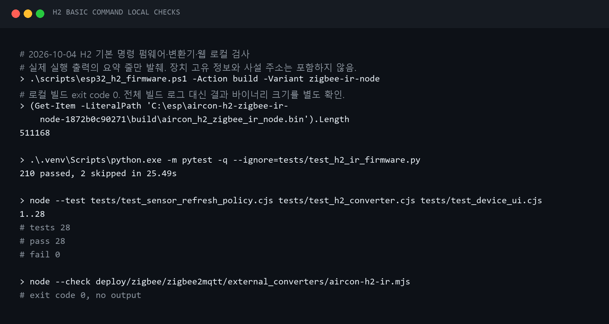

[로컬 검사 TXT](../../assets/terminal/363-h2-basic-command-local-checks.txt)

라즈베리파이에는 바뀐 변환기와 웹앱 파일만 전송했다. 기존 설정을 백업하고
관련 서비스만 다시 시작한 뒤, H2와 기존 센서 두 개가 모두 목록에 남아
있는지 확인했다. 이제 화면에서 켜기·끄기, 온도·풍량, 모드·부가 기능을
선택할 수 있다. 다만 화면에 보이는 것은 **마지막으로 보낸 요청**이지
에어컨에서 직접 읽어 온 현재 상태가 아니다.

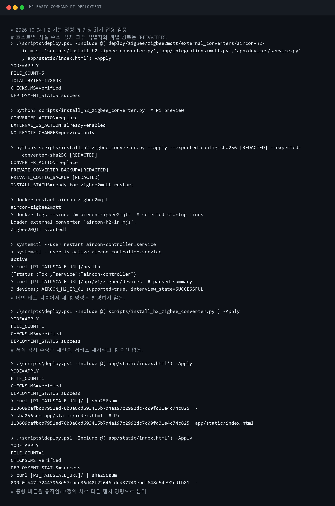

[Pi 배포·검증 TXT](../../assets/terminal/364-h2-basic-command-pi-deployment.txt)

파일 배포만으로 새 명령이 실제 에어컨에 먹히는지는 알 수 없다. 마지막으로
대시보드 버튼을 직접 눌러보기로 했다.

## 대시보드에서 보냈을 때도 에어컨이 반응했다

처음에는 순조롭지 않았다. 대시보드에서 냉방 명령을 누르자 ‘H2 응답 시간을
초과했다. 다시 보내기 전에 에어컨을 확인하라’는 오류가 나왔다. 무선 통신
기록에도 응답을 받지 못했다는 오류가 있었다. 사용자는 **오류가 난 시험에서는
에어컨이 반응하지 않았다**고 확인했다.

전원 케이블과 H2의 위치를 바꿔가며 다시 시험했다. PC에 데이터 케이블로
연결했을 때도, 5 V 3 A 충전기에 연결했을 때도 새 냉방 명령의 수신·송신
응답이 나왔다. 충전 전용 케이블에서는 한 차례 오류가 났지만, 다시 연결된
뒤에는 새 명령이 성공했다. 사용자는 **성공 응답이 나온 송신마다 에어컨이
실제로 반응했다**고 확인했다. 이로써 대시보드 버튼에서 에어컨까지의
전체 경로를 실물로 확인했다.

재연결 때 옛 송신 결과가 로그에 다시 보이는 경우도 있어, **새 요청에 대한
응답만** 성공으로 셌다. 케이블과 거리 등을 함께 바꾼 시험이라 앞선 오류의
원인을 한 가지로 확정할 수는 없다. 특히 ‘데이터 케이블만 된다’는 결론은
맞지 않는다. Zigbee 동글 가까이에서 연결한 뒤 옮기는 방법이 도움이 될
가능성은 있지만, 실제 사용 거리에서 오래 안정적으로 유지되는지는 더
확인해야 한다.

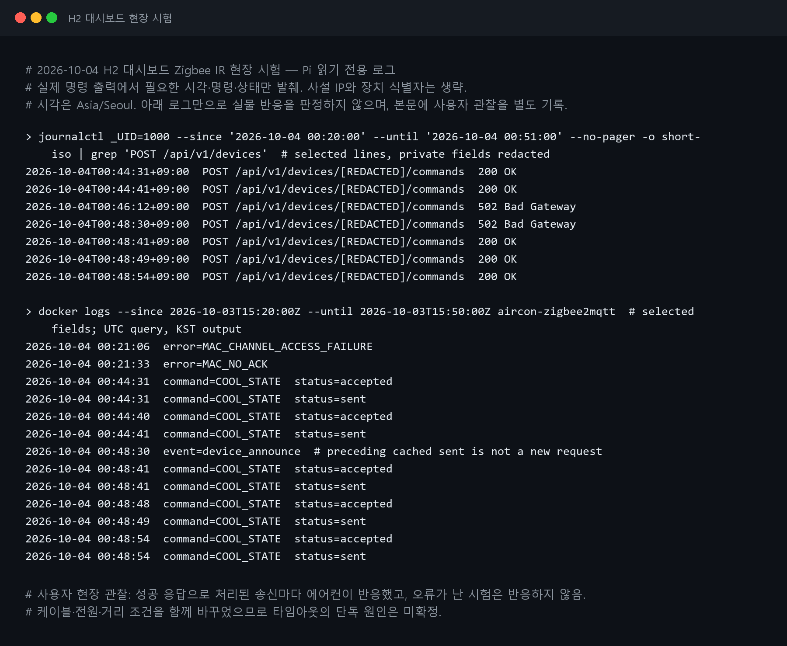

[현장 시험 로그 TXT](../../assets/terminal/365-h2-dashboard-field-test.txt)

## 여기까지 확인한 것과 남은 것

만능기판 시제품에서 IR LED 발광, Zigbee 끄기 명령으로 실제 에어컨 꺼짐,
대시보드 냉방 명령에 대한 실물 반응을 확인했다. **보드의 ‘보냈다’는 응답만
믿은 것이 아니라 에어컨 반응을 따로 확인했다.**

아직 모든 버튼을 검증한 것은 아니다. 자동·제습·송풍과 부가 기능,
21–30°C 신호, 무선 거리와 장시간 안정성, 배터리 구동은 다음 시험이
필요하다. 이번 편은 **집에서 조작할 수 있는 Zigbee IR 시제품의 핵심 경로**를
확인한 기록이며, 완성품의 신뢰성을 입증한 기록은 아니다.
