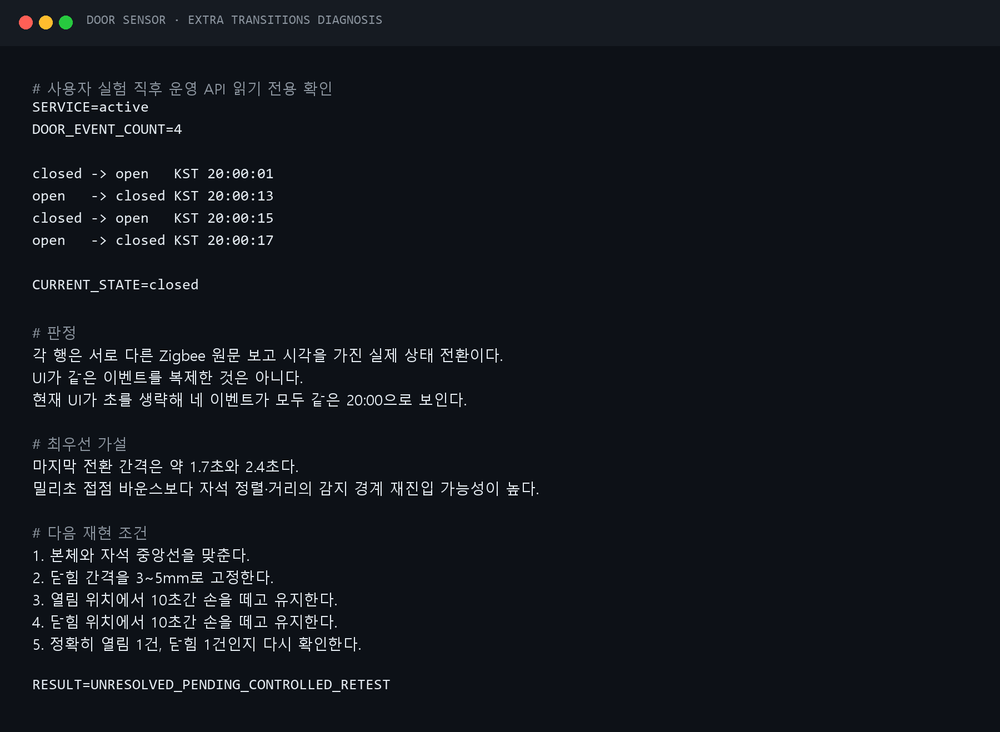
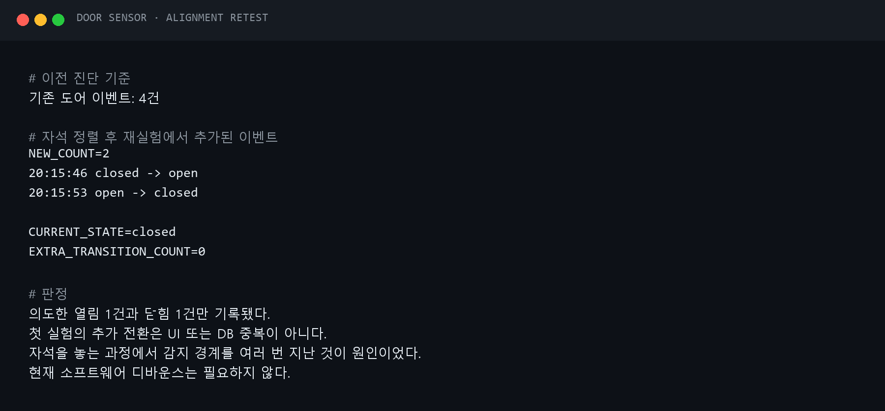

# 문 센서 시간 의미와 한국 시간 표시 수정

## 증상

문 센서 상세 화면에서 열림·닫힘 이력이 0건인데도 `마지막 상태 변경 9. 7. 12:22`가
표시됐다. 같은 화면의 `마지막 보고`와 `수신 시각`은 `9. 7. 16:22`였다.

## 확인한 사실

- Raspberry Pi의 시스템 시간대는 `Asia/Seoul`이었다.
- 최신 Zigbee 원문 보고 시각은 UTC `2026-09-07T07:22:43.117Z`였고, 한국 시간으로는
  `2026-09-07 16:22:43`이다. 따라서 16:22는 잘못된 시간이 아니다.
- 마지막 메시지의 접점 값은 기존과 같은 닫힘 상태라 새 열림·닫힘 이벤트가 아니었다.
- 도어 이벤트 API의 저장 이력은 0건이었다.
- 백엔드는 첫 접점 보고를 이벤트에는 넣지 않으면서 `last_changed_at`에는 기록했다.
  UI가 이 값을 실제 상태 변경으로 표시한 것이 12:22 표기의 원인이었다.

## 수정

1. 첫 접점 보고는 현재 상태의 기준값으로만 저장하고 `last_changed_at`은 비워 둔다.
2. 이전 버전에서 만들어진 값은 앱 시작 시 보정한다. 도어 이벤트가 한 건도 없는데
   변경 시각이 있는 행만 `last_changed_at=NULL`로 바꾼다.
3. 실제 `closed → open` 또는 `open → closed` 전환만 변경 시각과 이벤트를 만든다.
4. UI에는 `실제 상태 변경 기록 없음 · 최초 상태 확인 ...`을 표시하고 센서 정보에
   `최초 상태 확인` 항목을 추가한다.
5. 브라우저가 해외 시간대로 설정돼 있어도 센서의 절대 시각은 항상
   `Asia/Seoul`로 표시한다. 이력 제목에도 `한국 시간`을 명시한다.

기존 센서 상태와 도어 이벤트를 삭제하지 않으며, 런타임 SQLite 파일을 배포 파일로
덮어쓰지 않는다.

## 로컬 검증

- Python 테스트: 62개 통과
- 변경 Python 파일 Ruff 검사: 통과
- `app/static/sensors.js` Node 문법 검사: 통과
- 실제 전환 시각은 저장소 재초기화 후에도 유지되는 회귀 테스트를 추가했다.


## 첫 배포 검증에서 발견한 보정 조건 오류

첫 배포에서는 서비스와 한국 시간 UI는 정상 반영됐지만 운영 DB의 잘못된 변경 시각은
남았다. 최초 수신 시각은 서버가 메시지를 받은 때이고 기존 `last_changed_at`은 센서 원문의
보고 시각이라 두 값이 항상 같지는 않았다. 두 시각의 동등 비교는 보정 근거로 부적절했다.

이 버전의 저장 규칙에서 실제 접점 전환은 반드시 `door_events`에도 함께 기록된다. 따라서
`이벤트가 0건인데 변경 시각이 있음`을 이전 버전의 기준값 오표기로 판정하도록 조건을
수정했다. 실제 이벤트가 한 건이라도 있는 센서의 변경 시각은 건드리지 않는다.

## 재배포 및 운영 검증

승인 후 수정한 `app/sensors/store.py` 한 파일만 다시 전송하고 사용자 서비스를
재시작했다. 재시작 직후 health 연결은 두 번 대기했으며 이후 HTTP 200으로 복구됐다.

- 서비스: `active`
- 비정상 재시작: 0회
- 저장 센서: 2개 유지
- 문 현재 상태: 닫힘 유지
- 최초 확인·마지막 보고: 유지
- 잘못된 마지막 변경 시각: `None`으로 보정
- 실제 도어 이벤트: 0건 유지


## 첫 실제 개폐 실험에서 추가 전환이 관찰됨

사용자가 한 번의 개폐를 의도한 실험 뒤 이력에는 한국 시간 기준 다음 네 전환이 있었다.

```text
20:00:01 closed → open
20:00:13 open → closed
20:00:15 closed → open
20:00:17 open → closed
```

각 이벤트는 서로 다른 Zigbee 원문 보고 시각과 수신 시각을 가졌으므로 UI가 같은 DB 행을
반복 렌더링한 현상은 아니다. UI가 분까지만 표시해 네 행 모두 `20:00`으로 보이는 점은
혼동을 키웠다.

1.7초와 2.4초 간격은 일반적인 전기 접점 바운스보다 길다. 현재 최우선 가설은 자석을
닫힘 위치에 놓는 과정에서 정렬 또는 거리가 감지 경계를 여러 번 넘었다는 것이다. 설명서의
중앙선 정렬과 10mm 이하 간격보다 여유 있게 3~5mm 정도로 고정한 뒤, 열림과 닫힘 위치에서
각각 10초간 손을 떼고 다시 실험해야 한다.

이 재현 실험 전에는 센서 불량이나 소프트웨어 디바운스 필요 여부를 확정하지 않는다.



## 정렬 후 재실험

자석을 확실히 분리한 뒤 정렬해 닫는 절차로 다시 실험하자 새 이벤트는 정확히 두 건만
발생했다.

```text
20:15:46 closed → open
20:15:53 open → closed
```

현재 상태는 닫힘이며 그 사이 추가 전환은 없었다. 따라서 첫 실험의 추가 전환은 UI나
백엔드 중복이 아니라 자석을 놓는 동안 감지 경계를 여러 번 지난 것으로 결론 내렸다.
현재는 소프트웨어 디바운스를 추가하지 않는다.


