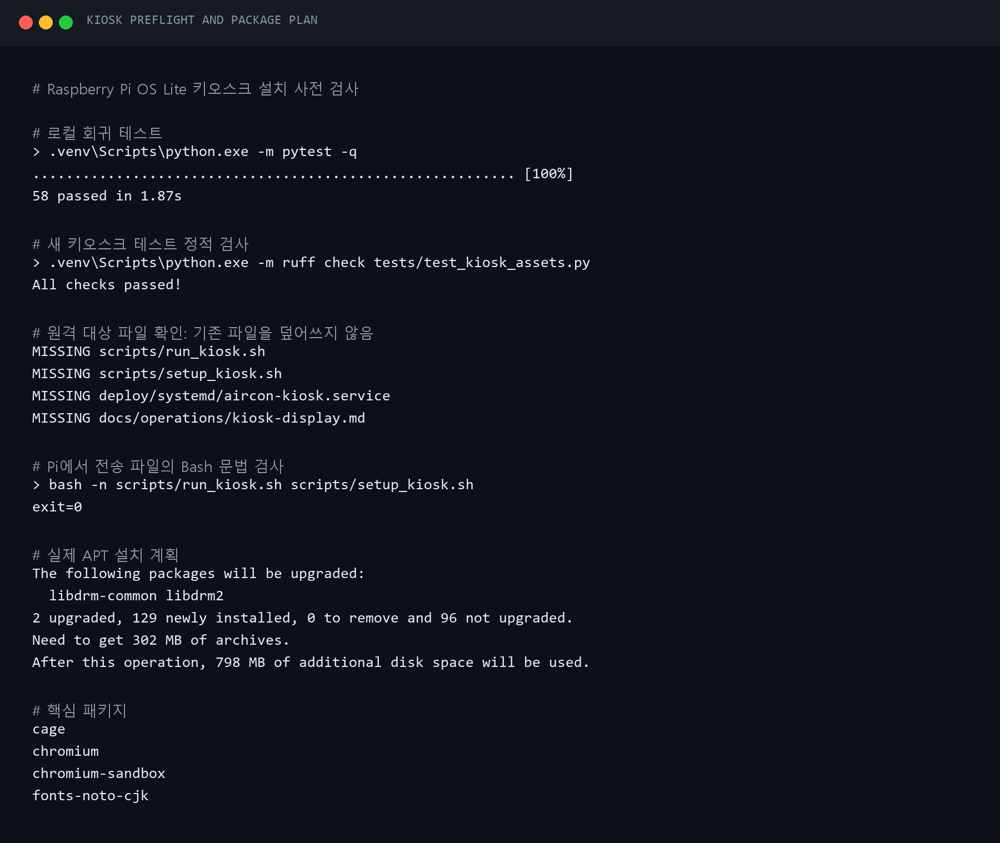

# 2026-09-07 — Raspberry Pi OS Lite 터치 키오스크 구성

## 목표

13인치 터치 디스플레이를 Raspberry Pi에 연결했을 때 콘솔 대신 기존 스마트홈 웹앱이
전체화면으로 자동 실행되게 한다. 전체 데스크톱은 설치하지 않고 Lite 운영 기반을
유지한다. 외부 접근은 기존처럼 Tailscale과 8001 포트를 사용한다.

## 적용한 구조

```text
Raspberry Pi OS Lite
  → systemd aircon-kiosk.service
  → Cage (Wayland 단일 앱 컴포지터)
  → Chromium kiosk
  → Pi 자신의 Tailscale IPv4:8001
  → FastAPI 스마트홈 대시보드
```

설치 패키지는 `cage`, `chromium`, `chromium-sandbox`, `fonts-noto-cjk`로 제한했다.
실제 설치 결과는 129개 신규 패키지, 2개 그래픽 라이브러리 업그레이드, 302MB 다운로드,
약 798MB 추가 디스크 사용이었다. 재부팅은 하지 않았다.

## 배포 전 검사

- 전체 회귀 테스트: 58개 통과
- 키오스크 자산 Ruff 검사: 통과
- `git diff --check`: 통과
- 원격 네 대상 파일: 모두 기존 파일 없음
- Pi의 `bash -n`: 두 스크립트 모두 통과
- 전송 후 로컬·원격 SHA-256: 일치



## 이슈 1 — 전송한 설치 스크립트를 직접 실행하지 못함

첫 명령은 다음 오류로 멈췄다.

```text
sudo: ./scripts/setup_kiosk.sh: command not found
```

문법 오류가 아니라 Windows에서 새로 전송한 파일에 Linux 실행 비트가 없던 것이 원인이었다.
`sudo bash scripts/setup_kiosk.sh`로 인터프리터를 직접 지정해 설치했고, 설치 과정에서 이후
직접 실행할 수 있도록 두 키오스크 스크립트에 `0755`를 적용하게 수정했다. 운영 문서의 첫
설치 명령도 같은 방식으로 바꿨다.

## 이슈 2 — 설치 직후 키오스크 서비스가 inactive가 됨

패키지와 unit 설치는 성공했지만 첫 검증에서 `enabled`, `inactive`가 나왔다. 저널에는
키오스크 시작 뒤 `getty@tty1` 종료가 이어졌고, 키오스크 프로세스가 `SIGHUP`으로 끝난
기록이 있었다.

```text
Started aircon-kiosk.service
Stopping getty@tty1.service
Stopped getty@tty1.service
aircon-kiosk.service: Deactivated successfully
```

원인은 같은 `tty1`을 사용하던 콘솔과 키오스크의 전환 순서 경쟁이다. unit에
`After=getty@tty1.service`를 추가했다. `Conflicts=getty@tty1.service`와 함께 적용되므로
기존 콘솔이 먼저 정지한 뒤 키오스크가 시작된다.

재배포 후에는 `enabled`, `active (running)`, `NRestarts=0`을 확인했다. 기존 FastAPI 사용자
서비스와 Tailscale도 계속 active였다.


## 현재 검증 범위

두 HDMI 커넥터가 모두 `disconnected`인 상태다. 키오스크 런처는 실패·재시작을 반복하지
않고 `sleep 5`로 디스플레이 연결을 기다리는 것까지 확인했다. 실제 Cage/Chromium 화면,
터치 좌표, 회전, 해상도, 화면 꺼짐은 13인치 디스플레이를 연결한 뒤 검증해야 한다.

실물 연결 사진은 사용자가 제공하면 EXIF를 제거한 공개본을 `docs/assets/hardware/display/`
아래에 보존한다.

## 변경 파일

- `scripts/run_kiosk.sh`
- `scripts/setup_kiosk.sh`
- `deploy/systemd/aircon-kiosk.service`
- `docs/operations/kiosk-display.md`
- `tests/test_kiosk_assets.py`

## 공개 전 보안 점검

터미널 캡처에는 비밀번호, 인증 URL, SSH 키, 사설 IP와 세션 식별자를 넣지 않았다. 실제
디스플레이 사진도 게시 전에 `scripts/sanitize_blog_images.py`로 메타데이터 0건을 확인한다.

## 이슈 3 — HDMI 연결 뒤에도 cloud-init 마지막 문구가 남음

13인치 화면을 연결하고 부팅했지만 콘솔의
`Reached target cloud-init.target - Cloud-init target` 문구에서 화면이 바뀌지 않았다.
부팅 정지와 키오스크 실패를 분리하기 위해 SSH에서 상태를 읽었다.

- Pi는 부팅 후 SSH와 기존 웹 서비스가 정상 동작했다.
- HDMI-A-1은 `connected`, 기본 모드 목록 첫 항목은 1920×1200이었다.
- USB 입력에는 `wch.cn TouchScreen`이 나타나 화면과 터치 케이블이 모두 인식됐다.
- Cage 세션은 tty1의 활성 DRM 세션이었지만 Chromium 자식과 Wayland 소켓은 없었다.
- 키오스크 세션 로그에는 `Unable to open Wayland socket: Invalid argument`가 있었다.
- Mesa도 `/home/air/.cache/mesa_shader_cache`가 읽기 전용이라 캐시를 끈다는 로그를 남겼다.

원인은 서비스의 `ProtectSystem=strict` 보안 격리다. Chromium 프로필만 쓰도록 프로젝트
런타임 폴더를 예외 처리했지만, Cage가 `XDG_RUNTIME_DIR=/run/user/1000`에 Wayland 소켓을
만들 권한은 열지 않았다. 서비스는 Cage PID가 남아 `active`로 보였지만 웹 클라이언트는
시작되지 않았다.

로컬 수정은 다음처럼 최소화했다.

- `/run/user/1000`을 서비스의 `ReadWritePaths`에 추가
- `XDG_RUNTIME_DIR=/run/user/1000`을 명시
- Mesa/Chromium 캐시는 `runtime/kiosk/cache`로 이동
- 설치 스크립트가 캐시 폴더도 생성
- 전체 테스트 62개, Ruff와 두 Bash 스크립트 구문 검사 통과


사용자 승인 후 unit과 두 스크립트만 Pi에 재배포했다. 설치 unit의 SHA-256이 로컬 기준본과
일치하고 `systemd-analyze verify` 및 두 Bash 스크립트 구문 검사가 통과한 뒤 다음 최소 변경을
적용했다.

첫 전송에서는 여러 파일의 목적지를 프로젝트 루트 하나로 지정해 같은 이름의 비활성 사본
3개가 루트에 생겼다. 이를 숨기지 않고 즉시 올바른 하위 경로로 다시 전송했으며, 운영 파일의
체크섬을 재검증했다. 루트 사본은 코드나 unit에서 참조하지 않는다. 원격 삭제는 별도 승인
대상이므로 승인 전까지 보존하고 `ISSUE-041`로 추적한다.

- `runtime/kiosk/cache`를 `air:air`, `0750`으로 생성
- 새 unit을 `/etc/systemd/system/aircon-kiosk.service`에 설치
- `daemon-reload` 후 `aircon-kiosk.service`만 재시작

재시작 뒤 서비스는 `active`, `NRestarts=0`이었고 `/run/user/1000/wayland-0`과 Cage 아래
Chromium 프로세스가 생성됐다. 새 세션에서는 기존 `Unable to open Wayland socket` 및 Mesa
캐시 읽기 전용 오류가 다시 나타나지 않았다. Pi 자신의 Tailscale 주소로 확인한 `/health`도
200이었다. 이로써 cloud-init 문구는 부팅 정지가 아니라 키오스크가 화면을 인계받지 못해
남아 있던 콘솔 마지막 줄임을 확인했다. 물리 화면의 최종 육안 확인과 터치 좌표 검증은
사용자 확인 항목으로 남긴다.


## 키오스크 전용 마우스 커서 숨김

실제 13인치 터치 화면에서 Chromium 키오스크가 정상 실행된 뒤 마우스 포인터가 화면에
남는 것을 확인했다. 전체 웹앱에서 커서를 없애면 외부 PC 사용성까지 망가지므로 키오스크
런처 URL에만 `?kiosk=1`을 추가했다. HTML은 이 값을 문서 로딩 초기에 읽고 키오스크 문서에만
`cursor: none`을 적용한다. 터치 화면에서는 포인터가 숨고, 일반 Tailscale PC·휴대폰 접속은
기존 동작을 유지한다.

전체 65개 테스트와 Ruff, JavaScript 문법 검사를 통과했다. 로컬 PC에는 Bash 런타임이 없어
기존 ISSUE-038의 절차대로 스크립트 내용을 SSH 표준입력으로 보내 Pi의 `bash -n`으로 검사했다.
원격 사전 비교에는 커서 CSS와 키오스크 URL 변경만 있었고 다른 Pi 변경은 없었다.

사용자 승인 후 `app/static/index.html`과 `scripts/run_kiosk.sh`만 전송했고 두 SHA-256이 로컬
기준본과 일치했다. 이어서 Pi 전체를 재부팅했다. SSH가 실제로 끊겼다가 다시 연결됐으며
부팅 45초 시점에 systemd는 `running`, Tailscale·웹앱·키오스크는 `active`, 키오스크 재시작은
0회였다. `wayland-0`, Chromium 11개 프로세스, 실행 URL의 `?kiosk=1`, health 200과
Mosquitto·Zigbee2MQTT 자동 복구도 확인했다.

첫 HTML 검증에서는 `curl | grep -q`의 조기 파이프 종료 때문에 `curl (23)`이 섞였다. 앱
장애가 아니라 검사 명령의 동작이므로 응답 전체를 변수에 저장한 뒤 커서 규칙을 검사해 오류
없이 다시 확인했다. 실제 화면에서 커서가 사라졌는지는 사용자의 육안 확인 항목으로 남긴다.


