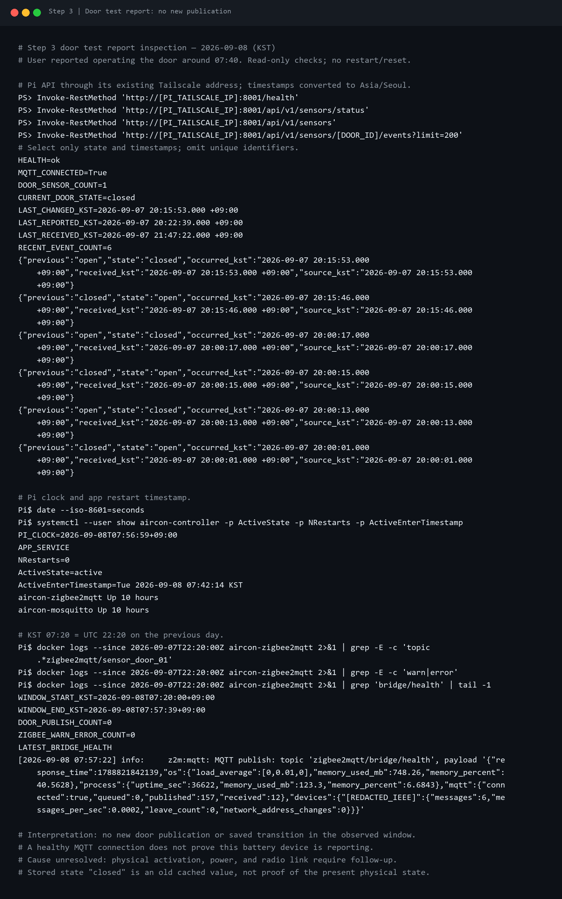
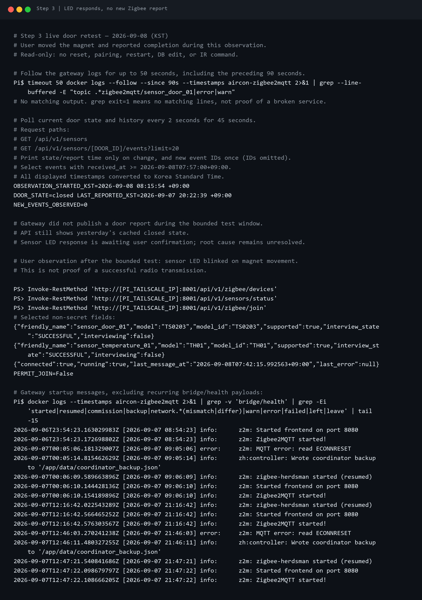
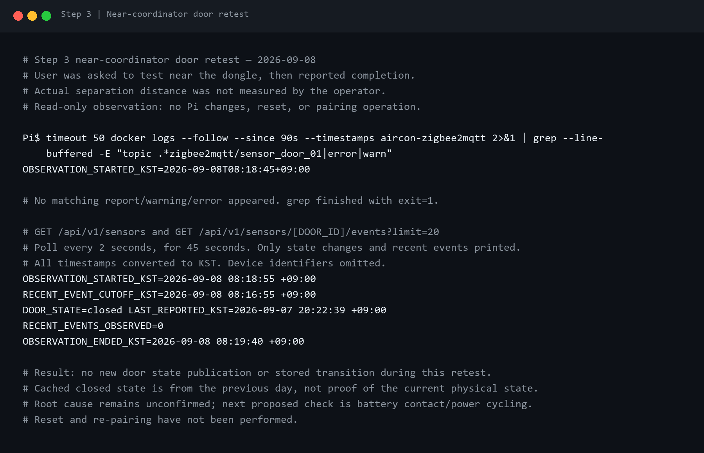
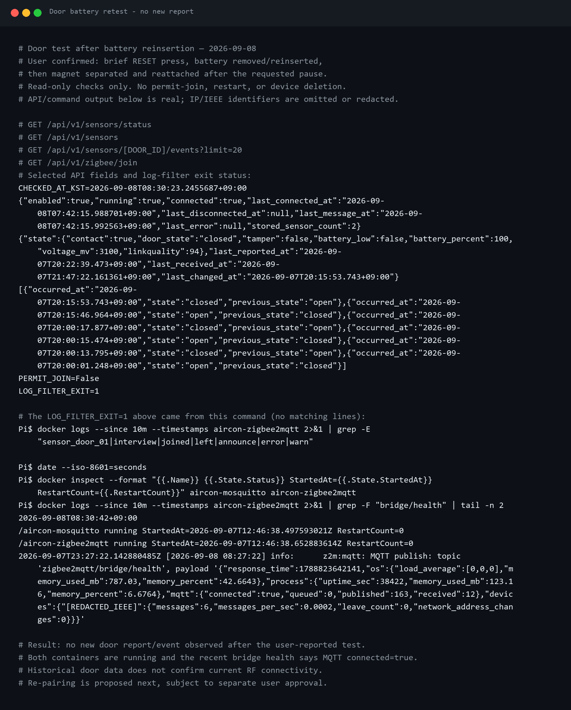
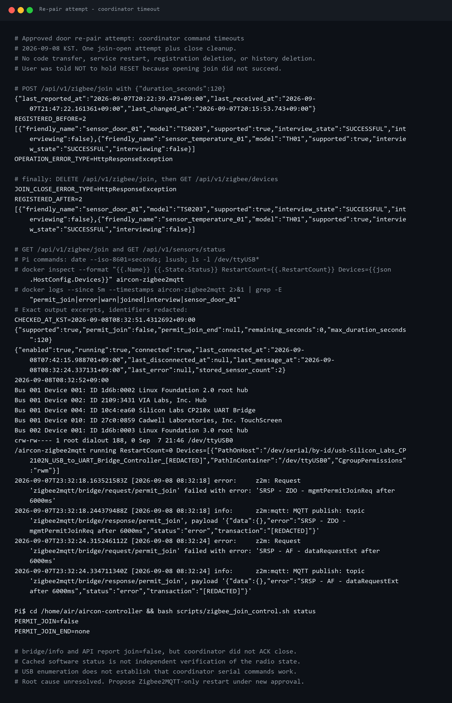
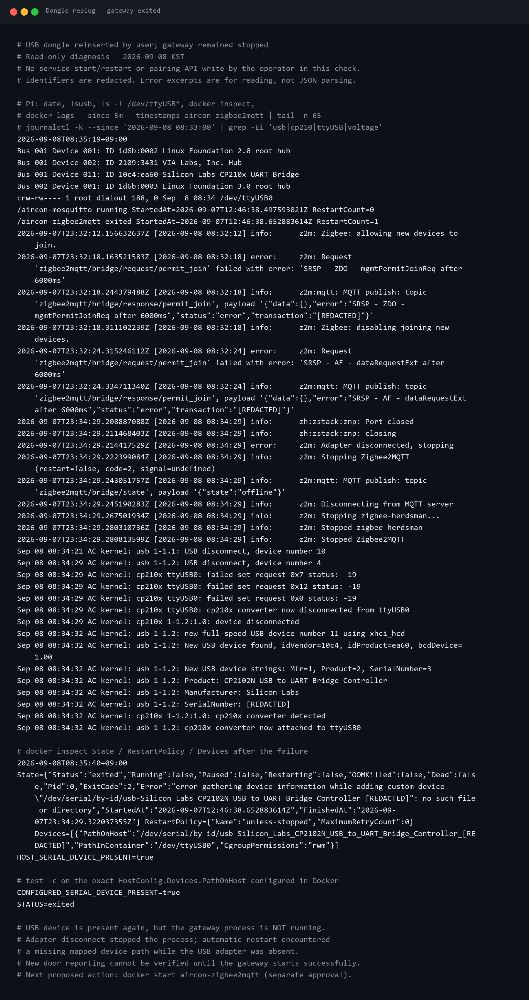

# Step 3 — 실시간 대시보드·자동화 Pi 0.7.0 배포

## 승인과 변경 범위

사용자가 제시된 한 번의 배포를 승인한 뒤 로컬 기준본의 운영 파일 11개를
`/home/air/aircon-controller`에 반영했다. 날짜는 2026-09-08, 버전은 0.6.0 → 0.7.0이다.

- `app/main.py`, `app/events.py`
- `app/automations/{__init__,service,store}.py`
- `app/sensors/service.py`, `app/devices/service.py`
- `app/static/{index.html,sensors.js,automations.js}`
- `pyproject.toml`

운영 중인 여섯 기존 파일의 SHA-256이 이전 배포 기준과 일치하고 신규 다섯 파일은 아직
없음을 먼저 확인했다. 예상하지 못한 원격 수정은 없었다. 기존 여섯 파일은 Pi의
`runtime/deployment-backups/pre-0.7.0-<TIMESTAMP>.tar.gz`에 먼저 백업했다.
최종 전송량은 227,084바이트다. 센서·도어 이력·기기 설정·Zigbee DB와 인증정보는
전송 대상에 포함하지 않았으며 삭제 동기화도 사용하지 않았다.

## 배포 전 회귀 수정

독립 코드 검토에서 새 SSE 경로가 기존 온습도 자동 화면 갱신 정책을 우회하는 문제를
발견했다. UI에 정지 중이라고 표시하면서도 `sensor.updated`가 오면 값이 즉시 바뀌었다.
재접속 시 `force:true`로 전체 REST 상태를 읽는 경로도 같은 문제였다.

승인된 파일 범위 안에서 다음을 보정하고 재검증했다.

1. 온습도 SSE는 표시값을 바꾸지 않는다. 서버의 MQTT 수신·SQLite 저장은 계속한다.
2. 자동 REST 조회는 자동 갱신 활성화, 한국 시간 기준 정지 구간, 마지막 표시 갱신 이후
   설정 간격을 모두 확인한다. 재접속과 페어링 중 강제 조회도 이 정책을 우회하지 않는다.
3. 최초 화면 로드와 사용자가 누른 수동 갱신은 최신 저장값을 즉시 읽는다. 새 측정을
   센서에 강제하는 기능은 아니며 실제 보고 시각은 따로 표시한다.
4. 도어센서는 실시간 갱신을 유지한다. 재접속 시 자동화 상태·이력도 REST로 복구한다.
5. 두 JavaScript URL에 `v=20260908-1`을 붙여 기존 브라우저 캐시와 구분한다.

로컬 Ruff, Python 테스트 74개, JavaScript 구문 검사와 Node 회귀 테스트 12개가 통과했다.
Node 테스트는 실제 파일의 함수를 실행해 07:00/19:00 경계, 자정 넘는 정지 구간,
자동 갱신 꺼짐, 간격, 수동 갱신과 도어 SSE를 검사한다. UTC·미국·한국의 기본 시간대를
사용하는 별도 프로세스에서도 정지 구간은 한국 시간 기준으로 같았다.

## 설치 실패와 해결

기존 의존성을 유지하면서 빌드 다운로드도 생략하려고 처음에는 다음을 실행했다.

```bash
.venv/bin/python -m pip install --no-deps --no-build-isolation -e .
```

하지만 Pi 가상환경에 빌드 백엔드가 없어 `Cannot import 'setuptools.build_meta'`로
실패했다. 이 명령과 서비스 재시작을 `&&`로 연결했으므로 실패한 시도에서 앱은
재시작하지 않았다. 불필요한 전역 패키지 설치 대신 pip의 기본 격리 빌드를 복원했다.

```bash
.venv/bin/python -m pip install --no-deps -e .
.venv/bin/python -m pip check
systemctl --user restart aircon-controller
sudo systemctl restart aircon-kiosk
```

격리된 빌드 환경에서 패키지를 만들고 0.7.0 설치와 `No broken requirements found.`를
확인했다. `--no-deps`로 기존 앱 의존성 버전을 보존했다. sudo 암호는 대화형 프롬프트에만
입력했으며 파일·터미널 캡처에는 남기지 않았다.


## 실제 검증 결과

| 확인 | 결과 |
|---|---|
| 재시작 후 코드 체크섬 | 로컬·Pi 11/11 일치 |
| 설치 패키지 / OpenAPI 버전 | 0.7.0 / 0.7.0 |
| 앱 / 키오스크 | 모두 active·running, NRestarts=0 |
| 최근 5분 앱 로그 오류 검색 | ERROR/Traceback/Exception 일치 0건 |
| MQTT / 저장 센서 | connected=true / 도어·온습도 2개 |
| Zigbee 장치 / 새 가입 | 2개 / permit_join=false |
| 자동화 | 1개, 활성화, 기본 300초, 경고 비활성, 이력 0건 |
| SSE | HTTP 200, text/event-stream, stream.ready와 keep-alive 수신 |
| 관찰 중 센서 SSE | 0건 — 이 점검에서는 실물 센서를 조작하지 않음 |
| PC → Pi Tailscale HTTP | health=ok, API 0.7.0 |
| 키오스크 커서 설정 | 실행 중 Chromium의 ?kiosk=1 및 CSS 선택자 확인 |
| 실제 IR 제어 명령 | 0회 |

키오스크 설정·프로세스를 확인한 것이며 이번에 패널의 실제 커서 비표시를 사람이
재확인한 것은 아니다. Mosquitto와 Zigbee2MQTT 컨테이너는 중단·재시작하지 않았다.
자동화도 지금 단계에서는 화면 경고와 이력만 남기며 에어컨을 임의로 끄지 않는다.


재현 가능한 HTTP 점검 기준본은 `scripts/verify_live_dashboard.py`다. Pi에 파일로
배포하지 않고 SSH 표준입력으로 실행했으며 주소·고유 ID·센서 원문은 출력하지 않는다.

## 남은 확인과 운영 리스크

- 실제 문을 열고 닫아 화면·이력의 즉시 갱신을 확인한다.
- 사용자와 함께 에어컨의 마지막 명령 상태를 맞춘 뒤 경고 지연을 1분으로 임시 설정해
  경고 1건과 닫힘/끄기 후 해제를 확인하고 5분으로 복구한다. 아직 수행하지 않았다.
- IR은 실제 에어컨 상태 피드백이 없으므로 자동화는 마지막 성공 명령에서 추론한
  상태를 사용한다. 기존 물리 리모컨으로 조작한 상태와 다를 수 있다.
- MQTT 단절·재연결과 화면 회전·절전 현장 점검은 남아 있다.
- 코드 검토상 Uvicorn 기본 graceful shutdown 대기는 제한이 없고 SSE는 장기 연결이다.
  이후 키오스크/원격 브라우저가 연결된 상태에서 앱을 재시작하면 systemd의 강제 종료
  시한까지 지연될 수 있다. 이번 이전 버전에는 SSE가 없어 첫 재시작은 정상 완료했다.
  종료 시간 제한 설정은 이번 11개 파일에 포함되지 않은 실행 스크립트 변경이므로
  별도 운영 보완 항목으로 남긴다. 해결됐거나 실기 재현한 것으로 기록하지 않는다.

따라서 Step 3는 **운영 배포·기본 연결 검증 완료, 최종 실물 통합시험 대기**다.
Step 4의 ESP32-H2 노드 구현이나 배선 변경은 이번에 진행하지 않았다.

## 후속: 사용자가 보고한 오전 07:40 문 조작 조회

사용자가 오전 07:40경 이미 문을 조작했다고 알려 07:55~07:57에 읽기 전용으로 조회했다.
API의 전체 최근 도어 이벤트는 기존 6건이며 새 이벤트가 없었다. 마지막 전환은 전날
2026-09-07 20:15:46 열림, 20:15:53 닫힘(KST)이다. 마지막 실제 보고는 같은 날
20:22:39, 앱 수신 시각은 21:47:22로 오늘 조작과 구분된다. 현재 `closed`는 저장값이지
현재 물리 상태가 확인됐다는 의미는 아니다.

Pi 시계는 한국 시간과 일치했고 앱은 07:42:14에 재시작돼 실행 중이었다. 그러나 앱보다
앞단의 Zigbee2MQTT 로그에서도 07:20~07:57:39 사이 `sensor_door_01` 발행은 0건이었다.
같은 구간 warning/error 검색은 0건이고 07:57:22의 bridge health는 MQTT connected=true,
queued=0으로 확인됐다. 앱 배포로 해당 순간을 놓쳤거나 UI 시간 변환만 틀어진 것으로
단정할 근거는 없다. 현재 근거로는 게이트웨이에 새 도어 상태 발행이 없는 상황이다.

센서 본체 LED가 실제 조작에 반응했는지, 자석 간격과 설치 위치, 전원 및 무선 연결 상태를
사용자와 확인해야 한다. 원인은 아직 미확정이다. 초기화·재페어링·서비스 재시작·DB 변경은
하지 않았고, 해당 물리 조작을 성공한 통합시험으로 기록하지 않았다.



### 08:15~08:16 사용자 재시험

사용자가 지금 조작하겠다고 알려 Zigbee2MQTT 로그를 최대 50초 따라 읽고, API는
08:15:54부터 45초 동안 2초 간격으로 조회했다. 관찰 도중 사용자가 조작 완료를 알렸다.
게이트웨이 로그에서는 도어 토픽 발행·경고·오류에 해당하는 새 출력이 없었고,
API의 새 이벤트도 0건이었다. 현재 표시 상태는 계속 전날 20:22:39 보고의 저장된 닫힘이다.

로그 조회 파이프의 종료 코드 1은 `grep` 일치 행이 없다는 뜻이며 서비스 장애 판정으로
사용하지 않았다. 센서 LED가 깜빡였는지 사용자 확인을 요청했다. 이번에도 센서 초기화,
재페어링이나 Pi 변경은 하지 않았으며 ISSUE-052의 원인은 아직 미확정이다.



사용자가 후속 답변으로 **자석 조작 시 LED가 깜빡였음**을 확인했다. 이는 본체가
자석 움직임에 반응한다는 관찰이며 Zigbee 송신 성공을 증명하지는 않는다. 등록 목록에는
TS0203 도어와 TH01 온습도 두 장치가 supported=true, interview_state=SUCCESSFUL로
남아 있었다. 앱 MQTT는 connected=true, last_error=null이다. 성공한 과거 인터뷰나
MQTT 접속 상태를 현재 센서 무선 연결의 증거로 혼동하지 않는다.

최근 도어 토픽의 기존 payload를 확인하니 전날 21:47:22 발행에서도 `last_seen`은
20:22:39(KST)였다. 따라서 수신 시각 21:47:22는 최신 물리 개폐 측정이 아닌 과거 상태
재발행과 일치한다. 다음에는 초기화하지 않은 채 동글 가까이에서 자석을 조작해
거리·차폐 문제인지 확인할 계획이다. 무선 연결 상실, 거리·차폐와 전원 문제 중 어느 것이
원인인지는 아직 확정하지 않았다.

### 08:18~08:19 동글 근처 재시험 안내 후 관찰

동글 약 1m 부근에서 재시험을 안내한 뒤 사용자가 조작 완료를 알렸다. 실제 거리는
측정하지 않았으므로 거리 문제가 완전히 배제됐다고 단정하지 않는다. 게이트웨이 로그는
08:18:45부터 최대 50초, API는 08:18:55~08:19:40 동안 2초 간격으로 관찰했다.
새 도어 보고나 이벤트는 다시 0건이었다. API 현재값도 전날 20:22:39 보고 상태 그대로다.

다음에는 초기화나 재페어링 전에 배터리 접촉과 센서 전원 재연결을 사용자에게 안내한다.
앞서 LED 반응이 있었다고 해서 무선 송신에 충분한 전원이나 연결을 보장하지는 않는다.
배터리 탈착은 아직 수행 확인 전이며 Pi 변경·서비스 재시작·가입 허용은 하지 않았다.
ISSUE-052는 미해결 상태로 유지한다.



### 08:25 사용자 RESET 조작 보고

사용자가 실수로 RESET을 눌렀다고 알렸다. 누른 시간과 현재 LED 점멸 상태는 아직
확인되지 않아 공장 초기화 또는 페어링 모드 진입을 확정하지 않는다. 보고 직후
08:25:22(KST)에 읽기 전용 API 조회로 `permit_join=false`, 등록 장치 2대,
도어의 기존 인터뷰 `SUCCESSFUL`을 확인했다. 도어의 마지막 보고와 수신 시각은
각각 전날 20:22:39, 21:47:22로 그대로였다. 기존 등록 정보가 남아 있다는 사실만으로
현재 무선 연결을 정상이라고 판정하지 않는다. 앞선 미수신 증상은 이번 RESET 보고보다
먼저 발생했으므로 RESET을 최초 장애 원인으로 기록하지 않는다.

가입 허용, 장치 삭제, 재페어링 또는 서비스 재시작은 하지 않았다. 먼저 짧게 누른 것인지
길게 누른 것인지와 LED 상태를 확인하고, 재가입이 필요하면 별도 승인을 받아 진행한다.

### 08:28 짧은 RESET 및 배터리 재삽입 확인

사용자가 RESET은 잠깐 눌렀으며 배터리를 뺐다가 다시 꽂았다고 확인했다. 배터리 탈착은
사용자 수행으로 기록하되 짧은 RESET의 결과를 초기화 또는 정상 복구로 단정하지 않는다.
08:28:33(KST) 읽기 전용 재조회에서 MQTT 연결은 정상이나 마지막 도어 보고는 여전히
전날 20:22:39, 마지막 상태 전환은 20:15:53이며 최근 이벤트 6건도 모두 전날 기록이다.
직전 10분 Zigbee2MQTT 로그의 도어 토픽·가입·인터뷰·탈퇴·announce·경고·오류 검색에는
일치 행이 없었다. `grep` 종료 코드 1은 일치 없음이며 서비스 실패가 아니다.

첫 조회 스크립트가 센서 API에도 `friendly_name` 필드가 있다고 가정해 `Door lookup
failed`로 중단됐다. 로컬 API 스키마에서 센서 식별자가 `device_id`임을 확인하여 필터와
이벤트 URL을 바로잡았고 위 재조회는 완료됐다. 이는 점검 스크립트의 오류이지 센서
미수신 원인이 아니다. Pi 파일·서비스·가입 상태는 변경하지 않았다.

전원 재연결만으로 접점 보고가 반드시 발생하는지는 확인되지 않았으므로 다음 검증은
배터리 재삽입 후 자석을 한 번 떼고 붙이는 것으로 한정한다. 새 보고가 없다면 같은
실험을 반복하지 않고 별도 승인 후 재가입을 검토한다. 반복된 과거 상태 출력은
캡처 59와 동일하여 별도 PNG를 중복 생성하지 않았다. ISSUE-052는 미해결이다.

### 08:30 배터리 재삽입 후 접점 재시험 결과

사용자가 자석을 떼고 다시 붙였다고 알려 08:30:23(KST)에 API와 직전 10분 로그를
조회했다. 도어의 보고·수신·상태 전환 시각은 모두 전날 그대로였으며 새 이벤트는 없었다.
도어·가입·인터뷰·탈퇴·announce·경고·오류 로그 필터도 일치 행 0건이었다.
08:30:42 확인한 Mosquitto와 Zigbee2MQTT 컨테이너는 모두 running, RestartCount=0이며,
08:27:22 bridge health는 MQTT connected=true, queued=0을 보고했다.

앱 `last_message_at`이 07:42:15로 남은 것은 모든 MQTT 트래픽의 시각을 뜻하지 않는다.
현재 앱은 bridge/health를 구독하지 않으며 MQTT keepalive도 해당 시각을 갱신하지 않는다.
앱↔브로커와 게이트웨이 프로세스 실행은 확인했지만 센서↔동글의 현재 RF 연결은 여전히
미확인이다. 배터리 잔량·전압도 과거 저장값이므로 현재 전원을 정상으로 보증하지 않는다.

같은 접점 시험을 더 반복하지 않고 기존 등록과 이력 삭제 없이 120초 가입 허용,
도어 재페어링, 성공 또는 시간 만료 시 가입 닫기를 다음 절차로 제안한다. 가입 상태와
런타임 정보에 영향을 주므로 별도 사용자 승인 전에는 실행하지 않는다. 이번 확인에서도
Pi 변경은 없었고 ISSUE-052의 원인은 확정되지 않았다.



### 08:32 승인된 재가입 시도에서 Coordinator 응답 시간 초과

사용자가 120초 가입 허용 및 종료 후 닫기 작업을 승인했다. 기존 등록 2대와 과거 도어
시각을 확인한 뒤 `POST /api/v1/zigbee/join`에 `duration_seconds=120`을 한 번 전달했다.
그러나 08:32:18(KST)에 Zigbee2MQTT가 `SRSP - ZDO - mgmtPermitJoinReq after 6000ms`를
반환했고 API 요청은 `HttpResponseException`으로 끝났다. 정리 절차의
`DELETE /api/v1/zigbee/join`도 08:32:24에 `SRSP - AF - dataRequestExt after 6000ms`로
실패했다. 가입이 열렸다고 사용자에게 안내하지 않았으며 RESET을 길게 누르지 않도록
즉시 요청했다. 자동 재시도, 장치 삭제, 서비스 재시작은 하지 않았다.

08:32:51 API와 이후 읽기 전용 `zigbee_join_control.sh status`의 retained bridge/info는
모두 `permit_join=false`를 표시했다. 단, Coordinator가 닫기 요청을 응답하지 않았으므로
소프트웨어의 기존 가입 상태와 실제 무선 가입 상태가 검증됐다는 주장은 구분한다.
현재 등록 2대는 그대로이며 센서 보고의 복구는 확인되지 않았다.

Pi에는 CP210x USB UART와 `/dev/ttyUSB0`이 존재하고 Zigbee2MQTT 컨테이너도 running,
RestartCount=0이었다. 07:00 이후 커널 로그에서 조회된 USB 재연결은 터치스크린이며
동글의 분리 기록으로 해석하지 않았다. 실제 식별자는 공개용 캡처에서 삭제했다.

센서가 보내는 보고만 없는 상황에 더해, 게이트웨이가 발행한 Coordinator 제어 명령의
응답도 없다는 새로운 증거를 얻었다. 동글/직렬 통신/펌웨어 처리 경로를 우선 의심하지만
동글의 물리 고장이나 최초 미수신 원인으로 확정하지 않는다. 다음 복구안은 별도 승인 후
Zigbee2MQTT 컨테이너만 재시작하여 기존 네트워크로 복구되는지, 가입 닫기 명령에 응답하는지
확인하는 것이다. 해당 재시작은 이번 재페어링 승인 범위에 넣어 임의 실행하지 않았다.



공식 [Zigbee2MQTT FAQ](https://www.zigbee2mqtt.io/guide/faq/#zigbee2mqtt-crashes-after-some-time)는
같은 `mgmtPermitJoinReq` SRSP 시간 초과를 어댑터 정지 증상으로 설명하고 USB 재삽입과
Zigbee2MQTT 재시작을 복구 방법으로 안내한다. 이를 확인한 뒤 최종 제안은 서비스 정지,
사용자의 동글 USB 재삽입, 서비스 시작 및 가입 닫기 응답 검증 순서로 구체화했다.
코드·네트워크 키·DB를 바꾸지 않고 도어/온습도 수신만 일시 중단하는 작업이며,
별도 승인과 사용자 USB 조작이 필요하다. 아직 실행하지 않았다.

### 08:35 사용자 동글 USB 재삽입 후 게이트웨이 종료 확인

사용자는 이미 동글 USB를 뺐다가 꽂았으며 약 2분 뒤 문을 조작하겠다고 알렸다.
운영자가 서비스 정지·시작을 실행하기 전에 사용자가 USB를 재삽입한 상황이다.
커널과 Zigbee2MQTT 로그는 08:34:29 분리 및 `Adapter disconnected, stopping`,
08:34:32 CP210x의 `/dev/ttyUSB0` 재연결을 보여준다.

08:35:19 및 08:35:40 조회에서 Mosquitto는 running이지만 Zigbee2MQTT는 exited,
ExitCode=2, RestartCount=1이었다. Docker의 State.Error에는 재시작 과정에서 설정된
`/dev/serial/by-id/…` 장치 정보를 찾지 못했다는 오류가 남았다. 정책은 `unless-stopped`이며
현재는 같은 설정 경로에 문자 장치가 다시 존재함을 별도 확인했다. 이는 USB 분리 당시
발생한 자동 재시작 실패로 판단하며, 앞서 발생한 SRSP 정지의 최초 원인과 구분한다.

현재 수신 프로세스가 없어서 예정된 문 시험은 보류하도록 즉시 안내했다. 기다리거나
센서를 반복 조작하는 것만으로 수신을 검증할 수 없는 상태다. 사용자에게 기존 컨테이너의
`docker start aircon-zigbee2mqtt` 1회 및 복구 후 가입 닫기 응답 확인을 별도 승인받을
예정이다. 코드·네트워크 설정·등록 이력 삭제, 컨테이너 재생성, Pi 재부팅은 하지 않는다.



이후 사용자가 문 조작 완료를 알려 08:36:33(KST)에 재조회했으나 새 도어 이벤트는 없고
Zigbee2MQTT는 여전히 `STATUS=exited RUNNING=false`였다. 앱 MQTT 연결은 true이지만
게이트웨이 실행과는 별개다. 이번 개폐를 정상 수신 시험으로 판정하지 않으며 서비스
시작 승인 후 게이트웨이 복구가 먼저 필요하다고 안내한다.

### 08:39 승인된 게이트웨이 시작 중 USB 호스트 컨트롤러 정지

사용자가 재시작을 승인하고 이번에는 문 대신 온습도계로 검증하도록 요청했다.
시작 전 온습도 저장값은 24.86°C, 38.92%이며 마지막 실제 보고는 전날 22:52:29(KST)였다.
설정된 by-id 경로의 문자 장치가 존재함을 확인한 뒤 종료된 기존 컨테이너에
`docker start aircon-zigbee2mqtt`를 한 번 실행했다. 08:39:00 running으로 바뀌었으나
08:39:13 Zigbee 초기화가 `I/O error, cannot open /dev/ttyUSB0`로 실패했다.

같은 시각 커널에는 다음이 기록됐다.

```text
xHCI host not responding to stop endpoint command
Host halt failed, -110
xHCI host controller not responding, assume dead
HC died; cleaning up
```

이후 USB 허브와 CP210x가 분리됐고, 08:39:46/08:40:17의 `lsusb`에는 root hub 2개만
남았다. `/dev/ttyUSB0`과 by-id 경로도 없어졌다. 따라서 현재는 센서 RF나 컨테이너
경로만의 문제가 아니라 Pi의 USB 호스트 응답 상실을 직접 관찰한 상태다. 그러나
물리 고장·전원·드라이버·펌웨어 중 최초 원인을 확정하지 않는다. 서비스 시작과 동시에
문제가 드러난 시간 관계만으로 Docker 시작 명령 자체가 근본 원인이라고도 단정하지 않는다.

08:40:17 추가 조회는 `throttled=0x0`, CPU 38.9°C, 루트 파일시스템
`/dev/mmcblk0p2 ext4`, USB autosuspend 값 2를 반환했다. 앱·키오스크와 Mosquitto는
실행 중이나 Zigbee2MQTT는 exited다. 전압 경고 비트가 없다고 모든 USB 전원 문제를
배제하거나 autosuspend 값만으로 이를 원인으로 확정하지 않는다. 설정 변경은 하지 않았다.

초기화 실패로 온습도 새 보고 및 가입 닫기 응답 검증은 진행할 수 없었다. 온습도계 버튼이나
문 조작은 아직 요구하지 않았으며 새 측정 성공으로 기록하지 않는다. 다음은 별도 승인 후
Pi 전체 재부팅과 USB/게이트웨이/온습도 보고 복구 확인이다. USB 드라이버 강제 해제,
펌웨어 업데이트, 설정/DB 삭제와 반복 재시작은 수행하지 않았다.


### 작업별 반복 승인 병목 해소

사용자는 Pi 정상 재부팅을 승인한 뒤 매 단계 승인을 묻는 방식이 병목이라고 알렸다.
이에 로컬 `AGENTS.md`를 수정했다. 이미 사용자가 요청한 작업에 필요한 통상 배포,
서비스 복구·정상 재부팅·검증은 변경 범위와 중단 영향을 사전 안내하고 진행한다.
데이터 삭제·초기화, 보안/인증/인터넷 노출, 펌웨어·배선/핀 변경과 작업 범위 확장은
별도 확인 대상으로 유지했다. 로컬 기준본·명시적 단방향 배포·기존 데이터 보존·캡처
및 비밀정보 제거 원칙은 바꾸지 않았다. 자동 동기화나 감시도 켜지 않았다.

### 08:43 정상 재부팅 요청

SSH에서 재부팅 전 boot ID를 비공개 비교용으로 읽고, TTY의 sudo 프롬프트로만 인증하여
`sudo reboot`를 한 번 요청했다. 08:43:36(KST) 실행 시각을 기록했고 SSH가 닫혔다.
인증 입력은 명령·문서·캡처에 저장하지 않는다. 단절 자체를 재부팅 완료로 판단하지 않고
복귀 후 boot ID 변경, USB 장치, 현재 부팅의 서비스 로그와 센서 보고를 확인한다.

### 08:45 USB 및 Coordinator 제어 경로 복구 확인

08:44:22(KST)에 SSH가 복귀했고 이전과 다른 boot ID를 확인했다. 새 부팅 시작 시각은
08:43:54다. 08:45:03 조회에서 CP210x USB UART와 `/dev/ttyUSB0`이 다시 존재했다.
앱·키오스크는 active, Mosquitto·Zigbee2MQTT는 running 및 RestartCount=0이었다.
현재 컨테이너 StartedAt 이후 08:45:00에 `zigbee-herdsman started (resumed)`, Coordinator
펌웨어 조회와 `Zigbee2MQTT started!`를 확인했다. 현재 부팅의 xHCI 사망/전압 경고 필터는
일치 행이 없었다. 단순한 retained online 표시가 아니라 실제 이번 시작 로그로 판단했다.

08:45:25 가입 닫기 DELETE 요청을 실행했고 08:45:26 MQTT 응답에서
`status=ok`, `data.time=0`을 확인했다. GET도 permit_join=false다. 이전의 SRSP 시간 초과와
달리 이번에는 Coordinator의 제어 응답까지 돌아왔다. 센서 2대의 등록도 유지됐다.
코드·펌웨어·네트워크 키/설정과 DB를 교체하거나 지우지 않았다.

그러나 시작 직후 재발행된 온습도 24.86°C, 38.92%의 `last_seen`은 여전히 전날
22:52:29(KST)였다. 앱 수신 시각이 오늘 08:45:00으로 바뀐 것은 저장값 재발행이지
새 실측 성공이 아니다. 사용자가 문 조작을 할 수 없으므로 온습도계 버튼을 짧게 한 번
누르고 놓도록 안내하고 별도 새 보고 관찰을 시작했다. 길게 누르는 페어링은 요청하지 않았다.

USB/동글 제어 경로는 재부팅으로 복구됐지만 최초 정지 원인과 장기 안정성은 아직 미확정이다.
USB 분리 시 자동 시작에 실패하는 취약점도 근본 해결된 것으로 기록하지 않는다.


08:45:47~08:47:18(KST) 온습도 API를 2초 간격으로 관찰했지만 새 `last_reported_at`은
없었다. 사용자가 버튼을 눌렀는지는 아직 답변받지 못했으므로 이것만으로 센서 재장애를
판정하지 않았다. 그 시점에는 사용자 짧은 버튼 조작 또는 이후 새 보고를 기다렸다.
최종 점검에서 health HTTP 200, 두 컨테이너 running·RestartCount=0 및 현재 부팅
xHCI 오류 검색 일치 없음 상태를 유지했다.

### 08:47:26 온습도계 새 보고 확인

90초 관찰이 끝난 직후인 08:47:26.291(KST)에 온습도계의 새 보고가 들어왔다.
08:48:02 최종 API 조회에서 온도 25.08°C, 습도 표시 38.92%, 배터리 100%,
linkquality 171 및 오늘의 `last_reported_at`을 확인했다. 실제 Zigbee2MQTT 로그에도
동일 센서의 MQTT 발행과 `last_seen=2026-09-07T23:47:26.291Z`가 있었고 앱 수신 시각은
08:47:26.320427(KST)로 일치했다. 시작 시점의 어제 값 재발행과 구분되는 새 보고다.

따라서 이번 재부팅으로 USB·Coordinator 제어뿐 아니라 TH01 센서→Zigbee2MQTT→MQTT→앱의
새 데이터 수신까지 복구됐음을 확인했다. 사용자 버튼 조작 여부는 아직 답변받지 못했으므로
버튼 덕분인지 자동 보고인지는 확정하지 않는다. 동일한 습도 값의 내부 측정 시점까지
별도로 계측한 것은 아니며 메시지가 새로 들어온 사실과 표시값을 기록한다.
도어센서의 현장 개폐 검증, 최초 USB 정지 원인과 장기 안정성은 계속 남겨 둔다.
캡처 64에는 관찰 창 종료 당시 미수신과 뒤이은 실제 새 보고를 모두 순서대로 보존했다.

### 08:57~08:58 디스플레이 USB 전원 부하 가설과 분리 후 기준 상태

사용자가 Pi USB로 동글과 13인치 디스플레이에 동시에 전원을 공급한 것이 원인일 수
있는지 질문했고, 이어 디스플레이 USB를 제거했다고 알려 주었다. 정확한 제거 시각과
화면 소비전류·Pi 어댑터 정격은 확인하지 않았다. 따라서 08:57:24 조회가 제거 전인지
후인지 단정하지 않는다. 이 조회에서 실제 보드는 Raspberry Pi 4 Model B Rev 1.4,
throttled=0x0, 온도 40.4°C였고 CP210x 동글이 열거됐다.

공식 문서상 Pi 4의 USB 전원 한도는 포트마다가 아니라 전체 합계 1.2A다.
5V 기준 약 6W이므로 화면과 동글의 합산 부하를 검토할 이유가 있다. 단, 화면 크기나
어댑터 정격만으로 실제 소비전류를 확정하지 않는다. 이전 xHCI 정지는 증상이며,
throttled=0x0은 USB 분기 전류 측정이 아니므로 전원 문제를 확정하거나 완전히 배제하지 않는다.

- [공식 USB 전원 한도](https://www.raspberrypi.com/documentation/computers/raspberry-pi.html#maximum-power-output)
- [공식 get_throttled 설명](https://www.raspberrypi.com/documentation/computers/os.html#get_throttled)

제거 알림 후 08:58:04 읽기 전용 조회에서는 동글 열거, 앱 active, Zigbee2MQTT와
Mosquitto Up 13 minutes를 확인했다. 현재 부팅의 전압·과전류·xHCI 장애 필터에는
일치 행이 없었다. Pi loopback 8001 조회는 연결 실패했으나 기존 Tailscale 주소로
조회하자 health HTTP 200과 센서 API가 정상 응답했다. loopback 실패를 USB 재장애로
판정하거나 서비스를 재시작하지 않았다. 최신 TH01 보고는 여전히 08:47:26이며
이번 분리 이후의 새 센서 보고까지 확인한 것은 아니다.

화면 제조사가 지원하는 별도 전원 입력과 정격 어댑터로 전원을 분리한 뒤 비교하는 것을
다음 시험으로 제안한다. 실제 배선 변경은 정상 종료 후 수행하고 지원 여부를 모르는
이중 USB 전원이나 Y 케이블을 사용하지 않는다. 터치 데이터 연결 유지 방법은 화면
모델·포트 구성을 먼저 확인한다. 이번에는 읽기 전용 점검과 문서 기록만 수행했다.
분리 후 장기 안정성이나 최초 장애 원인 해결을 선언하지 않는다.


### 사용 중인 전원과 디스플레이 모델 확인

사용자가 본체 전원은 Raspberry Pi 공식 27W USB-C 어댑터(SC1417, 판매 페이지 표기
5.1V/5A), 화면은 AliExpress 상품 ID `1005011932746434`의 13.3인치 1920×1200 터치
휴대용 모니터라고 확인했다. 공식 Pi 5용 어댑터를 Pi 4 본체에 사용하는 것은 전원 용량상
부족한 구성이 아니다. 하지만 Pi 4의 USB-A 하류 공급 한도는 어댑터 용량과 별개로 네 포트
전체 1.2A이므로, 화면을 Pi USB-A에서 직접 구동하는 방식은 분리 시험이 필요한 구성이다.

모니터 판매 페이지에서 정확한 입력 전압·전류와 각 USB-C 포트 역할을 확인하지 못했으므로
화면의 실제 소비전력을 추정값으로 확정하지 않는다. 다음 설치에서는 제품 라벨·포트 표기를
확인해 화면을 별도 전원으로 공급하고 HDMI와 터치 데이터만 Pi에 연결한다. 이 결정을
`docs/decisions/0012-separate-display-power-from-pi-usb.md`에 기록했다.
