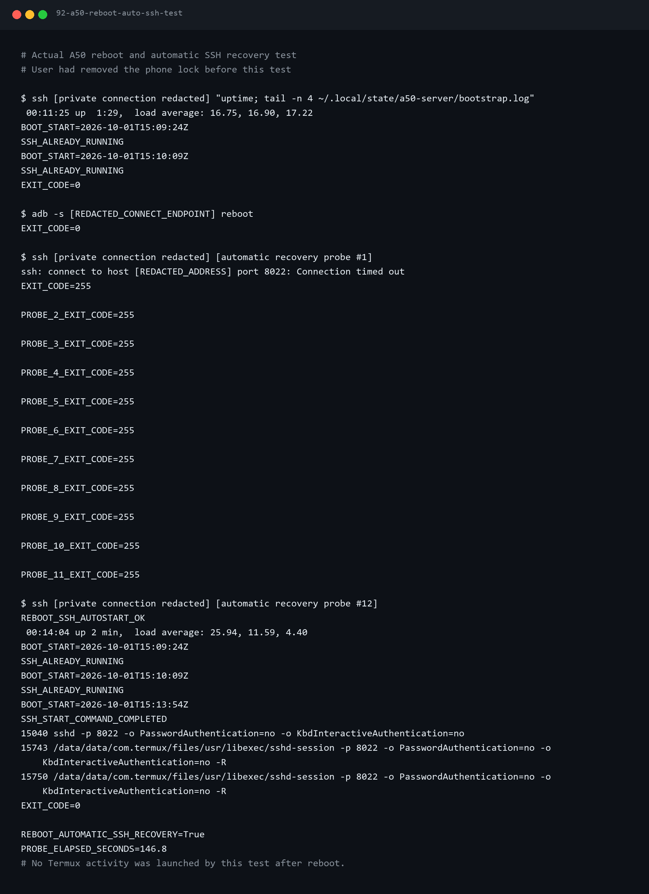

# [편하게 살자] 스마트홈 알림 - 남는 Galaxy A50을 서버로 써봤다

　라즈베리파이에서 문 상태나 온습도를 읽는 것까지는 만들었다. 이제 집 밖에서도 휴대폰으로 알림을 받고 싶었다.

　그런데 여러 집에서 같은 앱을 쓴다면 각 집의 소식을 구분해서 보내줄 장비가 필요했다. 노트북을 계속 켜두는 방법도 생각했지만, 평소 쓰는 노트북은 건드리고 싶지 않았다. 마침 남는 Galaxy A50이 있어서 이걸 작은 서버로 써보기로 했다.

　처음에는 PC에서 접속하면 되겠다고 생각했다. 그런데 화면을 끄거나 재부팅하면 어떨까? 매번 휴대폰을 잡고 설정을 켜야 한다면 계속 켜두는 서버로 쓰기에는 번거롭다.

　그래서 첫 번째로 **휴대폰을 직접 만지지 않고 다시 접속할 수 있는 상태**부터 만들었다. 우선 접속부터 준비하고, 서버 프로그램은 그다음에 올리기로 했다.

　**앞에서 준비할 것:** Windows PC, A50과 같은 Wi-Fi, 충전기와 본인 Google 계정. PC에 필요한 도구도 아래에 함께 적었다.

| 사용한 장비 | 환경 |
| --- | --- |
| 휴대폰 | Galaxy A50 SM-A505N |
| Android | 11 |
| One UI | 3.1 |
| 연결 | USB 없이 Wi-Fi로 진행 |

## PC에 필요한 것부터 준비했다

---

　휴대폰 명령을 PC에서 대신 실행하려면 PC에도 도구가 필요했다. Python은 준비 도구를 실행하고, ADB는 휴대폰 화면을 읽거나 앱을 설치한다. SSH는 A50과 Pi에 명령을 보낸다. JDK는 Android 앱을 설치 파일로 만드는 데 쓴다.

| 도구 | 준비한 버전과 위치 | 내려받는 곳 |
| --- | --- | --- |
| Python | PC에서는 3.12를 사용했다. 설치할 때 실행 경로 추가를 선택한다. | `https://www.python.org/downloads/windows/` |
| Android Platform Tools | 압축을 풀어 `C:\android\platform-tools\adb.exe`를 준비한다. | `https://developer.android.com/tools/releases/platform-tools` |
| JDK | Windows x64용 JDK 17을 설치한다. | `https://adoptium.net/temurin/releases/?version=17` |
| OpenSSH 클라이언트 | Windows 선택적 기능에서 설치 여부를 확인한다. | Windows 설정 → 선택적 기능 |

　내가 만든 도구와 앱 소스는 [GitHub의 서버 코드](https://github.com/PCY00/aircon-remote-control/tree/main/server)에 올려뒀다. 링크를 열고 **Code → Download ZIP**을 누르면 `main`의 현재 코드를 받을 수 있다.

　GitHub에서 받은 ZIP에는 저장소 전체가 들어 있다. 압축을 풀면 `aircon-remote-control-main` 폴더가 나오는데, **그 안의 `server` 폴더**를 `C:\`로 옮기고 이름을 `smart-home-reader`로 바꾼다. `C:\smart-home-reader` 바로 아래에 `scripts`, `services`, `android`, `docs`가 있어야 한다. 이후 명령어는 이 폴더를 연 PowerShell에서 실행한다.

```powershell
Set-Location C:\smart-home-reader
Get-ChildItem scripts, services, android, docs
py -3.12 --version
py -3.12 -m venv .venv
.venv/Scripts/python.exe -m pip install -r examples/mobile-app/requirements-reader.txt
.venv/Scripts/python.exe -m pip check
```

　`.venv`는 이 프로젝트에서만 쓸 Python 도구를 모아둔 폴더다. 마지막에 `No broken requirements found.`가 나오면 필요한 도구끼리 충돌하지 않는다는 뜻이다. 이미 같은 이름의 환경이 있다면 새로 만들지 않고 기존 상태부터 확인한다.

```powershell
$adb = 'C:\android\platform-tools\adb.exe'
& $adb version
ssh -V
# java.exe가 있는 bin 폴더의 상위 폴더를 넣는다.
$jdk17 = 'C:\Program Files\Eclipse Adoptium\본인이_설치한_JDK17_폴더'
& "$jdk17/bin/java.exe" -version
```

　ADB와 SSH 버전이 나오고 Java 버전은 17로 시작하면 된다. 예시의 JDK 폴더 이름은 실제 설치 위치로 바꿔야 한다. PowerShell을 새로 열면 프로젝트 폴더로 다시 이동하고 `$adb`, `$jdk17` 같은 값도 다시 넣는다.

　이후 도구가 사용하는 실제 주소와 키는 `.deploy` 폴더에 따로 저장한다. 이 폴더는 공개 자료에 넣지 않았다. 앱과 서버 소스는 0.4.0 상태로 준비했으므로, 옛 결과 화면을 맞추려고 예전 앱을 차례로 설치할 필요는 없다.

## A50부터 초기화했다

---

　나는 공기계라 초기화하고 시작했다. 필요한 사진이나 계정 자료가 있는 사람은 먼저 백업하자. 초기화 경로는 설정 → 일반 → 초기화 → 디바이스 전체 초기화다. 이미 준비된 폰이라면 다시 초기화할 필요는 없다.

　Wi-Fi를 연결하고 F-Droid에서 Termux와 Termux Boot를 설치했다. 설치 페이지 주소는 각각 `https://f-droid.org/packages/com.termux/`와 `https://f-droid.org/packages/com.termux.boot/`다. Termux는 휴대폰에서 명령어를 입력하는 앱이고, Boot는 재부팅 뒤 정해둔 명령을 실행하는 앱이다.

　두 앱은 같은 배포처에서 받자. 다른 곳에서 받은 파일을 섞으면 앱 서명이 달라 설치가 안 될 수 있다.

　**A50의 Termux**에서 아래를 입력한다.

```sh
pkg update
pkg install openssh python termux-am
whoami
termux-setup-storage
```

　`whoami`로 나온 값은 이 휴대폰의 Termux 사용자명이다. 뒤에서 필요하니 본인 값만 따로 적어두자. 마지막 명령의 파일 접근 허용창도 허용한다. PC에서 보낸 공개키 파일을 읽는 데 쓴다.

## Wi-Fi로 PC와 연결했다

---

　설정 → 휴대전화 정보 → 소프트웨어 정보에서 빌드번호를 여러 번 누르면 개발자 옵션이 열린다. 개발자 옵션 → 무선 디버깅을 켜고 집 Wi-Fi 허용창에서 ‘이 네트워크에서 항상 허용’을 선택한다.

　그다음 ‘페어링 코드로 기기 페어링’을 열자. **PC PowerShell**에서 화면에 나온 페어링용 주소와 포트를 넣는다. 예시 글자는 그대로 쓰면 안 됨.

```powershell
$adb = 'C:\android\platform-tools\adb.exe'
$pairAddress = '휴대폰_WiFi주소:페어링_포트'
& $adb pair $pairAddress
```

　6자리 코드는 도구가 요청할 때 입력한다. `Successfully paired`가 나오면 무선 디버깅 기본 화면으로 돌아간다.

　여기서 주의할 것이 있다. **페어링 화면의 포트와 기본 화면의 연결 포트는 다르다.** 다음 명령에는 기본 화면에 나온 연결 포트를 넣는다.

```powershell
$phoneWifi = '휴대폰_WiFi주소'
$adbConnection = '휴대폰_WiFi주소:연결_포트'
& $adb connect $adbConnection
& $adb -s $adbConnection get-state
& $adb -s $adbConnection shell getprop ro.product.model
```

　`device`와 `SM-A505N`이 나오면 자신의 A50에 연결된 것이다. 이 Wi-Fi 연결 방식은 Android 11 이상에서 지원한다.

## 명령어를 보낼 SSH도 준비했다

---

　앱을 설치하는 연결과 서버 명령을 보내는 연결을 따로 준비했다. 뒤에서 무선 디버깅이 끊겼을 때 SSH가 살아 있어서 상황을 확인할 수 있었다.

| 연결 | 주로 하는 일 | 접속에 쓰는 것 |
| --- | --- | --- |
| SSH | 서버 실행과 로그 읽기 | Termux 사용자명, SSH 키, 8022 포트 |
| ADB | 앱 설치와 휴대폰 화면 확인 | 페어링, 무선 디버깅 연결 포트 |

　SSH 키는 PC의 접속을 허용하는 파일이다. 공개키는 휴대폰에 보내고, 개인키는 PC에 남겨둔다. 같은 이름의 키가 이미 있으면 덮어쓰지 말고 새 이름을 정하자.

　**PC PowerShell**에서 실행한다.

```powershell
New-Item -ItemType Directory -Force "$HOME/.ssh"
ssh-keygen -t ed25519 -f "$HOME/.ssh/a50-reader"
& $adb -s $adbConnection push "$HOME/.ssh/a50-reader.pub" /sdcard/Download/a50-reader.pub
```

　자동 접속을 쓸 공기계 시험에서는 키 암호 입력을 비워 Enter로 넘길 수 있다. 그 경우 개인키 파일을 다른 사람에게 주지 않는다. 암호를 넣었다면 자동 접속 전에 SSH 에이전트에 키를 등록해야 한다.

　이제 **A50 Termux**에서 공개키를 등록한다. `>>`는 기존 내용을 남겨두고 뒤에 추가하는 표시다.

```sh
mkdir -p ~/.ssh
cat ~/storage/downloads/a50-reader.pub >> ~/.ssh/authorized_keys
chmod 700 ~/.ssh
chmod 600 ~/.ssh/authorized_keys
ssh-keygen -A
sshd -p 8022 -o PasswordAuthentication=no -o KbdInteractiveAuthentication=no
ssh-keygen -lf "$PREFIX/etc/ssh/ssh_host_ed25519_key.pub"
```

　마지막 줄의 SHA256 표시는 휴대폰 자체를 구분하는 값이다. PC에서 처음 접속할 때 나오는 표시와 비교하자.

```powershell
$termuxUser = 'whoami로_확인한_사용자명'
$phoneTarget = "$termuxUser@$phoneWifi"
$phoneKnownHosts = "$HOME/.ssh/a50-reader-known-hosts"
ssh -p 8022 -i "$HOME/.ssh/a50-reader" -o HostKeyAlgorithms=ssh-ed25519 -o "UserKnownHostsFile=$phoneKnownHosts" $phoneTarget 'echo SSH_CONNECTION_OK'
```

　두 표시가 같을 때 첫 연결을 허용한다. `SSH_CONNECTION_OK`가 나오면 접속됐다. 나중에 키가 달라졌다는 오류가 나오면 허용 목록부터 지우지 말고, 같은 휴대폰인지 먼저 확인하자.

## 매번 주소를 입력하지 않게 저장했다

---

　같은 PowerShell에서 본인 연결 정보를 저장한다.

```powershell
.venv/Scripts/python.exe scripts/reader/setup_connections.py phone --host $phoneWifi --user $termuxUser --identity-file "$HOME/.ssh/a50-reader" --known-hosts-file $phoneKnownHosts --adb $adb --endpoint $adbConnection
.venv/Scripts/python.exe scripts/android/a50_ssh.py 'echo SSH_CONNECTION_OK'
.venv/Scripts/python.exe scripts/android/a50_adb.py -- shell getprop ro.product.model
```

　`.deploy/a50/connection.json`과 `adb.json`이 생긴다. 도구가 휴대폰 모델과 기기 번호를 확인한 뒤 저장하며, 실제 값은 화면에 출력하지 않는다. 이미 있는 설정도 덮어쓰지 않는다.

　이후 명령은 이 파일을 읽는다. 블로그에는 실제 주소나 사용자명을 적지 않고 본인 값으로 바꿀 부분만 남겼다.

## 화면을 꺼도 돌아가게 했다

---

　Termux Boot를 한 번 열고 홈 화면으로 나온다. Termux와 Boot를 배터리 최적화 예외에 넣고, 삼성 설정의 절전 앱·초절전 앱에도 들어가지 않게 한다. 모델에 따라 메뉴 이름이 조금 다를 수 있다.

　**A50 Termux**에서 실행한다.

```sh
termux-wake-lock
```

　화면을 계속 켜두는 명령은 아니다. 휴대폰이 깊게 잠들어 작업이 멈추는 것을 줄이기 위한 요청이다. 재부팅 뒤 SSH를 시작할 파일은 **PC**에서 준비한다.

```powershell
.venv/Scripts/python.exe scripts/reader/prepare_phone_boot.py
.venv/Scripts/python.exe scripts/reader/prepare_phone_boot.py --apply
```

　첫 명령은 바뀔 파일만 확인하고, `--apply`를 붙여야 실제 파일을 만든다. 휴대폰의 `~/.termux/boot/10-start-ssh`에 아래 내용이 들어간다. 앞의 도구를 사용했다면 다시 손으로 만들 필요는 없다.

```sh
#!/data/data/com.termux/files/usr/bin/sh
# Deploy to ~/.termux/boot/10-start-ssh after installing and opening Termux:Boot.
set -eu
export PREFIX=/data/data/com.termux/files/usr
export PATH="$PREFIX/bin:$PATH"
umask 077
state_dir="$HOME/.local/state/a50-server"
mkdir -p "$state_dir"
log_file="$state_dir/bootstrap.log"
if [ -f "$log_file" ]; then
    tail -n 100 "$log_file" > "$log_file.tmp"
    mv "$log_file.tmp" "$log_file"
fi
exec >> "$log_file" 2>&1
date -u '+BOOT_START=%Y-%m-%dT%H:%M:%SZ'
termux-wake-lock
sshd -t -p 8022 -o PasswordAuthentication=no -o KbdInteractiveAuthentication=no
if pgrep -x sshd > /dev/null; then
    echo 'SSH_ALREADY_RUNNING'
else
    sshd -p 8022 -o PasswordAuthentication=no -o KbdInteractiveAuthentication=no
    echo 'SSH_START_COMMAND_COMPLETED'
fi
```

　부팅하면 잠들지 않도록 요청하고 SSH가 이미 실행 중인지 본다. 없을 때만 시작한다. 이전 시작 기록은 100줄만 남기고 이번 결과를 이어 적는다. 처음에는 Windows와 Android의 줄바꿈 차이로 실행이 안 된 적도 있었다. 그래서 준비 도구에서 휴대폰에 맞는 줄바꿈으로 저장하게 했다.

## 재부팅 뒤 허용창에서 막혔다

---

　SSH는 돌아왔는데 무선 디버깅은 다시 꺼졌다. ‘항상 허용’을 선택해도 Wi-Fi 허용창이 다시 나타나는 경우가 있었다.

　포트를 자동으로 찾는 것만으로는 해결되지 않았다. 무선 디버깅 자체가 꺼져 있으면 찾을 포트도 없기 때문이다. 그래서 ‘A50 관리 자동 복구’ 앱을 따로 만들었다. 현재 소스에는 이 앱도 들어 있다.

　**PC PowerShell**에서 실행한다. `$jdk17`에는 이 글 앞에서 확인한 본인 JDK 17 폴더가 들어 있어야 한다.

```powershell
# 시작 안내에서 확인한 실제 JDK 17 폴더를 사용한다.
.venv/Scripts/python.exe scripts/android/prepare_family_tools.py --java-home $jdk17
.venv/Scripts/python.exe scripts/android/prepare_manager_tools.py
.venv/Scripts/python.exe scripts/android/build_a50_manager.py --tools tmp/a50-build-tools/reader-paths.json
.venv/Scripts/python.exe scripts/android/install_a50_manager.py --configure-current-wifi
.venv/Scripts/python.exe scripts/android/install_a50_manager.py --configure-current-wifi --apply
```

　도구 다운로드 때 Android SDK 이용 조건을 확인하자. `--apply`는 관리 앱을 설치하고 Android 설정 변경 권한과 접근성 기능을 부여한다. **자신의 서버용 공기계에만 실행한다.** 설치 후 휴대폰에서 ‘자동 복구 켜기’를 누른다.

　그런데 여기서도 한 번 더 막혔다. 재부팅 직후 드래그 잠금화면이 남아 있으면 허용창 처리가 멈췄다. 화면을 밀어서 잠금을 풀자 처리가 이어졌다. 비밀번호를 없애는 것과 잠금화면 자체를 없애는 것은 달랐다,,

　나는 서버 전용 공기계라 설정 → 잠금화면 → 화면 잠금 방식에서 ‘설정 안 함’을 사용했다. 잠금을 유지한다면 재부팅 뒤 직접 한 번 풀어야 할 수 있다. 중요한 개인 자료가 있는 폰이라면 이 선택부터 다시 생각하자.

## 화면을 끄고 다시 접속해봤다

---

　화면을 끄고 2분 뒤 SSH가 되는지 확인했다. 그다음 정상 재부팅 뒤에도 연결이 돌아오는지 봤다. 본인 폰에서도 같은 순서로 해보자.

```powershell
.venv/Scripts/python.exe scripts/android/a50_ssh.py 'echo SSH_CONNECTION_OK'
.venv/Scripts/python.exe scripts/android/a50_adb.py --timeout 40 --rediscover -- shell getprop ro.product.model
```

　내 A50에서는 화면 꺼짐과 재부팅 뒤 접속을 확인했다. 당시 출력 중 결과를 판단한 부분은 다음과 같다. 새로 따라 하는 명령이 아니라 실제 결과에서 필요한 줄만 가져왔다.

```text
# 화면을 끈 상태에서 새 SSH 연결
mScreenState=OFF
NEW_SSH_WHILE_SCREEN_OFF_OK
# 화면이 꺼진 동안 2분짜리 작업도 끝났다.
BACKGROUND_JOB_COMPLETED
EXIT_CODE=0

# 재부팅 직후에는 접속 시간 초과가 나왔다.
ssh: connect to host [REDACTED_ADDRESS] port 8022: Connection timed out
# 이후 자동 시작된 SSH에 다시 접속했다.
REBOOT_SSH_AUTOSTART_OK
SSH_START_COMMAND_COMPLETED
REBOOT_AUTOMATIC_SSH_RECOVERY=True
PROBE_ELAPSED_SECONDS=146.8
```

　재부팅하자마자 연결된 것은 아니었다. 당시에는 약 147초 뒤 돌아왔다. 실패가 나온 순간과 다시 연결된 결과를 같이 봐야 했던 이유다.



　같은 Wi-Fi, 충전 중, 잠금 없음 조건의 짧은 시험이다. 이 결과로 하루 종일 안 끊긴다고 말할 수는 없다. 그래도 매번 폰을 잡고 SSH를 켜는 단계는 줄였다.

　처음 공개키를 넣을 때는 화면 입력 도구가 명령을 바꿔 SSH 접속에 실패하기도 했다. 그래서 공개키 파일 자체를 ADB로 보내고 Termux에서 읽는 순서로 정리했다. 접속이 안 되면 메시지부터 보자. `Permission denied (publickey)`는 공개키 등록, `Connection refused`는 Termux의 SSH 실행 상태를 확인한다. ADB만 안 되면 무선 디버깅과 Wi-Fi 허용창을 확인한다.

　**여기까지 확인할 것:** 화면을 끈 뒤 SSH가 되고, 재부팅 뒤 SSH와 ADB로 자신의 A50에 다시 접속된다.

　이제 명령을 보낼 길은 만들었다. 다음에는 A50에 서버 프로그램을 올려보자.
