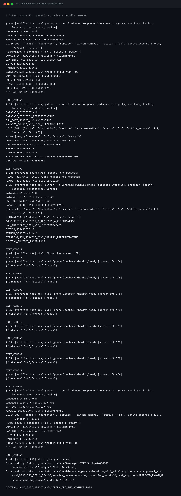

# [편하게 살자] 스마트홈 알림 - A50에서 작은 서버를 돌려봤다

　화면을 끄거나 재부팅해도 PC에서 A50에 다시 접속할 수 있게 만들었다. 이제 이 휴대폰에 집과 알림 정보를 보관할 프로그램을 올려보기로 했다.

　그 전에 휴대폰에 깔린 앱부터 정리했다. 서버로 쓸 폰에 동영상이나 게임 관련 앱이 계속 필요하지는 않았다. 다만 폰이 동작하는 데 필요한 것까지 없애면 원격으로 복구하는 일이 더 번거로워진다.

　그래서 필요한 기능은 남겨두고, 쓰지 않는 일반 앱만 사용 중지했다. 앱 정리는 선택 사항이다. 정리를 건너뛰고 서버 설치부터 해도 된다.

　**앞에서 준비할 것:** SSH와 ADB로 접속되는 A50, 실행해둔 Termux Boot와 PC의 Python 환경. 아래 명령은 모두 압축을 풀어둔 프로젝트 폴더의 **PC PowerShell**에서 실행한다.

## 지우기 전에 상태부터 봤다

---

```powershell
.venv/Scripts/python.exe scripts/android/inspect_a50_resources.py --label before
.venv/Scripts/python.exe scripts/android/a50_app_cleanup.py
```

　첫 명령은 앱 목록, 메모리와 배터리 상태를 기록한다. 두 번째는 정리할 목록만 보여준다. 아직 앱을 끄지는 않는다.

| 구분 | 이번에 처리한 것 |
| --- | --- |
| 사용 중지 | YouTube, Google TV, 사진, Drive, Gmail, 지도, Meet, Android Auto, AR 기능, Game Launcher |
| 그대로 유지 | Google Play 서비스·스토어, Wi-Fi, 설정, 홈 화면, 키보드, Termux와 부팅 앱 |

　Google Play 서비스는 나중에 Google 로그인과 알림을 받을 때도 필요하다. 이름만 보고 ‘구글 앱이네?’ 하면서 전부 끄면 안 됨.

　본인 A50의 정리 목록을 읽어보고, 사용하지 않는 앱들일 때 실행하자. 다른 폰에 같은 목록을 그대로 적용하지 않는다.

```powershell
.venv/Scripts/python.exe scripts/android/a50_app_cleanup.py --apply
.venv/Scripts/python.exe scripts/android/inspect_a50_resources.py --label after
```

　앱과 데이터를 지운 것은 아니다. 사용 중지라 다시 켤 수 있게 원래 상태도 보관했다. 복원이 필요할 때는 같은 PC에서 아래 명령을 쓴다. 이번 작업에서 실제 전체 복원까지 해본 것은 아니다.

```powershell
.venv/Scripts/python.exe scripts/android/a50_app_cleanup.py --restore --apply
```

　다른 휴대폰의 상태 파일을 가져와 복원하지 말자.

## 메모리는 생각처럼 줄지 않았다

---

　불필요한 앱을 정리하면 여유 메모리도 확 늘어날까 싶었는데, 전체 수치는 그렇게 나오지 않았다.

| 당시 측정한 항목 | 정리 전 | 정리 후 |
| --- | --- | --- |
| 사용할 수 있는 메모리 | 1,482.8 MiB | 1,475.1 MiB |

　MiB는 메모리 크기를 표시하는 단위다. 위 표에서는 숫자가 클수록 다른 작업에 쓸 수 있는 메모리가 많다는 뜻이다.

　같은 부팅에서 충전 중, 화면을 끈 조건으로 측정했다. 사용 중지한 앱의 실행 흔적은 줄었지만, **휴대폰 전체의 여유 메모리가 늘었다고 할 결과는 아니었다.** 설정 화면을 열거나 다른 작업이 움직이는 영향도 있다.

　그래서 ‘앱 10개를 껐으니 RAM이 얼마 줄었다’고 쓰지는 않았다. 이번 정리의 결과는 필요 없는 앱을 덜 실행하게 만든 것까지다. 캐시를 강제로 비우거나 시스템 작업을 죽이지도 않았다.

## 서버 실행에 필요한 도구를 설치했다

---

```powershell
.venv/Scripts/python.exe scripts/android/a50_record.py --label central-runtime-packages --script scripts/android/prepare_a50_runtime.sh --timeout 600
.venv/Scripts/python.exe scripts/android/a50_record.py --label auth-dependencies --script scripts/android/prepare_a50_auth.sh --timeout 300
```

　PC에서 명령을 실행하면 SSH로 A50에 전달된다. Python, 서버를 계속 실행하는 도구와 로그인 확인에 필요한 암호화 도구를 설치한다. `--timeout`은 기다릴 시간이고 초 단위다.

　함께 준비한 코드는 로그인과 알림까지 들어 있는 최신 상태라 두 명령을 여기서 실행한다. 설치 중 오류가 나오면 마지막 오류와 저장 공간부터 보자. 그 상태로 다음 명령까지 밀어붙이지 않는다.

## 서버 소스를 A50에 보냈다

---

```powershell
.venv/Scripts/python.exe scripts/android/deploy_a50_central.py
.venv/Scripts/python.exe scripts/android/deploy_a50_central.py --apply
.venv/Scripts/python.exe scripts/android/verify_a50_central.py
```

　첫 번째는 보낼 파일과 기존 파일의 차이만 보여준다. `--apply`를 붙인 명령이 파일을 보내고 서버를 시작한다. 마지막 명령으로 응답과 기록 파일을 확인한다.

　코드와 집 기록은 다른 곳에 뒀다. 앱 코드를 업데이트할 때 집 정보까지 새로 만들면 안 되기 때문이다.

| 자료 | 보관 위치 |
| --- | --- |
| PC의 서버 소스 | `services/central-server` |
| A50의 서버 프로그램 | `~/services/aircon-central` |
| A50의 집과 알림 기록 | `~/.local/share/aircon-central/central.sqlite3` |

　SQLite는 여러 기록을 하나의 파일에 보관하는 방식이다. 기존 기록과 키는 소스와 따로 유지한다. 도구가 모르는 파일 변경을 발견하면 덮어쓰지 않고 멈춘다.

## 진짜 응답하는지 확인했다

---

```powershell
.venv/Scripts/python.exe scripts/android/a50_ssh.py 'curl --fail --silent http://127.0.0.1:8001/health/ready'
```

　결과의 `status`가 `ready`, `database`가 `ok`면 서버가 기록 파일을 읽고 응답한 것이다.

　`127.0.0.1`은 명령을 실행하는 장비 자신을 뜻한다. 위 명령은 A50 안에서 실행되므로 A50 서버에 연결된다. 다른 휴대폰에서 같은 주소를 입력하면 그 다른 휴대폰 자신을 찾게 된다.

　처음 서버를 올렸을 때는 실행 중인 서버 프로그램을 한 번 종료해 다시 돌아오는지 봤고, 정상 재부팅 뒤에도 응답하는지 확인했다. 당시 출력에서 확인한 부분을 가져왔다.

```text
DATABASE_INTEGRITY=ok
READY=[200, {"database": "ok", "status": "ready"}]
WORKER_PID_CHANGED=TRUE
WORKER_AUTOMATIC_RECOVERY=PASS
DATABASE_IDENTITY_PERSISTED=TRUE
CENTRAL_HANDS_FREE_REBOOT_AND_SCREEN_OFF_TWO_MINUTES=PASS
```

　`WORKER_PID_CHANGED`는 서버를 실행하던 작업이 새 작업으로 바뀌었다는 뜻이다. 그 뒤 다시 응답했고, 재부팅 뒤에도 기록 파일이 유지됐다.



　당시 서버 프로그램 하나의 메모리는 약 36 MiB였다. 초기 기능만 있던 시점의 짧은 측정값이다. 현재 코드의 사용량이나 여러 집을 연결한 성능이 그 숫자로 고정된다는 뜻은 아니다.

　아직 연결 입구는 A50 안의 8001번만 사용한다. 공유기 포트포워딩이나 Pi 제어 서비스의 인터넷 공개는 하지 않았다. 외부 연결은 HTTPS 연결 글에서 따로 준비한다.

## 서버가 안 뜨면 로그부터 읽자

---

　`No module named ...`는 필요한 Python 도구가 없는 경우다. PC에서는 `.venv/Scripts/python.exe`를 썼는지, A50에서는 위 두 설치 명령이 끝났는지 확인한다.

　SSH가 살아 있다면 서버가 멈춰도 로그를 읽을 수 있다.

```powershell
.venv/Scripts/python.exe scripts/android/a50_ssh.py 'tail -n 30 ~/.local/state/aircon-central/server.log'
```

　같은 오류가 반복되면 재시작만 계속하지 말고 원인을 먼저 보자. 재부팅 시험은 폰 곁에 있을 때 한 번 진행하는 편이 좋다.

　**여기까지 확인할 것:** 서버 확인 명령에서 `ready`와 `ok`가 나온다.

　이제 A50이 요청을 받고 기록을 보관할 수 있게 됐다. 다음은 같은 앱을 써도 자기 집 정보만 보게 만드는 작업이다.
