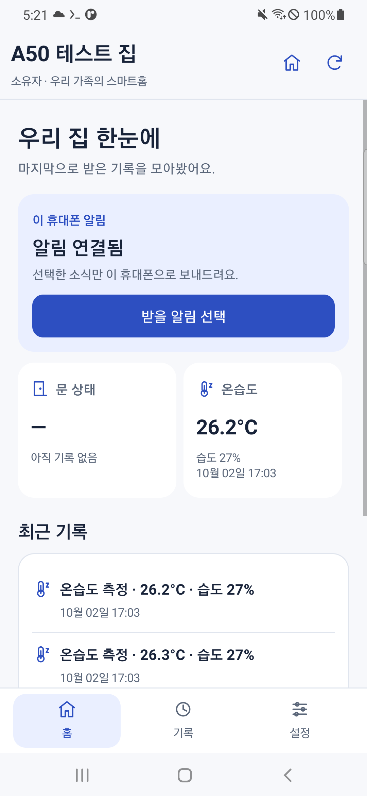

# [편하게 살자] 스마트홈 알림 - 다른 휴대폰에서 A50 서버에 연결해봤다

　앱에서 Google 로그인이 됐다. 그런데 앱에 넣을 중앙 서버 주소가 필요했다.

　A50이 집 Wi-Fi에서 쓰는 주소만 넣어서는 집 밖에서 접속할 수 없다. 아직 가지고 있는 도메인도 없었다. 그래서 우선 Cloudflare Quick Tunnel로 시험용 HTTPS 주소를 만들었다.

　HTTPS는 앱과 서버 사이의 내용을 암호화해서 주고받는 연결 방식이다. 이번에는 A50이 먼저 Cloudflare에 연결해 통로를 여는 구성을 사용했다.

| 연결 순서 | 역할 |
| --- | --- |
| 가족 앱 | 집 목록과 기록을 요청한다. |
| HTTPS 통로 | 요청을 A50까지 전달한다. |
| A50 서버 | 로그인과 가족 권한을 확인하고 응답한다. |

　여기서 만든 주소는 시험용이라 통로 프로그램을 다시 실행하면 바뀔 수 있다. 계속 쓸 고정 주소는 따로 준비해야 한다.

　**앞에서 준비할 것:** Google 로그인이 되는 가족 앱, 인터넷에 연결된 A50과 응답하는 중앙 서버. 아래 명령은 **PC PowerShell**에서 실행한다. Pi의 기존 에어컨 제어는 계속 사설망으로 사용한다.

## A50에 통로 프로그램을 설치했다

---

```powershell
.venv/Scripts/python.exe scripts/android/a50_record.py --label tunnel-package --script scripts/android/prepare_a50_tunnel.sh --timeout 180
```

　`cloudflared`라는 도구를 설치한다. 설치 명령은 현재 상태를 확인하고 필요한 파일을 준비한다. 공유기에서 포트포워딩을 설정하는 과정은 없다.

## 처음 시작할 때 바로 되지는 않았다

---

　통로를 실행할 파일을 보내고 시작했다. 현재 코드로 따라 할 때는 아래 명령을 사용한다.

```powershell
.venv/Scripts/python.exe scripts/android/deploy_a50_tunnel.py
.venv/Scripts/python.exe scripts/android/deploy_a50_tunnel.py --apply
.venv/Scripts/python.exe scripts/android/verify_a50_tunnel.py
```

　첫 명령은 파일과 상태를 확인한다. 두 번째가 실제 통로를 실행하고, 세 번째가 HTTPS 응답을 확인한다.

　내가 처음 실행했을 때는 `unable to open supervise/ok: file does not exist`라는 오류가 나왔다. 파일을 보냈는데 왜 없다고 하지?

　서버를 계속 실행하는 도구가 새 서비스 폴더를 알아보기 전에 시작 명령이 먼저 나간 것이었다. 잠시 뒤에는 연결돼 있었고, 이후 새 서비스를 인식할 때까지 기다리도록 수정했다. 함께 준비한 소스에는 그 처리가 들어 있다. 당시에는 아래 오류가 나왔다.

```text
warning: aircon-public-tunnel: unable to open supervise/ok: file does not exist
subprocess.CalledProcessError: Command '['sv-enable', 'aircon-public-tunnel']' returned non-zero exit status 1.
EXIT_CODE=1
```

　이후 파일의 존재와 실행 도구의 준비 상태를 구분해 기다리도록 바꿨다.

　확인 명령에서 `PUBLIC_HTTPS_SYSTEM_CERTIFICATE_VALIDATION=PASS`와 서버 상태 200이 나오면 암호화된 주소로 응답한 것이다.

| 응답 | 여기서의 의미 |
| --- | --- |
| 상태 확인 200 | 서버가 응답했다. |
| 로그인 없이 집 목록 요청 401 | 로그인이 필요해서 거절됐다. |

　401을 서버가 고장 난 것으로 보면 안 된다. 주소를 알아도 가족 정보는 로그인과 권한 확인을 거쳐야 한다.

## 만들어진 주소를 앱에 넣었다

---

　주소는 `.deploy/a50/tunnel-endpoint.json`에 저장된다. 아래 명령은 화면에 주소를 남기는 대신 PC의 클립보드로 복사한다.

```powershell
$serverUrl = (& .venv/Scripts/python.exe -c "import json; print(json.load(open('.deploy/a50/tunnel-endpoint.json',encoding='utf-8'))['endpoint']['url'])")
Set-Clipboard -Value $serverUrl
```

　가족 앱의 연결 설정에 붙여넣고 저장하자. 다른 휴대폰에도 본인의 같은 주소를 넣는다. 주소가 보이는 화면은 블로그에서 가린다.

　다만 주소를 가리는 것이 가족 권한을 대신하지는 않는다. 서버에서는 요청할 때마다 로그인한 계정과 그 집의 가족 권한을 확인한다.

## 첫 집을 만들었다

---

　앱에서 ‘새 집 만들기’를 누르고 이름을 넣었다. 내 시험 화면에는 `A50 테스트 집`이라고 나온다. 따라 만드는 사람은 원하는 이름으로 만들면 된다. 이후 명령어 예시에서는 `우리 집`으로 적어두었다.

　집을 만든 계정이 소유자다. 목록에서 ‘집 열기’를 눌렀을 때 집 화면이 나오는지 보자.



　위 화면은 이후 센서까지 연결한 내 시험 집이다. 지금 막 만든 집에 측정값이 없는 것은 정상이다.

　A50에도 같은 소유자 계정으로 로그인하고 이 집을 열어두자. Pi 기록 연결 글의 PC 도구가 A50 앱에서 소유자 상태를 확인한다. 그때 `--home-name`에는 **본인 앱에 보이는 실제 집 이름**을 넣는다.

## 밖에서도 연결되는지 해보자

---

　나는 만든 HTTPS 주소로 실제 Google 계정의 집 목록을 읽고 집 화면을 여는 것까지 확인했다. 집 밖 이동통신 조건은 본인 환경에서도 따로 확인하자.

　다른 휴대폰이 있다면 그 휴대폰의 Wi-Fi를 끄고 이동통신으로 집 목록을 새로고침한다. 이때 A50의 Wi-Fi는 켜둬야 한다. 서버까지 인터넷을 끊으면 연결될 길이 없다.

　통로를 재시작한 뒤 접속이 안 되면 현재 주소부터 확인한다. `verify_a50_tunnel.py`를 다시 실행해 주소가 바뀌었는지 보고 앱 설정을 맞춘다. Pi를 연결한 뒤에는 Pi 쪽 주소도 함께 확인해야 한다.

　시험 주소로 연결하는 흐름은 만들었다. 계속 쓸 고정 주소는 이후에 준비할 부분이다.

　**여기까지 확인할 것:** 앱에서 HTTPS 주소로 집 목록을 읽고 첫 집을 열 수 있다.

　이제 집 화면까지 들어왔다. 다음에는 화면을 열어두지 않아도 시험 알림이 오는지 해보자.
