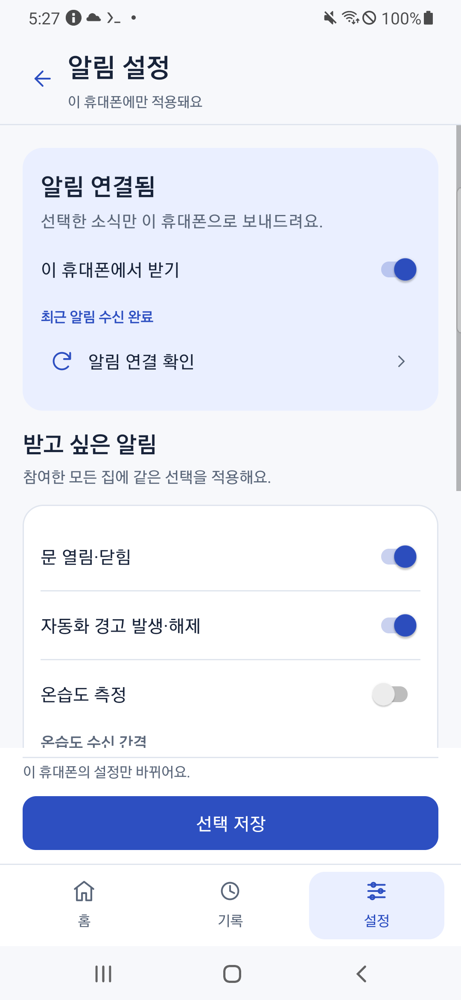

# [편하게 살자] 스마트홈 알림 - 화면을 꺼둔 A50에 시험 알림을 보내봤다

　앱과 서버를 연결했다. 이제 처음 원했던 휴대폰 알림을 붙여보기로 했다.

　집 화면을 열어두면 기록을 읽을 수 있지만, 문이 열릴 때마다 앱을 켜서 확인할 수는 없다. 그래서 FCM을 사용했다. Firebase Cloud Messaging의 줄임말이고, Google이 휴대폰에 알림을 전달하는 서비스다.

　A50 서버가 어느 집의 어느 휴대폰에 보낼지 정하고 Google에 전달을 요청한다. 가족별로 받을 사람을 고르는 것은 여전히 우리 서버의 역할이다.

　**앞에서 준비할 것:** HTTPS 주소로 연결한 가족 앱과 등록한 집, 본인 Firebase 프로젝트. A50에도 같은 계정으로 로그인한 가족 앱을 준비했다. 이 글은 센서 없이 시험 알림으로 진행한다.

## 알림을 보낼 계정을 따로 만들었다

---

　사람이 로그인하는 Google 계정과 별개로, 서버 프로그램이 사용할 서비스 계정을 만들었다.

　Google Cloud Console에서 **Firebase와 같은 프로젝트**를 선택한다. 필요한 기본 약관을 확인하고 동의한 뒤 서비스 계정을 추가한다.

| 설정 | 사용할 값 |
| --- | --- |
| 서비스 계정 이름 | `a50-fcm-sender` |
| 프로젝트 역할 | Firebase Cloud Messaging API Admin |
| API 사용 설정 | Firebase Cloud Messaging API 활성화 |
| 내려받을 키 형식 | JSON |

　연결 도구가 계정 이름을 확인하므로 여기서는 `a50-fcm-sender`를 그대로 사용한다. 알림을 보내는 역할만 주면 된다. 프로젝트 전체 소유자나 편집자로 만들지는 않았다.

　계정의 키 메뉴에서 JSON 키를 만들고 PC의 비공개 폴더에 내려받는다. **이 파일에는 알림을 보내는 비밀키가 들어 있다.** 블로그, GitHub나 APK에 넣으면 안 된다.

　앱을 만들 때 받은 `google-services.json`과 이름이 비슷해 헷갈릴 수 있다. 하나는 앱이 쓸 프로젝트 설정이고, 이번 파일은 서버가 알림을 보낼 비밀키다.

## 키를 A50에 연결했다

---

　**PC PowerShell**에서 본인 파일 위치를 넣는다.

```powershell
$fcmKey = 'C:\본인의_비공개_폴더\알림전송용-서비스계정.json'
.venv/Scripts/python.exe scripts/android/configure_a50_fcm.py --source $fcmKey
.venv/Scripts/python.exe scripts/android/configure_a50_fcm.py --source $fcmKey --apply
```

　첫 명령은 프로젝트와 키 종류를 확인한다. `--apply`를 붙이면 SSH로 A50의 비공개 폴더에 복사하고 중앙 서버를 다시 시작한다. 키 내용은 출력하지 않는다.

　기존 키와 다른 파일이 발견되면 멈춘다. 오류가 나더라도 파일 내용부터 공개 채팅에 붙이지 말고 프로젝트 선택과 계정 이름을 먼저 보자.

## 받을 휴대폰도 등록해야 했다

---

　같은 Google 계정으로 로그인했다고 모든 휴대폰이 자동으로 알림을 받는 것은 아니다. 어느 휴대폰에서 받을지도 등록해야 한다.

　A50의 가족 앱에서 집을 열고, ‘받을 알림 선택’ 또는 설정 → 알림 설정으로 들어간다. **이 휴대폰에서 받기**를 켠다. 이 과정에서 휴대폰의 알림 수신 주소가 서버에 저장된다.

| 확인할 곳 | 필요한 상태 |
| --- | --- |
| 가족 앱 | ‘이 휴대폰에서 받기’ 켜짐 |
| Android 설정 | 가족 스마트홈 알림 허용 |

　Android 13 이상에서는 알림 허용창이 나올 수 있다. Android 11인 A50에서는 설정 → 애플리케이션 → 가족 스마트홈 → 알림에서 확인한다. 위 두 가지가 모두 켜져 있어야 한다.

　다른 휴대폰에 같은 APK를 설치해도 그 휴대폰에서 따로 등록하자.

## 요청 성공만 보고 끝내지는 않았다

---

　알림 설정의 ‘알림 연결 확인’을 누른다. 한 집에서는 시험 요청을 1분 간격으로 제한하므로 연속해서 누르면 기다리라는 안내가 나온다.

　서버가 요청을 받았다는 것과 폰이 실제 알림을 받았다는 것은 다르다. 나는 앱을 홈 화면 뒤로 보내고, 실제 수신과 알림 게시가 이어졌는지 확인했다.

　그다음은 화면을 끈 조건이었다. A50이 실제로 비활성 화면 상태인지 확인한 뒤 시험 알림을 보냈고, 새 알림을 받는 것까지 확인했다. 서버와 수신 앱은 같은 A50에 있었다. 집 밖의 다른 휴대폰 수신 시험과는 조건이 다르다.



　당시 앱의 수신 상태는 알림을 받은 뒤 화면을 켜서 찍었다. 화면이 꺼져 있는 순간의 사진이나 알림창 캡처는 아니다. 실제 시험 기록에서도 다음 결과를 확인했다.

```text
INSTRUMENTATION_STATUS: fcm_receipt=real_data_message_callback_and_own_notification_posted_while_display_noninteractive
INSTRUMENTATION_STATUS: test_send=same_owner_API_requested_after_display_off_no_token_export
OK (1 test)
EXIT_CODE=0
```

　첫 줄은 화면이 꺼진 상태에서 앱이 메시지를 받고 자기 알림을 게시했다는 뜻이다. 전송 요청을 보냈다는 결과만으로 끝내지 않았다.

　본인 폰에서는 상태 표시줄이나 알림 목록에 가족 스마트홈의 시험 알림이 있는지 직접 보자.

1. 집 화면에서 ‘이 휴대폰에서 받기’가 켜져 있는지 본다.
2. 앱을 홈 화면 뒤로 보내고 시험 알림을 요청한다.
3. 화면을 끈 조건도 해보고, 다시 켜 알림 목록을 확인한다.

## A50 하나로 시험할 때 쓴 도구

---

　받는 폰이 A50 하나라면 **PC**에서 아래 도구를 사용할 수 있다. 첫 두 명령으로 확인용 앱을 만들고 실행 내용을 본 뒤, 마지막 `--apply` 명령으로 실제 시험을 진행한다.

```powershell
.venv/Scripts/python.exe scripts/android/build_family_app.py --production-smoke-only
.venv/Scripts/python.exe scripts/android/run_a50_family_smoke.py --home-name '우리 집' --push-test receiveRealFCMWhileScreenOff
.venv/Scripts/python.exe scripts/android/run_a50_family_smoke.py --home-name '우리 집' --push-test receiveRealFCMWhileScreenOff --apply
```

　A50 앱이 해당 집의 소유자로 로그인돼 있고 알림을 받고 있어야 한다. `우리 집`은 본인 앱의 실제 집 이름으로 바꾸자. 도구는 그 A50 앱으로 요청하며 집을 삭제하거나 Google 비밀번호를 입력하지 않는다.

## 알림이 안 오면 안내부터 보자

---

| 안내 | 먼저 확인할 것 |
| --- | --- |
| 알림을 켜주세요 | Android에서 앱 알림을 허용했는가 |
| 다른 등록과 충돌 | 지금 계정과 휴대폰의 등록 상태가 맞는가 |
| 잠시 뒤 다시 | 시험 요청 간격을 기다렸는가 |
| 서버에서 준비 중 | 서버의 알림 전송 키 연결이 끝났는가 |

　원인이 다른데 같은 버튼만 계속 누르면 해결하기 어렵다. 뒤에서 알림 선택을 넣을 때 이 안내도 더 나눴다.

　**여기까지 확인할 것:** 자신의 A50에 실제 시험 알림이 도착한다. 다른 휴대폰도 사용할 때는 그 폰에서 따로 등록하고 수신을 확인한다.

　화면을 끈 상태에서도 짧은 시험은 통과했다. 장시간 절전까지 확인한 것은 아니다. 다음은 시험 버튼 대신 라즈베리파이의 기록을 보내는 단계다.
