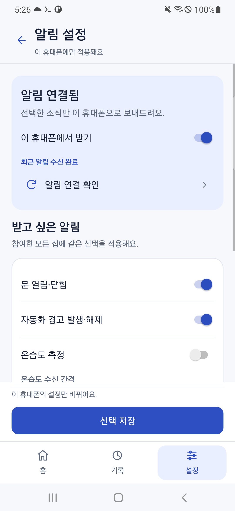

# [편하게 살자] 스마트홈 알림 - 받고 싶은 알림만 고르고 가족을 관리하게 했다

　Pi의 기록을 연결했다. 문 상태와 온습도가 함께 들어오니 다음 문제가 생겼다. 사람마다 받고 싶은 알림이 다르다.

　나는 문 열림만 받고 싶을 수도 있고, 누군가는 온습도를 계속 보고 싶을 수도 있다. 같은 Google 계정으로 로그인한 두 폰도 용도가 다를 수 있다.

　그래서 **알림 선택은 휴대폰마다 따로 저장**하게 했다. 여기에 집 추가·삭제와 가족 관리도 붙였다.

　**앞에서 준비할 것:** 알림 받을 휴대폰 등록과 본인 집 화면. 센서가 아직 없어도 설정은 사용할 수 있다. 현재 앱과 서버는 0.4.0이며, 최신 소스로 만든 앱에는 아래 기능이 이미 들어 있다.

## 오류 문구부터 더 나눴다

---

　내 다른 휴대폰에서 시험 버튼을 눌렀을 때 ‘이미 등록됐거나 다른 등록과 충돌했어요’라는 안내가 나왔다. 이 말만 보고는 뭘 해야 할지 알기 어려웠다.

　알림을 켜야 하는 상황이면 ‘알림을 켜주세요’라고 알려주는 편이 낫다. 그래서 알림 차단, 등록 충돌, 요청 간격과 권한 문제를 구분하게 바꿨다.

| 상황 | 먼저 할 일 |
| --- | --- |
| Android에서 알림을 꺼둠 | 휴대폰 설정에서 가족 앱 알림 켜기 |
| 앱에서 이 휴대폰 받기가 꺼짐 | 앱의 ‘이 휴대폰에서 받기’ 켜기 |
| 등록 정보가 현재 계정과 충돌 | 로그인 계정과 휴대폰 등록 상태 확인 |
| 시험 버튼을 너무 자주 누름 | 안내한 간격만큼 기다리기 |
| 소유자 권한이 필요한 작업 | 지금 집에서 내 권한 확인 |

　설정을 바꾸고 앱으로 돌아와 다시 확인하자. 등록 충돌은 시험 버튼을 계속 누른다고 해결되지는 않는다.

## 휴대폰마다 알림을 골랐다

---

　집 화면의 ‘받을 알림 선택’ 또는 설정 → 알림 설정으로 들어간다.

| 선택할 항목 | 들어오는 소식 |
| --- | --- |
| 문 상태 | 문 열림과 닫힘 |
| 자동화 경고 | 경고 발생과 해제 |
| 온습도 | 새 측정값 |

　원하는 항목을 켠 뒤 **선택 저장** 버튼을 누른다. 화면에서 스위치만 바꾼 것과 서버에 저장한 것은 다르다.

　같은 계정의 다른 휴대폰 설정은 바뀌지 않는다. 다만 현재는 한 휴대폰의 선택이 그 휴대폰이 참여한 **모든 집에 공통으로 적용**된다. 집마다 다른 알림을 고르는 기능까지 만든 것은 아니다.

　온습도는 1분, 5분, 15분, 60분 중 간격을 고른다. 5분을 골랐다고 옛 측정값을 매 5분마다 다시 보내는 것은 아니다. 새 값이 들어올 때, 선택한 간격보다 자주 보내지 않게 제한한다.

　내 서버에서 두 휴대폰의 선택이 서로 다르게 저장된 것을 확인했다. 하나는 온습도를 끄고 5분, 다른 하나는 온습도를 켜고 15분이었다. 다른 폰의 선택을 강제로 맞추지 않았다.

　본인 폰에서도 저장한 뒤 다른 화면으로 갔다가 돌아와 선택이 남아 있는지 보자.

## 집을 추가하고 가족을 초대하게 했다

---

　집 목록의 ‘새 집 만들기’로 다른 집도 추가할 수 있다. 만든 사람이 그 집의 소유자가 된다.

　가족은 자신의 Google 계정으로 로그인한다. 소유자는 집 설정 → 가족 관리에서 상대방의 Google 이메일과 권한을 선택하고 초대 코드를 만든다.

　코드는 상대에게 직접 전달한다. 앱이 이메일을 대신 보내지는 않는다. 가족은 집 목록의 ‘가족 초대 수락’에서 코드를 넣는다.

　초대한 이메일과 다르게 로그인했거나 코드가 만료됐다면 참여할 수 없다. 새 코드는 24시간 안에 한 번 사용할 수 있다.

　같은 계정으로 폰 두 대에 로그인하는 것과 서로 다른 가족 계정으로 참여하는 것은 다르다. 나는 소유자 관리 화면과 코드로 확인한 권한 규칙을 기록했고, 서로 다른 가족의 실제 휴대폰 수신은 아직 남겨뒀다.

## 삭제 버튼은 한 번 더 확인하게 했다

---

　집을 추가할 수 있으면 잘못 만든 집도 지울 수 있어야 한다. 그렇다고 쓰고 있는 집을 실수로 바로 지우게 만들 수는 없었다.

　소유자만 설정 → 집 관리에서 삭제할 수 있게 하고, **삭제할 집 이름을 직접 다시 입력**하게 했다.

　나는 확인 화면과 틀린 이름이 거절되는 것까지 봤다. 실제로 사용하는 집을 지워보지는 않았다. 따라 시험할 때도 센서와 가족이 없는 별도 연습 집을 만들고, 필요한 기록은 먼저 보관하자.

## 선택 저장과 실제 수신은 따로 확인하자

---

　문 알림만 켰다면 새 문 변화가 생겼을 때 받는지 본다. 온습도를 껐다면 그 휴대폰에 온습도 알림이 오지 않는지도 봐야 한다.

　기록 화면에 센서값이 보이는 것만으로 알림을 받았다고 할 수는 없다. 내가 확인한 것은 두 폰의 선택 저장과 A50의 시험 알림 수신이다. 다른 가족 계정의 전체 수신과 실제 온습도 알림 도착은 별도 확인이 필요하다.

　**여기까지 확인할 것:** 알림 선택이 저장되고 집과 가족 관리 화면을 사용할 수 있다.

　기능을 붙이다 보니 화면이 복잡해졌다. 게다가 아래로 내려 버튼을 누르면 맨 위로 올라가는 문제가 있었다. 다음에는 이 부분을 정리해보자.
