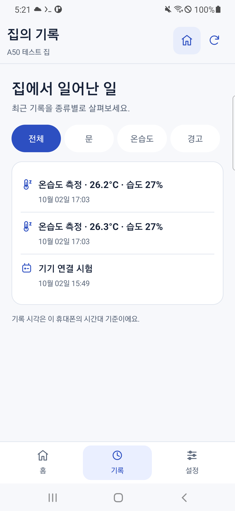

# [편하게 살자] 스마트홈 알림 - 버튼을 누르면 맨 위로 올라가던 화면을 고쳤다

　알림 선택과 가족 관리 기능을 넣었다. 기능은 생겼는데 화면을 쓰다 보니 불편했다.

　아래로 내려서 버튼을 누르면 다시 맨 위로 올라갔다. 설정 하나 바꾸고 또 내려가야 하는 식이었다. 화면에는 집 정보와 알림, 관리 기능이 같이 보여서 어디를 눌러야 할지도 복잡했다.

　그래서 버튼 위치만 조금 바꾸는 대신 화면을 나누고, 읽던 위치를 기억하게 만들었다.

　**앞에서 준비할 것:** 앞에서 만든 집과 알림 설정. 최신 소스로 만든 앱에는 아래 화면이 이미 들어 있다. APK를 만든 뒤 화면 코드를 따로 추가하는 과정은 없다.

## 홈과 기록과 설정을 나눴다

---

　다른 스마트홈 앱의 화면도 찾아봤다. Google Home이 집 화면과 활동 기록을 구분하는 방식을 참고하고, 우리 앱에서 필요한 기능을 세 화면으로 나눴다. Google Home 공식 화면 소개

| 화면 | 여기서 볼 것 |
| --- | --- |
| 홈 | 지금 문 상태, 온습도와 최근 집 소식 |
| 기록 | 시간 순서로 들어온 집의 변화 |
| 설정 | 받을 알림, 가족, 집과 서버 연결 |

　아래 탭으로 화면을 고른다. 첫 화면에서는 집 상태를 보고, 자세한 기록이나 설정이 필요할 때 해당 화면으로 이동한다.





　내 시험 집이라 센서값이 보인다. 본인이 막 만든 집은 아직 기록이 없을 수 있다. 이메일은 가렸고, 서버 주소나 기기 번호가 나오는 화면은 공개 자료에 넣지 않았다.

## 왜 자꾸 맨 위로 올라갔을까

---

　알림을 저장한 뒤 화면 전체를 다시 만들고 있었다. 그래서 아래로 내려갔던 위치도 사라졌다. 다른 앱에 갔다 돌아올 때 집 목록을 다시 여는 동작도 있었다.

　저장 결과만 현재 화면에서 바꾸도록 수정했다. 집과 화면마다 스크롤 위치를 기억하게 해서 다른 탭에 갔다 돌아와도 이어서 읽게 했다. 실제 앱 코드에서 위치를 저장하고 되돌리는 부분은 다음과 같다.

```java
private void rememberScroll() {
    if(scroll!=null && !screenKey.isEmpty()) scrollPositions.put(screenKey,scroll.getScrollY());
}
private void restoreScroll(int y) {
    final ScrollView target=scroll;
    target.post(()->{ if(scroll==target) target.scrollTo(0,y); });
}

private void replacePage(Runnable render) {
    int y=scroll.getScrollY();
    page.removeAllViews();buttons.removeIf(b->!insideShell(b));render.run();restoreScroll(y);
}
```

　화면을 바꾸기 전에 현재 위치를 저장하고, 내용이 다시 만들어진 뒤 같은 위치로 돌려놓는다. `screenKey`는 화면 종류와 집을 함께 구분하는 값이다. 이 코드는 전체 앱의 일부이며 APK를 만들 때 이미 포함된다.

　저장하지 않은 알림 선택도 다른 앱에 잠깐 갔다 오는 동안에는 유지했다. 앱을 완전히 종료한 뒤까지 보관되는 것은 아니다. 실제 적용하려면 ‘선택 저장’을 눌러야 한다.

## 아래로 내려서 같은 버튼을 눌러봤다

---

　버튼이 된다는 것만 확인하면 위치 문제를 놓칠 수 있다. 그래서 아래로 내려간 상태에서 저장하고, 다른 화면에 갔다 돌아오는 순서로 해봤다.

　본인 폰에서도 다음처럼 확인하자.

1. 알림 설정을 아래로 내리고 항목을 바꾼 뒤 ‘선택 저장’을 누른다.
2. 저장 후 화면이 맨 위로 뛰지 않는지 본다.
3. ‘알림 연결 확인’을 누른 뒤에도 읽던 위치를 본다.
4. 홈을 아래로 내리고 기록·설정으로 갔다가 홈으로 돌아온다.
5. 알림을 바꿨지만 저장하지 않은 상태로 홈 화면에 나갔다가 앱으로 돌아온다.


　내 A50에서는 알림 설정을 315px, 홈을 200px 내린 위치가 유지됐다. 확인 도구가 측정한 이동 거리이며 따라 할 설정값은 아니다. 화면 크기나 글자 크기가 다르면 본인 폰에서 보이는 위치도 다르다.

## 확인 도구도 한 번 실패했다

---

　알림 안내를 확인하는 과정에서는 버튼을 못 찾는 실패가 있었다. 아래쪽 시험 버튼을 본 뒤 위쪽 선택 버튼으로 돌아가야 하는데, 확인 도구가 아래로만 움직이고 있었다.

　실패했다고 앱 자체가 모두 잘못된 것은 아니었다. 버튼 위치와 스크롤 영역을 비교하고 도구가 위로도 찾도록 고쳤다. 같은 앱에서 다시 실행해 통과했다. 처음에는 아래처럼 실패했다.

```text
java.lang.AssertionError: Own-family enabled action did not accept click: 받을 알림 선택
FAILURES!!!
Tests run: 1, Failures: 1
EXIT_CODE=0
```

　명령 종료값은 0이었지만 시험 내용에는 실패가 있었다. 그래서 종료값 하나만 보고 성공이라고 하지 않았다. 찾는 방향을 고친 뒤에는 같은 시험에서 다음 결과가 나왔다.

```text
INSTRUMENTATION_STATUS: notification_guidance=off_state_guidance_choices_and_wrong_name_delete_guard_passed_no_server_deletion
OK (1 test)
SIGNED_RELEASE_REAL_LOGIN_HTTPS_HOME_AND_CLIENT_RESTART=PASS TEST=verifyNotificationGuidanceAndChoices
```

　알림을 껐을 때의 안내, 선택 화면과 잘못된 이름으로 삭제가 거절되는 것까지 확인했다. 실제 집을 삭제한 결과는 아니다.

　가족 화면과 틀린 집 이름으로 삭제가 거절되는 것도 확인했다. 실제 사용하는 집은 삭제하지 않았다.

## 예전 APK라면 같은 키로 업데이트하자

---

　앞에서 사용한 `build_family_app.py`와 `verify_family_apk.py`로 새 APK를 만든 뒤 아래 도구를 사용한다. **PC PowerShell**에서 첫 명령으로 내용을 보고, 두 번째로 A50 앱을 업데이트한다.

```powershell
.venv/Scripts/python.exe scripts/android/update_a50_family_app.py
.venv/Scripts/python.exe scripts/android/update_a50_family_app.py --apply
```

　기존 설정을 유지해서 업데이트하려면 처음 앱을 만든 서명 키가 필요하다. 다른 키로 만든 파일을 강제로 덮어쓰지는 않는다. 서명이 다르다는 안내가 나오면 기존 앱의 제작 키부터 확인하자.

## 여기까지 직접 해본 것

---

　처음에는 남는 휴대폰이 서버 역할을 할 수 있을까 싶었다. 여기까지 진행해서 A50에 서버를 올리고, 가족 앱으로 집 소식을 보는 흐름을 만들었다.

| 항목 | 현재 확인한 범위 |
| --- | --- |
| 원격 접속 | 화면 꺼짐과 정상 재부팅 뒤 A50 접속 |
| Google 로그인과 집 | 실제 계정 로그인과 집 등록 |
| Pi 연결 | 연결 확인 알림 수신, 온습도 기록 조회 |
| 알림 설정 | 두 휴대폰의 서로 다른 선택 저장 |
| 시험 알림 | A50 화면 꺼짐 조건의 짧은 실제 수신 |
| 화면 이동 | 저장·탭 이동·앱 복귀 때 읽던 위치 유지 |

　남은 것도 있다. 문을 직접 열고 닫아서 받는 알림, 실제 온습도 알림, 다른 가족 계정끼리의 수신과 장시간 운영은 따로 확인해야 한다. 지금까지 했던 일을 이 표에 적었고, 아직 안 해본 일까지 성공으로 넣지는 않았다.

　내 자취방의 개인 프로젝트에서는 이 구성으로 계속 해볼 수 있다. 여러 가족에게 제품으로 제공하려면 오래된 A50의 보안 패치, 새 이용자를 허용하는 방식, 요청량 제한과 고정 서버 주소도 다시 준비해야 한다.

　**여기까지의 결과:** 직접 만든 앱으로 집과 알림을 사용하고 다음 시험을 이어갈 상태가 됐다. 새 PC와 새 휴대폰에서 전체 글 전부를 다시 실행한 결과는 아직 별도로 남겨야 한다.

　우선 다음에는 실제 센서가 움직일 때 알림이 오는지부터 이어서 해볼 생각이다.
